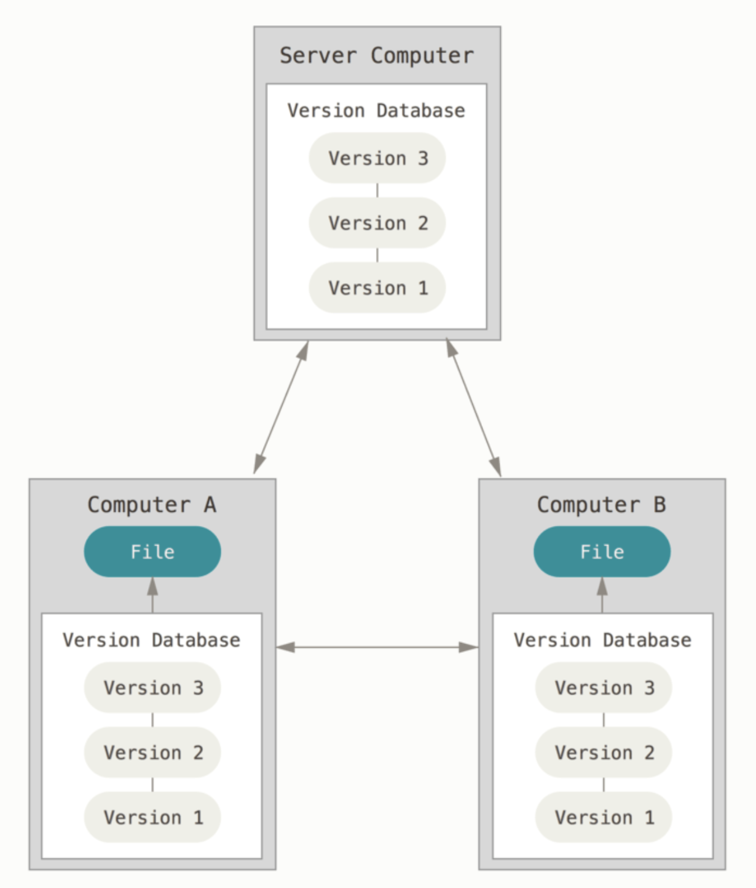
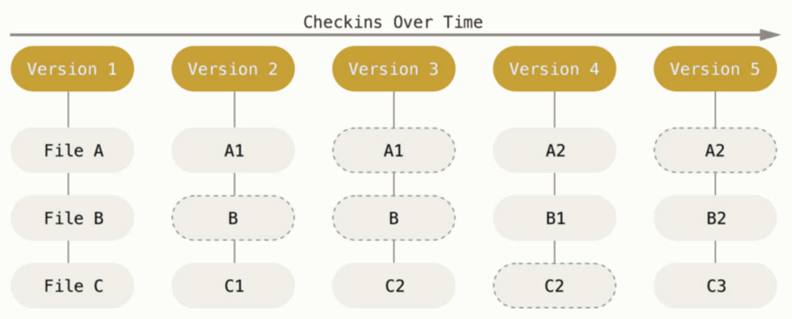

# git  --everything-is-local

- git 시작가이드 : [https://git-scm.com/book/ko/v2](https://git-scm.com/book/ko/v2)

# 시작하기 - 버전 관리란?

- 버전 관리 도구에 대한 이해와 Git을 설치하는 방법을 먼저 설명한다.
- 마지막으로 Git 서버를 설정하고 사용하는 방법을 설명한다.

> 버전 관리 시스템(VCS - Version Control System) 버전관리란? 
> 

버전관리는 무엇이고 우리는 왜 이것을 알아야 할까? 
버전 관리 시스템은 파일 변화를 시간에 따라 기록했다가 나중에 특정 시점의 버전을 다시 꺼내올 수 있는 시스템이다. 

VCS (Version Control System)를 사용하면 각 파일을 이전 상태로 되돌릴 수 있고, 프로젝트를 통째로 이전 상태로 되돌릴 수 있고, 시간에 따라 수정 내용을 비교해 볼 수 있고, 누가 문제를 일으켰는지도 추적할 수 있고, 누가 언제 만들어낸 이슈인지도 알 수 있다. VCS를 사용하면 파일을 잃어버리거나 잘못 고쳤을 때도 쉽게 복구할 수 있다.

## 분산 버전 관리 시스템 (DVCS)

DVCS(분산 버전 관리 시스템)을 설명할 차례다. Git, Mecurial, Bazaar, Darcs 같은 DVCS에서의 클라이언트는 단순히 파일의 마지막 스냅샷을 Checkout 하지 않는다. 그냥 저장소를 전부 복제한다. 서버에 문제가 생기면 이 복제물로 다시 작업을 시작할 수 있다. 클라이언트 중에서 아무거나 골라도 서버를 복원할 수 있다. 모든 Checkout은 모든 데이터를 가진 진정한 백업이다.



# 시작하기 - Git 기초
## 스냅샷 

 **Git**은 데이터를 파일 시스템 스냅샷으로 취급하고 크기가 아주 작다. Git은 커밋하거나 프로젝트의 상태를 저장할 때마다 파일이 존재하는 그 순간을 중요하게 여긴다. 파일이 달라지지 않았으면 Git은 성능을 위해서 파일을 새로 저장하지 않는다. 단지 이전 상태의 파일에 대한 링크만 저장한다. Git은 데이터를 스냅샷의 스트림처럼 취급한다.



## git 무결성 


**Git**은 데이터를 저장하기 전에 항상 체크섬을 구하고 그 체크섬으로 데이터를 관리한다. 그래서 체크섬을 이해하는 Git 없이는 어떠한 파일이나 디렉토리도 변경할 수 없다. 체크섬은 Git에서 사용하는 가장 기본적인(Atomic) 데이터 단위이자 Git의 기본 철학이다. Git 없이는 체크섬을 다룰 수 없어서 파일의 상태도 알 수 없고 심지어 데이터를 잃어버릴 수도 없다


##  Git은 데이터를 추가할 뿐

Git은 파일을 Committed, Modified, Staged 이렇게 세 가지 상태로 관리한다. 
- **Committed** - 데이터가 로컬 데이터베이스에 안전하게 저장됐다는 것을 의미한다. 
- **Modified** - 수정한 파일을 아직 로컬 데이터베이스에 커밋하지 않은 것을 말한다. 
- **Staged** - 현재 수정한 파일을 곧 커밋할 것이라고 표시한 상태를 의미한다.


#### Git으로 하는 일은 기본적으로 아래와 같다.

1. 워킹 트리에서 파일을 수정한다.

2. Staging Area에 파일을 Stage 해서 commit할 스냅샷을 만든다.

3. Staging Area에 있는 파일들을 커밋해서 Git 디렉토리에 영구적인 스냅샷으로 저장한다.


# 시작하기 - Git 설치 

### [Git 설치 방법](https://git-scm.com/book/ko/v2/%EC%8B%9C%EC%9E%91%ED%95%98%EA%B8%B0-Git-%EC%84%A4%EC%B9%98) 을 참고한다. 

- 다운로드 페이지에서 설치하는 간단한 방법도 있다. 
[Download for macOS](https://desktop.github.com/)

## Git 최초 설정 

Git을 설치하고 나면 Git의 사용 환경을 적절하게 설정해 주어야 한다. 환경 설정은 한 컴퓨터에서 한 번만 하면 된다. 설정한 내용은 Git을 업그레이드해도 유지된다. 언제든지 다시 바꿀 수 있는 명령어도 있다.

### 사용자 정보

Git을 설치하고 나서 가장 먼저 해야 하는 것은 사용자이름과 이메일 주소를 설정하는 것이다. Git은 커밋할 때마다 이 정보를 사용한다.
github.com 에 가입 할 때와 다르게 이메일을 입력하면 커밋을 아무리 해도 커밋 적용이 안되는 수가 있다. 그러니 이메일은 정확히 등록해 준다.
(git 안내서에서는 commit한 후에는 username과 email 정보를 변경할 수 없다지만 나름 방법이 있다. )

```
$ git config --global user.name "Janggunhee"
$ git config --global user.email jan9.9unhee@gmail.com
```
사용자 정보를 설정하고 나면 Git에서 사용할 텍스트 편집기를 고른다. 기본적으로 Git은 시스템의 기본 편집기를 사용한다. 하지만, 다른 텍스트 편집기를 사용할 수 있고 아래와 같이 실행하면 된다.

```
$ git config --global core.editor vim
```

공통적으로 git에서 차단 될 파일

```

$ git config --global core.excludefile ~/.gitignore

```

git 설정 확인 

```
$ git config --list
user.name=janggunhee
user.email=jan9.9unhee@gmail.com
core.editor=vim
core.excludesfile=/Users/janggunhee/.gitignore
```
git 설정 name, email 확인

```
$ git config user.name
janggunhee

$ git config user.email
jan9.9unhee@gmail.com
```

