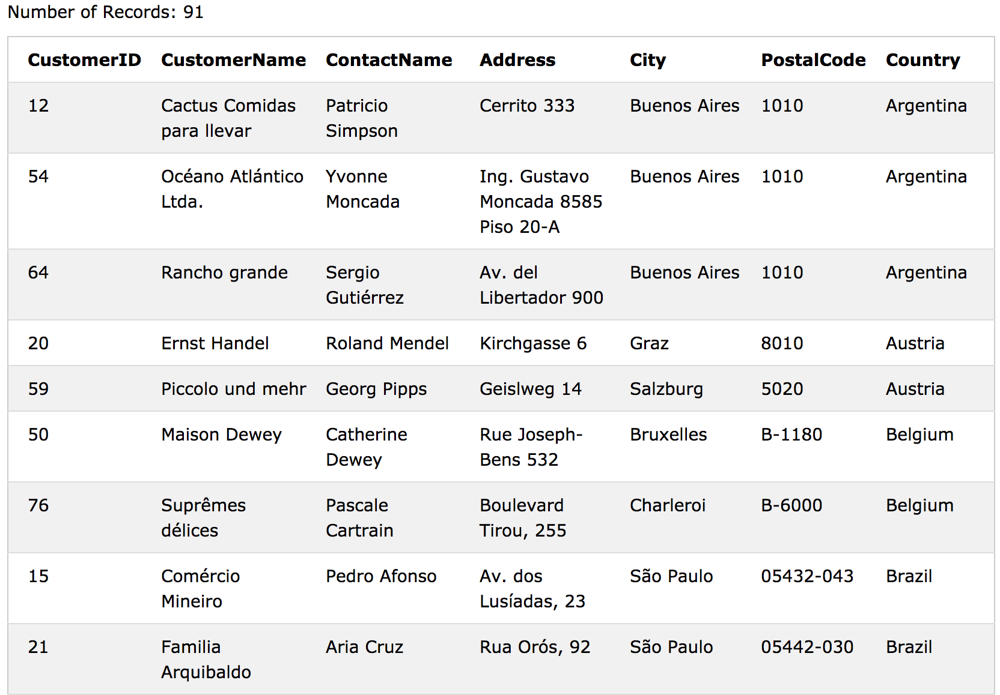
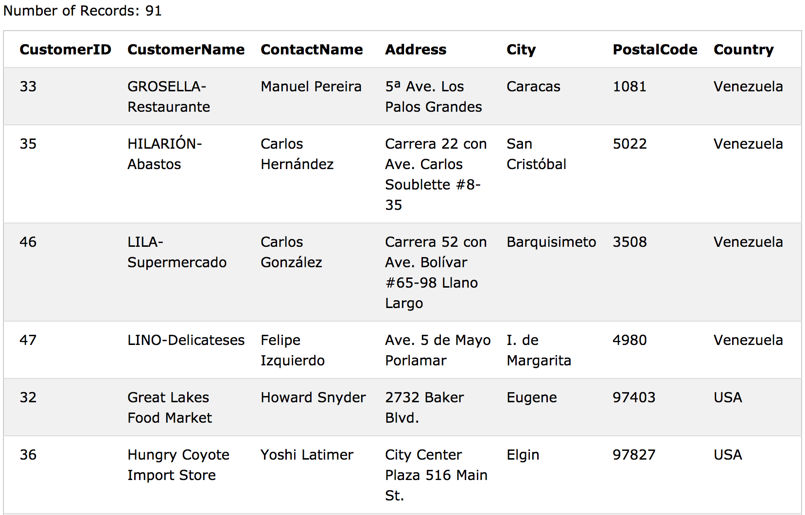
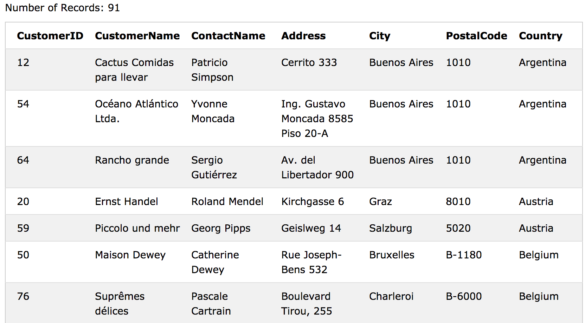
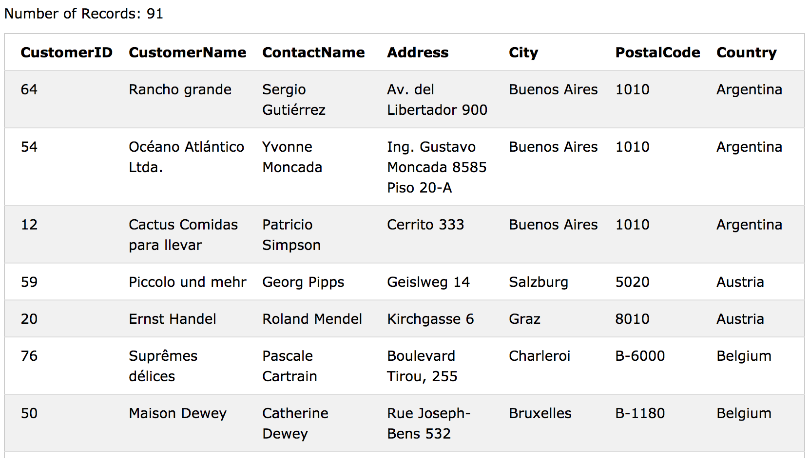

# SQL - ORDER BY Keyword

ORDER BY 키워드는 결과 집합을 오름차순 또는 내림차순으로 정렬하는 데 사용됩니다. 

- ORDER BY 키워드는 기본적으로 레코드를 오름차순으로 정렬합니다. 

- 내림차순으로 레코드를 정렬하려면 DESC 키워드를 사용하십시오.

### ORDER BY Syntax

```sql
SELECT column1, column2, ...
FROM table_name
ORDER BY column1, column2, ... ASC|DESC;
```

### ORDER BY Example

```sql
SELECT * FROM Customers
ORDER BY Country;
```



### ORDER BY DESC Example

끝에 DESC를 붙이면 내림차순 정렬

```sql
SELECT * FROM Customers
ORDER BY Country DESC;
```


### ORDER BY Several Columns Example

다음 SQL 문은 'Customers'테이블의 모든 고객을 'Country'및 'CustomerName'열로 정렬하여 선택합니다.

```sql
SELECT * FROM Customers
ORDER BY Country, CustomerName;
```



### ORDER BY Several Columns Example DESC

다음 SQL 문은 'Customers'테이블의 모든 고객을 'Country'로 오름차순으로 정렬하고 'CustomerName'열로 내림차순으로 정렬합니다.

```sql
SELECT * FROM Customers
ORDER BY Country ASC, CustomerName DESC;
```


