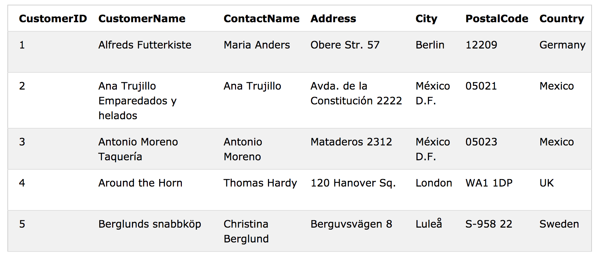
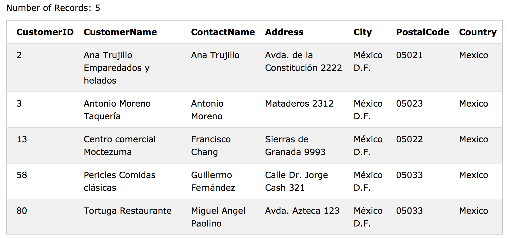

# SQL - WHERE

WHERE 절은 records를 필터링하는 데 사용됩니다. 

WHERE 절은 지정된 조건을 충족하는 records 만 추출하는 데 사용됩니다.

### WHERE Syntax


SELECT column1, column2, ...
FROM table_name
WHERE condition;


> 참고 : WHERE 절은 SELECT 문에서만 사용되는 것이 아니라 UPDATE, 
> DELETE 문에서도 사용됩니다!
>

### demo database

## WHERE Clause Example

다음 SQL 문은 'Customers'테이블에서 'Mexico'국가의 모든 고객을 선택합니다.


SELECT * FROM Customers
WHERE Country='Mexico';


## WHERE 절 연산자

다음 연산자는 **WHERE** 절에서 사용할 수 있습니다.

|Operator |	Description|
|:--------|:-----------|
|=	|같다|
|<>	|같지 않다. Note: SQL의 일부 버전에서는 **!=** |
|>	|보다 큰|
|<	|보다 작은|
|>=	|크거나 같음|
|<=	|작거나 같음|
|BETWEEN|	포괄적인 범위 사이(안) |
|LIKE|	패턴 검색|
|IN	|열에 가능한 여러 값을 지정|

