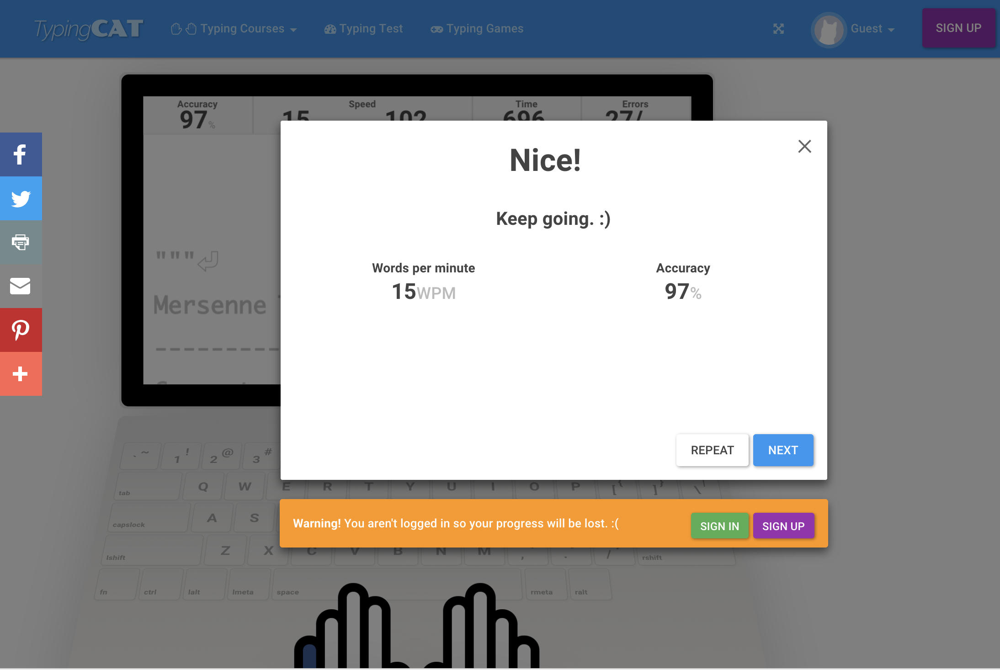

### 두 번째로 올리는 post !! 

#### 오늘은 10월 14일 그러고 보니 한 달여가 지났다.
 
 
터미널 창을 붙잡고 애원을 하다시피 하던 

그 암담했던 시기를 겨우 빠저 나온 것 같다. 지금은 vim 단축키를 익힌다던가, 

`vi .gitignore` 파일을 만드는 정도의 행위를 하고 있다. 
  

지금도 애원하는 마음은 비슷하지만 우연에 기대는 코드는 없다는점 정도는 알게된 것 같다. 

생 초보자로서 가장 난관에 처하는 큰 문제점은 사소한 오타로 인한 반복되는 오류에서 헤어 나오기 힘들다는 것이다. 

우선 코드가 작동하는 기능과 의미를 모르다 보니 발현되는 오류도 상당하지만,  
오타로 인한 삽질에 정말 많은 시간을 소모하고 있다는 것이다.

우선 한글 맞춤법을 틀리는 것도 무척 부끄러운 일이고 수정이 필요하지만,  
영타가 익숙하지 않아서 생기는 오타도 수정이 시급하다.

그리고 한 달여가 지나도 성장하지 않는 것이 있다. 

#### 바로!!! 

#### 타자 속도이다. (뭐지? 이 독수리 타법으로 쓴 것 같은 타자 속도는?????) 

#### 무려 !!!!

눈물이 앞을 가린다. 연습 이외엔 답이 없다는 것 정도는 아는것이 다행이다.

### 타자 연습이 가능한 사이트 

**the typing cat** 이라는 사이트에서 타이핑 연습을 하고 있다. 

여러 사이트가 있지만 이 사이트의 장점은 여러 언어로 타이핑 연습을 할 수 있다는 것이다. 

이 링크를 따라가면 **python 알고리즘**을 연습할 수 있다. 

Link: <http://thetypingcat.com/custom-typing-courses/algorithms-in-python>

### 현재 나에게 필요한 공부 

- python 알고리즘 연습

- django post 만들어 보기 

- git documentation 보고 연습하고 md.file로 정리해 보기 

git 시작하기 주소 - Link: <https://git-scm.com/book/ko/v1/시작하기>

