# AWS - Django 프로젝트 배포하기 - 1

> 아마존 웹 서비스 (AWS)를 이용해 프로젝트 배포하기 

## AWS 클라우드 컴퓨팅 

### 클라우드 컴퓨팅이란?

클라우드 컴퓨팅(cloud computing)은 인터넷 기반 컴퓨팅의 일종으로, 공유 컴퓨터 처리 자원과 데이터를 컴퓨터와 다른 장치들에 요청 시 제공해준다. 구성 가능한 컴퓨팅 자원(예: 컴퓨터 네트워크, 서버, 스토리지, 애플리케이션, 서비스)에 대해 어디서나 접근이 가능한, 주문형 접근을 가능케하는 모델이며 최소한의 관리 노력으로 빠르게 예비 및 릴리스를 가능케 한다. 클라우드 컴퓨팅과 스토리지 솔루션들은 사용자와 기업들에게 개인 소유나 타사 데이터 센터의 데이터를 저장, 가공하는 다양한 기능을 제공하며 도시를 거쳐 전 세계로까지 위치해 있을 수 있다. 클라우드 컴퓨팅은 전기망을 통한 전력망과 비슷한 일관성 및 규모의 경제를 달성하기 위해 자원의 공유에 의존한다.

#### AWS 클라우드 서비스 플랫폼 설명 동영상 

<iframe width="535" height="301" src="https://www.youtube.com/embed/jOhbTAU4OPI" frameborder="0" gesture="media" allowfullscreen></iframe>

## AWS : Amazon Web Services

[AWS](https://aws.amazon.com/) : https://aws.amazon.com/

아마존 닷컴에서 제공하는 원격 컴퓨팅 서비스 

## AWS 시작하기 

- AWS에 가입해서 로그인 후, console home으로 이동한다.

- 상단의 지역 설정에서 본인 위치의 지역을 지정해 준다. 저는 아시아 태평양 (서울)


## IAM을 이용해 새 유저 새성하기 

### IAM 이란?

AWS Identity and Access Management(IAM)는 사용자를 위해 AWS 리소스에 대한 액세스를 안전하게 제어할 수 있는 웹 서비스입니다. IAM을 사용하여 AWS 리소스를 사용할 수 있는 사람(인증)과 이들이 사용할 수 있는 리소스 및 그 사용 방법(권한 부여)을 제어합니다.

### IAM 사용자  

AWS Identity and Access Management(IAM)의 "자격 증명"을 통해 "사용자의 정체"를 확인할 수 있습니다. 이를 흔히 인증이라고 합니다. 루트 사용자 자격 증명을 타인과 공유하는 대신, 조직의 사용자에 해당하는 개별 IAM 사용자를 계정에서 생성할 수 있습니다. IAM 사용자는 별개의 계정이 아니라 해당 계정 내의 사용자입니다. 각 사용자는 고유의 AWS Management Console 액세스 암호를 가질 수 있습니다. 또한 사용자가 계정의 리소스를 사용하기 위한 프로그래밍 방식의 요청을 할 수 있도록 각 사용자에 대한 개별 액세스 키를 생성할 수 있습니다.

#### AWS - IAM 소개 동영상 

<iframe width="360" height="240" src="https://www.youtube.com/embed/Ul6FW4UANGc" frameborder="0" gesture="media" allowfullscreen></iframe>


AWS - IAM 설명서 link : [docs](http://docs.aws.amazon.com/ko_kr/IAM/latest/UserGuide/introduction.html)

## [Amazon EC2란 무엇입니까?](http://docs.aws.amazon.com/ko_kr/AWSEC2/latest/UserGuide/concepts.html)

Amazon Elastic Compute Cloud(Amazon EC2)는 Amazon Web Services(AWS) 클라우드에서 확장식 컴퓨팅을 제공합니다. Amazon EC2를 사용하면 하드웨어에 선투자할 필요가 없어 더 빠르게 애플리케이션을 개발하고 배포할 수 있습니다. Amazon EC2를 통해 원하는 만큼 가상 서버를 구축하고 보안 및 네트워크 구성과 스토리지 관리가 가능합니다. Amazon EC2는 요건이나 갑작스러운 인기 증대 등 변동사항에 따라 확장하거나 축소할 수 있어 트래픽 예측 필요성이 줄어듭니다.

## Amazon EC2의 기능

### Amazon EC2는 다음의 기능을 제공합니다.

- 인스턴스: 가상 컴퓨팅 환경
Amazon 머신 이미지(AMI): 서버에 필요한 운영체제와 여러 소프트웨어들이 적절히 구성된 상태로 제공되는 템플릿으로 인스턴스를 쉽게 만들 수 있습니다.
- 인스턴스 유형: 인스턴스를 위한 CPU, 메모리, 스토리지, 네트워킹 용량의 여러 가지 구성 제공
- 키 쌍을 사용해 인스턴스 로그인 정보 보호(AWS는 공용키를 저장하고 사용자는 개인 키를 안전한 장소에 보관하는 방식)
- 인스턴스 스토어 볼륨: 임시 데이터를 저장하는 스토리지 볼륨으로 인스턴스 종료 시 삭제됨
- Amazon Elastic Block Store(Amazon EBS), 즉 Amazon EBS 볼륨을 사용해 영구 스토리지 볼륨에 데이터 저장
- 인스턴스와 Amazon EBS 볼륨 등의 리소스를 다른 물리적 장소에서 액세스할 수 있는 리전 및 가용 영역
- 보안 그룹을 사용해 인스턴스에 연결할 수 있는 프로토콜, 포트, 소스 IP 범위를 지정하는 방화벽 기능
- 탄력적 IP 주소(EIP): 동적 클라우드 컴퓨팅을 위한 고정 IPv4 주소
- 태그: 사용자가 생성하여 Amazon EC2 리소스에 할당할 수 있는 메타데이터
- AWS 클라우드에스는 논리적으로 격리되어 있지만, 원하실때 마다 고객님의 네트워크와 간편히 연결할 수 있는 가상 네트워크, Virtual Private Clouds(VPC)

## [Amazon EC2로 설정](http://docs.aws.amazon.com/ko_kr/AWSEC2/latest/UserGuide/get-set-up-for-amazon-ec2.html)

1. [AWS에 가입](http://docs.aws.amazon.com/ko_kr/AWSEC2/latest/UserGuide/get-set-up-for-amazon-ec2.html#sign-up-for-aws)

2. [IAM 사용자 생성](http://docs.aws.amazon.com/ko_kr/AWSEC2/latest/UserGuide/get-set-up-for-amazon-ec2.html#create-an-iam-user)

3. [키 페어 생성](http://docs.aws.amazon.com/ko_kr/AWSEC2/latest/UserGuide/get-set-up-for-amazon-ec2.html#create-a-key-pair)

4. [Virtual Private Cloud(VPC) 생성](http://docs.aws.amazon.com/ko_kr/AWSEC2/latest/UserGuide/get-set-up-for-amazon-ec2.html#create-a-vpc)

5. [보안 그룹 생성](http://docs.aws.amazon.com/ko_kr/AWSEC2/latest/UserGuide/get-set-up-for-amazon-ec2.html#create-a-base-security-group)


## AWS User  생성 

### 1. User 

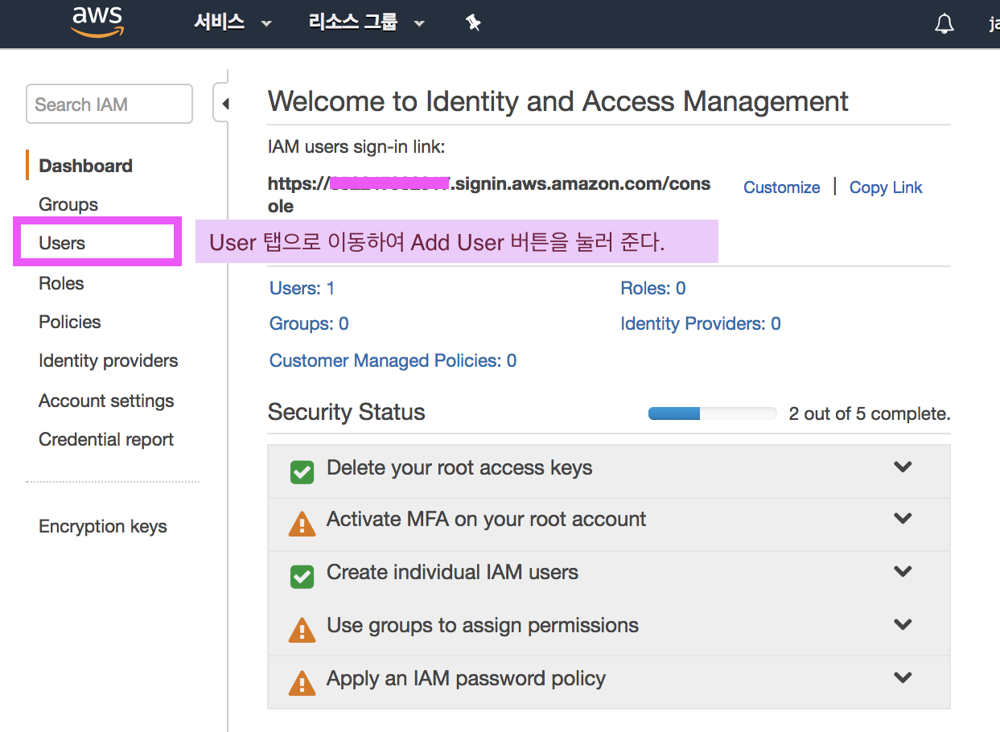 


### 2. User details 설정

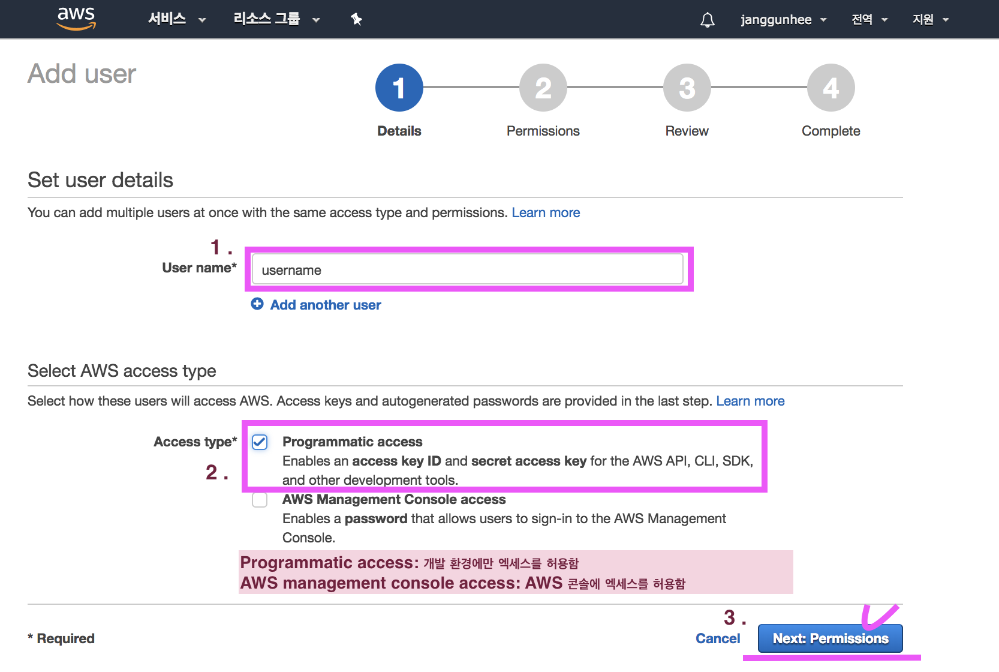

### 3. Permissions summary

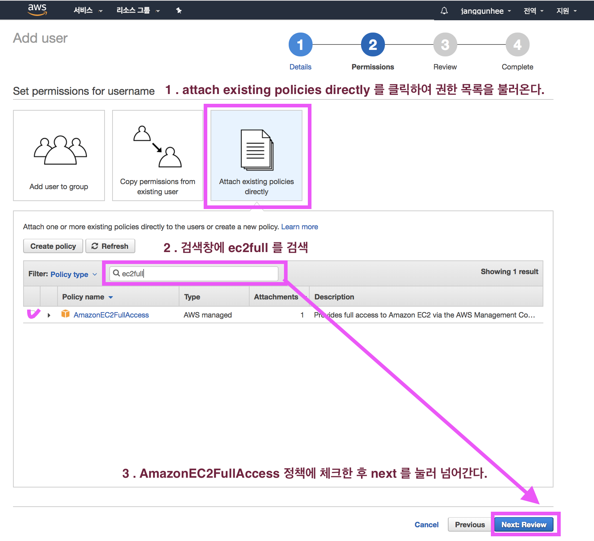

### 4. create user

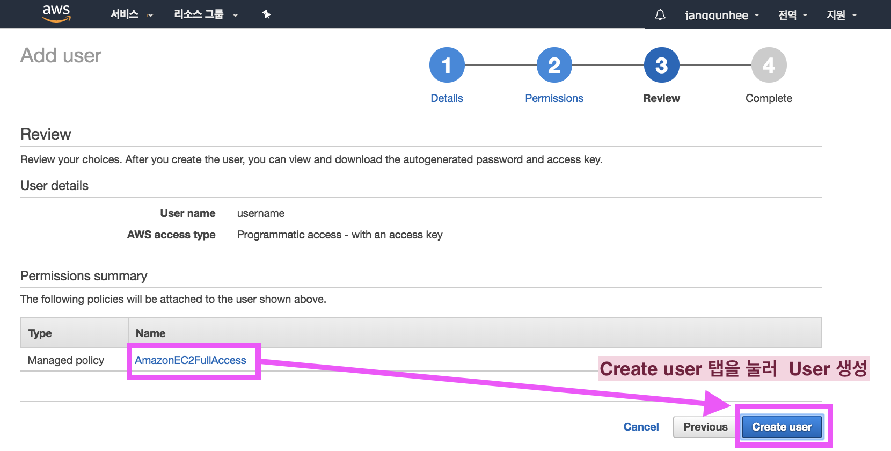

### 5. Add user - Access key ID / Secret access key (다운로드)

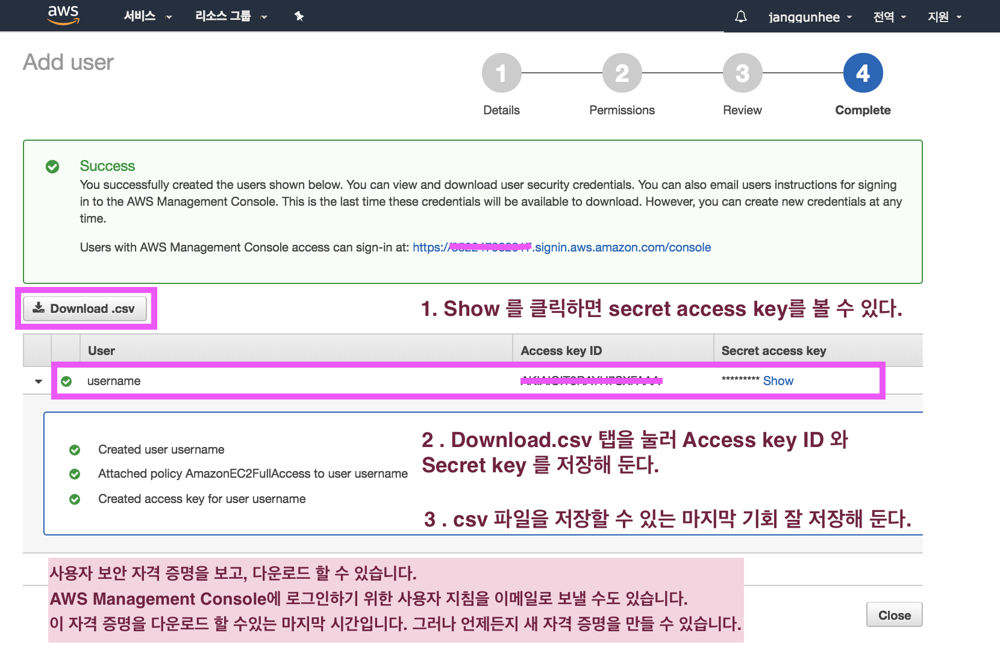

- 다운로드를 탭 하면 credentials.csv 파일로 `ID` 와 `Secret key`가 저장되는데, 이 `secret key`는 외부에 노출되면 보안에 심각한 위험이 될 수 있어 주의하도록 한다. 


## 키 페어 생성 

Amazon EC2는 퍼블릭 키 암호화 기법을 사용하여 로그인 정보를 암호화 및 해독합니다. 공개 키 암호화 기법은 공개 키를 사용하여 암호 등의 데이터를 암호화하고, 수신자가 개인 키를 사용하여 해당 데이터를 해독하는 방식입니다. 퍼블릭 키와 프라이빗 키를 키 페어라고 합니다.

인스턴스에 로그인하려면 키 페어를 만들고, 인스턴스를 시작할 때 키 페어의 이름을 지정하고, 인스턴스에 연결할 때 프라이빗 키를 제공해야 합니다.

이 과정은 부팅 시에 처리되므로 암호 대신 프라이빗 키를 사용하여 안전하게 인스턴스에 액세스할 수 있습니다.

### 1. 키 페어 생성 개인키 

 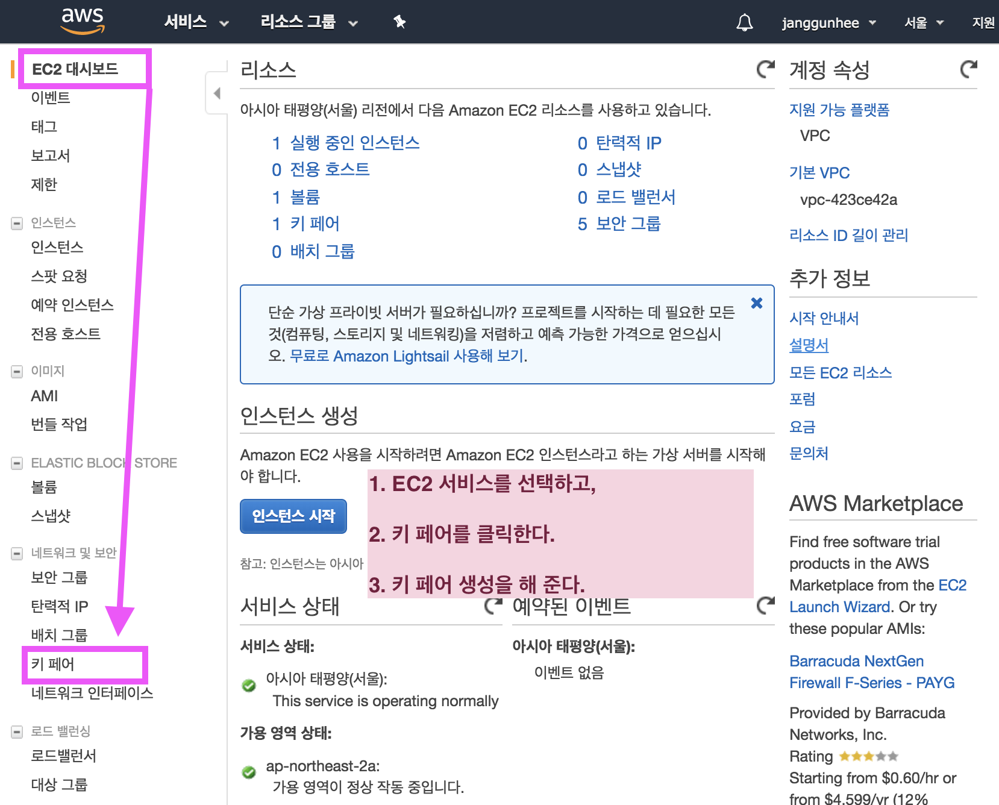
 
- 키 페어 생성을 한 후 키 페어 이름을 만들어 줄 수 다. 
- 생성 탭을 눌러 키페어 생성하기
- `<Key-pair 생성한 name>.pem` 파일의 인증서가 바로 저장이 될 수 있게 연결 됩니다. 


### 2. key pair 파일 `.ssh` 폴더에 저장

 - 다운로드 한 `<Key-pair name>.pem` 파일은 `~/.ssh` 폴더에 보관하도록 한다.
 
 -  `~.ssh` 개인키 권환을 바꿔준다. 
 
```
chmod 400 /<EC2-Deploy-Keypair>.pem
```

#### linux 파일 권환
 - (http://byseob.blogspot.kr/2010/08/)


## EC2 Linux 인스턴스 시작하기

Linux 인스턴스를 시작, 연결 및 사용하여 Amazon Elastic Compute Cloud(Amazon EC2)를 시작합니다. 인스턴스는 AWS 클라우드의 가상 서버입니다. Amazon EC2를 사용하여 인스턴스에서 실행되는 운영 체제와 애플리케이션을 설정하고 구성할 수 있습니다.

AWS 가입 시 무상으로 Amazon EC2를 시작할 수 있는 AWS 프리 티어를 제공합니다. 12개월 이전에 AWS 계정을 생성했지만 Amazon EC2에 대한 프리 티어 혜택을 아직 다 사용하지 않은 경우 프리 티어 혜택 안에 포함된 옵션을 선택하는 데 도움이 되는 이 자습서를 무료로 이용할 수 있습니다. 그렇지 않을 경우, 유휴 상태로 유지되더라도 인스턴스를 시작하는 시점부터 인스턴스를 종료할 때까지(이 자습서의 최종 작업) 스탠다드 Amazon EC2 사용료가 발생합니다.

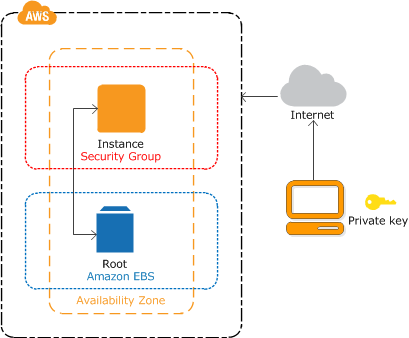

## 인스턴스 개요 

이 인스턴스는 Amazon EBS 지원 인스턴스(루트 볼륨이 EBS 볼륨임을 의미)입니다. 인스턴스가 실행되는 가용 영역을 지정하거나 적합한 가용 영역이 Amazon EC2에서 자동으로 선택할 수 있습니다. 인스턴스를 시작할 때 키 페어와 보안 그룹을 지정하여 인스턴스 보안을 설정합니다. 인스턴스에 연결할 때는 인스턴스 시작 시 지정한 키 페어의 프라이빗 키를 지정해야 합니다.


### 1. 인스턴스 시작 

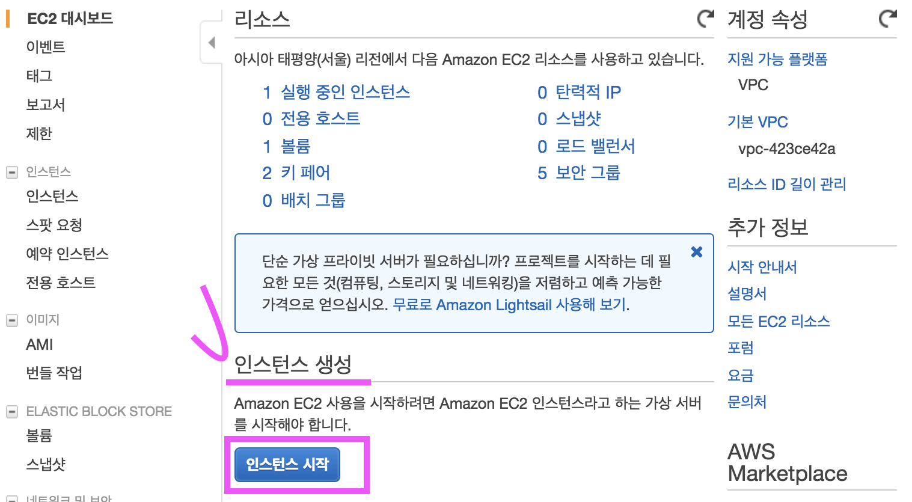

- EC2 대시보드로 이동해서 인스턴스를 시작해 줍니다.
 

#### 단계 1: Amazon Machine Image(AMI) 선택

  `Ubuntu Server 16.04 LTS (HVM), SSD Volume Type` 을 선택한다.

#### 단계 2: 인스턴스 유형 선택

Amazon EC2는 각 사용 사례에 맞게 최적화된 다양한 인스턴스 유형을 제공합니다. 인스턴스는 애플리케이션을 실행할 수 있는 가상 서버입니다. 이러한 인스턴스에는 CPU, 메모리, 스토리지 및 네트워킹 용량이 다양하게 조합되어 있으며, 애플리케이션에 사용할 적절한 리소스 조합을 유연하게 선택할 수 있습니다.

 - 프리티어가 사용가능한 유형을 선택한다. 
 
#### 단계 6: 보안 그룹 구성 

보안 그룹은 인스턴스에 대한 트래픽을 제어하는 방화벽 규칙 세트입니다. 이 페이지에서는 특정 트래픽을 인스턴스에 도달하도록 허용할 규칙을 추가할 수 있습니다. 예를 들면 웹 서버를 설정하여 인터넷 트래픽을 인스턴스에 도달하도록 허용하려는 경우 HTTP 및 HTTPS 트래픽에 대한 무제한 액세스를 허용하는 규칙을 추가합니다. 새 보안 그룹을 생성하거나 아래에 나와 있는 기존 보안 그룹 중에서 선택할 수 있습니다.

 - 보안 그룹명이 겹치지 않고 스스로 구분 할 수 있도록 그룹명을 생성해 준다. 
   
   ex) EC2-Deploy-SecurityGroup
       EC2 Instance(EC2-Deploy) Security Group

 - 보안그룹을 만들고 인스턴스 안에 보호되게 만든다. 

#### 단계 7: 인스턴스 시작 검토 

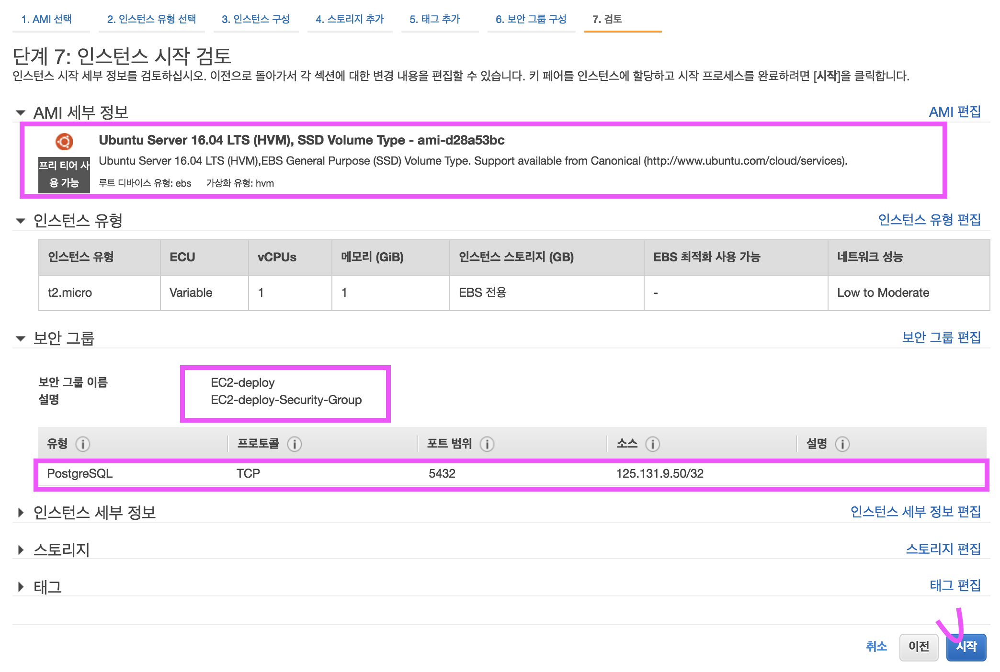


#### EC2 인스턴스에서  생성한 인스턴스를 확인

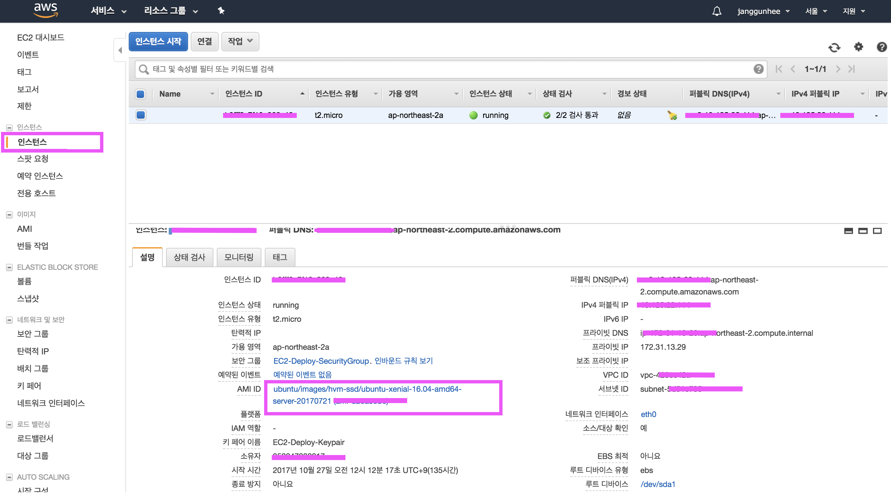


## 인스턴스에 접속하기 

### [SSH를 사용하여 Linux 인스턴스에 연결](http://docs.aws.amazon.com/ko_kr/AWSEC2/latest/UserGuide/AccessingInstancesLinux.html) 

(http://docs.aws.amazon.com/ko_kr/AWSEC2/latest/UserGuide/AccessingInstancesLinux.html)

생성한 가상 컴퓨터 인스턴스에 `ssh` 를 사용해서 접속한다. 

````
ssh -i <Private key> <username>@<EC2 public domain>

# 현재 프로젝트의 경우
ssh -i ~/.ssh/<Keypair name>.pem ubuntu@<EC2 Public domain>
```

```
➜  ~ ssh -i ~/.ssh/EC2-Deploy-Keypair.pem ubuntu@ec2-13-125-22-114.ap-northeast-2.compute.amazonaws.com
Welcome to Ubuntu 16.04.3 LTS (GNU/Linux 4.4.0-1022-aws x86_64)

 * Documentation:  https://help.ubuntu.com
 * Management:     https://landscape.canonical.com
 * Support:        https://ubuntu.com/advantage

  Get cloud support with Ubuntu Advantage Cloud Guest:
    http://www.ubuntu.com/business/services/cloud

13 packages can be updated.
0 updates are security updates.


*** System restart required ***
Last login: Tue Oct 31 04:07:25 2017 from 125.131.9.50
```

### UNPROTECTED PRIVATE KEY FILE 에러 발생 시

```
@@@@@@@@@@@@@@@@@@@@@@@@@@@@@@@@@@@@@@@@@@@@@@@@@@@@@@@@@@@
@         WARNING: UNPROTECTED PRIVATE KEY FILE!          @
@@@@@@@@@@@@@@@@@@@@@@@@@@@@@@@@@@@@@@@@@@@@@@@@@@@@@@@@@@@
Permissions 0644 for '/Users/Arcanelux/.ssh/fastcampus.pem' are too open.
It is required that your private key files are NOT accessible by others.
This private key will be ignored.
Load key "/Users/Arcanelux/.ssh/fastcampus.pem": bad permissions
Permission denied (publickey).
```

> 위와 같은 경우, `chmod 400 <pem file>`로 소유주만 읽을 수 있도록 권한설정을 해준다.
> 

### 인스턴스 연결하기 사전 조건 

 - SSH 클라이언트 설치
Linux 컴퓨터에는 기본적으로 SSH 클라이언트가 포함되어 있을 가능성이 높습니다. 명령줄에 `~/.ssh`를 입력하여 SSH 클라이언트가 있는지 확인할 수 있습니다.

- AWS CLI 도구 설치
(선택 사항) 타사의 퍼블릭 AMI를 사용하고 있는 경우 명령줄 도구를 사용하여 지문을 확인할 수 있습니다.

- 인스턴스의 ID 보기
Amazon EC2 콘솔을 사용하여 인스턴스의 ID를 볼 수 있습니다.

 - 인스턴스의 퍼블릭 DNS 이름 보기
Amazon EC2 콘솔을 사용해서 사용자의 인스턴스에 대한 퍼블릭 DNS를 얻을 수 있습니다.

 - (IPv6 전용) 인스턴스의 IPv6 주소를 얻습니다.
인스턴스에 IPv6 주소를 할당했다면 퍼블릭 IPv4 주소나 퍼블릭 IPv4 DNS 호스트 이름 대신 IPv6 주소를 사용하여 인스턴스에 연결할 수도 있습니다. 

 - 프라이빗 키 찾기
인스턴스를 시작할 때 지정한 키 페어를 찾기 위해 `<---->.pem`파일의 컴퓨터 상 위치에 대한 정규화된 경로를 얻습니다.

 - IP 주소에서 인스턴스로의 인바운드 SSH 트래픽 활성화
인스턴스와 연관된 보안 그룹이 IP 주소로부터 들어오는 SSH 트래픽을 허용하는지 확인하십시오. 기본 보안 그룹은 기본적으로 들어오는 SSH 트래픽을 허용하지 않습니다.


## 서버 환경 설정 

AWS 서버에 처음 접속한 뒤 다음 기본 설정을 셋팅한다.

### locale 설정

서버에서 편집 후 재접속한다

`sudo vi /etc/default/locale`
```
LC_CTYPE="en_US.UTF-8"
LC_ALL="en_US.UTF-8"
LANG="en_US.UTF-8"
```

### 연결 후 기본 설정

```
# 패키지 정보를 업데이트
sudo apt-get update

# 설치되어 있는 패키지들을 의존성 검사하며 업그레이드
sudo apt-get dist-upgrade

# pip 설치
sudo apt-get install python-pip

# zsh 설치
sudo apt-get install zsh

# oh-my-zsh 설치
sudo curl -L http://install.ohmyz.sh | sh

# Default shell 변경
# shell 변경 후엔 exit로 연결을 종료한 뒤 재연결
sudo chsh ubuntu -s /usr/bin/zsh
```


### pyenv 설정 


#### pyenv requirements설치

[pyenv - Common-build-problems](https://github.com/pyenv/pyenv/wiki/Common-build-problems)

```
sudo apt-get install -y make build-essential libssl-dev zlib1g-dev libbz2-dev libreadline-dev libsqlite3-dev wget curl llvm libncurses5-dev libncursesw5-dev xz-utils
```
#### pyenv 설치

```
curl -L https://raw.githubusercontent.com/yyuu/pyenv-installer/master/bin/pyenv-installer | bash
```

#### pyenv 설정을 .zshrc에 기록

`vi ~/.zshrc`
```
...
...
export PATH="/home/ubuntu/.pyenv/bin:$PATH"
eval "$(pyenv init -)"
eval "$(pyenv virtualenv-init -)"
```

```
source ~/.zshrc
```

#### Pillow 동작을 위한 Ubuntu python 라이브러리 설치

[Installation - Building on Linux](https://pillow.readthedocs.io/en/4.3.x/installation.html#building-on-linux)

```
sudo apt-get install python-dev python-setuptools
```

## Django 환경 설정

### Django 애플리케이션은 /srv Directory 사용

```
sudo chown -R ubuntu:ubuntu /srv/
```
[Linux file system structure](http://www.thegeekstuff.com/2010/09/linux-file-system-structure/?utm_source=tuicool)

- srv 폴더의 소유자와 그룹이 ubuntu로 설정된다. 

## Django 프로젝트 AWS에 전송하기 

django 프로젝트의 application 폴더의 settings.py의 ALLOWED_HOSTS에 
다음 내용을 추가해서 접속을 허용해 준다. 

```python
# settings.py

ALLOWED_HOSTS = [
    'localhost',
    '.ap-northeast-2.compute.amazonaws.com',
]
```
### scp를 사용하여 업로드하기

```
scp -i <Private key 경로> -r <보낼 폴더 경로
> 유저명@퍼블릭DNS:/srv/
```

#### 현재 본인 프로젝트의 경우

````
scp -i <Keypair name>.pem -r ~/projects/django/ec2_deploy_project ubuntu@<EC2 Public domain>:/srv
```

```
scp -i ~/.ssh/EC2-Deploy-Keypair.pem -r ec2_deploy_project ubuntu@ec2-13-125-22-114.ap-northeast-2.compute.amazonaws.com:/srv
```

## 서버에 Pyenv 가상환경 설치하기 

AWS 서버에 로컬 서버에서 생성했던 pyenv 가상환경 이름과 동일한 이름으로 가상환경을 생성한다.

### pyenv를 사용해서 virtualenv 생성

```
pyenv install 3.6.3
```
AWS 서버에서 /srv/EC2_Deploy_Project 로 이동하면 자동으로 pyenv 가상환경이 ec2_deploy 로 설정되어 있는 것을 확인 할 수 있다.

```
pyenv virtualenv 3.6.3 fc-ec2-deploy
```
### requirements설치

다음의 명령어를 입력하여 requirements.txt 에 기재되어 있는 패키지들을 설치해준다.

```
pip install -r requirements.txt
```


## EC2 보안그룹에 포트 추가

`EC2` -> `네트워크 및 보안` -> `보안 그룹` -> `EC2-Deploy` -> `인바운드` -> `편집` -> `규칙 추가` -> `사용자 지정 TCP규칙` -> `8080`

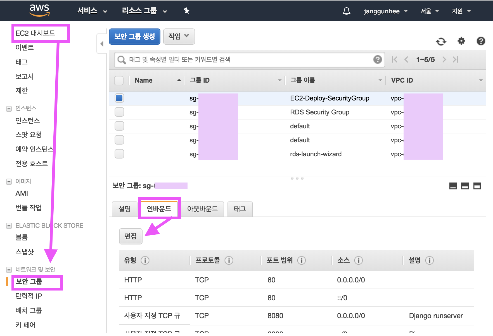

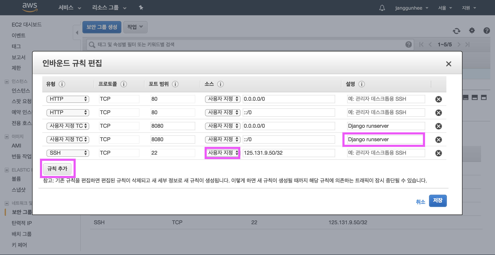

## runserver 실행하기 

`srv` 폴더안의 프로젝트 폴더로 이동하여 `runserver `를 포트 8080에 실행한다.

```
 ~ ssh -i ~/.ssh/EC2-Deploy-Keypair.pem ubuntu@ec2-13-125-22-114.ap-northeast-2.compute.amazonaws.com
 
 # aws 접속 
Welcome to Ubuntu 16.04.3 LTS (GNU/Linux 4.4.0-1022-aws x86_64)

 * Documentation:  https://help.ubuntu.com
 * Management:     https://landscape.canonical.com
 * Support:        https://ubuntu.com/advantage

  Get cloud support with Ubuntu Advantage Cloud Guest:
    http://www.ubuntu.com/business/services/cloud

0 packages can be updated.
0 updates are security updates.


*** System restart required ***
Last login: Wed Nov  1 17:56:05 2017 from 100.000.00.000
➜  ~
```

```
(fc-ec2) ➜  mysite git:(master) ✗ ./manage.py runserver 0:8080
Performing system checks...

System check identified no issues (0 silenced).
November 01, 2017 - 18:07:43
Django version 1.11.6, using settings 'config.settings'
Starting development server at http://0:8080/
Quit the server with CONTROL-C.

```

브라우저에서 포트번호 8080으로 퍼블릭 DNS 주소에 접속해서 `runserver` 가 실행되고 있는 것을 확인하자.

```
ec2-00-000-000-000.ap-northeast-2.compute.amazonaws.com:8080/
```

`EC2대시보드` -> `인스턴스` -> `설명` -> `퍼블릭 DNS(IPv4)`

```
퍼블릭 DNS:8080
```
