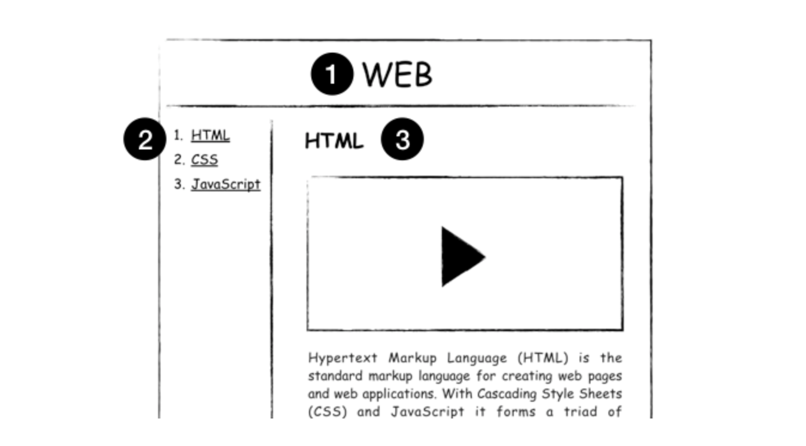
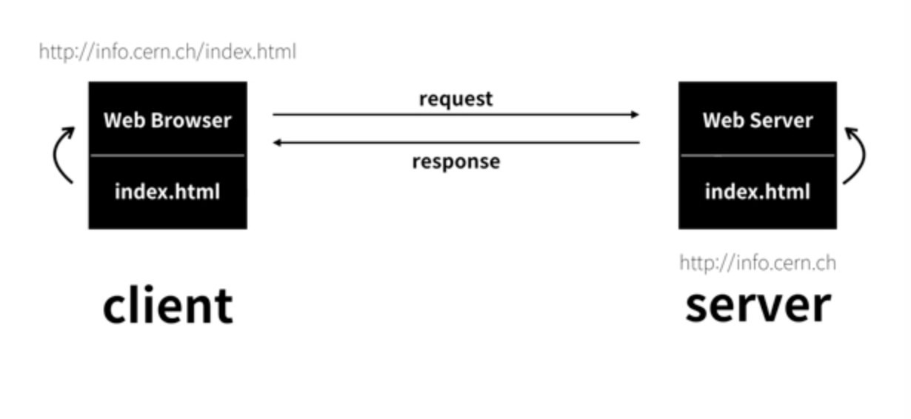
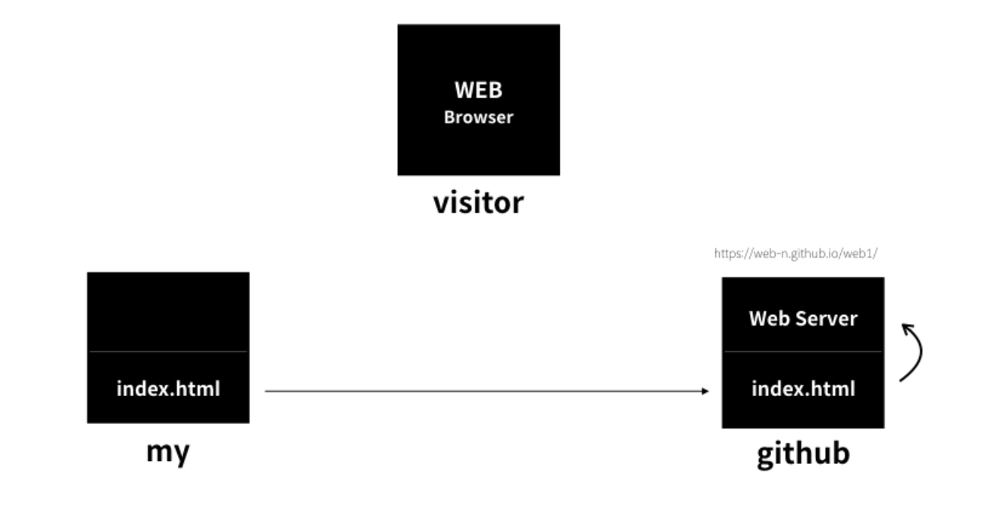
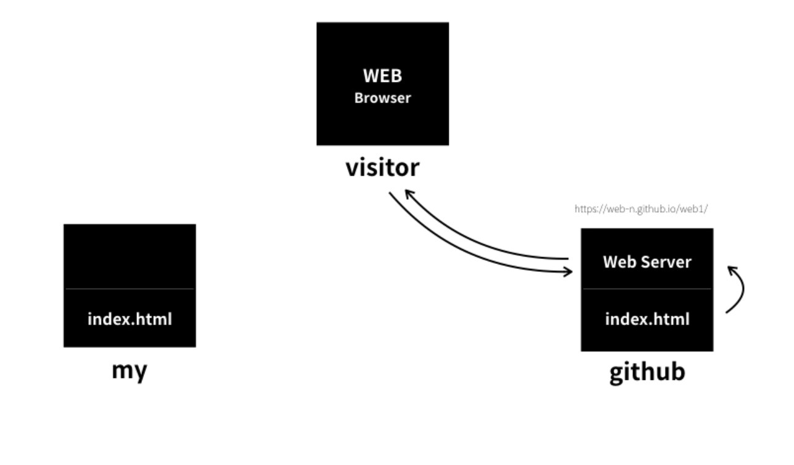
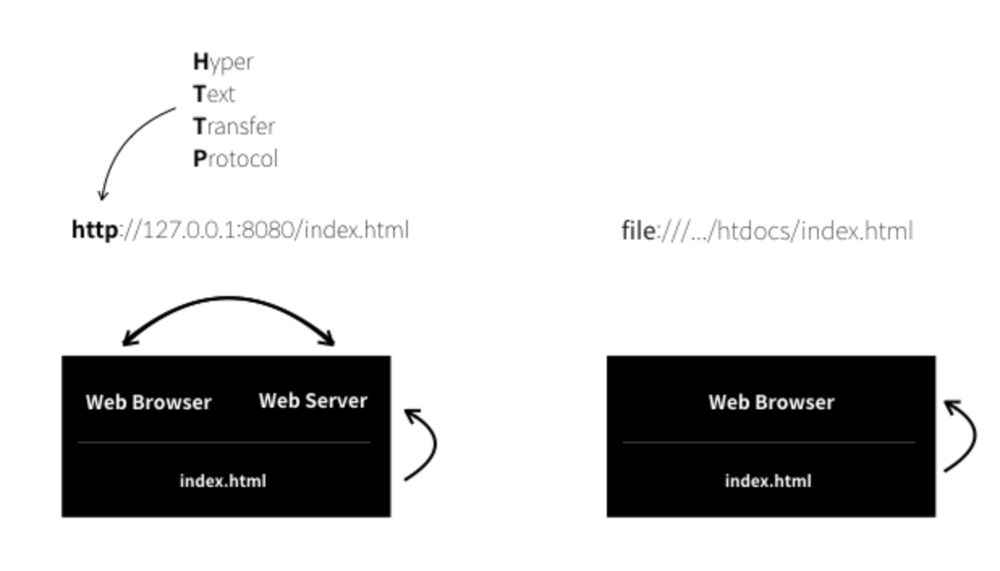
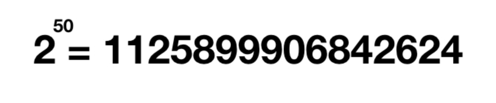
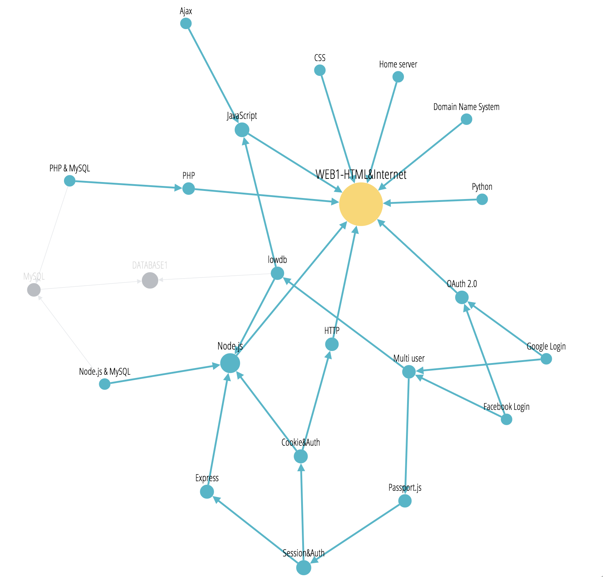
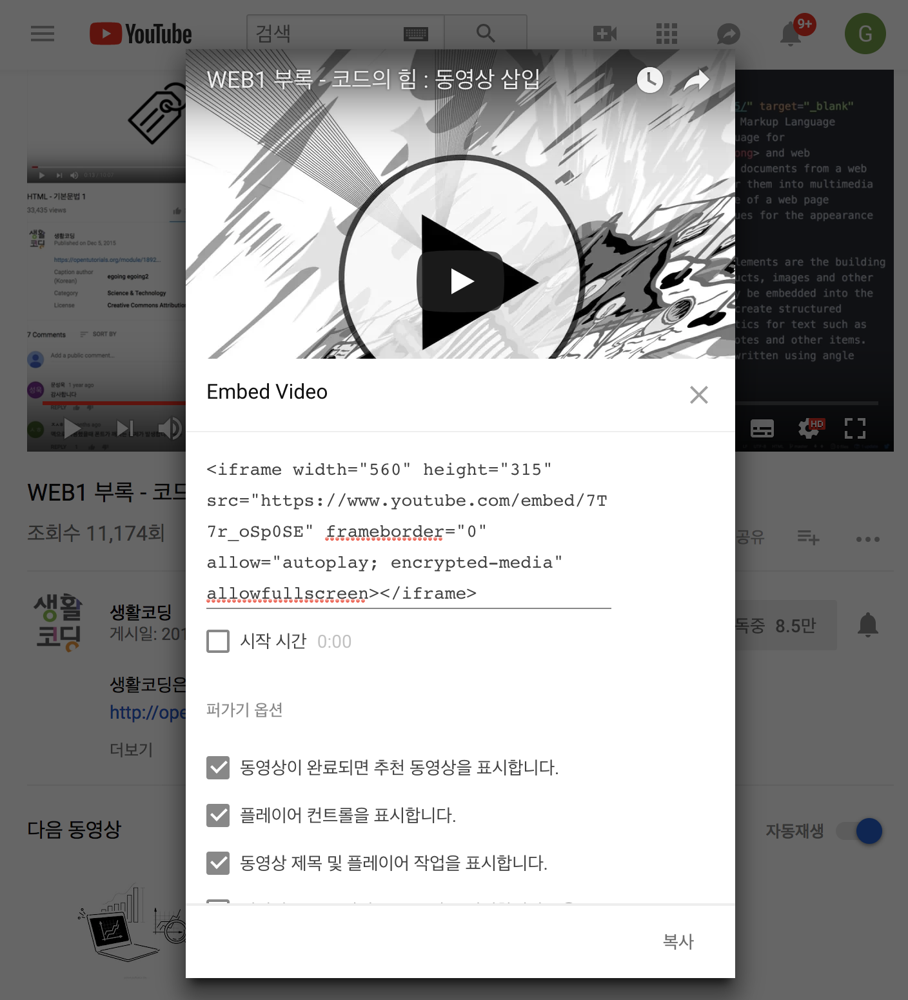

# WEB1 - HTML & Internet


> 생활 코딩으로 HTML을 배우고 기본적인 웹사이트를 만드는 방법을 배워보겠다. 


## 기획하기

- 코딩수업과 내용을 잘 정리 정돈할 수 있는 웹사이트를 그려본다.



#### 만들고 싶은 웹사이트의 형태

1. 상단에는 수업 전체 제목
2. 왼쪽 사이드 바에는 수업 목차, 목차에는 링크가 걸려있다. 링크를 클릭하면 해당하는 콘텐츠가 오른쪽에 표시가 된다. 
3. 오른쪽 상단에는 제목이 표시되고, 본문에는 제목에 대한 자세한 설명이 표시된다.


##  코딩과 HTML

> 기획을 했으니 구현을 할 차례이다. 


- 부호 또는 신호라는 의미의 **코드(Code)**
- 원천이라는 뜻의 **소스(Source)**
- 약속이라는 의미에서 언어 **컴퓨터 언어**


#### 1. 코딩이란? 코드를 통해서 결과를 만든다.


그리고 세상에는 다양한 종류의 코드들이 있다. 

C, C++, Java, JavaScript, Python, PHP, SQL...

그리고 코드마다 역할이 다르다.


#### 2. 웹페이지를 만드는 코드는?? 무엇인가?? **HTML** 입니다.

> HTML  (HyperText Markup Language)


## HTML 코딩 실습 환경 준비


> 코딩을 하기 위해서는 에디터(Editor) 프로그램이 필요하다.


생활코딩에서 채택한 에디터는 **github.com** 에서 만든 **Atom**

[ATOM 프로그램 다운 링크] :: <https://atom.io/>


## 기본 문법 - 태그


> 진짜 코딩을 해보기 


1. html에 아래와 같은 내용을 저장한 후 웹브라우저를 리로드

```html
Hypertext Markup Language (HTML) is the standard markup language for creating web pages and web applications.
```

2.  우리는 글씨를 강조하고 싶다. 

```html
Hypertext Markup Language (HTML) is the standard markup language for <strong>creating web pages</storong> and web applications.
```

3. 밑줄치기 

```html
Hypertext Markup Language (HTML) is the standard markup language for <strong>creating <u>web</u> pages</strong> and web applications.
```


## 혁명적인 변화

 

> <https://www.w3.org/>
>
> 이 웹사이트는 W3C(The World Wide Web Consortium)라는 
>
> 국제민간표준화기구의 홈페이지입니다.


- 웹은 한 기업에 의해 만들어 지는 것이 아니다. 

- W3C 소속된 여러 기업과 기관들의 논의를 통해 만들어 진다.


  **h1 태그** ::  <https://www.w3schools.com/tags/tag_hn.asp>

```html
<h1>This is heading 1</h1>
<h2>This is heading 2</h2>
<h3>This is heading 3</h3>
<h4>This is heading 4</h4>
<h5>This is heading 5</h5>
<h6>This is heading 6</h6>
```


## 통계에 기반한 학습


> 오늘날의 HTML은 약 150개가 넘는 태그가 존재한다. 
>
> 수 많은 태그를 다 공부해야 하는 것인가?


-  구글에서는 수많은 웹페이지를 분석했는데 그 결과를 정리한 사이트가 있다. 

         <https://advancedwebranking.com/html/>

- 수 많은 웹페이지들이 몇 종류의 태그로 이루어져 있는지 보여준다. 
- 우리는 후에 공부를 할때 이렇게  통계를 통해 빈도수를 파악한다. 
- 사용 빈도수가 높은 것들을 우선순위로 해서 공부를 한다면 많은 시간을 절약 할 수 있을 것이다.


##  줄 바꿈


1. HTML 에서 새로운 줄을 표현할 때는 `<br>` 태그를 쓰면 된다. 


- `<br>`태그는 좀 특이한 면이 있다.
- 닫는 태그가 필요하지 않다. 
- img, input, br, hr, meta 등이 닫지 않는 태그의 사례이다.


2. 단락 (paragraph)를 표현하는 태그 `<p>, </p>`

   

- `<p>` 태그는 하나의 단락을 그룹핑 할 수 있도록 닫는 태그가 존재한다.
- `<p>` 태그는 단락과 단락 사이의 간격이 고정되어 있다. 
- `<br>` 태그는 쓰는 만큼 줄 바꿈이 되기 때문에 원하는 만큼 간격을 줄 수 있는 장점이 있다.


3. CSS 를 이용하면 `<p>` 태그의 한계를 극복할 수 있다.

- HTML이 정보를 표현한다면,
- CSS는 정보를 꾸며준다.

```css
<p style="margin-top:45px;">
```

- 위과 같이 `<p>` 태그에 style="margin-top:45px"를 추가하면 
-  `<p>` 태그 위쪽에 45px 만큼의 여백 (margin)이 생긴다. 
- CSS를 통해 `<p>` 태그의 디자인을 자유롭게 변경할 수 있다. 
- 그래서 `<br>` 태그 보다 `<p>`태그가 더 좋은 선택입니다.


## 최후의 문법 속성과 img


> img 태그와 
>
> 속성 (attribute)


1. img 태그 

```html

```

- ` `  ::  태그 
- `src = `  ::  속성 
- `이미지의 주소` :: 속성 값


2. img 의 사이즈 

```html

```

- 높이와 넓이가 42pixels 이다. 


## 부모와 자식, 목록 


1. 무모 자식 관계 

```html
<parent>
    <child></child>
</parent>
```

- parent 태그에 대해 child 태그를 자식 태그라고 한다. 
- child 태그에 대해 parent 태그를 부모태그라고 한다.


```html
<p>
    <a href="https://opentutorials.org">opentutorials</a>
</p>
```

- `<p>`태그가`<a>` 태그의 부모 `<a>`태그가 `<p>`태그의 자식이다.
- 필요에 따라서 무모, 자식 관계가 달라질 수 있다. 


2. 목록 

- 목차를 표현하기 위한 태그 `<li>`
- 목록과 다른 목록을 구분 하기 위한 경계 `<ul>`

```html
<ul>
  <li>1. HTML</li>
  <li>2. CSS</li>
  <li>3. JavaScript</li>
</ul>
<ul>
  <li>egoing</li>
  <li>k8805</li>
  <li>sorialgi</li>
</ul>
```


-  `<li>` 태그는 `<ul>` 태그를 꼭 필요로 합니다.
- `<ul>` 태그 역시 `<li>` 태그가 없다면 존재 가치가 없습니다. 
- 이 둘은 서로 아주 밀접한 관계입니다.


```html
<ol>
  <li>HTML</li>
  <li>CSS</li>
  <li>JavaScript</li>
</ol>
```

- `<ul>`은 **u**nordered **l**ist의 약자이고
- `<ol>`은 **o**rdered **l**ist의 약자랍니다.


## 문서의 구조와 슈퍼스타들

> HTML 을 만든 사람들은 본문과 본문을 설명하는 정보를 
>
> 다른 태그로 분리해서 정리 정돈 하기로 했다. 
>
> 우리는 거기에 따르면 된다. 


- 제목을 지정하기 위해서는 `<title>` 특히, 검색엔진이 웹페이지를 분석할때 가장 중요하게 생각하는 태그이다.

- 이 웹페이지를 UTF-8로 저장했다면, 웹페이지를 열 때도 UTF-8 방식으로 해석해서 열어야 한다. 
`<meta charset="utf-8">`
- 본문은 `body` 태그로
- 본문을 설명하는 태그는 `head` 태그를 사용한다.
- 이 웹 페이지가 HTML로 만들어 졌다는 것을 표현하기 위해 문서 시작에 `<!doctype html>`코드를 추가 한다. 

```html
<!doctype html>
<html>
<head>
  <title>WEB1 - html</title>
  <meta charset="utf-8">
</head>
<body>
  <ol>
    <li>HTML</li>
    <li>CSS</li>
    <li>JavaScript</li>
  </ol>
  <h1>HTML</h1>
  <p>Hypertext Markup Language (HTML) is the standard markup language for <strong>creating <u>web</u> pages</strong> and web applications.Web browsers receive HTML documents from a web server or from local storage and render them into multimedia web pages. HTML describes the structure of a web page semantically and originally included cues for the appearance of the document.
  
  </p><p style="margin-top:45px;">HTML elements are the building blocks of HTML pages. With HTML constructs, images and other objects, such as interactive forms, may be embedded into the rendered page. It provides a means to create structured documents by denoting structural semantics for text such as headings, paragraphs, lists, links, quotes and other items. HTML elements are delineated by tags, written using angle brackets.
  </p>
</body>
</html>
```


## HTML 태그의 제왕

> anchor 앵커는 배가 정박할 때 사용하는 닻을 의미합니다.정보의 바다에 정박한다는 의미의 시적인 표현인
a 태그는 어떤 기능을 표현하는 것일까요?

> `<a>,</a>` 태그는 바로 링크이다.
> 


- Hypertext Markup Language (HTML)
HTML의 공식 사용설명서 페이지를
링크로 걸어보겠습니다.
주소는 아래와 같습니다.
<https://www.w3.org/TR/html5/>

```html
<a href="https://www.w3.org/TR/html5/" target="_blank" title="html5 specification">Hypertext Markup Language (HTML)</a>
```


## 원시웹

> 웹과 인터넷은 어떻게 다를까?
> 
> 인터넷이 도시라면, 
> 웹은 도시 위에 있는 건물 하나
> 
> 인터넷이 도로라면, 
> 웹은 도로 위를 달리는 자동차 한대 라고 할 수 있다.
> 
> 인터넷이 운영체제라면 웹은 운영체제 위에 동작하는 하나의 앱이라고 할 수 있습니다. 
> 


#### 정보 기술 역사상 중요한 사건 2개 

- 1960년에 인터넷이 탄생합니다. 
- 1990년에는 웹이 시작됩니다. 

#### 원시웹의 탄생 인터넷과 웹의 관계

- **1960년대**는 인류역사상 핵전쟁이 끝나지 얼마 되지 않은 때 이다.
- 미국에서 핵공격이 일어 났을때, **중앙집중적 통신 시스템**이 매우 취약하다는 것을 발견한다.
- 핵공격을 당하면 통신이 마비되는 위험이 있었던 것이다.
- **분산된 형태의 통신 시스템**을 구상하게 되었는데, 그게 바로 **인터넷의 시작**이었습니다.
- **수 많은 통신장치들이 각자 일종의 전화국 역할을 하는 상호부조 시스템이 인터넷 인것이다.** 
- 인터넷은 천천히 확산되지만 일반인들은 인터넷을 접할 기회가 없었다.
- 대학, 군대, 기업들만 사용하는 엘리트 전용 시스템이 었다.
- 바로 **1990**년 **웹**이 탄생하게 된다. 
- 웹의 창시자 **팀 버너스 리**, 그는 스위스 유럽입자물리연구소 엔지니어 이다.
- 그의 연구소에 인터넷이 도입 되면서, 그는 1990년 10월 웹페이지를 편집하는 프로그램은 만든다.
- 1990년 11월에 세계 최초의 웹브라우저를 만든다. 이름이 바로 **월드 와이드 웹(world wide web)**
- 1990년 12월 24일 크리스마스 이브에 **웹서버**를 완성한다.
- 그는 그 서버에 **info.cern.ch** 라는 도메인 네임을 부여한다.
- <http://info.cern.ch> 
- 이것이 바로 **세계 최초의 웹페이지**이자 웹의 메소포타미아, **원시웹** 인것이다 !
- 그 후 인터넷을 제대로 응용한 웹이 등장하면서, 일반인에게도 쓸 만한 시스템이 되었고
- 그렇게 인터넷과 웹은 폭팔적으로 동반성장해서 오늘날에 이르게 되었다. 
- 내가 만든 웹페이지를 인터넷을 통해서 전세계 누구나 볼 수 있도록 해야 한다. 
- 그렇게 된다면, 웹을 마스터한 사람을 부른는 칭호인 웹마스터! 한번 웹마스터가 되어 보자.


## 인터넷을 여는 열쇠 : 서버와 클라이언트 

> 인터넷이 동작하는 원리 

- 인터넷이 동작하기 위해서는 최소 두 대의 컴퓨터라 필요합니다. 

- 두 대의 컴퓨터가 서로 정보를 주고 받는 순간 인류는 완전히 새로운 존재가 되었다.


#### 팀 버너스 리는 인터넷을 이용해 웹을 만들기로 한다.

- 2대의 컴퓨터를 장만한다. 
- 2개의 프로그램을 개발한다. 
- 각각 프로그램에 웹프라우저와 웹서버라는 이름을 붙인다.
- 웹서버가 설치된 컴퓨터에는 info.cerm.ch라는 주소를 부여한다. 또 이 컴퓨터의 어떤 디렉토리에 index.html이라는 파일을 저장한다.
- 웹브라우저가 설치된 컴퓨터의 주소창에 <http://info.cern.ch/index.html>라는 주소를 입력하고 엔터를 친다.



- 웹브라우저가 설치된 컴퓨터는 인터넷을 통해서 전기적인 신호를 **info.cern.ch**라는 주소의 컴퓨터에게 보낸다.
- 그 전기적인 신호 안에는 이런 내용이 적혀 있습니다. 
- '나는 index.html 이라는 파일의 코드를 원합니다.'
- 그러면, info.cern.ch에 설치된 웹서버라는 프로그램이 어떤 디렉토리에서 index.html이라는 파일을 찾습니다.
- 그 내용을 읽어서 전기적인 신호를 바꾼 후에 웹브라우저가 설치된 컴퓨터에 신호를 보냅니다.
- 웹브라우저가 설치된 컴퓨터에는 index.html 파일의 내용 즉 코드가 도착합니다.
- 웹브라우저는 그 코드를 읽어서 웹페이지를 화면에 출력합니다.
- 그러면 우리가 알고있는 웹이 작동하게 된다. 


#### 웹브라우저와 서버의 관계


- 웹브라우저가 깔린 컴퓨터는 정보를 요청합니다. 
- 웹서버가 깔린 컴퓨터는 정보를 응답합니다. 
- 요청하는 컴퓨터를 **클라이언트(client) 컴퓨터**로 응답하는 컴퓨터를 **서버(server) 컴퓨터**라고 부르기로 합니다.


#### 웹서버 운영하는 방법

1. 내 컴퓨터에 직접 웹서버를 설치하는 것 

2. 웹서버를 제공해 주는 업체 이용 (웹소스팅 업체)


## 웹호스팅 (github pages)

>  직접 웹서버를 운영하는 일은 쉽지 않다. 
>
> 1. 우선 컴퓨터가 항상 켜져있어야 한다.
> 2. 웹서버라는 프로그램을 배워서 설치해야 한다.
> 3. 인터넷을 통해 외부로 정보를 전송할 수 있게 설정해야 한다. 


#### 웹 호스팅 업체 란? 

- 인터넷이 연결된 컴퓨터를 빌려주는 비즈니스 
- **github**  [https://github.com](https://github.com/)
- 프로그래머들의 성지 같은 곳 , 수 많은 오픈소스를 만날 수 있다. 
- **git hub page**에 호스팅 하기 - 설명 및 예시 <https://opentutorials.org/course/3084/18891> 
- **github**에 만들어진 웹페이지 - <https://janggunhee.github.io/web1_study/index.html>

 

#### 원리 ?

- 내 컴퓨터와 visitor 즉 나의 웹페이지를 보고 싶어하는 사람의 관계 연결
- 지금 내 컴퓨터로는 컨텐츠를 서비스 할 수 없다. 그래서 github의 pages 기능을 이용했다.
- github 서버에 파일을 업로드 하고, pages 기능을 활성화 하면 
- github의 서버 컴퓨터에 웹서버가 켜진다. 



- 우리에게 웹서버의 주소를 알려준다. 

- 이제 웹서버의 주소에 방문자가 방문해서 내 컴퓨터가 아닌 github 컴퓨터에 설치된 웹서버에 접속해 웹페이지 컨텐츠를 접할 수 있게된다. 




#### 호스팅 활용하기 

- 필요한 웹호스팅을 찾아내는 것도 능력이다. 

- 현재 HTML로만 웹페이지를 만들었고, 

  서버쪽에서 특별히 할 일이 없기에 무료로 서비스 해주는 곳이 많다. 

- 정적인 웹페이지와 / 동적인 웹페이지가 있다. 

- free static web hosting


#### 추천 사이트 

- [https://bitballoon.com](https://bitballoon.com/)
- [http://neocities.org](http://neocities.org/)
- [Azure Blob](https://azure.microsoft.com/en-us/services/storage/blobs/)
- [Google Cloud Storage](https://cloud.google.com/storage/)
- [Amazon S3](http://aws.amazon.com/s3)


## 웹서버 운영하기 


> 내 컴퓨터에 웹서버를 설치해서 내 컴퓨터에 있는 웹페이지를 볼 수 있도록 하기 
>
> 어려운 일이지만 
>
> 인터넷이 동작하는 원리를 알 수 있다는 장점이 있다. 


#### 내 컴퓨터에 웹서버 프로그램을 설치하기 

#### 웹 서버의 제품군 

- Apache
- IIS
- Nginx

이중에서 우리가 사용할 소프트웨어는 아파치 이다.


## Apache 

>  <https://httpd.apache.org/>

- 오픈소스 

- 무료 - 공공재 

- 웹서버 시장점유율 1위

  2017년 10월 기준으로 실질적으로 작동하는 웹 사이트(active site)들에서 쓰이는 
  [웹 서버 소프트웨어](https://namu.wiki/w/%EC%9B%B9%20%EC%84%9C%EB%B2%84) 
  순위는 [아파치 HTTP 서버](https://namu.wiki/w/%EC%95%84%ED%8C%8C%EC%B9%98%20HTTP%20%EC%84%9C%EB%B2%84)(44.89%), 
  [엔진엑스](https://namu.wiki/w/nginx)(20.65%), [구글 웹 서버](https://namu.wiki/w/Google%20Web%20Server)(7.86%), 
  [MS 인터넷 정보 서비스](https://namu.wiki/w/%EC%9D%B8%ED%84%B0%EB%84%B7%20%EC%A0%95%EB%B3%B4%20%EC%84%9C%EB%B9%84%EC%8A%A4)(7.32%) 순이다


#### 맥에 웹서버 설치

- 맥에는 아파치가 기본적으로 깔려 있다. 
- **bitnami**라는 프로그램으로 아파치를 설치하는 것을 도움 받을 수 있다. 
- (<https://bitnami.com/stack/mamp>)
- **MAMP** -  **M**은 Mac, **A**는 Apache, **M**은 MySQL, **P**는 PHP의 약자이다. 
- 우리는 이 중에서 Apache 웹서버를 설치하기 위해서 **Bitnami**를 깔고 있는 겁니다.
- 설치 순서 - 생활 코딩 (<https://opentutorials.org/course/3084/18894>)


## 웹 서버와 HTTP

> localhost:8080


- **:8080**은 포트(port)라느 것이다. 
- 맥에서는 기본적으로 웹서버가 설치되어 있다. 
- 기존의 웹서버와 구별하기 위해 나중에 설치한 웹서버의 포트번호를 **8080** 으로 부여한 것이다. 
- 기존의 웹서버는 포트 번호가 **localhost80**
- 웹서버의 포트 번호는 기본적으로 **80**을 쓰기로 약속했다 


#### localhost

- **localhost:8080** , **localhost**라는 도메인의 이름은 **'내컴퓨터'** 라는 의미의 특수한 주소이다. 
- **http://localhost:8080/index.html** 
- **http://127.0.0.1:8080/index.html**
- 이 주소들은 모두 내 컴퓨터에 있는 **index.html** 파일을 요청하는 주소이다. 
- **localhos**t와 같은 의미가 있는 이름을 **도메인 네임 (domain name)**
- **127.0.0.1** 과 같이 번호로 되어 있는 것을 **ip 주소 (ip address)**라 한다. 


#### 웹 서버를 이용하는 것과 하지 않는 것의 차이? 

> **ip** 주소인 **127.0.01**를 이용해 웹페이지를 여는 것과 
>
> 파일 열기를 통해서 웹페이지를 여는 것 사이에는 어떤 차이가 있을까요? 




- **http://**는 **H**yper**T**ext **T**ranxfer **P**rotocol의 약자이다. 
- 웹페이지를 전송하기 위해 만든 통신 규약이다. 
- 주소가 **http://**로 시작하면 웹브라우저는 **http 통신규약**에 따라 웹서버에 접속하게 된다. 
- **file://**로 시작하면 웹브라우저는 파일을 직접 열어서 보여준다. 


## 웹서버와 웹브라우저의 통신 

> 두 대의 컴퓨터가 서로 웹페이지를 주고 받는 방법을 살펴보자


- 웹브라우저가 웹서버에 접속하기 위해서는 웹서버가 설치된 컴퓨터의 **주소(ip 주소)**를 알아야 한다. 
- **127.0.01** - 은 마치 자기 자신을 의미하는 일종의 대명사 같은 것 
- 내 현재 네트워크 **ip주소**는 주소에 해당하는 컴퓨터를 가르키는 고유 명사라고 할 수 있다. 


#### 내 스마트폰과 통신


- 스마트 폰의 웹브라우저를 키고 
- 주소창에 웹서버가 설치된 컴퓨터의 ip 주소를 입력해서 접속한다. 
- 꼭 먼저 진행해야 하는 것이 있는데, 
- **웹브라우저가 설치된 컴퓨터**와 **웹서버가 설치된 컴퓨터**를 **같은 네트워크**에 접속해야 한다. 
- 웹서버에 저장된 내용이 웹브라우저에 표시된다. 


## 프로그래머가 되기 위한 공부 

> 세상은 우리 생각과는 다르게 쉽게 복잡해 진다. 


#### 예를 들어 check box 기능을 검수한다.


- 2개의 check box를 기능 검수하는데 4번의 확인이 필요하다. 

- 50개의 check box를 검수하는데는 2의 50승 즉, 

  

- 천 조개의 경우의 수가 생겨납니다. 


#### 사소한 기능 하나를 추가하는 것도 어렵게 된다. 


- 복잡함은 눈에 보이지 않기에 자연스럽게 좌절감의 원인을 자신 탓으로 돌리게 된다. 
- 겨우 체크박스 50개 밖에 안되는 단순한 프로그램도 제대로 못 만드는 사람이라고 여기게 되는 것이다. 
- 자기 탓이 아니라, 원래 그렇다.


#### 공부하는 것도 마찬가지다.


- 개념을 알게 된다는 것은, 체크해야 하는  체크박스가 늘어난다는 의미이다. 
- 자신도 모르게 머리 속이 기하급수적으로 복잡해진다.
- 인류는 눈에 보이는 단순함을 조작해서 눈에 보이지 않는 엄청난 복잡한 것을 만들어 내는 존재다.


#### 불만족에서 스스로에게 중요한 것이 보인다. 


> 인생에서 중요한 것일 수록 여러 불만족이 쏟아져 나올거다.


- 더 예쁘게 만들고 싶을 수도 있고 

- 더 편리하게 만들고 싶을 수도 있고

- 그리고 더 생산적으로 만들고 싶을 수도 있다.

  ##### <u>중요한 것은 이런 불만족을 자기 눈으로 직접 확인해 보는 것이다.</u> 


#### 공부의 갈림길 


1. 만약, 사이트를 더 아름답게 만들고 싶다면 

   **Web publisher**, **Web designer** 

   **CSS**를 배우는 것을 시도 하면 된다. 


2. 사용자와 상호작용을 하는 것을 하고 싶다면 

   **web front end engineer**

   **web interactive designer**

   JavaScript를 배우면 된다. 

3. 하나의 사이트를 운영하는데 생산성을 높이고 싶다면 

   **backend** **eigineer**

   PHP, JSP, Nodejs Express, Python Django, Ruby on Rails, ASP.net

   와 같은 기술을 배워야 한다. 


#### 알고 있는것을 공고히 하는 두 가지 방법 


- 알고 있는 지식을 이용해서 프로젝트를 하는 것 
- 알고 있는 지식을 컨텐츠로 만든는 것


#### <u>이 둘다 자기가 무엇을 알고 있는지, 자신과 타인에게 확인시켜 줄 수 있습니다.</u> 


**자신의 프로젝트를 시작하세요.**
**자신의 컨텐츠를 만드세요.**


#### 지식의 지도 




## 코드의 힘


#### 1. 동영상 삽입


>  **iframe** 이라는 태그 





<iframe width="560" height="315" src="https://www.youtube.com/embed/7T7r_oSp0SE" frameborder="0" allow="autoplay; encrypted-media" allowfullscreen></iframe>

```html
<iframe width="560" height="315" src="https://www.youtube.com/embed/7T7r_oSp0SE" frameborder="0" allow="autoplay; encrypted-media" allowfullscreen></iframe>
```


- 우리는 이제  방대한 양의 동영상 컨텐츠를 코드 한 줄로, 또 다른 컨텐츠를 구현 할 수 있다. 


#### 2. 댓글 기능 추가 

> 방문자들이 우리에게 정보를 제공 하는 것 
>
> 방문자와의 교류 수단,  바로 댓글기능이다.


- 이 기능은 backend 기술을 익혀야 하는 부분이 있다. 
- 댓글은 스팸이 달리기 마련이다. 사용자가 이것을 관리하기에는 힘들다. 
- 그래서 스팸 차단 기능 같은 것이 필요하다. 
- 이미지를 업로드 하는 기능
- 페이스북과 같은 sns서비스와 연동하는 기능 
- 개발의 영역이다. 


#### 댓글 기능을 제공하는 서비스 

- Disqus

- LiveRE

  <u>여기에서는 Disqus 라는 서비스를 이용해 본다.</u> 

  <https://disqus.com/>


