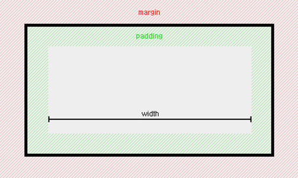

## WEB2 - CSS

> [생활코딩 - WEB2 CSS](https://opentutorials.org/course/3086)
>
> HTML 만으로는 웹을 표현하는데 한계가 있다. 
>
> 더 아름답고 보기 좋은 웹페이지를 만들기를 원했다.


### CSS 등장 이전의 상황

- 이미 있는 언어인 **html**에  디자인을 추가하는 태그를 만드는 것과 
  
  디자인을 위한 완전히 새로운 언어를 개발하는 것 중 무엇이 더 쉬운 것일까요? 

- 처음엔  html에 태그를 추가해서 만드는 방법을 시도했다. 그러나 곧 한계를 느끼고

- **CSS**라는 디자인을 위한 언어를 개발하게 된다.


### 폰트 `<font></font>` 태그 등장

```html
<li><a href="1.html.html"><font color="red">HTML</font></a>
</li>
<li><a href="2.css.html"><font color="red">CSS</font></a>
</li>
<li><a href="3.javascript.html"><font color="red">JavaScript</font></a>
</li>
```


- 만약 **a태그** 안에 있는 **text 색을**, 몇 억개가 있는 웹페이지를  매일 바꿔야 한다면?

- **font**라는 태그는 이 웹페이지에 대해서 어떠한 정보도 가지고 있지 않다. 

- text의 색이 red라는 것은 디자인에 대한 정보이지,

   웹페이지의 내용에 영향이 있는 정보의 것이 아니다

- 무분별하게 추가된 디자인 기능은 정보로서의 웹이라는 가치를 오히려 퇴보시키게 된다.

- 바로 이런 것을 극복할 수 있는 것이 **CSS** 인 것이다. 


### CSS의 등장

> CSS는  HTML과 완전히 다른 언어이다. 


- CSS를 쓰기 위해서는 웹브라우저에게 CSS의 문법으로 쓰여진 것을 알리기 위해 
- `<style></style>` 태그 안에 CSS문법을 작성해 준다. 

```css
    <style>
     a{
       color:red;
     }
    </style>
```


- **a 태그** 안의 색을 **red**로 바꿔 준다. 

- **중복된 코드**를 현격하게 줄여 준다. 

- 웹페이지의 **유지보수**를 **용이**하게 하고 

- 웹페이지의 **디자인**을 규칙성있게 조율하도록 한다. 

- **a태그**는 선택자 (selector) 그 안에, color를 red로 **declaration**(선언하다)


### 속성의 기본

> CSS의 기본 문법
>
> 속성을 이용하는 방법


- HTML 문법 안에 CSS 사용하기 - style 속성을 이용하기 

```html
<a href="2.css.html" style="color:red;">CSS</a>
```


- a태그 안에서 style태그를 달아서 CSS로 작동하게 한다.
- `;`세미콜론은 각자 효과를 구분한다. 


### 혁명적인 변화 


> **Selector** - 선택자 
>
> **Declaration** - 선언, (효과)
>
> **Property** - 속성 
>
> **Value** -  속성의 값 (Property Value)


- **CSS**를 통해서 웹페이지를 디자인 하는 어떠한  **Property(속성)**가 존재하는 지를 알아갈 것이다.
- 효과를 더 정확하게 지정하기 위해 다양한 **선택자(Seletor)**를 배워 가는 여정을 시작할 것이다.


### CSS 속성을 스스로 알아내는 방법 


> 우리는 **속성 (Property)** 에 대해서 알게 되었다. 
>
> 그러면 이제 우리는 **검색**할 수 있고, **질문**할 수 있고, **궁금**해 하기 시작한다. 


- **Title**`<h1>`을 **중앙 정렬**하고 **더 크게** 하고 싶다. 

```css
h1{
       text-align: center;
       font-size: 60px;
     }
```


### CSS 선택자를 스스로 알아내는 방법 

> HTML 속성인 class 를 사용해 그룹을 만든다.


- `<a 태그>` 안의 링크는 방문자가 한번 방문하면 색이 파란색에서 보라색으로 변하게 된다. 
-  링크가 달린 text를 기본 검정색으로 하고, 사용자가 링크를 방문하면 회색으로 변하게 하고 싶다.


### CLASS 속성을 사용하기 


> **css**

```css
    <style>
     a:link{                    # a의 링크를 선택 
       color: black;
       text-decoration: none;
     }
     .saw {                     # saw, active 클래스를 선택 
       color: grey;
     }
     .active{
       color: red
     }
     h1{
       text-align: center;
       font-size: 60px;         # h1 태그 선택 
     }
    </style>
```

> **html**

```html
    <h1><a href="index.html">WEB</a></h1>
      <ol>
        <li><a href="html.html" class="saw active">HTML</a></li>
        <li><a href="css.html" class="saw active">CSS</a></li>
        <li><a href="javascript.html" class="saw">JavaScript</a></li>
      </ol>
```


- css의 순서에 의해서 위에 있는 **명령이 더 강하게 작동**한다. 


###  id 선택자

>  `<id="">` 선택자는 ` <class="">` 선택자 보다 우위에 있다. 
>
> **태그 선택자** 보다는 **클래스 선택자**가 우위에 있다. 


1. **tag 선택자 < class 선택자 < id선택자**

2. 같은 **class** 끼리의 조합이면 가장 **마지막의 선택자**가 우선순위이다. 


### 왜 그런 우선순위를 가지고 있을까? 


- `id` 선택자의 값,  `#active`는  한번만 사용해야 한다. **`id`의 핵심은 중복되서는 안된다.** 
- **포괄적인 것 보다 구체적인 것을 더 우선순위를 높였다.** 
- 예를 들어 밑의  `a` 태그는  **포괄적인 범위를 정의**하고 , `id`는 **구체적인 지시**를 한다. 
- **tag 선택자 **(a tag)를 통해 **전체적인** 태그의 디자인을 한다.
-  **id 선택자** (#active)를 통해 **예외적인** 사항을 조정할 수 있다. 
- **class 선택자** (.saw)는 중간 정도의 우선순위 


```html
    <style>
     #active{
       color: red
     }
     .saw {
       color: grey;
     }
     a {
       color: black;
       text-decoration: none;
     }
     h1{
       text-align: center;
       font-size: 60px;
     }
    </style
    <title>WEB1 - HTML</title>
  </head>
  <body>
    <h1><a href="index.html">WEB</a></h1>
      <ol>
        <li><a href="html.html" class="saw">HTML</a></li>
        <li><a href="css.html" class="saw" id="active">CSS</a></li>
        <li><a href="javascript.html" class="saw">JavaScript</a></li>
      </ol>
```


### CSS Selectors

> CSS에서 선택자는 스타일을 적용 할 요소를 선택하는 데 사용되는 규칙입니다. 


<https://www.w3schools.com/cssref/css_selectors.asp>


| [.*class*](https://www.w3schools.com/cssref/sel_class.asp)   | .intro               | Selects all elements with class="intro"                      |
| ------------------------------------------------------------ | -------------------- | ------------------------------------------------------------ |
| [#*id*](https://www.w3schools.com/cssref/sel_id.asp)         | #firstname           | Selects the element with id="firstname"                      |
| [*](https://www.w3schools.com/cssref/sel_all.asp)            | *                    | Selects all elements                                         |
| *element*                                                    | p                    | Selects all <p> elements                                     |
| *element,element*                                            | div, p               | Selects all <div> elements and all <p> elements              |
| [*element* *element*](https://www.w3schools.com/cssref/sel_element_element.asp) | div p                | Selects all <p> elements inside <div> elements               |
| [*element*>*element*](https://www.w3schools.com/cssref/sel_element_gt.asp) | div > p              | Selects all <p> elements where the parent is a <div> element |
| [*element*+*element*](https://www.w3schools.com/cssref/sel_element_pluss.asp) | div + p              | Selects all <p> elements that are placed immediately after <div> elements |
| [*element1*~*element2*](https://www.w3schools.com/cssref/sel_gen_sibling.asp) | p ~ ul               | Selects every <ul> element that are preceded by a <p> element |
| [[*attribute*\]](https://www.w3schools.com/cssref/sel_attribute.asp) | [target]             | Selects all elements with a target attribute                 |
| [[*attribute*=*value*\]](https://www.w3schools.com/cssref/sel_attribute_value.asp) | [target=_blank]      | Selects all elements with target="_blank"                    |
| [[*attribute*~=*value*\]](https://www.w3schools.com/cssref/sel_attribute_value_contains.asp) | [title~=flower]      | Selects all elements with a title attribute containing the word "flower" |
| [[*attribute*\|=*value*\]](https://www.w3schools.com/cssref/sel_attribute_value_lang.asp) | [lang\|=en]          | Selects all elements with a lang attribute value starting with "en" |
| [[*attribute*^=*value*\]](https://www.w3schools.com/cssref/sel_attr_begin.asp) | a[href^="https"]     | Selects every <a> element whose href attribute value begins with "https" |
| [[*attribute*$=*value*\]](https://www.w3schools.com/cssref/sel_attr_end.asp) | a[href$=".pdf"]      | Selects every <a> element whose href attribute value ends with ".pdf" |
| [[*attribute**=*value*\]](https://www.w3schools.com/cssref/sel_attr_contain.asp) | a[href*="w3schools"] | Selects every <a> element whose href attribute value contains the substring "w3schools" |
| [:active](https://www.w3schools.com/cssref/sel_active.asp)   | a:active             | Selects the active link                                      |
| [::after](https://www.w3schools.com/cssref/sel_after.asp)    | p::after             | Insert something after the content of each <p> element       |
| [::before](https://www.w3schools.com/cssref/sel_before.asp)  | p::before            | Insert something before the content of each <p> element      |


### CSS box model 소개


> 우리는 웹페이지를 디자인 할때 각 구역의 범위를 나눈다.


- **h1 태그**와 **a 태그** 범위에 **5px**의 **red칼라**의 **선** 효과를 지정해 주었다. 


```css
    <style>
      /*
      block level element
      */
      h1{
        border-width: 5px;
        border-color: red;
        border-style: solid;
        display:inline;  
      }
      /*
      inline element
      */
      a{
        border-width: 5px;
        border-color: red;
        border-style: solid;
        display:block;
      }
    </style>
```


- **h1 태그**와 **a 태그**의 범위는? 
- 자신의 컨텐트 크기 만큼의 부피를 사용한다. 
- **h1 태그** 처럼 title의 범위를 지정하는 것은 **화면전체를 사용하는데**, 이것을 바로 **block** 이라고 한다. 
- **a태그** 처럼 **자기 영역**을 가지는 것을 **inline** 이라 한다. 
- **h1 태그**는 **block level elemet**
- **a 태그**는 **inline element**
- 이러한 범위는 절대적인 것이 아니라 **CSS의 기본 값**이다.
- `display:inline;` or `display:block;` 으로 디스플레이 값을 변동 시킬 수 있다. 


```css
    <style>
      h1, a{
        border-width: 5px;
        border-color: red;
        border-style: solid;
      }
    </style>
```


- 위 코드를 이렇게 바꿔 주면 동일한 효과로 **중복되는 코드** 사용을 **방지**할 수 있다. 


```css
    <style>
      h1, a{
        border:5px solid red;
      }
    </style>
```


- 또,  중복되어 사용되는 **border**를 이렇게 **줄여서 코드**를 **작성** 할 수 있다. 


#### CSS box의 영역 


- `border` 를 정의 내려준다. 


```css
    <style>
      h1{
        border:5px solid red; /* 5px 두꼐의 빨간 선 */
        padding: 20px;  /* h1 안쪽 영역에  20px의  여분 */
        margin: 20px;     /* h1 바깥 영역에  20px의 여분 */
        display: block;
        width: 100px;
        /* h1 magin 과 padding영역을 제외한 영역의 가로 폭 */
      }
    </style>
```


- `margin`과 `padding` 속성은 각각 **바깥쪽 여백**, **안쪽 여백**을 의미
- `width`, `height` 속성은 숫자 뒤에 **단위를 표시**하여 적습니다.

- `margin`과 `padding`은 `border`를 경계로 나뉩니다.




			[출처 :: ofcourse](https://ofcourse.kr/css-course/margin-padding-%EC%86%8D%EC%84%B1)


### CSS -  Box model  


[출처 모질라](https://developer.mozilla.org/en-US/docs/Learn/CSS/Introduction_to_CSS/Box_model)


### CSS 속성 보기 - 구글 개발자 툴


- 웹 개발을 도와 주는 도구  - **개발자 도구**

- 지금은 **content**의 영역을 보여 주고 있다. 


### CSS box model을 써먹기 


<iframe width="560" height="315" src="https://www.youtube.com/embed/4ir8XAf7wxI" frameborder="0" allow="autoplay; encrypted-media" allowfullscreen></iframe>


- 동영상 따라해 보기 


### 그리드의 기본 사용법

> rayout 을 효율적으로 짜는 방법
>
> 최근에 등장한 기술이다.


- 디자인을 위해서 어떠한 의미도 없는 태그를 써야 할 때가 있다. 
- 무색 무취와 같은 태그 `<div>` , **division(분할**)의 약자이다.
- 이와 같은 `<span>`이라는 태그가 있다. 
- **div 태그**는  block 영역을 지정
- **span태그**는 inline  element 이다
- **디자인 목적**만으로 **부모 자식간의 관계**를 만들어 줄때도 `div태그`를 사용할 수 있다. 

```html
  <body>
    <div id="grid">
      <div>NAVIGATION</div>
      <div>ARTICLE</div>
    </div>
  </body>
```


### CSS - GRID 

> grid 의 개념 
>
> **내용을 레이아웃하는 방법**으로, 작성자가 **예측 가능한 크기 조정 동작 세트**를 사용하여 
>
> **레이아웃에 사용할 수있는 공간**을 **열과 행으로 나눌 수**있는 메커니즘을 제공합니다. 
>
> 모든 그리드 속성 및 **fr 단위**에 대한 지원을 포함합니다.


```css
    <style>
      #grid{
        border: 5px solid pink;
        display: grid;
        grid-template-columns: 2fr 1fr;
      }
      div{
        border: 5px solid grey;
      }
    </style>
```

- `fr` 이라는 단위는 화면을 분할해서 차지하는 영역을 지정해 준다. 


- **article** 단어 대신 **긴 문장**이 들어와도 **그리드로 구분된 영역안에서** 확장된다.


### can i use 라는 사이트 

> 현재 웹브라우저 들이 얼마나 그 기술을 체택하고 있는가의 통계를 보여 주는 사이트 

<https://caniuse.com/>


- 웹브라우저 에서 얼마나 호환이 되는지를 보여준는 통계표 이다. 

- Opera mini 에서는 작동 안됨
- IE 11 버전에서는 부분적으로 작동 됨


### CSS 그리드 써먹기 


```css
 #grid{
   display: grid;
   grid-template-columns: 150px 1fr;
 }
 #grid ol{
   padding-left: 30px;
 }
 #grid #article{
   padding-left: 25px;
 }
```


- grid `id`의 선택자로 태그를 구분지어 정의 내릴 수 있다. `#grid ol`
- 의미를 더 분명히 하기 위해서 `id` 선택자 끼리 중첩시킬 수 있다.


