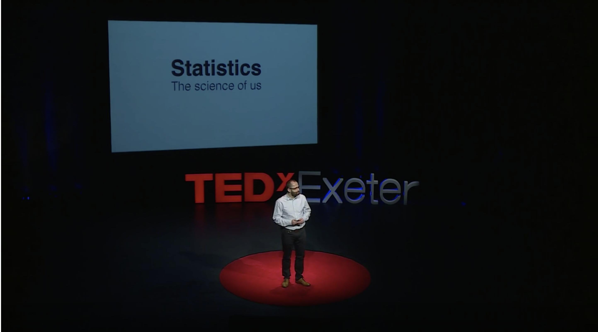
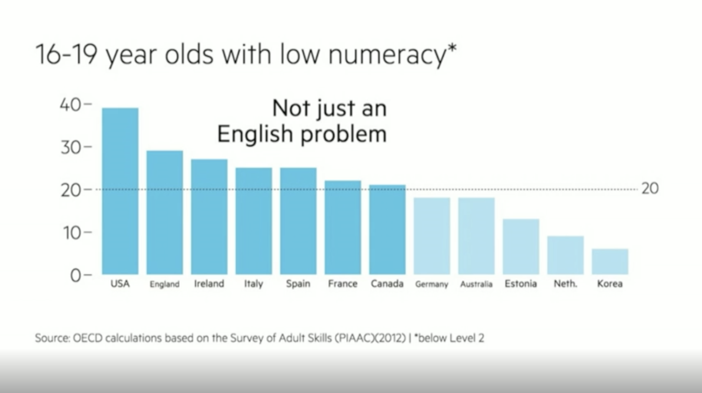
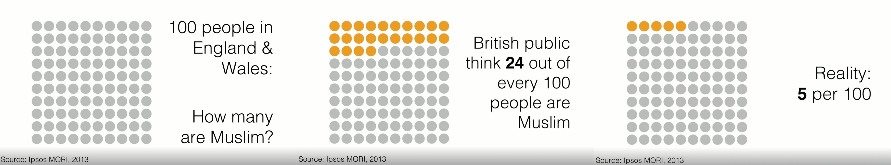
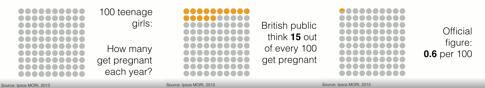
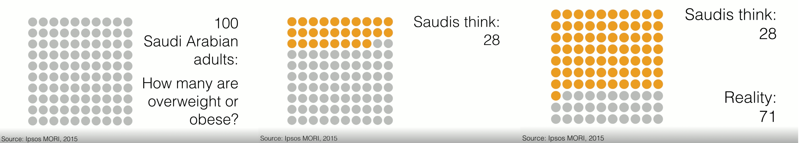
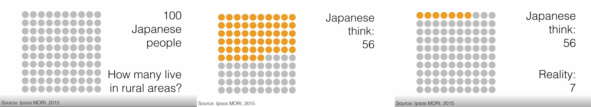

## 통계학 입문 - 1Day

> Alan Smith | TEDxExeter
>
> ### Why you should love statistics

[우리는 왜 통계학을 사랑해야 하는가? TED 영상 (20분)**](https://www.ted.com/talks/alan_smith_why_we_re_so_bad_at_statistics#t-3731)

> **현대인들의 계산능력 수준이 낮다.**

- **2003**년 사람들의 **계산능력**을 단계별로 평가하는 조사를 영국정부의 실행하였는데, 노동 가능한 나이의 인구 **100명당 47**명이 1단계도 충족하지 못한 충격적인 결과가 나왔다. 
- **계산능력 1단계**란 **분수, 백분율, 소수만** 다룰 줄 아는 것이다. 
- 영국 정부에서 정책을 바꾸고 투자도 했지만 **2011년 조사결과**는 오히려 **49명**으로 늘었다.

>  **올해 OECD는 젊은이들의 계산능력 조사결과를 발표했다.**

- 영국과 미국의 수준이 낮아보이지만 그 수치는 그저 그 나라의 평균치일 뿐 
- **OECD국가** 중 **한국**의 수준은 나아 보이지만, **본인의 계산능력은** 고등학교때 배웠던 수학지식을 재교육이 하지 않아 이미 **상실**했다고 봐도 무방할 것이다. 
- 하지만, **숫자를 유용하게 쓰려고 뛰어난 계산능력을 지닐 필요는 없다고 생각한다.** 그리고 여기서 부터 숫자에 대한 여정을 시작해야 한다. (Alan Sminth 이거 진짜임? ) 

- 어느 누구나 그러하듯이 **계산능력**이 떨어지면 **통계학**는 머나먼 나라의 이야기라고 생각하기 마련이기에 그의 말에 의문이 들 수밖에 없지만, 어디 한번 **숫자와 친해지기**를 시도해 보려한다.

> **Alan Smith가 통계학에 흥미를 갖게 된 계기** 

- 통계학은 바로 우리에 관한 학문이다. 
- 통계학은 우리가 사는 세상의 상태, 집단에 관한 데이터를 다루는 과학이다.
- 개인이 아닌 집단이다.
- 통계학은 우리에게 충격을 줄 때 가장 영향력이 강하다.

> **실제와 사람들이 인지하는 현상과 차이** 

**예시 1>**   **글랜드와 웨일즈 사람 100명 중 무슬림은 몇 명이나 될까요?**

- 영국 성인 1,000명에게 물었다. 
- 잉글랜드와 웨일즈 사람 100명 중 무슬림은 몇 명이나 될까요? 
- 그 결과 전체 인구를 나타내는 평균대답은 24명 이였습니다. 사람들 생각으론 그랬던 거죠. 영국 사람 100명 중 무슬림은 24명일 거라고요. 
- 공식 수치에 따르면 5명입니다.

**예시 2>  영국사회가 영국에서 얼마나 많은 십대 여학생들이 임신을 한다 생각한다고 생각해요?** 

- 영국사회가 100명의 십대 청소년들 중 15명이 임신을 한다 생각했지만 
- 공식적인 통계에 의하면 실제로는 한개의 점을 색칠하려면 200개에 가까운 점들이 있어야 했다.

**예시 3> 사우디 아라비아 사람들에게 물었죠. 나라 안의 성인 100명 당 몇 명이 비만이라고 생각하세요?** 

- 평균적인 대답은 4분의 1을 조금 넘었습니다.  4분의 1보다 조금 많은 사람들이 비만이라고요. 
- 그렇지만 공식적인 통계학은 사실 4분의 3이라고 나타내고 있습니다.

**예시 4> 일본인들에게 물었습니다. 일본인들 100명 중 몇 명이 시골에 산다고 생각해요?** 

-  평균 대답은 약 50대 50으로 나뉘었습니다. 반 정도로요. 그들은 일본인들 100명 중 56명이 시골에서 산다고 생각하고 있었어요. 
- 공식적인 통계는 7명입니다.

> **사람들은 직관적인 통계에 약하다**

- 노벨상 수상자 경제학자 다니엘 카네만은 수년 동안 사람들이 인지하는 것과 실제 차이를 연구했다.

- 개인의 경험은 당연히 자신의 인식을 바꿀 수 있고 몇몇 대중매체의 정보들로도 영향력을 끼칠 수 있다. 

- 카데만은 말한다. "우리는 당연한 것을 보지 못할 수 있다." , "우리는 숫자를 맞추지 못했다.

  ###   	  **"우리는 우리의 맹목을 보지 못할 수 있다."**

> **당신은 당신의 지역에 대해 얼마나 잘 아나요?**

- 지역지민이 자기 주거지의 지역정보를 맞추는 애니메이션으로 작동하는 퀴즈 웹사이트를 만들었다.
- 인구조사 통계치와 지역주민의 선입견의 차이가 여실히 들어나는 것을 발견했다.
- 사람들은 그 사실에 매우 흥미로워 했다. 
- 자신을 대표하는 지역 정치인들에게 웹사이트 링크를 보내기 시작했다.
- 숫자에 능통한 통계학자들에게도 이 퀴즈를 풀게 했다.
- 결과는 당연히 "**개인의 편견**과 실제 숫자가 의미 하는 **사실에 대한 큰 차이**를 드러내는 것이다."

######	*" 우리는 통계에 대해 불확실의 과학이라고 이야기합니다. 저는 이렇게 생각합니다.*

######					*통계는 우리에 대한 과학이라고.*

######			*그리고 이것은 우리가 숫자에 매료되어야 하는 이유입니다. "*

