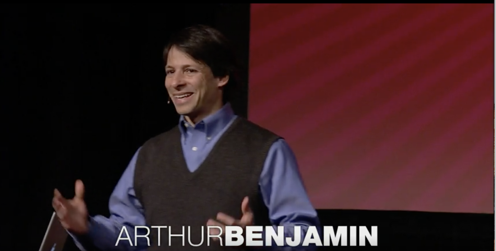

## 통계학 입문 - 2Day 

> Arthur Benjamin at TED2009
>
> ### Teach statistics before calculus!

[**미적분학 이전에 통계학을 가르쳐라 TED 영상 시청 (3분)**](https://www.ted.com/talks/arthur_benjamin_s_formula_for_changing_math_education?utm_campaign=tedspread&utm_medium=referral&utm_source=tedcomshare)

<iframe src="https://embed.ted.com/talks/arthur_benjamin_teach_statistics_before_calculus" width="854" height="480" style="position:absolute;left:0;top:0;width:100%;height:100%" frameborder="0" scrolling="no" allowfullscreen></iframe>

> **고등학교를 졸업했다면 누구나 확률과 통계를 알아야 한다.** 

- 우리가 학교에서 배우는 모든 **수학교과 내용**은 하나의 지향점을 향하고 있다.
- 바로 미적분학이다.
- 하지만 **Arthur Benjamin**은 수학교육의 목표가 잘못되었다고 말하며 
- **확률**과 **통계**야 말로 수학교육의 목표가 되어야 한다고 주장한다. 

> **미적분학 / 통계학** 

- 실생활에서 매일 미적분을 의식적으로 의미있게 활용하는 사람은 극소수이다. 
- 통계는 일상에서 활용할 수 있고, 활용해야하는 지식이다. 
- **리스크**, **보상**,  **무작위성(randomness**), **데이터 이해하기** 등, 이 모든게 통계이다.

> **우리 모두가 확률과 통계에 대해 알고 있다면 ?**

- 아마 경제 위기는 오지 않았을지도 모릅니다. 
- 트렌드를 분석하고 미래를 예측하는 것이다. 
- 세상이 아날로그에서 디지털로 바뀌었다. 
- 전통적인 연속함수를 다루던 수학에서 현대적 이산수학에 대한 내용을 더 배워야 한다. 
- 불확실성과 무작위성 그리고 데이터에 대한 수학이 바로 확률과 통계이다. 

