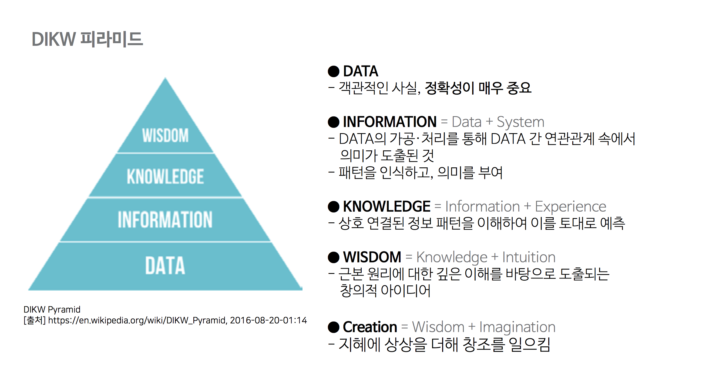

## 데이터 이해 

### 제 1절  데이터와 정보

### 1. 데이터의 정의

- **데이터(data)** - 라틴어 dare(주다, to give)의 과거분사형으로서 '주어진 것' 이라는 의미로 처음 사용
- **옥스포드 대사전** - **'추론과 추정의 근거를 이루는 사실'** 로 정의 
- 객체로서의 가치 뿐만 아니라 다른 객체와의 상호관계 속에서 가치를 갖는 것으로 설명한 것
- **객관적 사실 (fact, raw material)**이라는 **존재적 특성**
- **추론• 예측 • 전망 • 추정을 위한 근거(basis)** 로 기능하는 **당위적 특성** 

#### 1-1 데이터의 유형 

| 구분                                        | 형태             | 예                 | 특징                                        |
| ------------------------------------------- | ---------------- | ------------------ | ------------------------------------------- |
| **정성적 데이터 (qualitative data)**   | 언어, 문자 등    | 회사 매출이 증가함 | 저장•검색•분석에 많은   비용이 소모됨  |
| **정량적데이터   (quantitative data)** | 수치, 도형, 기호 | 30(나이) , 체중    | 정형화가 된 데이터로  비용 소모가 적음 |

 

- **정성적 데이터** 
  - 언어, 문자
  - **설문조사, 주관식 응답, sns 올린 글** 등과 
  - 데이터 형태 형식이 정해져 있지 않고 천차만별(**비정형 데이터**) 
  - 통계분석이 어려움
- **정량 데이터** 
  - 수치, 도형, 기호
  - 정형데이터 **수치로 명확하게 표현** 
  - 지역별 온도, 풍속, 강우량 같은 데이터 
  - 통계분석이 용이함

#### 1-2 암묵지와 형식지의 상호작용

**암묵지(tacit knowledge)**

- 시행착오와 오랜 경험  ∙ 학습과 체험을 통해 개인에게 습득된 무형의 지식
- 개인에게 체화되어 있기 때문에 외부에 표출되어 다른 사람에게 공유되기 어렵다는 단점을 갖고 있다. 

**형식지(explicit knowledge)** 

- 교과서, 매뉴얼, 비디오, DB 와 같이 형상화된 지식 
- 유형의 대상이 있기 때문에 지식의 전달과 공유가 용이하다.

> 현장 경험을 통해 개인에게 축적된 **내면화**된 (internalization) 지식을 조직의 지식으로 **공통화**(socialization)하기 
> 위해서는 개인의 암묵지를 언어나 기호, 숫자 등의 형태로 **표출화**(externalization)하고, 
> 이를 다시 다른 개인이 본인의 지식에 **연결**(combination)하여, 그 바탕 위에 새로운 경험을 부가하여 
> 다시 **내면화하는 과정이 반복**되는 상호 순환 작용을 통해 **조직의 지식**이 증대된다고 본다.

|          구분           |         형식지          | 예   | 특징 | 상호작용                                             |
| :-----------: | :---------------------: | :----: | :--: | ----------- |
| **암묵지** | 학습과 경험을 통해   개인에게 체화되어 있지만   겉으로드러나지 않는 지식 | 김장김치 담그기,   자전거 타기 | 사회적으로 중요하지만  다른사람에게   공유되기 어려움 | **공통화 (socialization)**  **내면화(internalization)** |
| **형식지** |   문서나 매뉴얼처럼  형상화된 지식   | 교과서, 비디오,   DB | 전달과 공유가 용이함 | **표출화(externalization)**  **연결화(combination)** |

### 2. 데이터와 정보의 관계 

**DIKW 피라미드** ( Data, Information, Knowledge, Wisdom hierarchy) - 데이터, 정보, 지식을 통해 최종적으로 
지혜를 얻어내는 과정을 계층구조 설명하고 있다. 

   *** 자주 출제 되는 부분으로 반드시 체크!!!! 

- **데이터** (Data) - 존재 형식을 불문하고, 타 데이터와의 상관관계가 없는 가공하기 전의
   순수한 수치나 기호 , 개별 데이터 자체로는 의미가 중요하지 않은 객관적인 사실 

- **정보** (Information) - 데이터의 가공 , 처리 및 상관관계간 이해를 통해 패턴을 의식하고
   그 의미를 부여한 데이터 

- **지식**(Knowledge) - 상호 연결된 정보패턴을 이해하여 이를 토대로 예측한 결과물, 
  개인적인 경험을 결합시켜 고유의 지식으로 내재화된 것

- **지혜**(Wisdom) - 지식의 축척과 아이디어가 결합된 창의적인 산물 
  근본 원리에 대한 깊은 이해를 바탕으로 도출되는 창의적 아이디어 

  

> **데이터의 정확성**은 향후 데이터 간의 관계 및 **현상의 분석**(정보)과 **적용**(지식), 더 나아가 미래를 예측하고 창의적 산물을 **도출**(지혜)하는데 지대한 영향을 미치며, 가치창출에 핵심적인 역할을  수행한다.

### 제2절 데이터베이스 정의와 특징

 ### 1. 용어의 연역

- **데이터 베이스(database)** - **1950년대** 미국 정부가 전 세계에 산재한 자국 군대의 군비 상황을 집중 관리하기 위해여 
  컴퓨터 기술로 구현한 도서관을 설립하면서 비롯되었다.
- **SDC(System Developement  Corporation)** 기관 - **1963년 6 월** **"컴퓨터 중심의 데이터베이스 개발과 관리"** 
  라는 주제의 심포지엄에서 데이터 베이스라는 용어가 공식적으로 사용되었다.
  데이터 베이스 초기 개념인 **'대량의 데이터를 축적하는 기지'**
- **1963년** **GE의 바크만**은 현대적 의미의 **데이터베이스 관리 시스템(IDS- Intergrated Data Store)**을 개발하였다. 
- **1965년**  2차 심포지엄에서 시스템을 통한 체계적인 **데이터 관리와 저장** 의 의미를 담은 **'데이터베이스 시스템**'이라는
   용어가 등장 
- **1970년대** 초반 유럽에서 **'데이터 베이스' 라는 단어가 일반화**되었고, 후반에는 주요 신문등에서 흔히 사용되었다.
- 우리나라는 **1975년** 미국의 CAC가  **KORSTIC(한국과학기술정보센터)**를 통해 서비스되면서 데이터베이스 이용이 
  이루어졌다. 
- **1980년**에는 **'TECHNOLINE'** 이라는 온라인 정보검색 서비스를 개시 하여 본격적인 데이터베이스 서비스 시대를
   맞이 하였다.
- **1980년대 중반**  국내의 데이터베이스 관련 기술의 연구, 개발

### 2. 데이터베이스의 정의 

**EU** - 체계적이거나 조직적으로 정리되고 전자식 또는 기타 수단으로 개별적으로 접근할 수 있는
 독립된 저작물, 데이터 또는 기타 소재의 수집물

**국내** - **'저작권법'에 따르면, "**소재를 체계적으로 배열 또는 구성한 편집물로서 개별적으로 
그 소재에 접근하거나 그 소재를 검색 할 수 있도록 한 것" 이라 정의하고 있다. 

**법률적** - 데이터베이스는 기술을 기반으로 한 일종의 저작물

**컴퓨터 용어사전** -  동시에 복수의 적용 업무를 지원할 수 있도록 복수 이용자의 요구에 대응해서 
데이터를 받아들이고 저장, 공급하기 위하여 일정한 구조에 따라서 편성된 데이터의 집합이다.

**본 가이드에서의 정의 ( ADP ∙  ADsP 과정)** - "문자, 기호, 음성, 화상, 영상 등 상호관련된 다수의 콘텐츠를 정보 처리 및
 정보통신 기기에 의하여 체계적으로 수집 ∙ 추적하여 다양한 용도와 방법으로 이용할 수 있도록 정리한 정보의 집합체"

### 3. 데이터베이스의 특징  

#### 가. 데이터베이스의 일반적인 특징

   *** 자주 출제 되는 부분으로 반드시 체크 

- **통합된 데이터(intergated data)** 
  - 동일한 내용의 데이터가 중복되어 있지 않다는 것을 의미한다.
  - 데이터의 중복은 관리상의 복잡한 부작용을 초래한다. 
- **저장된 데이터(stored data)**  
  - 자기 디스크나 자기   테이프 등과 같이 컴퓨터가 접근할 수 있는 저장매체에 저장되는 것을 의미
  - 데이터 베이스는 기본적으로 컴퓨터 기술을 바탕으로 한 것이다. 
- **공용데이터(shared data)** 
  	- 여러 사용자가 서로 다른 목적으로 데이터 베이스의 데이터를 공도으로 이용한다는 것을 의미
  	- 일반적으로 대용량화되고 구조가 복잡한 것이 보통이다. 
- **변화되는 데이터(changable data)** 
  - 데이터베이스가 저장하는 내용은 곧 데이터베이스의 한 생태를 나타낸다 
  - 다만, 이 상태는 새로운 데이터의 삽입, 기존 데이터의 삭제, 갱신으로 항상 변화하면서도 
    항상 정확한 데이터를 유지해야 한다. 

#### 나. 데이터베이스의 다양한 측면에서의 특징

-  **정보의 축적 및 전달 측면**
  - **기계가독성** - 대량의 정보를 일정한 형식에 따라 컴퓨터 등의 정보처리기기 
    읽고 쓸 수 있도록 하는것
  - **검색가능성** - 다양한 방법으로 필요한 정보를 검색할 수 있는 것
  - **원격조작성** - 정보통신망을 통하여 원거리에서도 즉시 온라인으로 이용할 수 있는 것 

- **정보 이용 측면**

  - 이용자의 정보 요구에 따라 다양한 정보를 신속하게 획득

  - 원하는 정보를 정확하고 경제적으로 찾아낼 수 있다는 특성

- **정보 관리 측면** 
  - 정보를 일정한 질서와 구조에 따라 정리 ∙ 저장 하고 검색 ∙ 관리할 수 있도록 하여
  - 방대한 양의 정보를 체계적으로 추적하고 새로운 내용을 추가하거나 갱신이 용이하다. 

- **정보기술 발전 측면**
  - 데이터베이스는 정보처리, 검색 ∙ 관리 소프트웨어, 관련 하드웨어, 정보 전송을 위한 
    네트워크 기술 등의 발전을 견인할 수 있다. 

-  **경제 ∙ 산업적 측면**
  - 데이터 베이스는 다양한 정보를 필요에 따라 신속하게 제공 ∙ 이용할 수 있는 인프라로 특성을 가지고 있다. 
  - 경제, 산업, 사회 활동의 효율성을 제고하고 국민의 편의를 증진하는 수단으로서 의미를 갖는다. 

### 제 3절. 데이터 베이스 활용

### 1. 기업내부 데이터베이스 

### 가. 1980-90년대 기업내부 데이터베이스

- **1990년대** 기업내부 데이터 베이스는 기업 경영 전반에 관한 모든 자료를 일관된 체계로 구축, 운영 경영 활동의 
  기반이 되는 전산 시스템으로 확대되었다.

- **1990년 중반** 데이터 마이닝 등의 기술이 등장하면서 단순 정보의 '수집'에서 탈피, '분석'이 중심이 되는 시스템 구축으로 
변화하게 되었다. 
  - **OLTP(On-Line Transaction Processing)** 
    - 호스트 컴퓨터와 온라인으로 접속된 여러 단말간의 처리 형태의 하나,
    - **호스트 컴퓨터가 데이터베이스를 액세스하고, 바로 처리결과를 돌려보내는 형태**
    -  즉, 데이터베이스의 데이터를 수시로 갱신하는 프로세싱을 의미한다.  

  - **OLAP (On-Line Analaytical Processing)** 
    - 정보 위주의 분석 처리를 의미
    - **다양한 비즈니스 관점에서 쉽고 빠르게 다차원적인 데이터에 접근하여 의사결정에 활용**
    - OLTP에서 처리된 트랜잭션 데이터를 분석해 제품의 판매 추이, 구매 성향파악, 재무 회계 분석등을 프로세싱하는 것을 의미한다. 
    - OLTP가 데이터 갱신위주라면, OLAP는 데이터 조회 위주라고 할 수 있다. 

### 나. 2000년대 기업내부 데이터베이스									

- **2000년**기업 DB 구축의 화두는 **CRM**(Consumer Relationship Management, 고객관리)와 **SCM**(Supply Chain Management, 공급관리)로 바뀌었다.

  - **CRM** (Consumer Relationship Management, 고객관리)
    - **'고객관계관리'** 라고 하며, 고객별 구매이력 데이터베이스를 분석하여 고객에 대한 이해를 돕고 이를 바탕으로 
      각종 마케팅 전략을 펼치는 것을 말한다.
    - 최근에 등장한 데이터베이스 마케팅(DB Marketing의 일대일 마케팅 , 관계마케팅에서 진화한 요소들을
   기반으로 등장
    - 고객데이터의 세분화를 실기 신규고객획득, 우수고객 유지, 고객가치증진, 잠재고객 활성화, 평생고객화 같은 
      사이클을 통하여 고객을 적극적으로 관리하고 유도한다. 
  - **SCM** (Supply Chain Management, 공급관리)
    - **공급망 관리** 
    - 자재구매 데이터, 생산･재고 데이터, 유통 ･ 판매 데이터, 고객 데이터로 구성된다. 
    - 기업간 IT를 이용한 실시간 정보공유를 통해 시장이나 수요자들의 요구에 기민하게 대응토록 지원하는 것 
    - 세계적으로 선도적 위치에 있는 제조업체, 물류업체, 유통업체들은 SCM을 통해 거래선들과 긴밀하게 
      협력함으로써 그 이익을 훨씬 더 극대화하고 있다.

​		

### 다. 각 분야별 내부 데이터베이스 

#### 1. 제조부분

- 데이터베이스 기술이 가장 중요한 적용 분야이다. 
- **2000년** 기존 부품 테이블, 재고관리 등의 영역에서 활용이 중점
- 이후는 부품 설계, 제조, 유통 전 공정을 포함하는 범위로 확대되었다. 
- 초기에는 **기업별 고유시스템** -> 이후에는 **솔루션 유형**으로 발전
- **클라이언트/서버 기반**의 내부 정보시스템 웹환경으로 전환 
- **ERP**(Enterprise Resource planning) 이후에 **SCM**으로 기능을 확장하는 등 기업 내부 **인하우스 DB** 구축이 이루어짐
- **2000년대 중반** 이후 중소기업에 대한 인하우스 DB 구축투자가 증가되었다.
- **실시간 기업 (RTE)** - 비즈니스 프로세스를 투명하고 민첩하게 유지, 적응 속도를 최대화 지연시간을 없애는 정보화 전략

#### 2. 금융부분

- **1998 IMF 외환위기 이후** 금융부문은 금융사 간의 합병이나 지주회사 설립 등을 통해 총체적인 부실을 타파하기 위한 
  노력을 지속해 왔다.
- **2000년대 초반** EAI(Enterprise Applications Intergration), ERP. e-CRM 등과 같이 데이터베이스 간의
   정보 공유 및 통합이나 고객 정보의 전략적 활용이 주된 테마 
- 은행 ∙보험 ∙ 증권사 등은 앞다퉈 업무의 효율화와 고객 관리를 위한 시스템을 구축 하기 시작했다.
- **2000년대 중반** 금융부문에도 DW를 적극 도입하여 DB관련 마케팅을 증대시키는 노력이 가시화되었다.
- 최근 금융부문은 차세대 프로젝트와 다운사이징, 바젤 ll 등의 대형 프로젝트가 마무리되면서 향후 
  **EDW**(Enterprise Data Warehouse)의 확장이 데이터베이스 시장 확대에 기여할 것으로 예상

#### 3. 유통부분

- **2000년대 이후** 유통부문도 CRM와 CSM 구축이 이뤄졌다. 유통부문이 백화점, 할인점, 전문점, 홈쇼핑 등으로 
  다양해 지면서 지역과 고객 중심으로 운영해야 생존할 수 있었다. 
- **2000년대 중반** 체계적인 고객정보의 수집∙분석과 상권분석 등으로 심화되었고, **균형성과관리(BSC**), **핵심성과지표(KPI)**, 
  **웹리포팅** 의 다양한 고객 분석 툴을 통해 기존 데이터베이스와 연계하고 있다.
- 최근 **전자태그**(RFID)가 등장, 사물과 주변 정보를 접촉 없이도 무선주차수로 전송・처리가 가능한 인식기술 대량상품을 
  거래하는 유통부문에 적용 기대 
- 대용량 데이터베이스를 지원하는 플랫폼이 요구되는 시기이다.
- **RFID**의 등장으로 유비쿼터스 시대를 준비하고 있다.

| 분야         | 내용                                                         |
| ------------| ------------------------------------------------------------ |
| **제조분야** | **ERP(Enterprise Resource Planning)**  인사 재무 생산 등 기업의 전 부문에 걸쳐 독립적으로 운영되던 각종 관리 시스템의 경영자원을  하나의 통합시스템으로 재구축함으로써 생산성을 극대화 하려는 경영혁신기법을 의미한다.  **BI(Business Intelligence)**  비즈니스 인텔리전스란 기업이 보유하고 있는 수많은 데이터를 정리하고 분석해 기업의 의사결정에  활용하는 일련의 프로세스를 말한다.  **CRM(Customer Relationship Management)** '고객관계관리'라고 한다. 기업이 고객과 관련된 내외부 자료를 분석 통합해 고객 중심자원을 극대화하고  이를 토대로 고객특성에 맞게 마케팅 활동을 계획지원평가하는 과정이다. **RTE(Real-Time Enterprise)**  회사의 주요 경영정보를 통합관리하는 실시간 기업의 새로운 기업경영시스템이다. 전사적 자원관리, 판매망관리,  고객관리 등 부문별 전산화에서 한발 나아가 회사 전 부문의 정보를 하나로 통합함으로써  경영자의 빠른 의사결정을 이끌어 내려는 목적에서 만들어졌으며 기업활동이 글로벌화되고  기술의 발전으로 제품 수명이 짧아지는 현실에 대응되고 있다. |
| **금융부문** | **EA(Enterprise Application Integration)**  기업 내 상호 연관된 모든 애플리케이션을 유기적으로 연동하여 필요한 정보를 중앙 집중적으로 통합, 관리,  사용할 수 있는 환경을 구현하는 것으로 e-비즈니스를 위한 기본 인프라이다. **EDW(Enterprise Data Warehouse)**  기존 DW(Data Warehouse) 를 전산적으로 확장한 모델로  BPR과 CRM, BSC 같은 다양한  분석 애플리케이션들을 위한 원천이 된다. 따라서 EDW를 구축하는 것은 단순히 정보를 빠르게 전달하는  대형 시스템을 도입한다는 의미가 아니라 기업 리소스의 유기적 통합, 다원화된 관리 체계 정비,  데이터의 중복 방지 등을 위해 시스템을 재설계 하는 것을 나타낸다. |
| **유통부문** | **KMS(Knowledge Management System)**  지식관리시스템을 의미하며, 기업의 환경이 물품을 주로 생산하던 산업사회에서 지적재산의  중요성이 커지는 지식사회로 급격히 이동함에 따라, 기업 경영을 지식이라는 관점에서  새롭게 조명하는 접근방식이다. **RFID(RF,Radio Frequency)**  주파수를 이용해 ID를 식별하는 SYSTEM으로 일명 전자태그로 불린다. 전파를 이용해 먼 거리에서  정보를 인식하는 기술로 적용대상에 RFID칩을 부착한 후 리더기를 통해 정보를 인식한다. |

### 라. 사회기반구조로서의 데이터베이스   

- **1990년대** 사회 각 부문의 정보화가 본격화, 데이터베이스 구축 활발 추진

- **1990년대 이후** 정부 부처 중심으로 무역, 통관, 물류, 조세, 국세, 조달 등 **사회간접자본(SOC)** 차원에서
   **EDI(Electronic Data Interchange, 전자문서교환)** 활용이 본격화되면서 **부가가치통신망(VAN)**을 통한 
  정보망이 구축되기 시작

- **1995년** 조세전산망 인프라 활용

- **1996년** 조달･국방･물류종합망･의료정보망･산업정보망이 착수, 중공업이나 유통 분야를 중심으로 빠르게 확산되었다.

- **1990년대 후반** 부터 국가적으로 필요한 기반시설인 지리, 교통부문의 데이터베이스 구축이 본격적으로 시작

- **2000년대** 들어서면서 지리, 교통부문의 데이터베이스는 보다 고도화되었고, 의료･교육･행정 등 사회 각 부문으로 
공공 DB구축･이용이 확대되었다.
  
  

#### 1. 물류부문

- **1995년** 국가기간전산망사업으로 확정 출범한 **종합물류정보망**

- **1998년**에 이르러 서비스 개발을 완료, 사용서비스를 제공하였다. 

  - **실시간 차량추적** - 전자지도상에 운행중인 차량의 위치 및 상태를 실시간으로 파악하여 관제, 운송회사 및 화주등 서비스 가입자의 합리적인 의사결정을 지원하는 것이다. 

- **종합물류정보망** 

  - **CVO서비스(Commercial Vehicle Opreration System, 화물운송정보)**, EDI서비스, 데이터베이스 서비스
  (물류정보), 부가서비스 등으로 구성되어 있다.
  
- 한국통신(현KT)에서 이삿짐, 택배등의 생활 물류정보와 정책, 법령, 물류시설, 장비 등의 기업 물류정보를 제공했다. 
  
- 해양수산부의 **항만운영정보시스템(PORT-MIS)**, 철도청의 **철도운영정보시스템(KROIS)**, 복합화물터미널망, 
    항공정보망, **민간기업 물류 VAN(Value Added Network)**을 연결하고, 무역자동화망과 통관자동화망 등 
  유관전산망과도 연계하여 물류흐름에 따라 모든 업무를 신속하게 처리하도록 하였다. 
  
- 2000년 이후, 민간 기업 물류 VAN도 활성화 되었다. 
  
    예 : (현대택배 HYTEX, 한진 GIOVAN, 대한통운 SPAT･CONSIS, 한국복합물류주식회사 KIFOS)
  
  - 2003년 이후 종합물류 정보망 활성화를 위해 내륙화물기지와 같은 주요 물류거점 시설의 지속적인 정보화를 추진
  - 최근에는 인터넷 기반 데이터 베이스 제공, 이어 전자태그를 활용한 사업으로 영역 확장하고 있다. 

#### 2. 지리부분

- 1995년 **국가지리정보체계 (NGIS)** 구축은 국가지형도와 공통주제도, 지하매설물도를 전산화화여 기본 공간정보
   데이터베이스를 구축, 관련 기술 개발과 함께 범국가적인 활용을 위한 국가 표준설정과 활용체계를 개발하는 사업이었다. 
- 2000년 1단계 사업 종료, **국가 수치지형도의 구축**이 가장 큰 성과였다. 2단계로 **제2차 국가지리정보체계 기본 계**획(2001~2005)을 통해 수치지형도의 수정 갱신 국가기준점 정비, 지적도면 전산화 등 기본 지리정보 구축과 함께 
  이를 기반으로 한 **토지종합정보망(LMIS)** 및 공공제한 관련 정보, 7대 지하시설물 지리정보 등 다양한 활용체계 
  사업을 추진하였다. 

- 2000년 이후에는 **GIS, RS(Remote Sensing), GPS(Global Positioning System),**
  **ITS(Intelligent Transport System)** 기술을 통합하여 새로운 GIS 응용에 활용하는 4S 통합기술, 
  **LBS(Location Based Service**) 기술, **SIM(Spatial Information Management)**, 
  공간 DBMS 등 GIS 곤련 정보 기술의 비약적인 발전으로 , 웹 GIS도 실현되었다. 
- 2005년 2단계 국가지리체계 구축 사업이 완료되면서, 지리정보통합관리소를 운영하고 이를 통해 공공기관,
   민간 기업, 일반 국민 등 다양한 지리정보 수요자에게 정보를 제공하는 지리정보 유통망이 가시화 되었다. 