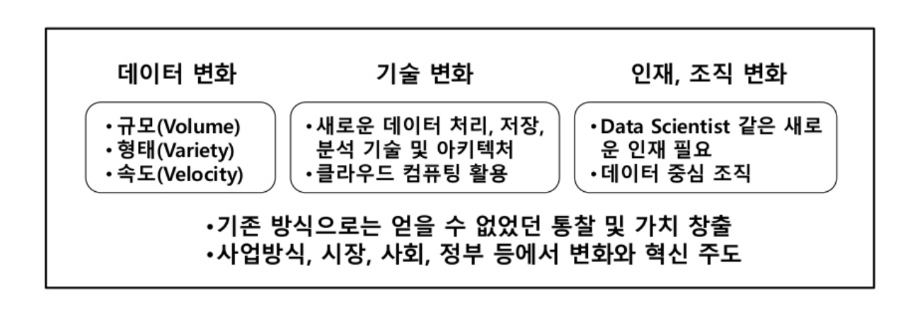
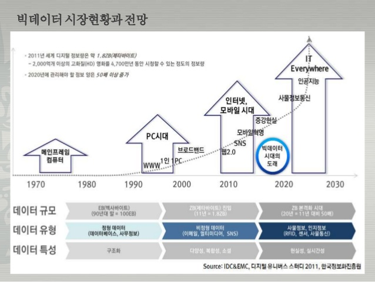

## 제2장 데이터의 가치와 미래


### 제1절 빅데이터의 이해

#### 1. 빅데이터의 정의 

<span style="color:red">   *** 3V 용어와 정의 정확히 이해 필요</span>

- "빅데이터는 일반적인 데이터베이스 소프트웨어로 저장, 관리, 분석할 수 있는 범위를 초과하는 규모의 데이터다."(McKinsey, 2011)

- "데이터는 다양한 종류의 대규모 데이터로부터 저렴한 비용으로 가치를 추출하고 데이터의 초고속 수집・발굴・분석을 지원하도록 고안된 차세대 기술 및 아키텍처다.(IDC, 2011)"

- **3V** - **데이터의 양(volume)**, **데이터의** 유형과 소스측면의 **다양성(Variety)**, **데이터** 수집과 처리 측면에서 **속도(Velocity)** (Doug Laney)

- "빅데이터란 대용량 데이터를 활용해 작은 용량에서는 얻을 수 없었던 새로운 통찰이나 가치를 추출해 내는 일이다. 나아가 이를 활용해 시장, 기업 및 시민과 정부의 관계 등 많은 분야에 변화를 가져오는 일이다."(Mayer-Schönberger&Cukier, 2013)

  

#### 빅데이터의 공통적 속성  - 3V 

- 3V라는 세 가지 요소의 측면에서 빅데이터는 기존의 데이터베이스와 차별화된다.
- **데이터의 크기(Volume)** 은 단순 저장되는 물리적 데이터양을 나타내며 빅데이터의 가장 기본적인 특징이다. 
- **데이터 속도(Velocity)**는 데이터의 고도화된 실시간 처리를 뜻한다. 이는 데이터가 생성되고, 저장되며, 시각화되는 과정이 얼마나 빠르게 이뤄져야 하는지에 대한 중요성을 나타낸다. 
- **다양성(Variety)**은 다양한 형태의 데이터를 포함하는 것을 뜻한다. 정형데이터뿐만 아니라 사진, 오디오, 비디오, 소셜 미디어 데이터, 로그파일 등과 같은 비정형 데이터도 포함된다. 

| 양 (Volume)<br /> ⬇︎<br /> 데이터의 <br /> 규모측면<br /> | 다양성 (Variety) <br /> ⬇︎<br /> 데이터의 유형과 <br /> 소스 측면 <br /> | 속도 (Velocity)<br /> ⬇︎<br /> 데이터의 수집과 <br /> 처리 측면 <br /> |
| :------------------------------------------------------: | :----------------------------------------------------------: | :----------------------------------------------------------: |
|          센싱데이터 <br /> 비정형 데이터<br />           |        정형, 비정형 데이터 <br /> (영상, 사진 )<br />        |        원하는 데이터의 <br /> 추출 및 분석속도<br />         |

####  빅데이터의 새로운 4V 

- 빅데이터 시대에는 방대한 데이터의 양의 분석하여 일정한 패턴을 추출할 수 있다. 
- 과연 데이터가 일정 패턴을 설명할 수 있을 만큼 신뢰성이 있느냐는 문제가 생긴다. 
- 데이터가 많아질 수록 엉터리 데이터도 커질 가능성이 높아지기 때문이다. 
- 기업이나 기관에서 수집한 데이터가 정확한 것인지 분석할 만한 가치가 있는지를 살펴야 하는 필요성이 생겼다. 
- 이러한 측면에서 빅데이터의 새로운 속성인 **정확성(Veracity)**이 제시되고 있다. 

|                              4v                              |
| :----------------------------------------------------------: |
| 가치 (Value)<br /> 시각화(Visualization)<br /> 정확성(Varacity) <br /> |


#### 빅데이터 정의의 범주 및 효과

-  **데이터의 변화 ➞ 기술변화 ➞ 인재, 조직의 변화** 로 점점 확대되고 있다. 




#### 2. 출현 배경과 변화

- **빅데이터 현상**
  
  - 새로 등장한 것이 아니라 기존의 데이터, 처리방식, 다루는 사람과 조직차원에서 일어나는 '변화'를 가르킨다.
  - 데이터와 그것을 다루는 기술 차원에서 **'패러다임전환(paradaigm shift)'**이 일어난 것을 가리킨다.
  
  #### 1) 3가지의 출현 배경 
  
  #### 산업계 
  
  - 기업들이 온라인과 오프라인을 가리지 않고 사용자 및 소비자의  고객데이터를 수집하고 있다. 
  - 기업들이 보유한 데이터가 **'거대한 가치 창출이 가능할 만큼 충분한 규모**'에 도달했다.
  - 기업들이 직면한 도전은 **'보유 데이터에 숨어 있는 가치를 발굴해 새로운 성장 동력원**으로 만들 수 있는 빅데이터 기술 확보' 이다. 
  
  #### 학계 
  
  - 기존에 10년 걸려 만들어낸 정보를 일주일이면 만들어 낼 수 있다. 
  
  -  비용은 1/1만 정도밖에 소요되지 않는다. 
  
  - NASA의 기후 시뮬레이션 센터에서는 약 32페타바이트의 기후관찰 정보를 활용해 슈퍼 컴퓨터에서 시뮬레이션 하고 있다. 
  
  - 거대 데이터를 다루는 학문 분야가 늘어나면서 **필요한 기술 아키텍처 및 통계 도구**들도 지**속적으로 발전**하고 있다.
  
  #### 기술 발전
  
  - **디지털화의 급진전, 저장 기술의 발전과 가격 하락, 인터넷의 발전과 모바일 시대의 진전에 따른 클라우드 컴퓨팅 보편화** 등이 있다.
  - 데이터 저장 비용이 빠르게 감소하면서 정보 생산량이 폭증 했다. 


#### 	2) 인터넷의 발전

- 인터넷 초기에는 매출을 올리는데 실패하면서 , 그 버블이 빠르게 꺼졌다.(닷컴버블) 

- 인터넷 기업들은 서비스를 제공하고 사용자의 정보를 기업들에게 제공하는 **양면시장 모델**, 즉 미디어 시장에서 커온 비즈니스 모델을 반영해 수익원을 만들어 나갔다. 

- **사용자 로그(log) 정보**를 이용, 사용자의 특성을 보다 정교하게 파악해 광고주가 도달하고자 하는 정확한 고객군을 만들어 내는 것이다. 

- **모바일 시대**가 도래하면서 사용자 들은 거의 모든 시간에 SNS로 자신들의 **'감정' 데이터**를 쏟아내고 있다. 

- 스마트폰에 내장된 GPS, 가속센서, 거리센서 등도 시시각각 값진 사용자의 **상황(context) 정보**를 양산하고 있다. 
- **클라우딩 컴퓨팅**은 많은 정보가 모인다는 점에서도 중요하지만, 빅데이터 처리 비용을 획기적으로 낮춘 측면에서 중요성이 크다. 

- **클라우드 분산 병렬처리 컴퓨팅**은 대용량 데이터 처리 비용을 **Map Reduce** 와 같은 혁신적인 방식을 통해 획기적으로 줄였다. 


#### 3) ICT 발전과 빅데이터의 출현



 

#### 3. 빅데이터 기능 

- **차세대 산업혁명의 "철"** - 서비스 분야의 생산성을 획기적으로 끌어올려 사회∙경제∙문화 생활 전반에 혁명적 변화를 가져올 것으로 기대되고 있다.
- **21세기 "원유"** - 각종 비즈니스, 공공기관 대국민 서비스, 경제 성장에 필요한 '정보'를 제공함으로써 산업전반의 생산성을 한 단계 향상시키고, 새로운 범주의 산업을 만들어 낼 것으로 전망한다. 

- **렌즈 역할** - 그 예로 <u>구글의 'Ngram Viewer'</u>를 들 수 있다. 학자들은 문법적 정의를 추적하기 위해 책이 아니라 - 구글이 수천만 권의 책을 디지털화해 빅데이터 서비스를 제공한 서비스를 통해 양적 변화를 시각적으로 확인 할 수 있다. 
- **빅데이터 플랫폼** -  <u>"공동 활용의 목적으로 구축된 유무형의 구조물"</u>  - 각종 사용자 데이터나 M2M 센서등에서 수집된 데이터를 가공∙처리∙저장해두고, 이 데이터에 접근할 수 있도록 **API(Application Program Interface)**를 공개한다. 


#### 4. 빅데이터가 만들어 내는 본질적인 변화 


#### 가. 사전 처리 ➞ 사후 처리 

- **산업혁명 - 정보의 사전 처리(pre-processing)** - 필요한 정보만 수집하고 필요하지 않는 정보를 버림으로써 당시 시스템에서 달성할 수 있는 효율성을 만들어 냈다.
- **빅데이터 시대 - 사후 처리 (post-processing)** - 가능한 한 많은 데이터를 모으고 그 데이터를 다양한 방식으로 조합해 숨은 정보를 찾아낸다. **(데이터 마이닝)** 

#### 나. 표본조사 ➞ 전수조사

- **표본조사**
  - 분석하고자 하는 바를 정하고 그에 필요한 정보를 수집하는 것 
  - 질문이 바뀌면 데이터를 바뀐 질문에 맞도록 다시 수집해야 한다. 
  - 융통성이 떨어진다. 
- **전수조사** 
  - 빅데이터 시대의 특징이다. 
  - 데이터 수집 비용과 데이처 처리 비용이 클라우드 컴퓨팅 기술의 발전으로 급격히 감소하고 있다.  
  - 모든 데이터를 모아두면 바뀐 질문에 따라 다양한 방식으로 데이터를 재가공할 수 있다. 
  - 융통성이 뛰어나다.

#### 다. 질 ➞ 양

- 빅데이터가 만드는 마법은 엄청난 용량이 질적으로 전환되는 과정에서 나타난다. 
- IBM과 Google이 만든 번역 시스템의 차이는 번역의 품질은 데이터베이스 양에 따라 성패가 결정됐다. 
- 데이터 수가 증가함에 따라 사소한 몇 개의 오류데이터는 **'대세에 영향을 주지 못하는'** 경향이 늘어나기 때문이다.
- **빅데이터 세계의 데이터 관점** - 샘플링에 의존하던 정확한 데이터 세트를 분석하는 것 보다. 모든 데이터를 활용할때 더 많은 가치를 추출할 수 있다고 본다.

#### 라. 인과관계 ➞ 상관관계

- **인과관계(causation)**이론(theory)에 기초해서 수집할 변인을 

  - 결정하고 엄격한 실험을 통해 잘 정제된 데이터를 얻고 이를 정교한 이론적 틀에 맞춰 분석한 후 변인간의 인과관계(causation)를 찾으려 했다. 

  - 변인들간의 인과관계를 많이 알 수록 현상에 대한 이해의 폭이 깊다.

- **상관관계 (correlation)**

  - 넘처나는 데이터로 특정 사이트의 로그정보를 이용해 사용자 전수조사를 진행 할 수도 있다.
  
  - 상관관계가 높은 데이터 값을 먼저 살펴보는 것만으로도 충분 할 수 있다. 
  - 신속한 의사결정(비즈니스, 주식투자)
  - 데이터 기반의 상관관계 분석이 주는 인사이트가 인과관계에 의해 미래 예측을 더 압도해 가는 시대가 도래하고 있다. 
  


### 제2절 빅데이터의 가치와 영향

### 1. 빅데이터의 가치

> 빅데이터 시대에서는 특정 데이터의 가치 산정이 어렵다. 


- **데이터의 활용방식** - 재사용이나 재조합, 다목적용 데이터 개발이 일반화되면서 특정데이터를 언제, 어디서, 누가 활용할지 알 수 없다. 따라서 가치를 산정하는 것도 어려워진다. 

  

- **새로운 가치 창출** - '기존에 없던 가치'를 창출 
  
  - 전자책 읽기 관련 데이터를 분석해 독자들의 독서 패턴을 분석해 저자들에게 제공한다. 

  - 페이스북은 특정인의 행위에 대한 강력한 예측변수를 새롭게 발견, 친구관계인 사람들의 행동 분석인 것이다. 
  
    
  
- **분석 기술의 발달**
  - 클라우드 분산 컴퓨팅에서 저렴한 비용에 분석하게 되면서 활용도가 증가하고 있다. 
  - 텍스트 마이닝 기법등을 통해 분석가능한 데이터의 영역이 넓어졌다. 
  - 지금은 가치 없는 데이터라도 새로운 분석 기법의 등장으로 거대한 가치를 만들어 내는 재료가 될 가능성이 있다. 


### 2. 빅데이터의 영향 

#### 생활 전반의 스마트화 

- **기업**

  - 혁신, 경쟁력 제고, 생산성 향상 

- - 소비자의 행동 분석 
  
  - 시장 변동 예측 비즈니스 모델을 혁신, 신사업
  
- **정부**: 환경 탐색, 상황 분석, 미래 대응

- **개인**: 목적에 따라 활용 


```tex
맥킨지는 빅데이터 보고서(2011)
빅데이터가 가치를 만들어 내는 방식으로 크게 다섯가지를 들고 있다.

1. 투명성 제고로 연구개발 및 관리 효율성 제고
2. 시뮬레이션을 통한 수요 포착 및 주요 변수 탐색으로 경쟁력 강화
3. 고객 세분화 및 맞품 서비스 제공
4. 알고리즘을 활용한 의사결정 보조 혹은 대체 
5. 비즈니스모델과 제품, 서비스의 혁신

```


### 제3절 비즈니스 모델 

### 1. 빅데이터 활용 사례 


> 기업과 정부, 개인 차원에서 빅데이터를 활용한 대표 사례를 소개 


#### 기업혁신 - 구글 검색 

- 사용자의 **로그 데이터를 활용**하면서 기존의 페이지 랭크(PageRank) 알고리즘을 혁신
- 다양한 차원의 신호(signal)를 추가해 검색 결과를 개선하고 있다. 

#### 경쟁력 강화 - 월마트 

- 고객의 **구매 패턴을 분석**해 상품 진열에 활용한다. 
- 허리케인이 올때, 비상음식 구매가 증가하는 패턴을 분석해 손전등과 비상음식을 함께 진열해 매출을 증대시켰다. 

#### 생산력 향상 - 의료 부분 개선

- 맥킨지는 미국의 의료분야에 빅데이터가 적용될 경우, 연간 약 3300억 달러가 절약될 것으로 평가
- IBM 의 왓슨(Watson)이라는 인공지는 컴퓨터가 병원에서 활용하기 시작

#### 정부 차원 

- 대국민 서비스 개선을 위해 빅데이터를 활용한다. 
- **환경 탐색** - 실시간 교통정보 수집, 기후정보, 각종 지질활동, 소방서비스 모니터링 
- **상황 분석** - NSA(National Security Agency)가 소셜 미디어, CCTV, 통화기록, 문자 통화내역 등의 모니터링과 분석 결과를 국가 안전확보 활동에 활용하는 것 
- 미래 의제인 의료과 교육 개선을 위해 빅데이터를 활용해 해결책 모색

#### 개인 차원

- 정치인은 선거 승리를 위해 사회관계망 분석을 통해 유세 지역을 선정하고, 해당 지역의 유권자에게 영향을 줄 수 있는 내용을 선정해 효과적인 선거 활동을 펼친다.
- 팬들의 음악 청취 기록 분석을 통해 실제 공연에서 부를 노래 순서를 짜는데 활용하기도 한다. 


### 2. 빅데이터 활용 기본 테크닉

<span style="color:red">*** 각각의 빅데이터 활용 테크닉이 어떤 기술인지 어떻게 활용되는지 숙지해야한다.</span>


#### 1 - 연관규칙학습(Association Rule Learning) 

[	Association Rule - 참고 블로그](https://hackability.kr/entry/Data-Mining-11-연관-법칙-Association-Rule-소개)

- 소비자들이 상품을 구매하는 이력을 사용해 **상품간의 연관관계를 만들고** 

  관계있는 상품, 관계 없는 상품등을 구분할 수 있다. 

- **'커피를 구매하는 사람이 탄산음료를 더 많이 사는가?'** 
- 어떤 변인들 간에 주목할 만한 상관관계가 있는지를 찾아내는 방법이다. 
- 슈퍼마켓 계산대에 있는 데이터를 활용해 개발되기 시작됐다.
- 상관관계가 높은 상품을 함께 진열
- 시스템 로그 데이터를 분석해 침입자나 유해 행위자 색출이 가능하다. 

#### 2 - 유형분석 / 분석 트리 분석(Classification tree analysis)

[	의사결정나무 분석 참고 블로그](http://www.dodomira.com/2016/05/29/564/)

- **'이 사용자는 어떤 특성을 가진 집단에 속하는가? '**
- **새로운 사건이 속하게 될 범주**를 찾아내는 일이다. 
- 기존 자료를 바팅으로 만들어진 훈련용 분류틀이 미리 갖춰져 있어야 한다. 
- 문서를 분류하거나 조직을 그룹으로 나눌때, 온라인 수강생들을 특성에 따라 분류할 때 사용할 수 있다. 

#### 3 - 유전알고리즘 (Genetic algorithms)

- **'최대의 시청률을 얻으려면 어떤 프로그램을 어떤 시간대에 방송해야 하는가?'** 
- **최적화가 필요한 문제의 해결책을 자연선택, 돌연변이 등과 같은 메커니즘을 통해 점진적으로 진화**(evolve)시켜 나가는 방법이다. 

- '응급실에서 의사를 어떻게 배치하는 것이 가장 효율적인가?'
- '연료 효율적인 차를 개발하기 위해 어떻게 원자재와 엔지니어링을 결합해야 하는가?'

#### 4 - 기계 학습 (Machine learning)

- **'기존의 시청 기록을 바탕으로 시청자가 현재 보유한 영화 중에서 어떤 것을 가장 보고 싶어할까?'**
- 데이터를 통해 학습할 수 있는 소프트웨어를 포함하고 있다. 
- 훈련 데이터로부터 학습한 알려진 특성을 활용해 **'예측'하는 일에 초점**을 맞춘다. 
- 스팸메일을 걸러내는데도 사용된다.
- 자용자의 기호를 학습해 추천서비스를 제공할때도 사용된다. 

#### 5 - 회귀분석 (Regression analysis) 

- '구매자의 나이가 구매 차량의 타입에 어떤 영행을 미치는가?'
- 분석가는 **독립변수를 조작하며, 종속변수가 어떻게 변하는지를 보면서 두 변인과의 관계를 파악**한다. 
- '사용자의 만족도가 충성도에 어떤 영향을 미치는가?'
- '이웃들과 그 규모가 집값에 어떤 영향을 미치는가?'


#### 6 - 감정분석(Sentiment analysis)

- **'새로운 환불 정책에 대한 고객의 평가는 어떤가?'**
- 특정 주제에 대해 말하거나 글을 쓴 사람의 감정을 분석한다. 
- 호텔에서 고객의 코멘트를 받아 서비스를 개선하거나 
- **소셜 미디어에 나타난 의견을 바탕**으로 고객이 원하는 것을 찾아 낼 때 사용된다. 

#### 7 - 소셜 네트워크분석(Social network analysis)

- '특정인과 다른 사람이 몇 촌(degree of separation) 정도의 관계인가?'

- 오피니언 리더, 즉 영향력 있는 사람을 찾아낼 수 있으며, **고객들 간 소셜 관계를 파악**할 수 있다. 

  

### 제4절 위기요인과 통제방안

### 1. 위기 요인

<span style="color:red"> *** 위기요인과 예시, 그리고 통제방안에 대해 시험에 자주출제 </span>

#### 가. 사생활 침해 

- M2M 시대가 본격화되면서 우리를 둘러싼 정보 수집 센서들의 수가 점점 증가 
- 개인 정보의 가치가 증가함에 따라 보다 많은 사업자가 개인정보 습득에 보다 많은 자원 투자 
- 스마트 홈이나 스마트 그리드 사업에서 활용되는 스마트 미터는 약 6초마다 데이터를 수집한다. 
- **익명화(anonymization) 기술이 발전되고 있으나 헛점 많음**
- 여행 사실을 트위터 한 사람의 집을 강도가 노리는 사례 발생

#### 나. 책임 원칙의 훼손

- 빅데이터 기본분석과 예측 기술이 정교화되어 정확도가 증가된 만큼, **분석대상이 되는 사람들은 예측 알고리즘의 희생양이 될 가능성이 증가** 
- 잠재적 위협이 아닌 명확하게 행동한 결과에 대해 책임을 묻고 있는 현재의 법적 원칙이 위협받고 있다. 
- 어떤 사람이 특정한 사회 ・ 경제적 특성을 가진 집단에 속한다는 이유로 자신의 신용도와 무관하게 부당하게 대출이 거절되는 상황이 가능
- 범죄 예측 프로그램에 의해 범행을 저지르기 전에 체포되는 가능성 

#### 다. 데이터 오용 - 데이터를 과신할 때 나타나는 문제 

- 빅데이터는 일어난 일에 대한 데이터에 의존, 그것을 바탕으로 미래를 예측하는 것, 높은 정확도를 가질 수 있지만 항상 맞을 수 없다. 

- **잘못된 지표는 상황을 오도하는 결과**를 가져올 수 있다. 

- 구글 검색 알고리즘이 잘못된 시그널을 사용할 경우, 특정 거래 사이트가 검색상단에서 밀려나 매출이 급감해 시장에서 퇴출될 가능성이 있다.

  

### 2. 통제방안

#### 가. 동의제를 책임제로 바꾸기 

- 개인정보의 활용에 대해 개인이 매번 동의하는 것은 경제적으로 비효율적, 가능하지도 않다. 
- 개인정보 사용으로 발생하는 피해에 대해 **사용자가 책임을 지게하여 사용 주체가 보다 적극적 보호장치를 강구**하도록 한다. 

#### 나. 기존의 책임 원칙을 보강하고 강화 

- 특정인을 '성향'에 따라 처벌하는 것이 아니라 '행위결과'를 보고 처벌 

- 기존의 원칙을 좀 더 보강하고 강화할 필요 있으며, 예측 자료에 의한 불이익을 당할 가능성을 

  최소화하는 장치를 마련하는 것이 필요하다.

#### 다. 알고리즘에 대한 접근권 제공

- **알고리즘의 부당한 적용으로 피해를 본 주체들을 구제하기 위한,** 컴퓨터와 수학, 통계학이나 비즈니스에 두루 깊은 지식을 갖춘 **'알고리즈미스트(algorithmist)' 라는 직업이 등장**하게 될 것.

  

### 제5절 미래의 빅데이터

### 1. 빅데이터 활용의 3요소

#### 가. 기본 3요소

####  - 데이터 : 모든 것들의 데이터화(datafication)

- 센서 관련 시장의 성장
- 매년 생산되는 데이터 단위 대규모화 

#### - 기술 : 분석 알고리즘의 진화가 빠르게 진행

- 개인정보를 반영한 구글의 검색엔진
- 넷플릭스의 추천 알고리즘
- 데이터 양의 증가에 따라 알고리즘을 학습할 수 있는 데이터가 늘어나면서 정확도가 증가 
- M2M, IoT의 확산이 데이터 생산량을 기하급수적으로 늘리고 있음

#### - 인력 : 데이터 사이언티스트, 알고리즈미스트의 역할

- **데이터사이언티스트**-  빅데이터의 다각적 분석을 통해 인사이트를 도출하고 이를 조직의 전략 방향 제시에 활용할 줄 아는 기획자 
- **알고리즈미스트** - 데이터 사이언티스트가 한 일로 인해 부당하게 피해가 발생하는 것을 막기 위해 필요 


