## 1장 데이터 분석 기획의 이해 

> 데이터 분석 기획을 위해 반드시 알아야 하는 분석 방법론에 대해서 살펴본다. 
>
> 다양한 방법으로 분석 기회를 발굴하여 분석과제를 정의하는 방법을 살펴본다. 

- 분석 기획 방향성 도출을 위한 분석 기획의 특징과 고려사항을 이해한다. 
- **KDD분석 방법론**에 대해 이해한다. 
- **CRISP-DM 분석 방법론**에 대해 이해한다. 
- **빅데이터 분석 방법론**을 이해하고 각 단계별 내용을 설명할 수 있다. 

###  제 1절. 분석기획 방향성 도출

#### 1. 분석기획의 특징

##### 가. 분석기획이란? 

- 분석을 수행할 **과제를 정의**하고, 의도했던 **결과를 도출**할 수 있도록 이를 적절하게 **관리**할 수 있는 방안을 
  **사전에 계획**하는 일련의 작업이다. 
- 분석과제 및 프로젝트를 직접 수행하는 것은 아니지만, **어떠한 목표(What)를** 달성하기 **위하여(why)** **어떠한 데이터를**
  **가지고 (How)** 어떠한 방식으로 수행할 지에 대한 일련의 계획을 수립하는 작업이기 때문에 성공적인 분석결과를 
  도출하기 위한 중요한 사전 작업이다. 

##### 나. 데이터 사이언티스트의 역량

- **수학/통계학적 지식** (Math & Statistics)
- **정보기술** (Information Technology)
- **비즈니스에 대한 이해** 

#### 2. 분석 대상과 방법 

 *** 분석기획을 위해 필요한 3가지 역량과 분석 대상과 방법에 따른 분석 유형 4가지 출제가능성이 높음

##### <분석 주제의 4가지 유형>

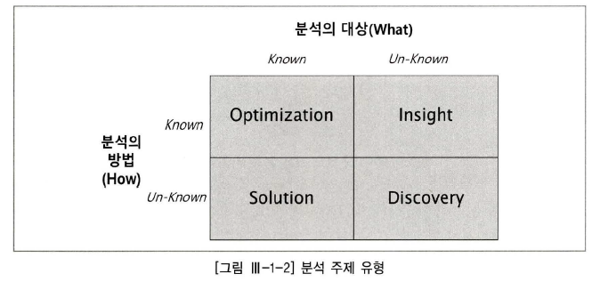

#### 3. 목표 시점별 분석 기획 방안

 *** 목표 시점별 분석 방향, 목표, 유형, 접근 방식에 대한 특성 묻는 문제 출제 가능성 ⬆︎⬆︎

- 목표시점 별로는 당면한 과제를 빠르게 해결하는 **"과제 중심적인 접근 방식"** 과 지속적인 분석 내재화를 위한 
  **"장기적인 마스터 플랜 방식"**
- 분석기획에서는 **문제해결(Problem Solving)**을 위한 **단기적인 접근**방식과 **분석과제 정의(Problem Definition)**를 
  위한 **중장기적인 마스터 플랜 접근**방식을 **융합**하여 적용하는 것이 중요 

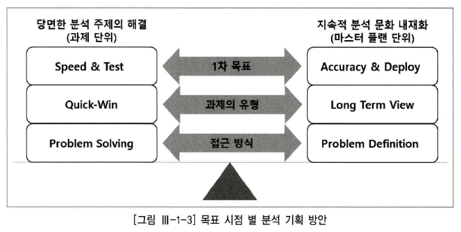

- 의미있는 분석을 위해서는 **분석기술, IT및 프로그래밍**, 분석 주제에 대한 **도메인 전문성**, **의사 소통**이 중요 , 
  분석대상 및 방식에 따른 다양한 분석 주제를 과제 단위 혹은 **마스터 플랜 단위**로 도출할 수 있어야 한다. 

#### 4. 분석 기획시 고려사항

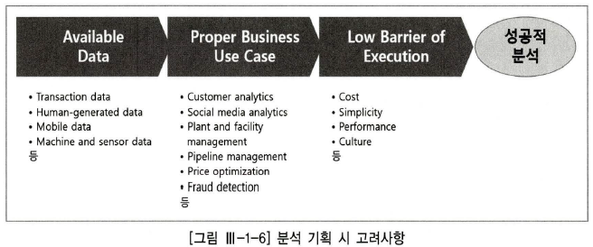

- **정형 데이터** (Structured Data, DB로 정제된 데이터)
- **반정형데이터**(Semi-structured Data, 센서 중심으로 스트리밍 되는 머신데이터)
- **비정형 데이터**(Unstructured Data, email, 보고서, 소셜비디어 데이터)

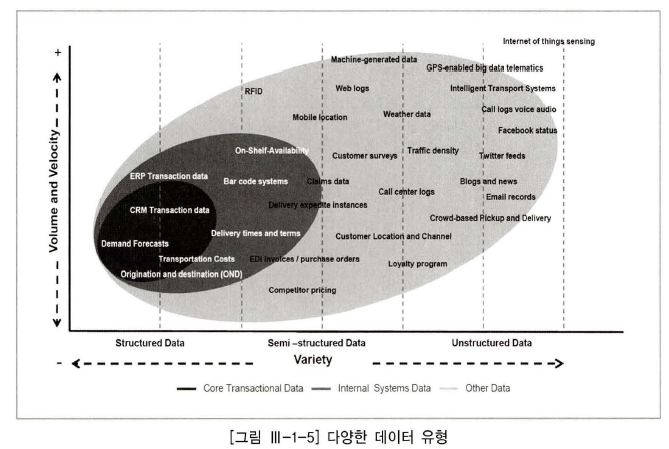

**가.** 분석의 기본인 **가용 데이터(Available data)**에 대한 고려가 필요하다. 

- 분석을 위한 **데이터 확보**가 우선적, 데이터 **유형에 따라 적용 가능한 솔루션** 및 **분석 방법**이 다르기 때문에 유형에 대한 분석이 선행적으로 이루어져야 한다. 

**나.** 분석을 통해 가치 창출위한 **적절한 활용방안**과 **유즈케이스**(Proper Business Use Case) 탐색이 필요하다. 

- 기존에 잘 구현되어 활용되고 있는 유사 분석 시나리오 및 솔루션을 최대한 활용하는 것이 중요하다. 

**다.** 분석 수행시 발생하는 **장애요소들에 대한 사전계획 수립**이 필요하다. (Low Barrier Of Execution)

- 일회성 분석으로 그치지 않고 조직의 역량으로 내재화하기 위해서는 충분하고 계속적인 교육 및 활용방은 등의 변화 관리(Change Management)가 고려되어야 한다. 

|   종류   | 정형데이터                                                   | 반정형 데이터                                                | 비정형 데이터                                                |
| :------: | ------------------------------------------------------------ | ------------------------------------------------------------ | ------------------------------------------------------------ |
| **특징** | - 데이터 자체로 분석 가능  - RDB구조의 데이터   - 데이터베이스로 관리 | - 데이터로 분석이 가능하지만  해석이 불가능하며 메타정보를 활용해야 해석이 가능  | - 데이터자체로 분석이 불가능   - 특정한 처리 프로세스를 거쳐  분석데이터로 변경 후 분석  |
| **유형** | - ERP, CRM, SCM 등 정보 시스템                               | - 로그데이터, 모바일데이터, 센싱데이터                       | - 파일형태로 저장, 관리  - 영상, 음성, 문자        |

### 제 2절. 분석 방법론

#### 1. 분석방법론 개요

#### 가. 개요

- 데이터 분석을 효과적으로 기업내 정착하기 위해서는 이를 체계화한 절차와 방법이 정리된 데이터 **분석 방법론의 수립**이 필수적이다.
- 프로젝트는 개인의 역량이나 조직의 우연한 성공에 기인해서는 안되고, 일정한 수준의 품질을 갖춘 산출물과 프로젝트의 성공 가능성을 확보하고 제시할 수 있어야 한다. 
- 방법론은 상세한 **절차(Procedures), 방법(Methods), 도구와 기법(Tools&Techniquest), 템플릿과 산출물(template&Outputs)**구성되어 어느 정도 지식만 있으면 활용 가능해야한다. 

#### 나. 데이터 기반 의사 결정의 필요성

 *** 합리적 의사결정을 가로막는 장애요소에 대한 문제가 자주 출제 ! 

- 경험과 감에 따른 의사결정 ➞ 데이터 기반의 의사결정
- 기업의 합리적 의사결정을 가로막는 장애요소
  - **고정관념(Stereotype)**, **편향된 생각(Bias)**. **프레이밍 효과**(Framing Effect:개인의 선택에 의해 결과가 달라질 수 있는 현상)

#### 다. 방법론의 생성과정 

#### 라. 방법론의 적용 업무의 특성에 따른 모델 

**1) 폭포수 모델 (Waterfall Model)**

  - 단계를 순차적으로 진행하는 방법으로, 이전 단계가 완료되어야 다음 단계로 진행될 수 있으며 문제가 발견될 시 피드백 과정이 수행된다. 

##### 2) 프로토 타입 모델(Prototype Model)

- 폭포수 모델의 단점을 보완, 점진적으로 시스템을 개발해 나가는 접근 방식, **고객의 요구**를 완전하게 이해하고 있지 못하거나 완벽한 요구 분석의 어려움을 해결하기 위해 **일부분을 우선 개발**하여 사용자에게 제공
- 시험 사용 후 요구를 분석하거나 요구 정당성을 점검, 성능을 평가하여 **그 결과를 통한 개선** 작업을 시행하는 모델

##### 3) 나선형 모델(Spiral Model)

- 반복을 통해 점증적으로 개발, 처음시도하는 프로젝트에 적용이 용이하다. 
- 관리체계를 효과적으로 갖추지 못한 경우 복잡도가 상승하여 프로젝트 진행이 어려울 수 있다. 

#### 마. 방법론의 구성 

#### 단계

- 최상위 계층

- 프로세스 그룹을 통해 완성된 단계별 산출물이 생성 
- 기준선으로 설절되어 관리, 버전관리 등을 통하여 통제 

  ##### ➔ 단계별 완료 보고서 

#### 태스크

- 단계를 구성하든 단위 활동
- 물리적 또는 논리적 단위로 품질 검토의 항목이 된다. 

  ##### ➔ 보고서 

#### 스탭 

- WBS(Work Breakdown Structure)의 워크 패키지에 해당
- 입력자료(Input), 처리 및 도구(Process&Tool), 출력자료(Output)로 구성된 단위 프로세스

  ##### ➔ 보고서 구성요소

#### 2. KDD 분석 방법론 

#### 가. 개요

- **KDD**(Knowledge Discuvery in Databases) 1996sus Fayyad가 **프로파일링 기술을 기반**으로 **데이터로부터 통계적 패턴이나 지식을 찾기 위해 활용**할 수 있도록 **체계적으로 정리한 데이터 마이닝** 프로세스이다. 

  

#### 나. KDD 분석 절차 

 *** 분석 절차 설명 후 어느 단계에 대한 설명인지 문제 출제 ⬆︎⬆︎

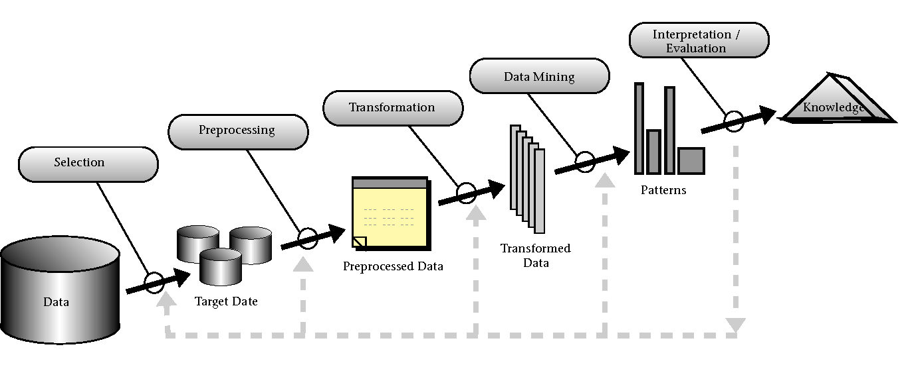

##### 1) 데이터셋 선택(Selection)

- 데이터셋 선택에 앞어 분석 대상의 **비즈니스 도메인**에 대한 이해와 **프로젝트 목표 설정**이 필수 
- 데이터 베이스 또는 원시 데이터에서 분석에 필요한 데이터를 선택하는 단계
- 데이터마이닝에 필요한 **목표데이터(tatget data)**를 구성하여 분석에 활용한다. 

##### 2) 데이터 전처리(Preprocessing)

- 추출된분석 대상용 데이터 섹에 포함되어 있는 **잡음(Noise)**과 **이상치(Outlier)**, **결측지(Mi-ssing Value)**를 식별하고 필요시 제거하거나 의미있는 데이터로 재처리하여 데이터 셋을 정제하는 단계
- 데이터 전처리 단계에서 **추가로 요구되는 데이터** 셋이 필요한 경우 데이터 선택 프로세스를 재실행한다.

##### 3) 데이터 변환(Transformation)

- 데이터 전처리 과정을 통해 정제된 데이터에 분석 목적에 맞게 변수를 생성, 선택하고 **데이터의 차원을 축소**하여 효율적으로 데이터마이닝을 할 수 있도록 데이터에 변경하는 단계이다. 

- 데이터마이닝 프로세스를 진행하기 위해 **학습용데이터(training data)**와 **검증용데이터(test data)**로 데이터를 분리하는 단계이다.

##### 4) 데이터 마이닝(Data Mining)

- 학습용 데이터를 이용하여 분석목적에 맞는 **데이터마이닝 기법을 선택**하고, 적절한 알고리즘을 적용하여 데이터마이닝 작업을 실행하는 단계이다.
- 필요에 따라 데이터 **전처리**와 데이터 **변환 프로세스**를 추가로 실행하여 최적의 결과를 산출한다.

##### 5) 데이터 마이닝 결과 평가(Interpretatio/Evaluation)

- 데이터마이닝 **결과에 대한 해석과 평가**, 그리고 **분석 목적과의 일치성**을 확인한다.
- 데이터마이닝을 통해 발견한 **지식을 업무에 활용**하기 위한 방안 마련의 단계
- 필요에 따라 데이터 선택 프로세스에서 데이터마이닝 프로세스를 반복 수행한다.

#### 3. CRISP-DM 분석 방법론

 *** CRISP-DM 프로세스의 4가지 레벨과 6단계 그리고 각 단계별 업무내용이 자주 출제 

#### 가. 개요

- CRISP-DM(Cross Industry Standartd Process For Data Mining)은 1996년 유럽연합의 
  ESPRIT 에서 있었던 프로젝트에서 시작되었으며, **주요한 5개의 업체들 (Daimler-Chrysler, SPSS, NCR, Teradata, OHRA)**이 주도하였다. 
  CRISP-DM은 **계층적 프로세스 모델**로써 4개 레벨로 구성된다.

#### 나. CRISP-DM 의 4레벨 구조 

- 최상위 레벨은 여러 개의 단계(Phases)로  구성되고 각 단계는 일반화 태스크(Generic Tasks)를 포함한다. 일반화 태스크는 데이터마이닝의 단일 프로세스를 완전하게 수행하는 단위이며, 이는 다시 구체적인 수행 레벨인 세분화 태스크(Specialized Tasks)로 구성된다. 
- 예를 들어 데이터 정제(Data Cleansing)라는 일반화 태스크는 범주형 데이터 정제와 연속형 데이터 정제와 같은 세분화 태스크로 구성왼다. 

#### 다. CRISP-DM의 프로세스 

- **6단계로 구성**되어 있으며, 각 단계는 단방향으로 구성되어 있지 않고 **단계 간 피드백**을 통해 **단계별 완성도를 높이**게 되어 있다. 

  

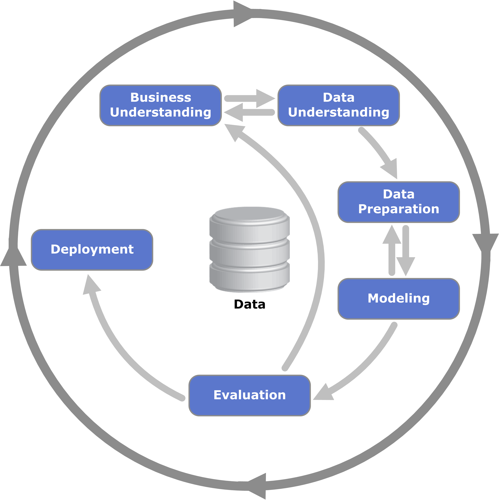

|                     단계                     | 내용                                                         | 수행업무                                                     |
| :------------------------------------------: | ------------------------------------------------------------ | ------------------------------------------------------------ |
| 업무이해   Business Understanding  | • 비즈니스 관점에서 프로젝트의 목적과 요구사항을 이해하기 위한 단계   • 도메인 지식을 데이터 분석을 위한 문제정의로 변경하고 초기 프로젝트 계획을 수립하는 단계 | 업무 목적 파악, 상황 파악, 데이터 마이닝 목표설정, 프로젝트 계획 수립 |
|  데이터 이해  Data Understanding   | • 분석을 위한 데이터를 수집하고 데이터 속성을 이해하기 위한 단계   • 데이터 품질에 대한 문제점을 식별하고 인사이트를 발견하는 단계 | 초기 데이터 수집, 데이터 기술 분석, 데이터 탐색, 데이터 품질 확인 |
|  데이터 준비   Data Preparation    | • 분석을 위하여 수집된 데이터에서 분석기법에 적합한 데이터를 편셩하는 단계 (많은 시간이 소요 될 수 있음) | 분석용 데이터 셋 선택, 데이터 정제, 분석용 데이터 셋 편성, 데이터 통합, 데이터 포맷팅 |
|         모델링  Modeling           | • 다양한 모델링 기법과 알고리즘을 선택하고 모델링 과정에서 사용되는 파라미터를 최적화해 나가는 단계  •모델링 과정에서 데이터 셋이 추가로 필요한 경우 데이터 준비 단계를 반복 수행할 수 있으며, 모델링 결과를 테스트용, 데이터 셋으로 평가하여 모델의 과적합(Over-fitting)문제를 확인 | 모델링 기법 선택, 모델테스트 계획 설계 , 모델작성, 모델평가  |
|         평가   Evauation           | • 모델링 결과가 프로젝트 목적에 부합하는지 평가하는 단계로 데이터마이닝 결과를 최종적으로 수용 할 것인지 판단  | 분석결과 평가, 모델링 과정 평가, 모델 적용성 평가            |
|         전개   Deployment          | • 완성된 모델을 실 업무에 적용하기 위한 계획을 수립하는 단계   • 모니터링과 모델의 유지보수 계획 마련    → 모델에 적용되는 비즈니스 도메인 특성, 입력되는 데이터의 품질 편차, 운영모델의 평가기준에 따라 생명주기(Lifr cycle)가 다양하므로 상세한 전개계획이 필요  • CRISP-DM 의 마지막 단계, 프로젝트 종료 | 전개 계획 수립,  모니터링과 유지보수 계획 수립  프로젝트 종료보고서 작성,  프로젝트 리뷰 |

#### 4. KDD와 CRISP_DM의 비교 

|                         KDD                          |              CRISP-DM               |
| :--------------------------------------------------: | :---------------------------------: |
|                분석대상 비즈니스 이해                | 업무 이해  (Business Understanding) |
|                    데이터 전처리                     | 데이터의 이해  (Data Understanding) |
|            데이터 전처리 (Preprocessing)             |            데이터의 이해            |
|             데이터 변환 (Transformation)             |    데이터 준비 (Data Preparaion)    |
|             데이터 마이닝 (Data mining)              |          모델링 (Modeling)          |
| 데이터 마이닝 결과 평가 (Interpretation/ Evoluation) |          평가 (Evauation)           |
|                  데이터 마이닝 활용                  |          전개 (Deployment)          |

#### 5. 빅데이터 분석 방법론 

 *** 빅데이터 분석을 위한 3개의 계층과 내용이 시험에 자주 출제됩니다. 

##### 가. 빅데이터 분석의 계층적 프로세스 - 3개의 계층 

-  **단계 (Pharse):** 프로세스 그룹(Process Goup)을 통하여 완성된 단계별 산출물이 생성된다. 
  각 단계는 기준선(Baselin 으로 설정되어 관리되어야 하며, 버전관리(Configuration Management)등을
  통하여 통제가 이루어져야 한다. 
- **태스크 (Task):** 각 단계는 여러 개의 태스크로 구성된다. 각 태스크는 단계를 구성하는 단위 활동이며,
  물리적 또는 논리적 단위로 품질 검토의 항목이 될 수 있다. 
- **스탭 (Stap ):** WBS(Work Breakdown Stuructue)의 워크 패키지에 해당하고 입력자료(Input), 출력자료(output),
  구성된 단위 프로세스(Unit Process)이다. 

##### 나. 빅데이터 분석 방법론 - 5단계

 *** 빅데이터 분석 방법론 5단계와 각 단계의 주요 업무는 시험에 자주 출제됩니다. 

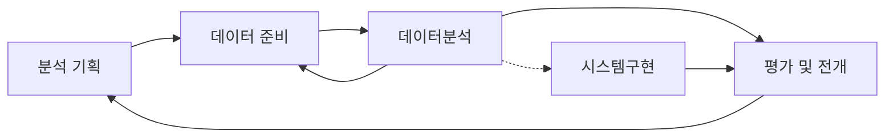

1. **분석기획(Planing) :** 비즈니스 도메인과 분제점을 인식하고 분석 계획 및 프로젝트 수행계획을 수립하는 단계

2. **데이터 준비(Preparing) :** 비즈니스 요구사항과 데이터 분석에 필요한 원천 데이터를 정의하고 준비하는 단계

3. **데이터 분석 (Analyzing) :** 원천 데이터를 분석용 데이터 셋으로 편성하고 다양한 분석 기법과 알고리즘을 
   이용하여 데이터를 분석하는 단계이다.  분석 단계를 수행하는 과정에서 추가적인 데이터 확보가 필요한 경우 
   데이터 준비 단계로 피드백하여 두 단계를 반복하여 진행한다. 
4. **시스템 구현(Developing) :** 분석 기획에 맞는 모델을 도출하고 이를 운영중인 가동 시스템에 적용하거나
    시스템 개발을 위한 사전 검증으로 프로토타입 시스템을 구현한다.  
5. **평가 및 전개(Lesson Learned) :** 데이터 분석 및 시스템 구현 단계를 수행한 후, 프로젝트의 성과를 평가하고 정리
   (Lesson Learned)하거나 차기 분석 기획으로 전달하고 프로젝트를 종료하는 단계이다. 

### 3절 분석 과제 발굴

#### 1.분석과제 발굴 방법론 

***분석방법론은 시험에 자주 나오는 부분입이다

##### 가. 개요

- 분석 과제는 풀어야 할 다양한 문제를 데이터 분석 문제로 변환한 후 관계자들이 이해하고 프로젝트로 
  수행할 수 있는 과제 정의서 형태로 도출된다. 
- 분석과제를 도출하기 위한 방식으로는 크게 **하향식 접근방법(Top Down Approach)**과 
  **상향식 접근방법(Bottion up Approach)**이 있다.

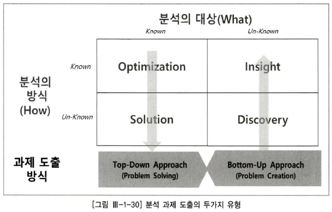

- 문제가 주어져 있는 상태에서 답을 구하는 하향식 접근방식이 전통적으로 수행되었던 분석과제 발굴방식이다.
- 대규모의 다양한 데이터를 생성하고 빠르게 변하는 기업환경에서는 문제 자체의 변화가 심해 정확하게 문제를 사전에 정의하는 것이 어려워 지고 있다. 
- 분석 과제 발굴을 두가지 방식으로 나누었지만, 실제 새로운 상품 개발이나 전략 수립등 중요한 의사결정을 할 때 하향식 접근방법과 상향식 접근 방법이 혼용되어 사용되며
- 분석의 가치를 높일 수 있는 최적의 의사결정은 두 접근 방식이 상호 보완 관계에 있을 때 가능하다. 

- **디자인 사고 (Design Thinking)**

  - 상향식 접근 방식의 발산 단계와 하향식 접근 방식의 수렴단계를 반복적으로 수행하는 식의 상호 보완적인 동적환경을 통해 분석의 가치를 높일 수 있는 최적의 의사결정방식
  - 발산과 수렴과정을 반복하여 결론에 이른다.

  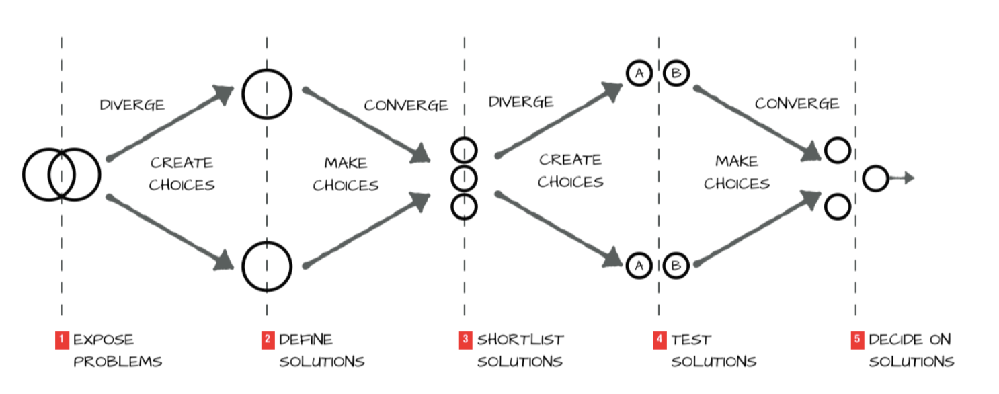

##### 나. 하향식 접근법 (Top Down Apporoach) 

***하향식 접근방법 특히 문제 탐색 단계 !! 시험에 자주 나오는 부분입이다

- 현황 분석을 통해 기회나 **문제를 탐색** (Problem Discovery)하고, 해당 **문제를 정의** (Problem Definition), **해결방안을 탐색**(Solution Search)한다. 그리고 데이터 분석의 **타당성 평가**(Feasibility Study)를 거쳐 분석 과제를 도출하는 과정으로 구성된다. 

  

##### 1. 문제탐색 (Problem Discovery) - 하향식 접근법 1단계

- 전체적인 관점의 기준 모델을 활용하여 빠짐없이 문제를 도출하고 식별하는 것이 중요하다. 
- 전체적인 관점의 기준모델로는 기업 내•외부 환경을 포괄하는 비즈니스 모델과 외부 참조 모델이 존재한다.
- 과제 발굴 단계에서는 세부적인 구현 및 솔루션에 초점을 맞추는게 아니라 문제를 해결함으로써 발생하는 가치에 중점을 두는 것이 중요한다. 

​	**가) 비즈니스 모델 기반 문제 탐색**  

​	***과제발굴방법 5가지 !! 시험에 자주 나오는 부분입이다

   - **업무(Operation), 제품(Product), 고객(Customer)** 단위로 문제를 발굴하고, 이를 관리하는 두 가지 영역인
      **규제와 감사(Audit&Regulation) 영역과 지원 인프라(IT&Human Resource) 영역**에 대한 기회를 추가로
      도출하는 작업을 수행한다. 

|              과제발굴방법              |                             내용                             |                              예                              |
| :------------------------------------: | :----------------------------------------------------------: | :----------------------------------------------------------: |
|       업무  Operation        | 제품 및 서비스를 생산하기 위해서 운영하는   내부 프로세스 및 주요 자원(Resource) 관련 주제 도출 |       - 생산 공정 최적화   - 재고량 최소화         |
|       제품  Product          | 생산 및 제공하는  제품 •서비스를 개선하기 위한   관련 주제 도출 | - 제품의 주요기능 개선   - 서비스 모니터링 제표도출  |
|       고객   Customer        | 제품 생산 및 전달과정 프로세스 중에서  발생하는 규제 및 보안의 관점에서 주제 도출   | - 고객 Call 대기 시간 최소화  - 영업점 위치 최적화   |
|  규제와 감사  Regualtion & Audit  | 제품 생산 및 전달과정 프로세스 중에서 발생하는  규제 및 보안의 관점에서 주제도출  | - 제공 서비스 품질의   이상징후 관리   - 새로운 환경 규제 시   예상되는 제품 추출 등 |
| 지원 인프라   IT & Human Resource | 분석을 수행하는 시스템 영역 및 이를   운영•관리하는 인력의 관점에서 주제도출 |        - EDW 최적화   - 적정 운영 인력도출         |

	##### 나) 분석 기회 발굴의 범위 확장 

*** 분석기획발굴의 범위 확장 4가지 관점 !! 시험에 자주 나오는 부분입이다

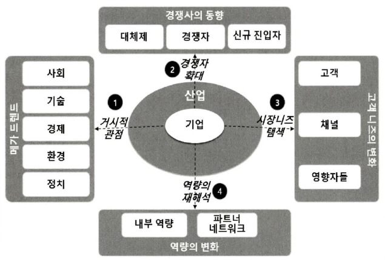

- **거시적 관점의 메가트랜드** 
  - 조직 및 해당 산업에 폭넓게 영향을 미치는 사회•경제적 요인을 STEEP으로 요약되는 사회(Social), 기술(Technological), 경제(Economic), 환경(Environmental), 정치 (Political) 영역으로 폭넓게 나눈다.

|        영역         |                             내용                             |                              예                              |
| :-----------------: | :----------------------------------------------------------: | :----------------------------------------------------------: |
|    사회(Social)     | 비즈니스 모델의 고객(Customer) 영역에 존재하는   현재 고객을 확장하여 전체 시장을 대상으로   사회적, 문화적, 구조적 트렌드 변화에 기반한  분석 기회를 도출한다. | - 노령화   - 밀레니엄 세대 등장  - 저출산에 따른 사업모델 변화   |
| 기술(Technological) | 과학, 기술, 의학 등 최신 기술의 등장 및 변화에   따른 역량 내 재화와 제품•서비스 개발에 대한  분석 기회를 도출한다. | - 나노 기술   - IT융합기술   - 로봇 기술의 고도화로 인한   제품의 Smart화 |
|   경제(Economic)    | 산업과 금융 전반의 변동성 및 경제 구조 변화 동향에   따른 시장의 흐름을 파악하고 ,   이에 대한 분석 기회를 도출한다.   | - 원자재 가격, 환율, 금리변동  따른 구매 전략의 변화 등 |
| 환경(Environmental) | 환경과 관련된 정부, 사회단체, 시민 사회의 관심과 규제동향을 파악하고 이에대한   분석 기회를 도출한다.   | - 탄소 배출 규제 및 거래 시장  등장에 따른 원가 절감 및   정보 가시화 |
|  정치 (Political)   | 주요 정책방향, 정세, 지정학적 동향등   거시적 인 스름을 토대로 한 분석 기회를 도출 |   - 대북관계 동향에 따른 원자재 구매 거래선의 다변화    |

- **경쟁자 확대 관점** 
  - 현재 수행하고 있는 사업 영역의 직접 경쟁사 및 제품 • 서비스 뿐만 아니라 대체재와 신규 진입자등으로 
    관점을 확대하여 위협이 될 수 있는 상황에 대한 분석 기회 발굴의 폭을 넓혀서 탐색한다. 

|               영역               |                             내용                             |                              예                              |
| :------------------------------: | :----------------------------------------------------------: | :----------------------------------------------------------: |
| 대체재  (Substitute)   | 융합적인 경쟁 환경에서 현재 생산을 수행하고 있는   제품 • 서비스를 온라인으로 제공하는 것에   대한 탐색 및 잠자적 위험을 파악한다.   | - 오프라인 제공 서비스  → 온라인 제공에 대한  탐색및 잠재적 위협파악 |
| 경쟁자   (Competitor)  | 현재 시장에 대해서 파괴적인 역할을 수행할 수 있는  신규 집입자에 대한 동향을 파악하여  이를 고려한 분석 기회를 도출  | 식별된 주요 경쟁사의 제품 서비스  카탈로그 및 전략 분석을 통한  잼재적 위협 파악 |
|    영향자   (Influencer)    | 기업 의사결정에 영향을 미치는 주주•투자자•협회 및  기타 이해 관계자의 주요 관심사항에 대해서  파악하고 분석기회를 탐색한다. | M&A 시장확대에 따른   유사업종의 신규기업   인수기회 탐색   |

- **역량의 재해석 관점** 
  - 현재 해당 조직 및 기업이 보유한 역량 뿐만 아니라 해당 조직의 비즈니스에 영향을 끼치는 파트너 네트워크를 
    포함한 활용가능한 역량을 토대로 폭널은 분석 기회를 탐색한다. 

|                    영역                     |                             내용                             |                              예                              |
| :-----------------------------------------: | :----------------------------------------------------------: | :----------------------------------------------------------: |
|     내부 역량   (Competency)      | 지적 재산권, 기술력등 기본적인 것 뿐만 아니라   중요하면서도 자칙 간과하기 쉬운   지식, 기술 , 스킬 등의 노하우와  인프라적인 유형 자산에 대해서 재해석하고  해당역역에서 분석 기회를 탐색한다. | 자사 소유 부동산을 활용한  부가 가치 창출 기회 발굴  |
| 파트너와 네트워크  (Partner & Network) | 자사가 직접 보유하고 있지는 않지만  밀접한 관계를 유지하고 있는 관계사와  공급사 등의 역량을 활용해 수행할 수 있는  기능을 파악해보고 이에 대한  분석 기회를 추가적으로 도출한다. |  수출입•통관•노하우를  활용한 추가 사업기회 탐색   |

#####   2. 문제 정의 단계 - 하향식 접근법 2단계 	

- 식별된 **비즈니스 문제를 데이터의 문제로 변환**하여 정의하는 단계이며, 앞서 수행한 문제 탐색의 단계가
   무엇을(What) 어떤 목적으로 (Why) 수행해야 하는지에 대한 관점이었다면, 본 단계에서는 **이를 달성하기 위해서** 
  **필요한 데이터 및 기법(How)를** 정의하기 위한 데이터 분석의 문제로의 변활을 수행하게 된다. 

- **데이터 분석 문제의 정의 및 요구사항 :** 분석을 수행하는 당사자 뿐만 아니라 해당 문제가 해결되었을 때 효용을 얻을 수 있는 최종사용자 관점에서 이루어져야 한다. 
- 데이터 분석 문제가 잘 정의 되었을때 필요한 데이터의 정믜 및 기법 발굴이 용이하기 때문에 가능한 **정확하게** 
  **분석의 관점으로 문제를 재정의**할 필요가 있다. 

##### 3. 해결방안 탬색(Solution Search) 단계 - 하향식 접근법 3단계 

- 정의된 데이터 분석 문제를 해결하기 위한 다양한 방안이 모색된다. 

  - 기존 정보시스템의 단순한 보완으로 분석이 가능한지 고려 
  - 엑셀 등의 간단한 도구로 분석이 가능한지 고려 
  - 하둡등 분산병렬처리를 활용한 빅데이터 분석 도구를 통해 보다 체계적이고 심도 있는 방안 고려 

- 분석 역량을 기존에 가지고 있는 지의 여부를 파악하여 보유하고 있지 않는 경우에는 교육이나 전문인력 채용을 통한 

  역량을 확보하거나 분석 전문업체를 활용하여 과제를 해결하는 방안에 대해 사전검토를 수행한다. 

  

##### 4. 타당성 검토 (Feasibility Study) - 하향식 접근법 4단계 

*** 검토대상 3개 (경제성, 데이터, 기술) 과 내용 출제 

- 도출된 분석 문제나 가설에 대한 대안을 과제화하기 위해서는 다음과 같은 다각적인 타당성 분석이 수행되어야 한다. 

  - **가. 경제성 타당성** 

    - 비**용대비 편익 분석 관점의 접근**이 필요하다. 

    - 비용 항목은 데이터, 시스템, 인력, 유지보수 등과 같은 분석 비용으로 구성되고 

    - 편익으로는 분석 결과를 적용함으로써 추정되는 실질적 비용 절감, 추가적 매출과 수익 등과 

      같은 경제적 가치로 산출된다. 

  - **나. 데이터 및 기술적 타당성** 

    - 데이터 분석에서는 데이터 존재여부, 분석 시스템환경 그리고 분석 영량이 필요하다. 

    - 특히, 분석역량의 경우 실제 프로젝트 수행시 걸림돌이 되는 경우가 많다

    - 기술적 타당성 분석시 역량 확보 방안을 사전에 수립하고 이를 효과적으로 평가하기 위해서는 

      비즈니스 지식과 기술적 지식이 요구된다. 

    - 위의 타당성 검토를 통해 도출된 대안을 통해 

      1. 평가 과정을 거쳐 가장 우월한 대안을 선택한다. 
      2. 도출한 데이터 분석 문제 및 선정된 솔루션 방안을 포함한다. 
      3. 분석과제 정의서의 형태로 명시하는 후속작업을 시행한다. 
      4. 프로젝트 계획은 입력물로 활용한다. 

#### 다. 상향식 접근법 (Botton up Approach)

*** 상향식 ,하향식 접근법 특징을 비교 문제 자추 출제

##### 1) 정의

		- 기업에서 보유하고 있는 다양한 원천 데이터로부터의 분석을 통하여 통찰력과 지식을 얻는 상향식 접근 방법 
		- 다양한 원천 데이터를 대상으로 분석을 수행하여 가치있는 모든 문제를 도출하는 일련의 과정이다. 

##### 2) 기존 하향식 접근법의 한계를 극복하기 위한 분석 방법론 

- 기존 논리적인 단계별 접근법은 분제 구조가 분명하고 문제를 해결하고 해결책을 도출하기 위한 데이터 분석가 및 의사결정자에게 주어져 있음을 가정하고 있기에 솔루션을 도출에는 유효하지만 새**로운 문제를 탐색하는데는 한계**가 있다. 
- 따라서 하향식 문제해결방식은 최근 **복잡하고 다양한 환경에서 발생하는 문제에는 적합하지 않을 수** 있다. 
- 스탠포드 대학의 d.school(Institute of Design at Stanford)은 **디자인(Design Thinking) 접근법**을 통해서 전통적 분석적 사고를 극복하려고 한다. 

- 사물을 있는 그대로 인식하는' What'의 관점에서 보아야 한다는 것이다. 

- 객관적으로 존재하는 데이터 그 자체를 관찰하고 실제적으로 행동에 옮김으로써 대상을 좀 더 잘 이해하는 방식으로 접근을 수행하는 것 

- d.school(Institute of Design at Stanford)에서는 특히 감정이입을 강조하고 있다. 

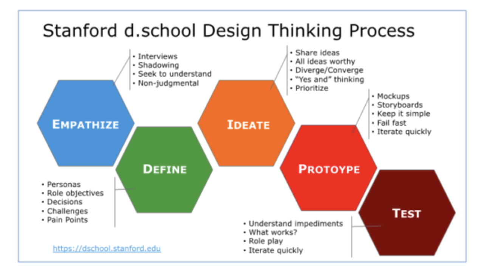

##### 3) 비지도 학습과 지도 학습

- **가) 비지도 학습 (Unsupervised Learning)**
  - 일반적으로 상향식 접근방식의 데이터 분석은 비지도 학습방법에 의해 수행된다. 
  - 비지도 학습은 데이터 분석의 목적이 명확히 정의된 형태의 특정 필드 값을 구하는 것이 아니다. 
  - 비지도 학습은 데이터 자체의 결합, 연관성, 유사성 등을 중심으로 데이터의 상태를 표현하는 것이다. 
  - 비지도 학습의 데이터 마이닝기법의 *예 - 장바구니 분석, 군집 분석, 기술 통계 및 프로파일링*

- **나) 지도 학습 (Supervised Learning)**
  - 명확한 목적 하에 데이터 분석을 실시하는 것 
  - 분류, 추축, 예측, 최적화를 통해 사용자의 주도하에 분석을 실시하고 지식을 도출하는 것이 목적이다. 
  - 통계적 분석에서는 인과관계 분석을 위해 가설을 설정하고 이를 검정하기 위해 모집단으로 부터 표본을 추출하고 그 표본을 이용한 거설 검정을 실시하는 방식으로 문제를 해결하였다. 그러나 빅데이터 환경에서는 이와 같은 논리적인 인과관계 분석 뿐만 아니라 **상관관계 분석 또는 연관 분석을 통하여 다양한 문제 해결**에 도움을 받을 수 있다. 
  - **인과 관계 →상관관계** 분석으로 빅데이터 분석이 변화하였다. 
  - 다량의 데이터 분석을 통해서 " 왜" 그러한 일이 발생하는지 역으로 추적하면서 문제를 도출하거나 재정의 하는 것이 상향식 접근법이다. 

##### 4) 시행착오를 통한 문제 해결 

*** 프로토 타입 접근법, 방법론, 특징 자주출제 

- **가. 정의** 

  - **프로토타이핑 접근법**은 사용자가 요구사항이나 데이터를 정확히 규정하기 어렵고 데이터 소스도 명확히 파악하기 어려운 상황에서 **일단 분석을 시도해 보고 그 결과를 확인해 가면서 반복적으로 개선해 나가는 방법**을 말한다. 

  - 하향식 접근방식은 문제가 정형화되어 있고 문제해결을 위한 데이터가 완벽하게 조직에 존재할 경우에 효과적이다. 

  - 이에 반하여 프로토타이핑 방법론은 비록 완전하지 못하다 해도 **신속하게 해결책**이나 **모형을 제시**함으로써, 이를 바탕으로 문제를 좀 더 명확하게 인식하고 **필요한 데이터를 식별하여 구체화 할 수 있게 하는 유용한 상향식 접근 방식**이다. 

  - 프로토타이핑 접근법의 기본적인 프로세스는 **가설의 생성, 디자인에 대한 실험, 실제 환경에서의 데스트, 테스트 결과에서의 통찰도출 및 가설 확인**으로 구성된다. 

     

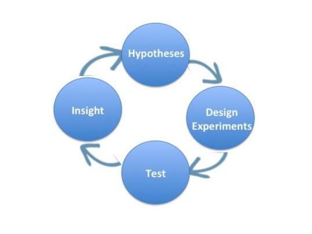

- **나. 빅데이터 분석 환경에서 프로토 타이핑의 필요성** 

  - 1. **문제에 대한 인식 수준** 

       - **문제 정의가 불명확**하거나 이전에 접해보지 못한 **새로운 문제일 경우** 사용자 및 이해 관계자는 프로토타입을 이용하여 **문제를 이해**하고, 이를 바탕으로 **구체화 하는데 도움**을 받을 수 있다. 

    2. **필요 데이터 존재 여부의 불확실성** 

       - 문제해결을 위해 필요한 데이터의 집합이 모두 존재하지 않을 경우, 그 데이터의 수집을 어떻게 할 것인지 

         또는 그 데이터를 다른 데이터로 대체할 것인지 등에 대한 **사용자와 분석가간의 반복적이고 순환적인 협의 과정**이 필요하다. 대체 불가능한 데이터가 존재하는지 사전에 확인한다면 불가능한 프로젝트를 수행하는 리스크를 사전에 방지할 수 있다. 

    3. **데이터 사용 목적의 가변성**

       - 데이터의 가치는 사전에 정해진 수집목적에 따라 확정되는 것이 아니고, 그 가치가 지속적으로 변화할 수 있다. 

       - 따라서 조직에서 보유 중인 데이터라 하더라도 기존듸 데이터 정의를 재검토하여 데이터의 사용 목적과 범위를 확대할 수 있을 것이다. 

         예 ) 사용자의 위치 데이터는 사용자 호출을 효육적으로 처리하기 위한 목적뿐만 아니라, 
         자용자들이 특정시간에 많이 모이는 장소가 어디인지를 분석하는 정보로 활용이 가능하다. 

- **라. 분석과제 정의**

  - 분석과제 정의서를 통해 분석별로 필요한 소스데이터, 분석방법 , 데이터 입수 및 분석의 난이도, 분석 수행주기, 분설결과에 대한 검증 오너십, 상세 분석과정 등을 정의한다. 분석 데이터 소스는 내•외부의 비구조적인 데이터와 소셜 미디어 및 오픈 데이터까지 범위를 확장하여 고려하고 분석방법 또한 상세하게 정의한다. 

  

#### 4절. 분석 프로젝트 관리 방안 

*** 분석 프로젝트 관리를 위한 5가지 주요 속성법의 방법론 특징 자주 출제 !!!!

##### 1. 분석과제 관리를 위한 5가지 주요 영역 

- 과제 형태로 도출된 분석기회는 프로젝트를 통해서 그 가치를 증명하고 목표를 달성해야한다. 
- 분석프로젝트는 다른 프로젝트 유형처럼 범위, 일정, 품질, 리스크, 의사소통등 영역별 관리가 수행되어야 한다. 
- 다양한 데이터 기반한 분석기법을 적용하는 특성 때문에 5가지 주요 속성을 고려한 추가적인 관리가 필요하다. 

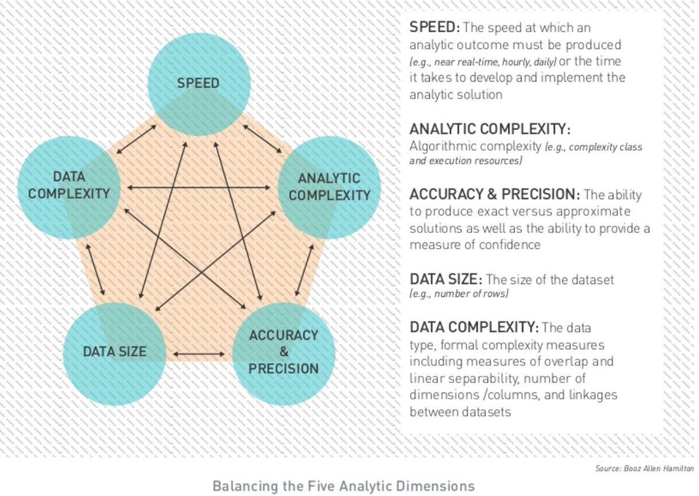

- **Data Size** 

  분석하고자 하는 **데이터의 양**을 **고려한 관리 방안 수립**이 필요하다. 하둡 환경에서의 엄청난 데이터양을 기반으로 분석하는 것과 기존 정형 데이터베이스에 있는 시간당 생성되는 데이터를 분석할 때의 관리 방식은 차이가 날 수 밖에 없다. 

- **Data Complexity** 

  B(Business Intelligence)  프로젝트처럼 정형 데이터가 분석 마트로 구성되어 있는 상태에서 분석을 하는 것과 달리 덱스트, 오디오 비디오 등의 **비정형 데이터** 및 **다양한 시스템에 산재**되어 있는 **원천 데이터**들을 통합해서 분석 프로젝트를 진행 할 떄는, 초기 데이터의 확보와 통합뿐 아니라 해당 **데이터에 잘 적용될 수 있는 분석 모델의 선정** 등에 대한 사전 고려가 필요하다. 

- **Speed**

  분석결과가 도출되었을 때 **이를 활용하는 시나리오 측면에서의 속도를 고려**해야 한다. 일 단위 , 주 단위 실적의 경우에는 배치 (Batch)형태로 작업되어도 무방하지만 실시간으로 사기(fraud) 를 탐지하거나 고객에게 개인화된 상품•서비스를 추천하는 경우에는 분석 모델의 적용 및 계산이 **실시간으로 수행되어야 하기때문에** 프로젝트 수행시 **분석모델의 성능 및 속도를 고려한 개발 및 테스트가 수행**되어야 한다. 

- **Analystic Complexity** 

  분석 모델의 **정확도와 복잡도**는 트레이드 오프(Trade off)관계가 존재한다. **분석 모델이 복잡할수록 정확도는 올라가지만 해석이 어려워지는 단점이 존재**하므로 이에 대한 기준점을 사전에 정의해 두어야 한다. 고객의 신용을 평가하는 마케팅 시나리오에서 분석모델을 활용하여 신용점수가 낮게 나올 때 어떠한 변수에 기인했는지를 모델에서 설명해 줄 수 없으면 영업•마케팅 직원 입장에서는 해당 고객과의 소통이 어려워지는 단점이 존재하므로, **해석이 가능하면서도 정확도를 올 수 있는 최적모델**을 찾는 방안을 사전에 모색해야 한다. 

- **Accuracy & Precision** 

  **Accuracy** 는 모델과 실제 값 사이의 차이가 적다는 정확도를 의미하고 **Predision**은 모델을 지속적으로 반복했을 때의 편차의 수준으로써 일관적으로 동일한 결과를 제시한다는 것을 의미한다. <u>분석의 활용적인 측면에서는 Accuracy가 중요하며, 안정성 측면에서는 Precision 이 중요하다.</u> 그러나 Accuracy와 Precision은 트레이드오프가 되는 경우가 많기 때문에 모델의 해석 및 적용 시 사전에 고려해야 한다..  

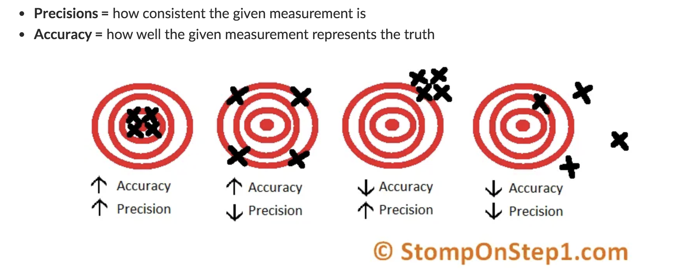

[[출처 : stomponstep]](http://www.stomponstep1.com/difference-between-accuracy-and-precision/) 

##### 2.분석 프로젝트의 특성 

**가. 개요** 

-  **분석가의 목표** : <u>분석의 **정확도**를 높이는 것이 목표</u>이지만, 프로젝트의 관점에서는 도출된 분석 과제를 잘 구현하여 원하는 결과를 얻고 사용자가 원할하게 활용할 수 있도록 전체적인 과정을 고려해야 하기 때문에 개별적인 분석 업무 수행뿐만 아니라 <u>전반적인 프로젝트 관리</u> 또한 중요하다. 

- **분석가의 입장** : 데이터의 원천을 다루는 **데이터 영역**과 **결과를 활용할** **비즈니스 영역**의 중간에서 **분석 모델을 통한 조율을 수행하는 조정자의 역할이 핵심**이 된다. 특히 <u>분석 프로젝트에서는 데이터 영역과 비즈니스 영역의 현황을 이해하고 프로젝트의 목표인 분석의 정확도 달성과 결과에 대한 가치 이해를 전달하는 조정자로서의 분석가의 역할이 중요</u>하다.  조정자로서의 분석가가 해당 프로젝트의 관리자까지 겸임하게 되는 경우가 대부분이므로, 프로젝트 관리방안에 대한 이해와 주요 관리 포인트를 사전에 숙지하는 것이 필수적이다. 

- 분석 프로젝트는 도출된 결과의 재해석을 통한 지속적인 반복 및 정교화가 수행되는 경우가 대부분이므로, 프로토타이핑 방식의 어자일(Agile)프로젝트 관리방식에 대한 고려도 필요하다. 

  데이터 분석의 지속적인 반복 및 개선을 통해여 의도했던 결과에 더욱 가까워지는 형태, 프로젝트가 진행될 수록 적절한 관리 방안 수립이 사전에 필요하다. 

##### 3. 분석 프로젝트이 관리방안 

> 영역별 주요 관리 항목

| 주제 그룹  |                    개념 및 관련 프로세스                     |
| :--------: | :----------------------------------------------------------: |
|    범위    | - 분석 기획단계의 프로젝트 범위가 분석을 진행하면서 데이터의 형태와 양 또는 적용되는  모델의 알고리즘에 따라 범위가 빈번하게 변경됨  - 분석의 최종 결과물이 분석 보고서 형태인지 시스템인지에 따라서  투입되는 자원 및 범위 또한 크게 변경되므로 사전에 충분한 고려가 필요함   |
|    시간    | - 데이터 분석 프로젝트는 초기에 의도했던 결과(모델)가 나오기 쉽지 않기 때문에  지속적으로 반복되어 많은 시간이 소요될 수 있음   - 분석 결과에 대한 품질이 보장된다는 전제로 Time Boxing 기법으로 일정관리를 진행하는 것이 필요함 |
|    원가    | - 외부 데이터를 활용한 데이터 분석인 경우 고가의 비용이 소요될 수 있으므로  사전에 충분한 조사가 필요함   - 오픈 소스 도구 (Tool)  외에 프로젝트 수행 시의도했던 결과를 달성하기 위하여  사용 버전의 도구(Tool)가 필요할 수 있음 |
|    품질    | - 분석 프로젝트를 수행한 결과에 대한 품질 목표를 사전에 수립하여 확정해야 함  - 프로젝트 품질은 품질 통제 (Quality Control) 품질보증 (Quality Assurance)으로 나누어 수행되어야함 |
|    통합    | - 프로젝트 관리 프로세스들이 통합적으로 운영될 수 있도록 관리해야함 |
|    조달    | - 프로젝트 목적성에 맞는 외부 소싱을 적절하게 운영할 필요가 있음 |
|    자원    | - 고급 분석 및 빅데이터 아키텍쳐링을 수행할 수 있는 인력의 공급이 부족하므로  프로젝트 수행 전 전문가 확보에 대한 검토가 필요함 |
|   리스크   | - 분석에 필요한 데이터 미확보로 분석 프로젝트 진행이 어려울 수 있으므로  관련 위험을 식별하고 대응방안을 사전에 수립해야 함  - 데이터 및 분석 알고리즘의 한계로 품질 목표를 달성하기 어려울 수 있어  그에 따른 대응방안을 수립할 필요가 있음 |
|  의사소통  | - 전문성이 요구되는 데이터 분석의 결과를 모든 프로젝트 이해관계자가 공유할 수 있도록 해야함  - 프로젝트이 원활한 진행을 위한 다양한 의사소통체계 마련이 필요함 |
| 이해관계자 | - 데이터 분석프로젝트는 데이터 전문가, 비즈니스 전문가, 분석전문가, 시스템 전문가 등  다양한 전문가가 참여하므로 이해관계자의 식별과 관리가 필요함 |

