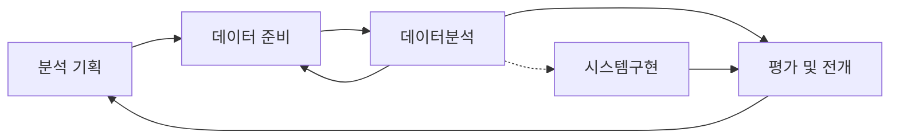

## 1장 데이터 분석 기획의 이해 

> 데이터 분석 기획을 위해 반드시 알아야 하는 분석 방법론에 대해서 살펴본다. 
>
> 다양한 방법으로 분석 기회를 발굴하여 분석과제를 정의하는 방법을 살펴본다. 

- 분석 기획 방향성 도출을 위한 분석 기획의 특징과 고려사항을 이해한다. 
- **KDD분석 방법론**에 대해 이해한다. 
- **CRISP-DM 분석 방법론**에 대해 이해한다. 
- **빅데이터 분석 방법론**을 이해하고 각 단계별 내용을 설명할 수 있다. 

###  제 1절. 분석기획 방향성 도출

#### 1. 분석기획의 특징

##### 가. 분석기획이란? 

- 분석을 수행할 **과제를 정의**하고, 의도했던 **결과를 도출**할 수 있도록 이를 적절하게 **관리**할 수 있는 방안을 **사전에 계획**하는 일련의 작업이다. 
- 분석과제 및 프로젝트를 직접 수행하는 것은 아니지만, **어떠한 목표(What)**를 달성하기 **위하여(why)** **어떠한 데이터를 가지고 (How)** 어떠한 방식으로 수행할 지에 대한 일련의 계획을 수립하는 작업이기 때문에 성공적인 분석결과를 도출하기 위한 중요한 사전 작업이다. 

##### 나. 데이터 사이언티스트의 역량

- **수학/통계학적 지식** (Math & Statistics)
- **정보기술** (Information Technology)
- **비즈니스에 대한 이해** 

#### 2. 분석 대상과 방법 

 *** 분석기획을 위해 필요한 3가지 역량과 분석 대상과 방법에 따른 분석 유형 4가지 출제가능성이 높음

##### <분석 주제의 4가지 유형>

#### 3. 목표 시점별 분석 기획 방안

 *** 목표 시점별 분석 방향, 목표, 유형, 접근 방식에 대한 특성 묻는 문제 출제 가능성 ⬆︎⬆︎

- 목표시점 별로는 당면한 과제를 빠르게 해결하는 **"과제 중심적인 접근 방식"** 과 지속적인 분석 내재화를 위한 **"장기적인 마스터 플랜 방식"**
- 분석기획에서는 **문제해결(Problem Solving)**을 위한 **단기적인 접근**방식과 **분석과제 정의(Problem Definition)**를 위한 **중장기적인 마스터 플랜 접근**방식을 **융합**하여 적용하는 것이 중요 

- 의미있는 분석을 위해서는 **분석기술, IT및 프로그래밍**, 분석 주제에 대한 **도메인 전문성**, **의사 소통**이 중요 , 분석대상 및 방식에 따른 다양한 분석 주제를 과제 단위 혹은 **마스터 플랜 단위**로 도출할 수 있어야 한다. 

#### 4. 분석 기획시 고려사항

- **정형 데이터** (Structured Data, DB로 정제된 데이터)
- **반정형데이터**(Semi-structured Data, 센서 중심으로 스트리밍 되는 머신데이터)
- **비정형 데이터**(Unstructured Data, email, 보고서, 소셜비디어 데이터)

**가.** 분석의 기본인 **가용 데이터(Available data)**에 대한 고려가 필요하다. 

- 분석을 위한 **데이터 확보**가 우선적, 데이터 **유형에 따라 적용 가능한 솔루션** 및 **분석 방법**이 다르기 때문에 유형에 대한 분석이 선행적으로 이루어져야 한다. 

**나.** 분석을 통해 가치 창출위한 **적절한 활용방안**과 **유즈케이스**(Proper Business Use Case) 탐색이 필요하다. 

- 기존에 잘 구현되어 활용되고 있는 유사 분석 시나리오 및 솔루션을 최대한 활용하는 것이 중요하다. 

**다.** 분석 수행시 발생하는 **장애요소들에 대한 사전계획 수립**이 필요하다. (Low Barrier Of Execution)

- 일회성 분석으로 그치지 않고 조직의 역량으로 내재화하기 위해서는 충분하고 계속적인 교육 및 활용방은 등의 변화 관리(Change Management)가 고려되어야 한다. 

|   종류   | 정형데이터                                                   | 반정형 데이터                                                | 비정형 데이터                                                |
| :------: | ------------------------------------------------------------ | ------------------------------------------------------------ | ------------------------------------------------------------ |
| **특징** | - 데이터 자체로 분석 가능  - RDB구조의 데이터   - 데이터베이스로 관리 | - 데이터로 분석이 가능하지만  해석이 불가능하며 메타정보를 활용해야 해석이 가능  | - 데이터자체로 분석이 불가능   - 특정한 처리 프로세스를 거쳐  분석데이터로 변경 후 분석  |
| **유형** | - ERP, CRM, SCM 등 정보 시스템                               | - 로그데이터, 모바일데이터, 센싱데이터                       | - 파일형태로 저장, 관리  - 영상, 음성, 문자        |

### 제 2절. 분석 방법론

#### 1. 분석방법론 개요

#### 가. 개요

- 데이터 분석을 효과적으로 기업내 정착하기 위해서는 이를 체계화한 절차와 방법이 정리된 데이터 **분석 방법론의 수립**이 필수적이다.
- 프로젝트는 개인의 역량이나 조직의 우연한 성공에 기인해서는 안되고, 일정한 수준의 품질을 갖춘 산출물과 프로젝트의 성공 가능성을 확보하고 제시할 수 있어야 한다. 
- 방법론은 상세한 **절차(Procedures), 방법(Methods), 도구와 기법(Tools&Techniquest), 템플릿과 산출물(template&Outputs)**구성되어 어느 정도 지식만 있으면 활용 가능해야한다. 

#### 나. 데이터 기반 의사 결정의 필요성

 *** 합리적 의사결정을 가로막는 장애요소에 대한 문제가 자주 출제 ! 

- 경험과 감에 따른 의사결정 ➞ 데이터 기반의 의사결정
- 기업의 합리적 의사결정을 가로막는 장애요소
  - **고정관념(Stereotype)**, **편향된 생각(Bias)**. **프레이밍 효과**(Framing Effect:개인의 선택에 의해 결과가 달라질 수 있는 현상)

#### 다. 방법론의 생성과정 

#### 라. 방법론의 적용 업무의 특성에 따른 모델 

**1) 폭포수 모델 (Waterfall Model)**

  - 단계를 순차적으로 진행하는 방법으로, 이전 단계가 완료되어야 다음 단계로 진행될 수 있으며 문제가 발견될 시 피드백 과정이 수행된다. 

##### 2) 프로토 타입 모델(Prototype Model)

- 폭포수 모델의 단점을 보완, 점진적으로 시스템을 개발해 나가는 접근 방식, **고객의 요구**를 완전하게 이해하고 있지 못하거나 완벽한 요구 분석의 어려움을 해결하기 위해 **일부분을 우선 개발**하여 사용자에게 제공
- 시험 사용 후 요구를 분석하거나 요구 정당성을 점검, 성능을 평가하여 **그 결과를 통한 개선** 작업을 시행하는 모델

##### 3) 나선형 모델(Spiral Model)

- 반복을 통해 점증적으로 개발, 처음시도하는 프로젝트에 적용이 용이하다. 
- 관리체계를 효과적으로 갖추지 못한 경우 복잡도가 상승하여 프로젝트 진행이 어려울 수 있다. 

#### 마. 방법론의 구성 

#### 단계

- 최상위 계층

- 프로세스 그룹을 통해 완성된 단계별 산출물이 생성 
- 기준선으로 설절되어 관리, 버전관리 등을 통하여 통제 

  ##### ➔ 단계별 완료 보고서 

#### 태스크

- 단계를 구성하든 단위 활동
- 물리적 또는 논리적 단위로 품질 검토의 항목이 된다. 

  ##### ➔ 보고서 

#### 스탭 

- WBS(Work Breakdown Structure)의 워크 패키지에 해당
- 입력자료(Input), 처리 및 도구(Process&Tool), 출력자료(Output)로 구성된 단위 프로세스

  ##### ➔ 보고서 구성요소

#### 2. KDD 분석 방법론 

#### 가. 개요

- **KDD**(Knowledge Discuvery in Databases) 1996sus Fayyad가 **프로파일링 기술을 기반**으로 **데이터로부터 통계적 패턴이나 지식을 찾기 위해 활용**할 수 있도록 **체계적으로 정리한 데이터 마이닝** 프로세스이다. 

  

#### 나. KDD 분석 절차 

 *** 분석 절차 설명 후 어느 단계에 대한 설명인지 문제 출제 ⬆︎⬆︎

##### 1) 데이터셋 선택(Selection)

- 데이터셋 선택에 앞어 분석 대상의 **비즈니스 도메인**에 대한 이해와 **프로젝트 목표 설정**이 필수 
- 데이터 베이스 또는 원시 데이터에서 분석에 필요한 데이터를 선택하는 단계
- 데이터마이닝에 필요한 **목표데이터(tatget data)**를 구성하여 분석에 활용한다. 

##### 2) 데이터 전처리(Preprocessing)

- 추출된분석 대상용 데이터 섹에 포함되어 있는 **잡음(Noise)**과 **이상치(Outlier)**, **결측지(Mi-ssing Value)**를 식별하고 필요시 제거하거나 의미있는 데이터로 재처리하여 데이터 셋을 정제하는 단계
- 데이터 전처리 단계에서 **추가로 요구되는 데이터** 셋이 필요한 경우 데이터 선택 프로세스를 재실행한다.

##### 3) 데이터 변환(Transformation)

- 데이터 전처리 과정을 통해 정제된 데이터에 분석 목적에 맞게 변수를 생성, 선택하고 **데이터의 차원을 축소**하여 효율적으로 데이터마이닝을 할 수 있도록 데이터에 변경하는 단계이다. 

- 데이터마이닝 프로세스를 진행하기 위해 **학습용데이터(training data)**와 **검증용데이터(test data)**로 데이터를 분리하는 단계이다.

##### 4) 데이터 마이닝(Data Mining)

- 학습용 데이터를 이용하여 분석목적에 맞는 **데이터마이닝 기법을 선택**하고, 적절한 알고리즘을 적용하여 데이터마이닝 작업을 실행하는 단계이다.
- 필요에 따라 데이터 **전처리**와 데이터 **변환 프로세스**를 추가로 실행하여 최적의 결과를 산출한다.

##### 5) 데이터 마이닝 결과 평가(Interpretatio/Evaluation)

- 데이터마이닝 **결과에 대한 해석과 평가**, 그리고 **분석 목적과의 일치성**을 확인한다.
- 데이터마이닝을 통해 발견한 **지식을 업무에 활용**하기 위한 방안 마련의 단계
- 필요에 따라 데이터 선택 프로세스에서 데이터마이닝 프로세스를 반복 수행한다.

#### 3. CRISP-DM 분석 방법론

 *** CRISP-DM 프로세스의 4가지 레벨과 6단계 그리고 각 단계별 업무내용이 자주 출제 

#### 가. 개요

- CRISP-DM(Cross Industry Standartd Process For Data Mining)은 1996년 유럽연합의 
  ESPRIT 에서 있었던 프로젝트에서 시작되었으며, **주요한 5개의 업체들 (Daimler-Chrysler, SPSS, NCR, Teradata, OHRA)**이 주도하였다. 
  CRISP-DM은 **계층적 프로세스 모델**로써 4개 레벨로 구성된다.

#### 나. CRISP-DM 의 4레벨 구조 

- 최상위 레벨은 여러 개의 단계(Phases)로  구성되고 각 단계는 일반화 태스크(Generic Tasks)를 포함한다. 일반화 태스크는 데이터마이닝의 단일 프로세스를 완전하게 수행하는 단위이며, 이는 다시 구체적인 수행 레벨인 세분화 태스크(Specialized Tasks)로 구성된다. 
- 예를 들어 데이터 정제(Data Cleansing)라는 일반화 태스크는 범주형 데이터 정제와 연속형 데이터 정제와 같은 세분화 태스크로 구성왼다. 

#### 다. CRISP-DM의 프로세스 

- **6단계로 구성**되어 있으며, 각 단계는 단방향으로 구성되어 있지 않고 **단계 간 피드백**을 통해 **단계별 완성도를 높이**게 되어 있다. 

  

|                     단계                     | 내용                                                         | 수행업무                                                     |
| :------------------------------------------: | ------------------------------------------------------------ | ------------------------------------------------------------ |
| 업무이해   Business Understanding  | • 비즈니스 관점에서 프로젝트의 목적과 요구사항을 이해하기 위한 단계   • 도메인 지식을 데이터 분석을 위한 문제정의로 변경하고 초기 프로젝트 계획을 수립하는 단계 | 업무 목적 파악, 상황 파악, 데이터 마이닝 목표설정, 프로젝트 계획 수립 |
|  데이터 이해  Data Understanding   | • 분석을 위한 데이터를 수집하고 데이터 속성을 이해하기 위한 단계   • 데이터 품질에 대한 문제점을 식별하고 인사이트를 발견하는 단계 | 초기 데이터 수집, 데이터 기술 분석, 데이터 탐색, 데이터 품질 확인 |
|  데이터 준비   Data Preparation    | • 분석을 위하여 수집된 데이터에서 분석기법에 적합한 데이터를 편셩하는 단계 (많은 시간이 소요 될 수 있음) | 분석용 데이터 셋 선택, 데이터 정제, 분석용 데이터 셋 편성, 데이터 통합, 데이터 포맷팅 |
|         모델링  Modeling           | • 다양한 모델링 기법과 알고리즘을 선택하고 모델링 과정에서 사용되는 파라미터를 최적화해 나가는 단계  •모델링 과정에서 데이터 셋이 추가로 필요한 경우 데이터 준비 단계를 반복 수행할 수 있으며, 모델링 결과를 테스트용, 데이터 셋으로 평가하여 모델의 과적합(Over-fitting)문제를 확인 | 모델링 기법 선택, 모델테스트 계획 설계 , 모델작성, 모델평가  |
|         평가   Evauation           | • 모델링 결과가 프로젝트 목적에 부합하는지 평가하는 단계로 데이터마이닝 결과를 최종적으로 수용 할 것인지 판단  | 분석결과 평가, 모델링 과정 평가, 모델 적용성 평가            |
|         전개   Deployment          | • 완성된 모델을 실 업무에 적용하기 위한 계획을 수립하는 단계   • 모니터링과 모델의 유지보수 계획 마련    → 모델에 적용되는 비즈니스 도메인 특성, 입력되는 데이터의 품질 편차, 운영모델의 평가기준에 따라 생명주기(Lifr cycle)가 다양하므로 상세한 전개계획이 필요  • CRISP-DM 의 마지막 단계, 프로젝트 종료 | 전개 계획 수립,  모니터링과 유지보수 계획 수립  프로젝트 종료보고서 작성,  프로젝트 리뷰 |

#### 4. KDD와 CRISP_DM의 비교 

|                         KDD                          |              CRISP-DM               |
| :--------------------------------------------------: | :---------------------------------: |
|                분석대상 비즈니스 이해                | 업무 이해  (Business Understanding) |
|                    데이터 전처리                     | 데이터의 이해  (Data Understanding) |
|            데이터 전처리 (Preprocessing)             |            데이터의 이해            |
|             데이터 변환 (Transformation)             |    데이터 준비 (Data Preparaion)    |
|             데이터 마이닝 (Data mining)              |          모델링 (Modeling)          |
| 데이터 마이닝 결과 평가 (Interpretation/ Evoluation) |          평가 (Evauation)           |
|                  데이터 마이닝 활용                  |          전개 (Deployment)          |

#### 5. 빅데이터 분석 방법론 

 *** 빅데이터 분석을 위한 3개의 계층과 내용이 시험에 자주 출제됩니다. 

##### 가. 빅데이터 분석의 계층적 프로세스 - 3개의 계층 

-  **단계 (Pharse):** 프로세스 그룹(Process Goup)을 통하여 완성된 단계별 산출물이 생성된다. 
  각 단계는 기준선(Baselin 으로 설정되어 관리되어야 하며, 버전관리(Configuration Management)등을
  통하여 통제가 이루어져야 한다. 
- **태스크 (Task):** 각 단계는 여러 개의 태스크로 구성된다. 각 태스크는 단계를 구성하는 단위 활동이며,
  물리적 또는 논리적 단위로 품질 검토의 항목이 될 수 있다. 
- **스탭 (Stap ):** WBS(Work Breakdown Stuructue)의 워크 패키지에 해당하고 입력자료(Input), 출력자료(output),
  구성된 단위 프로세스(Unit Process)이다. 

##### 나. 빅데이터 분석 방법론 - 5단계

 *** 빅데이터 분석 방법론 5단계와 각 단계의 주요 업무는 시험에 자주 출제됩니다. 

1. **분석기획(Planing) :** 비즈니스 도메인과 분제점을 인식하고 분석 계획 및 프로젝트 수행계획을 수립하는 단계

2. **데이터 준비(Preparing) :** 비즈니스 요구사항과 데이터 분석에 필요한 원천 데이터를 정의하고 준비하는 단계

3. **데이터 분석 (Analyzing) :** 원천 데이터를 분석용 데이터 셋으로 편성하고 다양한 분석 기법과 알고리즘을 
   이용하여 데이터를 분석하는 단계이다.  분석 단계를 수행하는 과정에서 추가적인 데이터 확보가 필요한 경우 
   데이터 준비 단계로 피드백하여 두 단계를 반복하여 진행한다. 
4. **시스템 구현(Developing) :** 분석 기획에 맞느 ㄴ모델을 도출하고 이를 운영중인 가동 시스템에 적용하거나
    시스템 개발을 위한 사전 검증으로 프로토타입 시스템을 구현한다.  
5. **평가 및 전개(Lesson Learned) :** 데이터 분석 및 시스템 구현 단계를 수행한 후, 프로젝트의 성과를 평가하고 정리
   (Lesson Learned)하거나 차기 분석 기획으로 전달하고 프로젝트를 종료하는 단계이다. 

