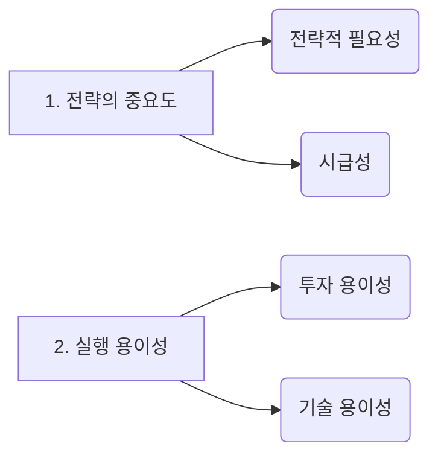
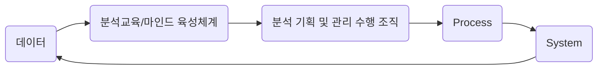

### 1절. 마스터 플랜 수립 프레임 워크

#### 1. 분석 마스터 플랜 수립 프레임 워크

##### 가. 마스터 플랜 수립개요

- 데이터 기반 구축을 위해서 분석 과제를 대상으로 전략적 중요도, 비즈니스 성과 및 ROI, 분석 과제의 실행 용이성등 
  다양한 기준을 고려해 적용 우선순위를 설정한다. 
- 업무내재화 적용 수준, 분석 데이터 적용 수준, 기술적용 수준 등 분석 적용 범위 및 방식에 
  대해서 종합적으로 고려하여 데이터 분석 구현을 위한 로드맵 수립해야 한다. 

[[이미지출처 birc 블러그]](http://www.birc.co.kr/2016/09/19/chapter3데이터-분석-기획-제2장_분석-마스터-플랜/)

- **ROI (%)** : 누적 순효과/총비용, 누적된 총 순효과를 총비용을 나누어 계산한 비율이다.

- **ISP (Information Starategy Plannig)** : 정보기술 또는 정보시스템을 전략적으로 활용하기 위하여 
  조직 내・외부 환경을 분석하여 기회나 문제점을 도출하고 사용자의 요구사항을 분석하여 시스템 구축 우선순위를
  결정하는 중장기 마스터 플랜을 수립하는 절차이다. 

##### 나. 수행과제 도출 및 우선순위 평가 

**1) 우선순위 평가 방법 및 절차** 

- 우선순위 평가의 경우 정의된 데이터과제에 대한 실행 순서를 정하는 것이다. 
- 업무별 도출된 분석과제를 우선순위 평가 기준에 따라 평가한뒤, 과제 수행의 선・후행 관계를 고려하여 
  적용순위를 조정해 최종 확정한다. 

##### 2) 일반적인 IT 프로젝트의 우선순위 평가 예시 

- 정보전략계획(ISP)과 같은 일반적인 IT프로젝트 과제의 우선순위 평가를 위해 전략적 중요도, 실행 용이성

  기업에서 고려하는 중요 가치기준에 따라 다양한 관점에서 우선순위 기준을 수립하여 평가한다.

- **전략적 중요도**

  **– 전략적 필요성** 

  - 전략적 목표 및 본원적 업무에 직접적인 연관관계 밀접도
  - 이슈 미해결 시 발생하게 될 위험 및 손실에 대한 정도

  **– 시급성** 

  - 사용자 요구사항 업무 능률 향상을 위해 시급히 수행되어야 하는지에 대한 정도
  - 향후 경쟁우위 확보를 위한 중요도

- **실행 용이성**

  **– 투자 용이성** 

  - 기간 및 인력 투입 용이성 정도
  -  투자 예산 확보 가능성 정도

  **– 기술 용이성** 

  - 적용 기술의 안정성 검증 정도
  - 응용시스템 H/W 유지보수 용이성정도
  - 개발 스킬 성숙도 및 신기술 적용성 정도

##### 3) ROI관점에서 빅데이터의 핵심특징

*** ROI요소로 어떻게 매칭되는 지 알아야 한다. 3V, 4V !!!

[[이미지출처 birc 블러그]](http://www.birc.co.kr/2016/09/19/chapter3데이터-분석-기획-제2장_분석-마스터-플랜/)

##### 가) 투자비용(Investment)

- **크기(Volume**): 데이터의 규모 및 양을 의미, 대용량 데이터를 저장 및 처리하고 관리하기 위한 새로운 투자가 필요하다

- **다양성(Variety)**: 다양한 데이터 종류와 형태(유형, 소스)의 데이터를 입수하는 데 있어서도 투자가 필요하다.

- **속도(Velocity**): 데이터 생성 속도 또는 데이터 처리 속도를 빠르게 가공・분석하는 기술이 요구된다. 

##### 나) 비즈니스 효과 (Return)

- **가치(Value)** :  분석 결과를 활용하거나 실질적인 실행을 통해 얻게 되는 비즈니스 효과 측면의 요소이다
  기업데이터 분석을 통해 추구하거나 달성하고자 하는 목표 가치를 의미한다. 

##### 4) 데이터 분석과제 추진시 고려해야 하는 우선순위 평가 기준

##### 가) 시급성 

- 전략적 중요도와 목표가치에 부합하는지에 따른 시급성이 가장 중요한 기준이다. 
- 시급성의 판단 기준은 전략적 중요도가 핵심 
- 현재의 관점에서 전략적 가치를 둘 것인지, 미래의 중장기적 관점에서 전략적인 가치를 둘 것인지 고려 
- 분석 과제의 목표가치(KPI)를 함께 고려해여 시급성 여부를 판단할 수 있다. 

##### 나) 난이도 

- 데이터를 생성, 저장, 가공, 분석하는 비용과 현재 기업의 분석 수준을 고려한 난이도 역시 중요한 기준이다. 
- 난이도는 현 시점에서 과제를 추진하는 것이 적용 비용 측면과 범위 측면에서 바로 적용하기 쉬운 것인지,
  어려운 것인지에 대한 판단기준으로서, 데이터 분석의 적합성 여부를 본다. 

##### 5) 포트폴리오 사분면 분석을 통한 과제 우선순위 선정 

- 난이도 또는 시급성을 고려하여 분석 과제를 4가지 유형으로 구준하여 분석과제의 적용 우선순위를 결정한다. 

  

[[출처 : DBGUIDE]](http://www.dbguide.net/db.db?cmd=view&boardUid=187502&boardConfigUid=9&boardIdx=163&boardStep=1)

[[출처 : DBGUIDE]](http://www.dbguide.net/db.db?cmd=view&boardUid=187502&boardConfigUid=9&boardIdx=163&boardStep=1)

- 사분면 영역에서 가장 **우선적인 분석 과제 적용이 필요한 영역은 3사분면(III 영역)**이다. 

-  전략적 중요도가 현재 시점에는 상대적으로 낮은 편이지만 중장기적으로는 경영에 미치는 영향도가 높고, 
  분석 과제를 바로 적용하기 어려워 **우선순위가 낮은 영역은 2사분면(II 영역)**이다. 

-  분석 과제의 적용 우선순위 기준을 **‘시급성’에 둔다면 III -> IV -> II 영역 순**이며, 
  우선순위 기준을 **‘난이도’에 둔다면 III -> I -> II 영역 순**으로 의사결정을 할 수 있다. 

- 시급성과 난이도가 높은 1사분면(I 영역)은 경영진 또는 실무 담당자의 의사결정에 따라 적용 우선순위를 조정할 수 있다.

- 9번 과졔와 같이 1사분면에 위치한 분석과제는 데이터양, 데이터 특성, 분석 범위 등에 따라 난이도를 조율함으로써 적용 우선순위를 조정할 수 있다. 

  

##### 다. 이행계획수립

*** 3가지의 추진단계로 구성 각 단계마다 어떤 목표와 추진과제를 가지고 있는 지 숙지 !!!!

##### 1) 로드맵 수립

- 가. 분석 과제에 대한 포트폴리오 사분면(Quadrant)분석을 통해 과제의 1차적 우선 순위를 결정한다. 
- 나. 분석 과제별 적용범위 및 방식을 고려하여 최정적인 실행 우선순위를 결정한 후 단계적 구현 로드맵을 수립한다. 
- 다. 단계별로 추진하고자 하는 목표를 정의한다. 
- 라. 추진 과제별 선 ・ 후행 관계를 고려하여 단계별 추진 내용을 정렬한다. 

##### 2) 세부 이행계획 수립

- 데이터 분석체계는 고전적인 폭포수 ( Water-Fall)방식도 있으나 반복적인 정련과정을 통하여 프로젝트의 완성도를 ㅋ

  높이는 방식을 주로 사용한다. 

- 반복적인 분석 체계는 모든 단계를 반복한다기 보다. 데이터 수집 및 확보와 분석데이터를 준비하는 단계를 순차적으로 
  진행하고, 모델링 단계는 반복적으로 수행하는 혼합형을 많이 적용한다. 

[[출처 : DBGUIDE]](http://www.dbguide.net/db.db?cmd=view&boardUid=187502&boardConfigUid=9&boardIdx=163&boardStep=1)

### 2절.  분석 거버넌스 체계 수립

#### 1. 거버넌스 체계 

##### 가. 개요 

- 기업에서 데이터를 이용한 의사결절이  강조될수록 데이터 분석과 활용에 대한 체계적인 관리의 중요성 또한 올라간다.
  이는 단순히 대용량 데이터를 수집·축적하는 것보다는 어떤 목적으로 어떤 데이터를 어떻게 분석해 활용할 것인가가
  더욱 중요하기 때문이다. 분석의 구현 과정에서도 반복적인 정련 과정이 필요하듯이, 분석관리 체계의 수립이 필요하다.
  분석 관리체계는 구현 후 지속적으로 분석을 고도화하고 분석 과제 등을 추가로 발굴하는 등 분석 업무를 기업의 문화로서 
  정착시키고,  안정적으로 분석을 운용하기 위해 필요하다.

##### 나. 구성 요소

- 마스터 플랜 수립 시점에서 데이터 분석의 지속적인 적용과 확산을 위한 거버넌스 체계는 
  분석 기획 및 관리를 수행하는 조직 (Oganization), 과제 기획 및 운영 프로세스(Process), 분석 관련 시스템(System), 
  데이터(Data), 분석관련 교육 및 마인드 육성체계 (Human Resource)로 구성된다. 

#### 2. 데이터 분석 수준 진단

##### 가. 개요 

- 기업은 데이터 분석 도입 여부와 활용에 명확한 분석수준을 점검할 필요가 있다. 
- 데이터 분석 수준진단을 통해 데이터 분석 기반의 구현을 위해 준비, 보완, 분석 유형 및 분석의 방향성을 결정할 수 있다. 

!! 분석 준비도와 분석 성숙도 주관식으로 출제 될 수 있다. 기억하자 !!

[[출처 : DBGUIDE]](http://www.dbguide.net/db.db?cmd=view&boardUid=187502&boardConfigUid=9&boardIdx=163&boardStep=1)

##### 나. 수준 진단 목표 2가지 

##### 1) 정의 

- 기업의 현재 분석 수분을 명확히 이해, 수준진단 결과를 토대로 미래 목표수준 정의. 

- 데이터 분석 기반 또는 환경이 타 경쟁사에 비해 어느 수준인지 경쟁령을 확보, 어떤 영역에 선택과 집중을 해야하는지, 
  보완해야 하는지 개선방안을 도출한다. 

##### 2) 분석 준비도 

- **가) 목표:** 기업의 데이터 분석 도입 수준을 파악하기 위한진단 방법 
- **나) 구성:** 분석업무파악, 인력 및 조직, 분석기법, 분석 데이터, 분석문화, IT 인프라 (총 6가지)
- **다) 진단과정** 
  	1. 영영별로 세부항목에 대한 수준파악 
   	2. 진단결과 전체 요건 중 일정 수준이상 충족하면 분석업무 도입 
   	3. 충족하지 못할 시 분석 환경 조성 

|                        분석 업무 파악                        |                         인력 및 조직                         |                           분석기법                           |
| :----------------------------------------------------------: | :----------------------------------------------------------: | :----------------------------------------------------------: |
| - 발생한 사실 분석업무   - 예측 분석업무   - 시뮬레이션 분석업무  - 최적화 분석업무 - 분석업무 정기적 개선  | - 분석 전무가 직무 존재   - 분석 전문가 교육 훈련 프로그램   - 관리자들의 기본적 분석 능력  - 전산 분석업무 총괄 조직 존재   - 경영진의 분석 업무 이해 능력  | - 업무별 적합한 분석기법 사용 - 분석업무 도입 방법론   - 분석기법 라이브러리   - 분석기법 효과성 평가   - 분석기법 정기적 개선   |

|                          분석데이터                          |                           분석문화                           |                           IT인프라                           |
| :----------------------------------------------------------: | :----------------------------------------------------------: | :----------------------------------------------------------: |
| - 분석업무를 위한 데이터 충분성   - 분석업무를 위한 데이터 신뢰성   - 분석업무를 위한 데이터 적시성   - 비구조적 데이터 관리   - 외부 데이터 활용 체계   - 기준 데이터 관리 (MDM)  | - 사실에 근거한 의사결정   - 관리자의 데이터 중시 정도   - 회의 등에서 데이터활용 상황   - 경영진의 직관 vs 데이터 기반의 의사 결정   - 데이터 공유 및 협업문화 | - 운영시스템 데이터 통합   - EAI, ETL 등 데이터 유통체계  -분석 전용 서버 및 스토리지  - 빅데이터 분석환경   - 통계 분석 환경   - 비쥬얼 분석 환경   |

##### 3) 분석 성숙도 모델 

##### 가) 조직의 성숙도 평가 도구 

- CMMI (Capability Maturity Model Intergration )모델

##### 나) 성숙도 수준 분류 

- 도입단계, 활용단계, 확산단계, 최적화단계 

##### 다) 분석 성숙도 진단 분류 

- 비즈니스 부문, 조직 ・ 역량 부분, IT부문 

*** 목표시점별 분석 방향, 목표, 유형, 접근 방식에 대한 문제 출제 가능 

|      단계      |                    도입단계                     |                        활용단계                         |                           확산단계                           |                          최적화단계                          |
| :------------: | :---------------------------------------------: | :-----------------------------------------------------: | :----------------------------------------------------------: | :----------------------------------------------------------: |
|      설명      |       분석을 시작해 환경과 시스템을 구축        |              분석 결과를 실제 업무에 적용               |              전사 차원에서 분석을 관리하고 공유              |          분석을 진화시켜서 혁신 및 성과 향상에 기여          |
| 비즈니스 부문  | 실적분석 및 통계 정기보고 수행 운영 데이터 기반 |       미래 결과 예측 시뮬레이션 운영 데이터 기반        | 전사 성과 실시간 분석 프로세스 혁신 3.0 분석규칙 관리 이벤트 관리 | 외부 환경분석 활용 최적화 업무 적용 실시간 분석 비즈니스 모델 진화 |
| 조직·역량 부문 |      일부 부서에서 수행 담당자 역량에 의존      | 전문 담당부서에서 수행 분석기법 도입 관리자가 분석 수행 | 전사 모든 부서 수행 분석 COE 조직 운영 데이터 사이언티스트 확보 |        데이터 사이언스그룹 경영진 분석 활용 전략 연계        |
|    IT 부문     |   데이터 웨어하우스 데이터 마트 ETL/EAI OLAP    |              실시간 대시보드 통계분석 환경              | 빅데이터 관리 환경 시뮬레이션·최적화 비주얼 분석 분석 전용 서버 |   분석 협업환경 분석 Sandbox 프로세스 내재화 빅데이터 분석   |

##### 4) 분석 수준 진단 결과 

- 기업의 현재 분석 수준을 객관적으로 파악
- 경쟁사의 분석 수준과 비교하여 분석 경쟁력 확보 및 강화를 위한 목표 수준 설정 가능 

##### 가)  분석 관점에서의 사분면 분석 

- 분석 수준 진단 결과를 구분 
- 데이터 분석 수준에 대한 목표 방향을 정의 
- 유형별 특성에 따른 개선 방안 수립 

[출처 DBguide    **[그림 Ⅴ-1-13] 사분면 분석(Analytics Quadrant)**](http://www.dbguide.net/db.db?cmd=view&boardUid=187503&boardConfigUid=9&categoryUid=216&boardIdx=163&boardStep=1)

#### 3. 분석지원 인프라 방안 수립

##### 가. 개요 

- 분석과제 단위별로 별도의 분석 시스템을 구축하는 경우, 관리의 복잡도 및 비용의 증대라는 부작용이 나타나게 된다. 
- 분석마스터 플랜을 기획하는 단계에서 부터 장기적이고 안정적인 확장성을 고려한 플랫폼 구조를 도입하는 것이 적절하다. 

|                         개별 시스템                          |                         플랫폼 구조                          |
| :----------------------------------------------------------: | :----------------------------------------------------------: |
| 시스템간 자체적인 데이터 교환   시스템별 독립적인 데이터 관리   확장시 시스템간 인터페이스 폭증   | 분석 플랫폼을 활용한 공동 기능 활용   중앙집중적 데이터 관리   시스템간 인터페이스 최소화   |

 

##### 나. 플랫폼 

- 단순한 분석 응용프로그램뿐만 아니라 분석 서비스를 위한 응용프로그램이 실행될 수 있는 기초를 이루는 컴퓨터 시스템을 의미한다. 

- 일반적으로 하드웨어에 탑재되어 데이터 분석에 필요한 프로그래밍 환경과 실행 및 서비스 환경을 제공하는 역활을 수행한다. 

- 분석플랫폼이 구성되어 있는 경우에는 새로운 데이터 분석 니즈가 존재할 경우 개별적인 분석 시스템을 추가하는 방식이 아닌 서비스를 추가적으로 제공하는 방식으로 확장성을 높일 수 있다. 

  

#### 4. 데이터 거버넌스 체계 수립

*** 단답형 문제가 자주 출제 숙지 하십쇼!!!

##### 가. 데이터 거버넌스의 개요 

 	1.  전사 차원의 모든 데이터에 대하여 정책 및 지침, 표준화, 운영조직 및 책임 등이 표준화된 관리 체계를 수립하고 
    운영을 위한 프레임워크(Framework) 및 저장소(Repository)를 구축하는 것을 말한다. 

2. 마스터 데이터 (Master Data), 메타 데이터(Meta Data), 데이터 사전(Data Dictionary)은 데이터 거버넌스의 

   중요한 관리 대상이다. 

   - 기업은 데이터 거버넌스 체계를 구축함으로써 데이터 가용성, 유용성, 통합성, 보안성, 안전성을 확보할 수 있다. 
   - 데이터 거버넌스는 독자적으로 수해될 수도 있지만 전사 차원의 IT 거버넌스나 EA(Enterprise Architectue)
     의 구성요소로써 구축되는 경우도 있다. 
   - 빅데이터 거버넌스는 이런한 데이터 거버넌스의 체계에 대하여 빅데이터의 효율적인 관리, 다양한 데이터의 관리체계, 데이터 최적화, 정보보호, 데이터 생명주기 관리, 데이터 카테고리별 관리 책임자(Data Steward) 지정 등을 포함한다. 

##### 나. 데이터 거버넌스 구성 요소 

##### 1. 개요 

- **원칙 , 조직, 프로세스** 는 유기적으로 조합하고 효과적으로 관리하여, 데이터를 비즈니스 목적에 부합하도록 하고 최적의 정보 서비스를 제공할 수 있도록 한다. 

##### 2. 구성3요소

##### 가) 원칙 (Principle)

- 데이터를 유지 ・ 관리 위한 지침과 가이드 
- 보안, 품질 기준, 변경관리 

##### 나) 조직(Oganization)

- 데이터를 관리할 조직의 역활과 책임 
- 데이터 관리자, 데이터 베이스 관리자, 데이터 아키텍트(Data Architect)

##### 다) 프로세스 (Process)

- 데이터 관리를 위한 활동과 체계 
- 작업절차, 모니터링 활동, 측정활동 

##### 다. 데이터 거버넌스 체계 

##### 1) 데이터 표준화  

​	데이터 표준 용어 설정, 명명규칙 수립, 메타 데이터 구축, 데이터 사전 구축 등

##### 2) 데이터 관리 체계 

​	데이터 정합성 및 활용의 효율성을 위하여 표준 데이터를 포함한 메타 데이터와 데이터 사전의 관리 원칙 수립하고 
​	원칙에 근거하여 항목별 상세한 프로세스를 만들고 관리와 운영을 위한 담당자 및 조직별 역할과 책임을 상세하게 준비

##### 3) 데이터 저장소 관리 (Repository)

​	메타 데이터 및 표준 데이터를 관리하기 위한 전사 차원의 저장소를 구성

##### 4) 표준화 활동 

​	표준 준수 여부를 주기적으로 점검하고 모니터링 실시, 변화관리 및 교육 진행, 데이터 표준화 개선활동

#### 5. 데이터 조직 및 인력방안 수립 

##### 가. 현황

- 빅데이터 등장에 따라 비즈니스 변화를 인식하고 데이터 과제 발굴, 기술 검토 및 전사 업무 적용계획 수립 등 데이터르 ㄹ효과적으로 분석・활용하기 위해 기획, 운영 및 관리를 전담 할 수 있는 전문 분석 조직의 필요성이 제기되고 있다. 

##### 나. 분석 조직의 개요 

|          | 기업 경쟁력 확보를 위해 비즈니스 질문과 이에 부합하는 가치를 찾고 비즈니스 최적화하는 것 |
| :------: | :----------------------------------------------------------: |
| **목표** | 기업 경쟁력 확보를 위해 비즈니스 질문과 이에 부합하는 가치를 찾고 비즈니스 최적화하는 것 |
| **역할** | 전자 및 부서의 분석 업무를 발굴하고 기업 내 빅데이터 속에서 insight  전파 이를 action화하는 것 |
| **구성** | 기초 통계학 및 분석 방법에 대한 지식과 분석 경험을 가진 인력, 전사 또는 부서내 조직 으로 구성하여 운영 |

##### 다. 조직 및 인력 구성 시 고려사항 

##### 1) 주요 고려사항 

|     구분      |                        주요 고려사항                         |
| :-----------: | :----------------------------------------------------------: |
| **조직 구조** | - 비즈니스 질문을 선제적으로 찾아낼 수 있는 구조인가?   - 분석 전담 조직과 타 부서관 유기적인 혀2조와 지원이 월활한 구조인가?   -효율적인 분석 업무를 수행하기 위한 분석 조직의 내부 조직구조는?   - 전사 및 단위 부서가 필요 시 접촉하며 지원할 수 있는 구조인가?   - 어떤 형태의 조직 (중앙 집중형, 분산형)으로 구성하는 것이 효율적인가?   |
| **인력 구성** | - 비즈니스 및 IT 전문가의 조합으로 구성되어야 하는가?   - 어떤 경험과 어떤 스킬을 갖춘 사람으로 구성해야 하는가 ?   - 통계적 기법및 분석 모델링 전문 인력을 별도로 구성해야 하는가?   - 전사 비즈니스를 커버하는 인력이 없다 . 그렇다면?   - 전사 분석업무에 대한 적합한 인력 규모는 어느 정도 인가?   |

##### 2) 분석을 위한 3가지 조직 구조 

***어떤 구조에 대한 설명인지 고르는 문제 출제 가능성 !! 내용 숙지 !!

[[이미지 출처 ]]( https://vipeveloper.tistory.com/42?category=777218)

|                          집중 구조                           |                          기능 구조                           |                           분산구조                           |
| :----------------------------------------------------------: | :----------------------------------------------------------: | :----------------------------------------------------------: |
| ・ 전사 분석업무를 **별도의  분석 전담 조직에서 담당**   ・ 전략적 중요도에 따라  분석조직이 우선 순위를  정해서 진행 가능  ・ 현업 업무부서의 분석업무와  **이중화/이원화 가능성 높음**   | ・ 일반적인 분석 수행 구조   ・ 별도 분석조직이 없고 **해당  업무 부서에서 분석 수행**   ・전사적 **핵심분석이 어려우며**,  부서 현황 및 실적 통계등   **과거 실적에 국한된   분석 수행 가능성 높음**   | ・ 분석 조직인력들을  **현업부서로 직접 배치**하여  분석업무 수행   ・ **전사차원의 우선 순위 수행**   ・분석결과에 따른 **신속한  action가능**  ・ 베스트 프랙티스 공유 가능   ・ 부서 분석업무와 역할 분담   명확히 해야함   |

##### 3) 분석 조직의 인력구성 

#### 6. 분석 과제 관리 프로세스 수립

##### 가. 현황 

- 분석 마스터 플랜이 수립되고 초기 데이터 분석과제가 성공적으로 수행되는 경우, 지속적인 분석 니즈 및 기회가 분석 과제 형태로 도출 될 수 있다. 이런 과정에서 분석 조직이 수행할 주요한 역할 중 하나가 분석 과제의 기획 및 운영이므로 이를 체계적으로 관리하기 위한 프로세스를 수립해야 한다. 

##### 나. 과제관리 프로세스 

	##### 1) 과제 발굴 

- 개별 조직이나 개인이 도출한 분석 아이디어를 발굴하고 이를 과제화하여 분석 과제 풀로 관리하면서 분석프로젝트를 선정하는 작업을 수행한다. 

##### 2) 과제 수행 

- 분석을 수행할 팀을 구성하고 분석 과제 실행 시 지속적인 모니터링과 과제결과를 공유하고 개선하는 절차를 수행한다. 

*** 분서과제 관리 프로세스에 대해 잘못된 것을 선택하라는 문제 출제 가능 숙지하라 !!

|               |                      관리 프로세스 순서                      |
| :-----------: | :----------------------------------------------------------: |
| **과제 발굴** |   1.분석 Idea 발굴 ➞ 2.분석과제 후보제안 ➞ 3.분석과제 확정   |
| **과제 수행** | 4. 팀구성 ➞ 5. 분석과제 실행 ➞ 6. 분석과제 진행관리 ➞ 7.결과공유/개선 |

#### 7. 분석 교육 및 변화 관리 

- 분석 조직 및 인력에 대한 지속적인 교육과 훈련 필요 
- 경영층이 사실 기반 의사결정을 할 수 있는 문화 정착 

- 분석역량을 확보하고 강화하는 것에 초점을 맞추어 진행돼야 한다.
- 지속적인 변화관리를 계획하고 수행・업무수행자에 대한 분석기회 발굴, 구체화, 시나리오 작성법
- 조직 구성원 모두에게 분석기반의 업무를 정착시킬 수 있어야 한다.

