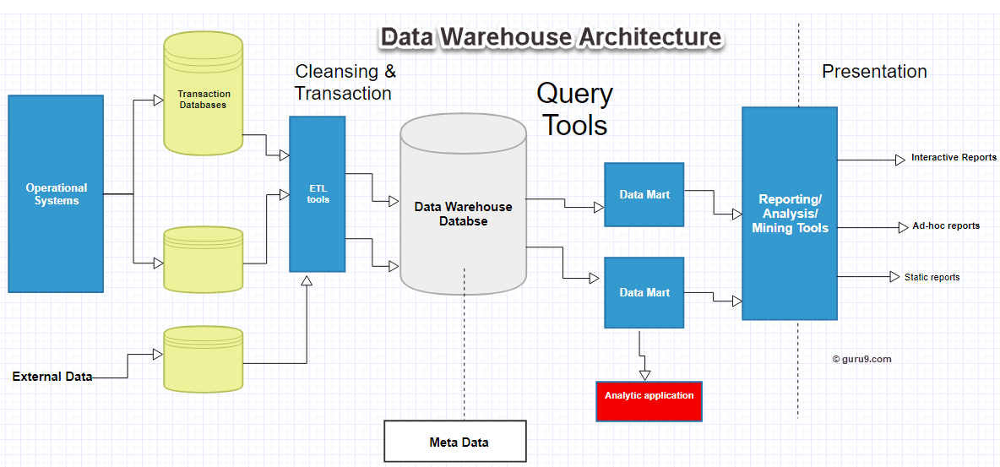
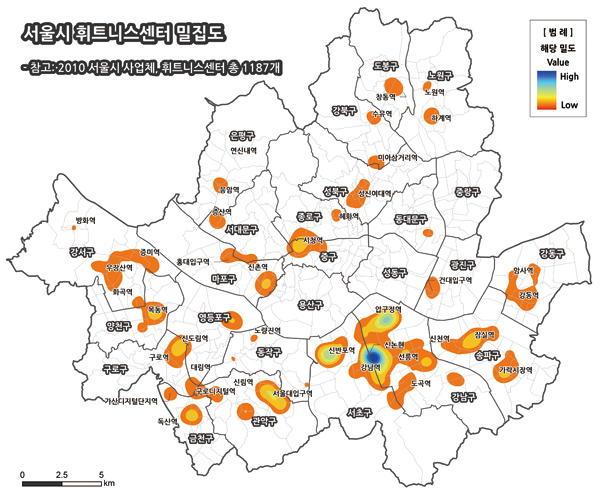
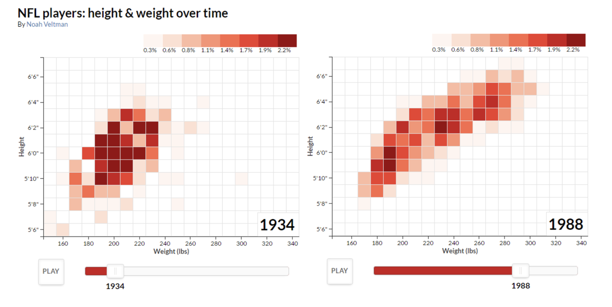

## 3. 데이터 분석 개요

### 1절. 데이터 분석 기법의 이해 

### 1. 데이터 처리 

#### 가. 개요 

- 데이터 분석은 통계에 기반, 통계지식과 복잡한 가정이 상대적으로 적은 실용적인분야.

  

#### 나. 활용

- 대기업은 **DW**와 **DM** 을 통해 분석데이터를 가져와서 사용한다. 
- 신규 시스템이나 DW에 포함되지 못한 자료의 경우, **기존 운영시스템(Lagacy)**나 **스테이징 영역(staging area)**과 **ODS(Operational Data Store)**에서 데이터를 가져와 **DW**에서 가져온 내용과 결합하여 활용
- 운영시스템에 접근해 데이터를 활용하는 것은 매우 위험한 일이다. 거의 이뤄지지 않는다.
- 스테이징 영역(Staging Atrea)의 데이터는 운영시스템에서 임시로 저장된 데이터이기 때문에 가급적 **클린징 영역인 (ODS)**에서 **데이터 전처리**를 해서 DW나 DM과 결합하여 활용하는 것이 이상적이다.

[[사진 출처 guru 99]](https://www.guru99.com/data-warehouse-architecture.html)

#### 다. 최종 데이터 구조로 가공

##### 1) 데이터 마이닝 분류 

- **분류값**과 **입력변수**를 연관시켜 인구통계 요약변수 파생변수 등을 산출

##### 2) 정형화된 패턴처리 

- 비정형데이터나 소셜데이터는 정형화한 패턴으로 처리해야 한다.

**가) 비정형 데이터** 

- **DBMS (Data Base Management Service)**에 저장됐다가 **텍스트 마이닝**을 거쳐 **DM와 통합**

**나) 관계형 데이터** 

- **DBMS (Data Base Management Service)**에 저장되어 **사회 신경망 분석**(Social Network Analysis)을 거쳐 **분석 결과 통계**값이 **DM와** 통합되어 활용된다. 

### 2. 시각화(시각화 그래프)

- 시각화, 가장 낮은 수준의 분석, 복잡한 분석보다도 더 효육적이다. 

- 빅데이터 분석에서 시각화는 필수이다.
- 탐색적 분석을 할때 시각화는 필수이다.
- SNA 분석(사회연결망 분석)을 할 때 자주활용된다. 

######          출처> https://kuduz.tistory.com/1087

### 3. 공간분석(GIS - Geographic Information System)

-  공간분석(Spatial Analysis)은 **공간적 차원과 관련된 속성들을 시각화**하는 분석 

- 지도 위에 관련 속성들을 생성하고 크기, 모양, 선 굵기 등으로 구분하여 인사이트를 얻는다. 

  
  
  
  
  

### 4. 탐색적 자료 분석 (EDA - Exploratory data analysis)

##### 가. 개요 

- 탐색적 분석은 **다양한 차원과 값을 조합**해가며 **특이한 점이나 의미 있는 사실을 도출**하고 분석의 최종목적을 달성해가는 과정으로 **데이터의 특징**과 **내재하는 구조적관계**를 알아내기 위한 기법들의 통칭이다. 

##### 나. EDA의 4가지 주제 

- **저항성의 강조, 잔차 계산, 자료변수의 재표현, 그래프를 통한 현시성**

##### 다. 탐색적 분석의 효율 예 

-  **모형개발 프로세스 (KDD, CRISP-DM)**에서 언급한바와 같이 **데이터 이해 단계(변수의 분포와 특성파악)**와 **변수생성 단계 (분석복적에 맞는 주요한 요약 및 파생변수 생성)** 그리고 **변수선택 단계(목적변수에 의미있는 후보 변수 선택**)에서 활용되고 있다. 

###### 출처> noaveltman (https://noahveltman.com/nflplayers/)

### 5. 통계분석

#### 가. 통계

- 어떤 현상을 종합적으로 한눈에 알아보기 쉽게 일정한 체계에 따라 숫자와 표, 그림 형태로 나타내는 것 

#### 나. 기술통계 (descriptive statistics)

- 모집단으로부터 표본을 추출하고 표본이 가지고 있는 정보를 쉽게  파악할 수 있도록 데이터를 정리하거나 요약하기 위해 하나의 숫자 또는 그래프의 형태로 표현하는 절차 

#### 다.  추측(추론)통계(inferential statistics)

- 모집단으로 부터 추출된 표본의 표본통계량으로 부터 모집단의  특성인 모수에 관해  통계적으로 추론하는 절차 

#### 라. 활용분야 

- 정부 경졔 정책 수립과 평가의 근거자료로 활용(통계청의 실업률, 고용률, 물가지수)
- 농업(가뭄, 수해 또는 평중채 등에 강한 품종의 개발 및 개량)
- 의학(의학적 치료방법의 효과나 신약 개발을 위한 임상실험의 결과  분석)
- 경영(제품 개발, 품질관리, 시장조사, 영업관리)
- 스포츠(선수들의 체질향상 및 개선, 경기 분석과 전략분석, 선수평가롸 기용)

### 6. 데이터마이닝

#### 가. 개요 

- 대표적입 고급 데이터  분석법, **대용량의 자료**부터 정보를 요약하고 미래에  대한 예측을 목표로 자료에 존재하는 **관계, 패턴, 규칙** 등을 탐색하고 이를 모형화함으로써 이전에 알려지지 않은 **유용한 지식을 추출**하는 분석 방법이다. 

#### 나. 방법론 

- **데이터 베이스**에서의 지식탐색 :  DW에서 DM를 생성하면서 각 데이터들의 속성을 사전분석을 통해 지식을 얻는 방법 
- **기계학습(machine learning)** : 인공지능의  한 분야로, 컴퓨터가 학습할 수 있도록 알고리즘과 기술을 개발하는 분야, **인공신경망, 의사결정나무, 클러스터링,  베이지안 분류, SVM**(**support vector machine**)등이 있다. 
- **패턴인식(pattern recognition)** : 원자료를 이용해 사전지식과 패턴에서 추출된 통계  정보를  기반으로, 자료  또는 패턴을 분류하는 방법으로 **장바구니 분석, 연관규칙** 등이 있다.

#### 다. 활용분야  

- **데이터베이스 마케팅** - 방대한 고객의 행동 정보를  활용해 목표 마케팅, 고객세분화, 장바구니 분석, 추천 시스템
- **신용평가 및 조기경보시스템** - 금융기관에서  신용카드 발급, 보험, 대출 발생시 업무에 적용
- **생물정보학** - 세포의 수많은 유전자를 분석하여 질병의 진단과 치료법 또는 신약개발
- **텍스트마이닝** - 전자우편, SNS 디지털 텍스트 정보를 통해 고객성향분석, 감성분석, 사회관계망분석 

