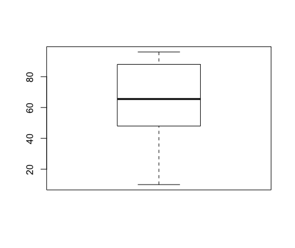

## R 소개 

### 1. 데이터 분석 도구의 현황

####  가. R의 탄생

- R은 오픈소스  프로그램, **통계 • 데이터마이닝**과 **그래프**를 위한 언어이다. 
- 다양한  **최신 통계분석**과 **마이닝 기능**을 제공한다.  
- 세계적으로 **많은 사용자**들이 **다양한 예제**를 공유한다.  
- 다양한 기능을 지원하는 **많은  패키지가 수시로 업데이트** 된다.  
- 1993년 뉴질랜드 University of Auckland, **Ross Inaka 와  Robert Gentleman에 의해 개발된 소프트웨어**  
- 1995년 R은 자유 소프트웨어 재단의 **GNU**(일반 공중 사용  허가서)로 인해 **무료**로 공개


#### 나. 분석도구의 비교

|                               | SAS        | SPSS       | 오픈소스 R             |
| :---------------------------: | ---------- | ---------- | ---------------------- |
|       **프로그램 비용**       | 유료, 고가 | 유료, 고가 | 오픈소스               |
| **설치용량** | 대용량     | 대용량     | 모듈화로 간단          |
| **다양한 모듈 지원 및 비용**  | 별도구매   | 별도구매   | 오픈소스               |
| **최근 알고리즘 및 기술반영** | 느림       | 다소느림   | 매우 빠름              |
|  **학습자료 입수의 편의성**   | 유료 도서  | 유료 도서  | 공개 논문 및 자료 많음 |
| **질의를 위한 공개 커뮤니티** | NA         | NA         | 매우 활발              |


####  다. R의 특징

#####  1) 오픈소스 프로그램

- 사용자 커뮤니티에  도움 요청이 쉽다.
- 많은 패키지가 수시로 업데이트  된다. 
- 특정 분석 기법을 사용하기위해, 분석에 필요한 과정들을 수행할 수 있는 함수가 패키지에 포함되어 있다.

##### 2) 그래픽 및 성능

- 프로그래밍이나 그래픽  측면등 대부분의 주요 특징들에서 상용 프로그램과 대등하거나 월등하다.
- 고해상도 이미지 생산가능, 처리 시간이 매우 빠름, 분석과정 뿐만 아니라 보고서 작성이나 발표 자료 작성에도 유용

##### 3) 시스템 데이터 저장  방식  

- 각  세션 사이마다 시스템에 데이터셋을 저장하므로 매번  데이터를 로딩할 필요가 없고  명령어 스토리도  저장 가능하다. 

##### 4) 모든 운영체제

- 윈도우, 맥, 리눅스 운영체제에서 사용 가능

##### 5) 표준 플랫폼

- S통계 언어를 기반으로 구현
- R/S 플랫폼은 통계전문가들의 사실상 표준 플랫폼이다. 

##### 6) 객체지향언어이며 함수언어

- 통계 기능뿐만 아니라 일반 프로그래밍 언어처럼 자동화거나 새로운 함수를 생성하며 사용가능

  

```R
# 패키지를 설치한 후 패키지를 R 콘솔에 불러 온다. 
> install.packages("패키지 이름") 

# 패키지를 설치 ""의 유무가 다르므로 유의해야한다.
> librarry(패키지 이름)

# 다양한 함수들과 옵션에 대한 상세한 도움말 
> ?par 
> help( par )
```


### 2. R의 데이터 구조 

##### 1) 벡터 

- 벡터 데이터 구조는 **하나의 스칼라값** 혹은 **하나 이상의 스칼라 원소**들을 갖는 단순한 형태의 집합
- 벡터 데이터 내에 들어갈 수 있는 원소는 **숫자, 문자, 논리연산자** 등이 될 수 있다. 
- 명령어 `c` 를 이용해 선언한다. **concentration(연결)**을 의미한다.

```R
# 숫자형 벡터 
> x = c(1, 10 , 24, 40)

# 문자형 벡터 
> y = c("사과", "바나나", "오렌지")

# 논리 연산자 벡터 
> z = c(TRUE, FALSE, TRUE)
> z <- c(TRUE, FALSE, TRUE)

# 벡터와 벡터의 결합 
> xy <- c(x,  y)
> xy

[1] "1" "10" "24" "40" "사과" "바나나" "오렌지"
```

- <u>논리 연산자 벡터를 숫자형 벡터처럼 사용하는 경우 자동적으로 **'TRUE'는 1의 값을 할당** 받으며 '**FALSE'는 0의 값을 할당**</u>받는다. 
- 합치는 벡터에 <u>문자형 벡터가 포함되면 합쳐진 벡터는 문자형 벡터가</u> 된다. 


##### 2) 행렬 (matrix)


[[이미지 출처 위키피디아]](https://simple.wikipedia.org/wiki/Matrix_(mathematics))


- 행과 열을 갖는 `m x n` 형태의 직사각형에 데이터를 나열한 데이터 구조
- 행렬 선언을 위해 명령어 **`matrix`** 를 사용한다. 
- <u>기본적으로 값들은 **열을 우선으로 채우는 방향**으로 입력</u>된다. 
- **행을 우선으로 채우는 방향**을 원하면 **`byrow=T`**  옵션을 추가하면 된다. 


```r
> mx = matrix(c(1,2,3,4,5,6), ncol=2)
> mx
     [,1] [,2]
[1,]    1    4
[2,]    2    5
[3,]    3    6

```


> **rbind, cbind**

- 명령어  `rbind`와 `cbind`를 사용해 이미 만들어져 있는 벡터를 서로 합쳐 행렬을 만들 수도 있다. 
- **rbind**의 r 은 'row' - 기존 행렬에 **행을 추가하는 형태로 데이터 결합**한다. 
- **cbind** c는 'column' - 기존 행렬에 **열을 추가하는 형태로 데이터 결합**


```R
> mx
     [,1] [,2]
[1,]    1    4
[2,]    2    5
[3,]    3    6
> 
> r1=c(10, 10)
> c1=c(20, 20, 20)
> 
> rbind(mx, r1)
   [,1] [,2]
      1    4
      2    5
      3    6
r1   10   10
> 
> cbind(mx, c1)
         c1
[1,] 1 4 20
[2,] 2 5 20
[3,] 3 6 20

```


##### 3) [리스트 (list)](https://kookmindna.tistory.com/6)

- 각 요소 마다 벡터나 행렬을 한꺼번에 취급할 수 있는 형식 
- 복수의 벡터나 행렬을 하나의 리스트에 정리하여 보존할 수 있다. 
- 함수 `list()` 를 이용하여 작성한다. 
- 데이터 참조용 이름을 부여할 수 있다. 

```R
# list 생성 방법 list()

> x <- list("name", "adc",100, TRUE)
> x
[[1]]
[1] "name"

[[2]]
[1] "adc"

[[3]]
[1] 100

[[4]]
[1] TRUE

# 각각의 리스트에 이름을 지어줄 수 있습니다.

> b <- list(name = "Gunhee", gender = "F", number = 100, person = TRUE)
> b
$name
[1] "Gunhee"

$gender
[1] "F"

$number
[1] 100

$person
[1] TRUE

# name()함수를 통해서도 가능 

> names(x) <- c("name","gender","number","person")
> x
$name
[1] "name"

$gender
[1] "adc"

$number
[1] 100

$person
[1] TRUE

# 리스트 값 호출 

> b$gender
[1] "F"

> b[[4]]
[1] TRUE
```


[R의 데이터 셋 (구조)[이미지 출처 kookmindnablog]](https://kookmindna.tistory.com/6)


##### 4) 데이터 프레임 (data.frame)

- 행렬과 유사한 2차원 목록 데이터 구조
- 데이터 프레임의 리스트의 원소는 벡터 또는 요인이다. 
- 한번에 많은 정보를 담을 수 있어 R에서 가장 널리 사용
- <u>행렬과 다르게 각 `열`에 서로 다른 데이터 타입을 가질 수 있다.</u> 
- `data.frame`을 이용하면 여러 개의 벡터를 하나의 데이터 프레임으로 합쳐 입력 할 수 있다. 


```R
> income = c(100, 200, 150, 300, 900)
> car =  c("kia", "hyundai", "kia", "toyota", "lexus")
> marriage = c(FALSE, FALSE, FALSE, TRUE, TRUE)
> 
> mydat = data.frame(income, car, marriage)
> mydat
  income     car marriage
1    100     kia    FALSE
2    200 hyundai    FALSE
3    150     kia    FALSE
4    300  toyota     TRUE
5    900   lexus     TRUE

```


##### 5) 그 밖의 데이터 구조들 

- **단일값 (Scalars)** :

  - 스칼라란 단일 차원의 값을 뜻하며, 길이가 1인 벡터와 같은 동일하다. 
  - 구성인자가 하나인 벡터를 말한다. 
  - 스칼라는 정수, 부동소수, 문자열, 논리값(TRUE, T, FALSE, F), NA, NULL 의 데이터타입을 갖는다. 
    - NA = 결측값 (값이 없음)
    - NULL =undefined(미정)

  - [R에서 결측지 정제하기](https://rpubs.com/jmhome/R_data_processing)


- **배열 (Araays)** : 

  - 행렬에 3차원 또는 n차원까지 확장된 상태 
  - 주어진 벡터에 더 많은 차원을 부여하여 배열을 생성 

  ```R
  > d <- array(1:16, dim=c(2,2,2))
  > 
  > e <- array(1:16, dim=c(2,3,2))
  > d
  , , 1
  
       [,1] [,2]
  [1,]    1    3
  [2,]    2    4
  
  , , 2
  
       [,1] [,2]
  [1,]    5    7
  [2,]    6    8
  
  > e
  , , 1
  
       [,1] [,2] [,3]
  [1,]    1    3    5
  [2,]    2    4    6
  
  , , 2
  
       [,1] [,2] [,3]
  [1,]    7    9   11
  [2,]    8   10   12
  
  ```

- **요인 (Factor)**:

  - 팩터는 범주형(categorical) 데이터 자료를 표현하기 위한 데이터 타입
  - 범주형 데이터는 혈액성(A, AB, B, 0), 성별(Female, Male), 성적(A, B, C, D, E)와 같은 데이터 형을 의미합니다.
  - R에서 벡터에 있는 고유값(unique value)의 정보를 얻어내는데, 이 고유값들을 요인의 수준이라고 한다. 
  - `factor()` 함수사용해 생성 가능

  ```R
  > blood.type <-factor(c("A","B","AB","O"))
  > blood.type[5]<-"D"
  Warning message:
  In `[<-.factor`(`*tmp*`, 5, value = "D") :
    invalid factor level, NA generated
  > blood.type
  [1] A    B    AB   O    <NA>
  Levels: A AB B O
  >
  ```

  

### 3. R의 기초

##### 1)  수열 생성 

```R
# 첫 번째 인수를 두 번째 인수만큼 반복하는 숫자 벡터를 생성
> rep (1,3)
[1] 1 1 1

# 첫 인수부터 두 번째 인수까지 1씩 증가하는 수열의 숫자 벡터를 생성
> seq (1,3)
[1] 1 2 3

> 1:4
[1] 1 2 3 4

# by=n,  n 씩 증가하는 수열을 생성 
> seq(1, 11, by=2)
[1]  1  3  5  7  9 11

#  lenght=m , 전체 수열의 개수가 m 개가 되도록 자동적으로 증가하는 수열 생성 
> seq(1, 11, length=6)
[1]  1  3  5  7  9 11

> seq(1, 11, length=8)
[1]  1.000000  2.428571  3.857143  5.285714
[5]  6.714286  8.142857  9.571429 11.000000

# 연속 증가하는 seq 함수 형태를 인수로 사용해 다음과 같은 수열 생성 
> rep(2:5, 3)
 [1] 2 3 4 5 2 3 4 5 2 3 4 5

```


##### 2) 기초적인 수치  계산 

- 다양한 형태의 수치 계산을 위한 함수와 명령어가 있다. 
- 벡터와 벡터간의 사칙연산을 수행하는 경우 연산되는 벡터들의 길이가 같아야 한다. 

```R
> a
 [1]  1  2  3  4  5  6  7  8  9 10
> 
> a+a
 [1]  2  4  6  8 10 12 14 16 18 20
> 
> a-a
 [1] 0 0 0 0 0 0 0 0 0 0
> 
> a*a
 [1]   1   4   9  16  25  36  49  64  81 100
> 
> a/a
 [1] 1 1 1 1 1 1 1 1 1 1
```


- R 은 기본적으로 열벡터(column vector)가 만들어 진다. 

- `t ` 명령어를 통해 주어진 행렬의 전치행렬(transpose matrix)을 구할 수 있다.

- `%*% `통해 두 행렬 사이의 행렬 곱을 실행할 수 있다. 

  

```R
> a  =  c(2,7,3)
> 
> a
[1] 2 7 3
> 

# 전치행렬(transpose matrix)
> t(a)
     [,1] [,2] [,3]
[1,]    2    7    3
> 

# 행렬 곱 
> A  = a%*%t(a)
> 
> A
     [,1] [,2] [,3]
[1,]    4   14    6
[2,]   14   49   21
[3,]    6   21    9
```


##### 3) 벡터의 기초 통계 

```R
> d <- c(1,2,3,4,5,6,7,8,9,10)
> 
> mean(d[1:5]) # 변수 평균 
[1] 3
> 
> sum(d) # 변수 합계 
[1] 55
> 
> sum(2*d) # 합계 x 2  
[1] 110
> 
> v1 <- median(d) #변수의 중앙값 산출 
> v1
[1] 5.5
>
> length(d) # 변수 길이 값  
[1] 10
> 
> max(d)# 변수 최대값 
[1] 10
> 
> min(d)# 변수 최소값
[1] 1
> 
> sort(d) # 올림차순 정렬
 [1]  1  2  3  4  5  6  7  8  9 10
> 
> sort(d, decreasing = FALSE) # 올림차순 정렬
 [1]  1  2  3  4  5  6  7  8  9 10
> 
> sort(d, decreasing = TRUE) # 내림차순 정렬
 [1] 10  9  8  7  6  5  4  3  2  1
> 
> log(d) # 변수 로그 값
 [1] 0.0000000 0.6931472 1.0986123 1.3862944
 [5] 1.6094379 1.7917595 1.9459101 2.0794415
 [9] 2.1972246 2.3025851
> 
> sd(d) # 변수 표준편차 
[1] 3.02765
> 
> var(d) # 분산산출 
[1] 9.166667

> summary(a) # 주어진 벡터에 대해 사분위수와  최소값 최대값, 중앙값, 평균을 계산할 수 있다. 
   Min. 1st Qu.  Median    Mean 3rd Qu. 
    2.0     2.5     3.0     4.0     5.0 
   Max. 
    7.0 

# 벡터의 원소 선택 하기 

> q
[1] "1" "2" "3" "4" "5" "m" "c" "d"
> q[3]
[1] "3"
> q[-3]
[1] "1" "2" "4" "5" "m" "c" "d"

# 벡터의 연산 

> q[[3]]  # 인덱스
[1] "3"

# 요소 뽑아 내기 

> x <- 1:5; coef(lm(c(1:3, 7, 6) ~ x))
(Intercept)           x 
       -0.7         1.5 
> 
> f=c(1:3,7,6)
> 
> j=lm(c(1:3,7,6) ~ x)
> 
> x
[1] 1 2 3 4 5
> f
[1] 1 2 3 7 6
> j

Call:
lm(formula = c(1:3, 7, 6) ~ x)

Coefficients:
(Intercept)            x  
       -0.7          1.5  

```


##### 4) 반복 구문, 조건문 

>  **for 반복 구문** 

```R

> a = c() # 아무 값도 포함되지 않은 a벡터 선언 
> for (i in 1:9)  {
+   a[i] = i * i
+ }
> 
> a
[1]  1  4  9 16 25 36 49 64 81

```

- for 반복 구문은 괄호 안의 조건 하에 i값을 하나씩 증가시켜가며 중괄호 {} 안의 구문을 반복실행 하도록 한다. 


```R
> isum = 0 
> for (i in 1:100) {
+   isum = isum +  i
+ }
> 
> cat("1부터 100까지 합=", isum, "입니다.", "\n")
1부터 100까지 합= 5050 입니다. 

```


> **while 반복 구문** 

```R
> x=1  
> while  (x<5) {
+   x=x+1
+   print(x)
+ }
[1] 2
[1] 3
[1] 4
[1] 5
```

- 괄호안의 조건이 만족되어 있는 동안 중괄호 안의 구문을 반복한다. 


> **사용자 정의 함수** 


- R 함수는 **‘function’** 키워드를 사용하여 생성합니다.

  

```R
# 괄호 안의 x,y,x는 (인수)argument로 사용된다. 

function_name <- function(arg_1, arg_2, ...) {

  함수본문

}


> new.function <- function(a) {
+   for(i in 1:a) {
+     b <- i^2
+     print(b)
+   }
+ }
> 
> new.function(6)
[1] 1
[1] 4
[1] 9
[1] 16
[1] 25
[1] 36
> 
```


##### 5)  기타 유용한 기능들 

> **paste**

```R
> # 문자 붙이기 
> 
>  A<- paste("a","b","c", sep = "-")
>  
>  B<- paste(A,c("e","f"))
>  
>  C<- paste(A,10, sep="&")  # seq 인자에 지정한 구분자로 연결함 
>  
>  A
[1] "a-b-c"
>  B
[1] "a-b-c e" "a-b-c f"
>  C
[1] "a-b-c&10"
 
```

- 입력받은 문자열을 하나로 붙여 준다. 
- 구분자를 삽입할 수 있다. 
- 더 알기 쉽게 출력하도록 할 있다. 


> **substr**

```
> # 문자열 추출 
>  substr("Bigdataanalysis", 1,4)  
[1] "Bigd"
```

-  substr("문자열", 시작점, 끝점) 문자열 특정부분추출가능 


##### 6) 자료형 데이터 구조 변환 

- R에서 객체는 다양한 형태를 가질 수 있다. 
- **문자형 변수, 실수형 변수, 논리 연산자, Factor, 데이터 프레임** 

- 데이터 구조를 다른 구조로 바꾸고자 할때 다음 같은 함수를 사용해 변환 가능

```R
as.data.frame(x)  # 데이터 프레임 형식으로 변환
as.list(x) # 리스트 형식으로 변환
as.matrix # 행렬 형식으로 변환
as.vector  # 벡터 형식으로 변환 
as.factor # 팩터 형식으로 변환 
```


###### 예시1 > 

```R
# 3.14 실수형 벡터를 함수를 이용해 강제로 정수형 벡터로 변경 
> as.integer(3.14)
[1] 3
> 
# "foo"라는 문자형 데이터를 수치형 벡터로 강제 변환 
# 숫자형 벡터에 포함 할 수 없어서 결측지인 'Na' 가 출력되면서 경고 
> as.numeric("foo")
[1] NA
Warning message:
NAs introduced by coercion 
```


###### 예시2> 

```R
# 수치형 -> 문자형
> as.character(101)
[1] "101"

# 논리형인 TRUE 와 FALSE를 수치형으로 변환
# FALSE = 0
# TRUE = 1

> as.numeric(FALSE)
[1] 0
> 
> as.logical(0.45)
[1] TRUE
> 
```


###### 예시3>

- 데이터 프레임을 행렬로 변환 
- **문자형 데이터**만 저장되는 행렬로 변환 

````R
> mydat
  income     car marriage
1    100     kia    FALSE
2    200 hyundai    FALSE
3    150     kia    FALSE
4    300  toyota     TRUE
5    900   lexus     TRUE
> 
> as.matrix(mydat)
     income car       marriage
[1,] "100"  "kia"     "FALSE" 
[2,] "200"  "hyundai" "FALSE" 
[3,] "150"  "kia"     "FALSE" 
[4,] "300"  "toyota"  "TRUE"  
[5,] "900"  "lexus"   "TRUE"  
> 
````


##### 7) 문자열을 날짜로 변화 

- as.Date - 기본적으로 문자열이 yyyy-mm-dd 일거라고 가정 
- 이외 다른 형식을 처리하려면 "format=" 날짜 형식을 지정 

```R
> as.Date("2019-11-19")
[1] "2019-11-19"

> as.Date("01/13/19")
Error in charToDate(x) : 
  character string is not in a standard unambiguous format

> as.Date("01/13/19", format="%m/%d/%y")
[1] "2019-01-13"
```


##### 8) 날짜를 문자열로 변환 

```r
> as.Date("08/13/19",format="%m/%d/%y")
[1] "2019-08-13"

> format(Sys.Date())
[1] "2019-10-19"

> as.character(Sys.Date())
[1] "2019-10-19"

> format(Sys.Date(), format="%m/%d/%y")
[1] "10/19/19"

```


### 4. 외부 데이터 불러오기 

##### 1)  CSV 파일 불러 오기 

- 명령어 - **read.table**

- `header=  T`   - CSV 파일의 첫 줄을 변수명으로 지정할 수 있다. 

- `sep=','`  -  데이터가 쉼표로 구분된 데이터파일(즉, csv)임을 지정해 준다. 

- 파일 경로에 ₩대신, ₩₩ 를 사용하는 것에 유의한다.  `/ ` 를 사용해도 무관하다.

- 유사한 명령어인 `read.csv`를 이용할 수도 있다. 구분자를 명시할 필요 없다. 

  ```R
  data1 <- read.tabel("D:\\DATA\\example.csv", header=T, sep=",")
  ```


##### 2) txt 파일 불러 오기 

```R
data2 <- read.table("D:\\DATA\\example.txt")
```


### 5. R 그래프 


##### 1. 산점도 그래프 

- x변수와 y변수의 값을 한눈에 살펴볼 수 있도록 평면에 점을 찍어 표현
- 옵션을 통해 기준선을 추가하는 등 부가적인 기능 사용가능 

```R
# 산점도 그래프 

height = c(170, 168, 174, 175, 188, 165, 165, 190, 173, 168, 159, 170, 184, 155, 165)
weight = c(68, 65, 74, 77, 92, 63, 67, 95, 72, 69, 60, 69, 73, 56, 55)
plot(height,weight)
```


##### 2. 산점도 행렬 

- 여러 변수들에 대해 각각의 산점도를 살펴볼 수 있도록 확장된 산점도 행렬 
- paris 명령어를 통해 그릴 수 있다. 
- `main = ` 그래프의 제목 
- `pch=` 그래프 상에 찍히는 점의 모양 변경 
- `bg=` iris 데이터의 Species에 따라 다른 색상을 부여했다. 


```R
> paris(iris[1:4]), main = "Anderson's Iris Data -- 3 species", pch = 21, bg = c("red", "green3", "blue")[unclass(iris$Species)])
```


#####  3. 히스토그램, 상자그림 

- 탐색적 자료 분석에서 자료 분포를 손쉽게 확인 하는 방법 
- `hist` 함수 사용 
- 기본적으로 세로축(Y축)에 도수를 표기한다. 
- `prob=T` 상대도수를 표시하도록 변경
- `boxplot` 상자그림 출력 


```R
> StatScore
 [1] 88 90 78 68 50 48 33 70 48 66 88 96 79 65 27 88 96 33 64 48 77 18 26 44
[25] 48 68 77 64 88 95 79 88 49 30 29 10 49 88
> hist(StatScore, prob=T)
> boxplot(StatScore)
```


