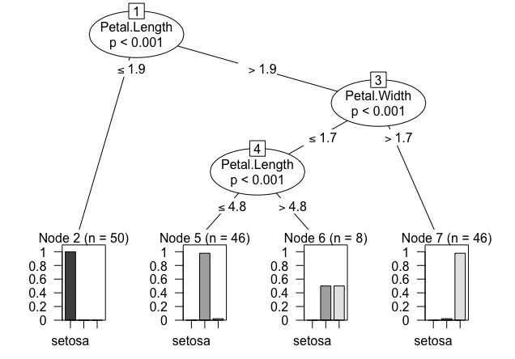
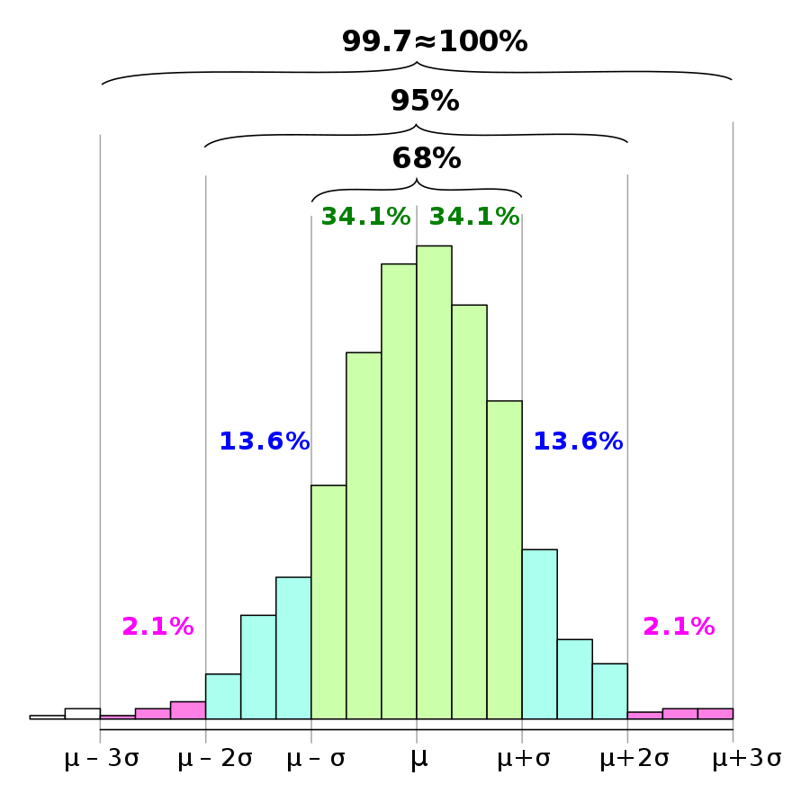
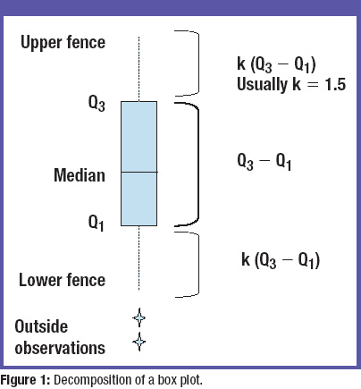

## 3장 데이터 마트 

### 1절.  데이터 변경 및 요약 


#### - 데이터 마트(Data mart)

- **데이터 웨어 하우스**(DW)와 **사용자 사이의 중간 층에 위치**, 하나의 주제 또는 하나의 부서 중심의 데이터 웨어하우스

- 데이터의 한 부분 으로서 특정 사용자가 관심을 갖는 데이터들을 담은 비교적 작은 규모의 데이터 웨어하우스 
- 데이터 마트의 구축은 성공정인 분석을 위한 데이터 전처리 및 유용한 속성들을 생성하는 과정으로 매우 중요.
- 일반적인 데이터베이스 형태로 갖고 있는 다양한 정보를 사용자의 욕 항목에 따라 체계적으로 분석하여 기업의 경영 활동을 돕기 위한 시스템을 말한다. 
- 분석 전에 데이터를 정제하고, 검증하고 파생변수, 요약 변수를 생성하는 과정이 분석의 성공 여부에 많은 영향을 끼친다. 그러므로 데이터 마트를 어떻게 구축하느냐에 따라 분석 효과는 크게 차이 난다. 

#### - 요약변수 (Summary Variables)

- 수집된 정보를 **분석에 맞게 종합한 변수**

- 데이터마트에서 가장 기본적인 변수, **총 구매 금액, 금액, 횟수, 구매 여부등 데이터 분석 위해 만들어지는 변수**

- 많은 모델에 공통으로 사용될 수 있어 **재활용성이 높다**.

- 합계, 횟수와 같이 간단한 구조여서 자동화프로그램으로 구축가능하다.

- 단점은 기준값을 정확히 정의해 두지 않으면 데이터를 다르게 해석할 수 있다. 그런 경우 연속형 변수를 그룹핑해서 보는 것이 좋다.

  

| 기간별 구매 금액/횟수 | 고객의 구매패턴 식별                                         |
| --------------------- | ------------------------------------------------------------ |
| 위클리 쇼퍼           | 구매시기를 통해 고객의 특성을 추정                           |
| 상품별 구매금액/횟수  | 고객의 라이프스테이지/라이프스타일 등을 이해                 |
| 상품별 구매순서       | 고객에 대한 이해/해석력을 높일 수 있다.                      |
| 유통채널별 구매금액   | 온/오프라인 고객의 구매를 유도                               |
| 단어 빈도             | 텍스트자료에서 단어들의 출현 빈도를 데이터화하여 사용        |
| 초기 행동변수         | 고객 가입/첫거래 초기 1개월간 거래패턴 > 1년후 어떤 행동?    |
| 트렌드변수            | 추이값을 나타내는 변수                                       |
| 결측값과 이상값 처리  | 결측값과 이상값을 무리해서 처리하려고 하면 시간과 위험이 커진다. |
| 연속형 변수의 구간화  | 분석 후 적용 단계를 고려한 데이터 분석을 위해 연력이나 비용 등<br /> 연속형 변수를 구간화 하는 것이 필요하다.<br /> 의미있는 구간으로 구간화 한다. |

#### - 파생변수 (Derived Variables)

- 사용자(분석자)가 **특정 조건을 만족**하거나 **특정 함수에 의해 값을 만들어 의미를 부여한 변수**이다. 
- **주관적일 수 있으므로 변수 생성에 대한 논리적 타당성과 기준을 갖추어 개발**해야 한다. 
- **세분화, 고객행동 예측, 캠페인 반응 예측**에 매우 잘 활용된다. 
- 파생변수는 특정 상황에만 유의미하지 않게 대표성을 나타나게 할 필요가 있다. 

| 근무시간 구매지수    | 근무시간대에 거래가 발생하는 비율을 산출                     |
| -------------------- | ------------------------------------------------------------ |
| 주 구매 매장 변수    | 고객의 주거래 매장을 예측                                    |
| 주 활동 지역 변수    | 고객의 정보/거래내용 통해 주 활동지역을 예측                 |
| 주 구매 상품 변수    | 상품 추천에 활용(1순위상품 구매>2순위상품 구매유도)          |
| 구매상품 다양성 변수 | 고객의 구매성향 파악                                         |
| 선호하는 가격대 변수 | 주로 패션분야에 중요하게 적용                                |
| 시즌 선호고객 변수   | 의미 있게 생각하는 날 > 소비증가 : 패턴 파악하기             |
| 라이프스테이지 변수  | 고객의 라이프스테이지 예측 > 행동 이해 > 니즈 파악           |
| 라이프 스타일 변수   | 고객의 라이프스타일을 보고 상품구매를 유도                   |
| 행사민감 변수        | 행사의 여부에 따른 구매 패턴을 파악                          |
| 휴면가망 변수        | 취향/관심사 변화, 경쟁사 선호 등을 파악해 사전 대응에 활용   |
| 최대가치 변수        | 고객의 가치를 판단 하여 어느 정도 판매 가능한지 예측에 활용  |
| 최적 통화 시간       | 콜센터에 전화가 걸려온 시간 고객의 직업등을 고려한<br /> 고객의 통화가능시간대 예측 |


#### 1. R.reshape를 활용한 데이터 마트 개발 

<span style="color:red"> *** cast와 melt 함수의 R코딩방식은 시험에 자주 나온다.</span> 

>  **Reshape -** 데이터 재정렬을 위한 기법의 하나이다. 

- R에는 다양한 방식의 reshape을 수행할 수 있는 명령어들이 여럿 존재한다. 

- 변수를 조합해 변수명을 만들고 변수들을 시간, 상품 등의 차원에 결합해 다양한 용약변수와 파생변수를 쉽게 생성하여 데이터마트를 구성할 수 있게 한다. 

  

####  'reshape'패키지

```R
# "reshape" 패키지 인스톨 하기 
> install.packages("reshape")
trying URL 'https://cran.rstudio.com/bin/macosx/el-capitan/contrib/3.6/reshape_0.8.8.tgz'
Content type 'application/x-gzip' length 172673 bytes (168 KB)
==================================================
downloaded 168 KB


The downloaded binary packages are in
	/var/folders/xt/l08wsh7x12z0w_46zt03fkcw0000gp/T//RtmpmvYt20/downloaded_packages

# 인스톨한 패키지 불러오기 
library("reshape")

# 데이터 불러오기 
data("airquality")

# 데이터 앞부분 일부분만 보기 
> head(airquality)
  Ozone Solar.R Wind Temp Month Day
1    41     190  7.4   67     5   1
2    36     118  8.0   72     5   2
3    12     149 12.6   74     5   3
4    18     313 11.5   62     5   4
5    NA      NA 14.3   56     5   5
6    28      NA 14.9   66     5   6

# 데이터의 개수를 정할 수 있다. 
> head(airquality, 10)
   Ozone Solar.R Wind Temp Month Day
1     41     190  7.4   67     5   1
2     36     118  8.0   72     5   2
3     12     149 12.6   74     5   3
4     18     313 11.5   62     5   4
5     NA      NA 14.3   56     5   5
6     28      NA 14.9   66     5   6
7     23     299  8.6   65     5   7
8     19      99 13.8   59     5   8
9      8      19 20.1   61     5   9
10    NA     194  8.6   69     5  10

# 변수명 확인 
> names(airquality)
[1] "Ozone"   "Solar.R" "Wind"    "Temp"    "Month"   "Day"  

# 변수의 대문자를 소문자로 바꾸기 
> names(airquality) = tolower(names(airquality))
> names(airquality)
[1] "ozone"   "solar.r" "wind"    "temp"    "month"   "day"  
```


#### - reshape 패키지의 주기능 `melt `

- id에 있는 변수를 기준으로 하여 나머지 각 변수를 variable 이란 이름의 데이터로 만든다. 
- 원래 변수들의 값을 이 value에 저장해 모든 데이터를 표준형식으로 변환한다. 
- 결측값을(missing data) 제거하는 옵션인, na.rm을 "TRUE"로 설정한다.


```R
> aqm = melt(airquality, id=c("month","day"), na.rm=TRUE)
> aqm
    month day variable value
1       5   1    ozone    41
2       5   2    ozone    36
3       5   3    ozone    12
4       5   4    ozone    18
5       5   6    ozone    28
6       5   7    ozone    23
7       5   8    ozone    19
8       5   9    ozone     8
9       5  11    ozone     7
10      5  12    ozone    16
```


#### - cast를 이용해 엑셀의 피펏팅과 같은 자료 변환

- melt된 aqm을 이용해 "~"를 y, x축의 dimension과 measure에  해당되는 변수값을 표시한다.
- 특별히 변수 종류를 선정하지 않았으므로 모든 변수에 대해 분리해 ozone, silar.r 과 같이 표시한다.
- 데이터를 원하는 형태로 계산 또는 변형 시켜주는 함수 


```R
> a<- cast(aqm, day ~ month ~ variable)
> a
, , variable = ozone

    month
day    5  6   7   8  9
  1   41 NA 135  39 96
  2   36 NA  49   9 78
  3   12 NA  32  16 73
  4   18 NA  NA  78 91
  5   NA NA  64  35 47
  6   28 NA  40  66 32
  7   23 29  77 122 20
  8   19 NA  97  89 23
  9    8 71  97 110 21
  10  NA 39  85  NA 24
  11   7 NA  NA  NA 44
  12  16 NA  10  44 21
  13  11 23  27  28 28
  14  14 NA  NA  65  9
  15  18 NA   7  NA 13
  16  14 21  48  22 46
  17  34 37  35  59 18
  18   6 20  61  23 13
  19  30 12  79  31 24
  20  11 13  63  44 16
  21   1 NA  16  21 13
  22  11 NA  NA   9 23
  23   4 NA  NA  NA 36
  24  32 NA  80  45  7
  25  NA NA 108 168 14
  26  NA NA  20  73 30
  27  NA NA  52  NA NA
  28  23 NA  82  76 14
  29  45 NA  50 118 18
  30 115 NA  64  84 20
  31  37 NA  59  85 NA

, , variable = solar.r

    month
day    5   6   7   8   9
  1  190 286 269  83 167
  2  118 287 248  24 197
  3  149 242 236  77 183
  4  313 186 101  NA 189
  5   NA 220 175  NA  95
  6   NA 264 314  NA  92
  7  299 127 276 255 252
  8   99 273 267 229 220
  9   19 291 272 207 230
  10 194 323 175 222 259
  11  NA 259 139 137 236
  12 256 250 264 192 259
  13 290 148 175 273 238
  14 274 332 291 157  24
  15  65 322  48  64 112
  16 334 191 260  71 237
  17 307 284 274  51 224
  18  78  37 285 115  27
  19 322 120 187 244 238
  20  44 137 220 190 201
  21   8 150   7 259 238
  22 320  59 258  36  14
  23  25  91 295 255 139
  24  92 250 294 212  49
  25  66 135 223 238  20
  26 266 127  81 215 193
  27  NA  47  82 153 145
  28  13  98 213 203 191
  29 252  31 275 225 131
  30 223 138 253 237 223
  31 279  NA 254 188  NA

, , variable = wind

    month
day     5    6    7    8    9
  1   7.4  8.6  4.1  6.9  6.9
  2   8.0  9.7  9.2 13.8  5.1
  3  12.6 16.1  9.2  7.4  2.8
  4  11.5  9.2 10.9  6.9  4.6
  5  14.3  8.6  4.6  7.4  7.4
  6  14.9 14.3 10.9  4.6 15.5
  7   8.6  9.7  5.1  4.0 10.9
  8  13.8  6.9  6.3 10.3 10.3
  9  20.1 13.8  5.7  8.0 10.9
  10  8.6 11.5  7.4  8.6  9.7
  11  6.9 10.9  8.6 11.5 14.9
  12  9.7  9.2 14.3 11.5 15.5
  13  9.2  8.0 14.9 11.5  6.3
  14 10.9 13.8 14.9  9.7 10.9
  15 13.2 11.5 14.3 11.5 11.5
  16 11.5 14.9  6.9 10.3  6.9
  17 12.0 20.7 10.3  6.3 13.8
  18 18.4  9.2  6.3  7.4 10.3
  19 11.5 11.5  5.1 10.9 10.3
  20  9.7 10.3 11.5 10.3  8.0
  21  9.7  6.3  6.9 15.5 12.6
  22 16.6  1.7  9.7 14.3  9.2
  23  9.7  4.6 11.5 12.6 10.3
  24 12.0  6.3  8.6  9.7 10.3
  25 16.6  8.0  8.0  3.4 16.6
  26 14.9  8.0  8.6  8.0  6.9
  27  8.0 10.3 12.0  5.7 13.2
  28 12.0 11.5  7.4  9.7 14.3
  29 14.9 14.9  7.4  2.3  8.0
  30  5.7  8.0  7.4  6.3 11.5
  31  7.4   NA  9.2  6.3   NA

, , variable = temp

    month
day   5  6  7  8  9
  1  67 78 84 81 91
  2  72 74 85 81 92
  3  74 67 81 82 93
  4  62 84 84 86 93
  5  56 85 83 85 87
  6  66 79 83 87 84
  7  65 82 88 89 80
  8  59 87 92 90 78
  9  61 90 92 90 75
  10 69 87 89 92 73
  11 74 93 82 86 81
  12 69 92 73 86 76
  13 66 82 81 82 77
  14 68 80 91 80 71
  15 58 79 80 79 71
  16 64 77 81 77 78
  17 66 72 82 79 67
  18 57 65 84 76 76
  19 68 73 87 78 68
  20 62 76 85 78 82
  21 59 77 74 77 64
  22 73 76 81 72 71
  23 61 76 82 75 81
  24 61 76 86 79 69
  25 57 75 85 81 63
  26 58 78 82 86 70
  27 57 73 86 88 77
  28 67 80 88 97 75
  29 81 77 86 94 76
  30 79 83 83 96 68
  31 76 NA 81 94 NA


```


- ##### y축은 month , x 축은 variable 인데 "," 로 구분한 다음,  mean 함수를 적용했다. 

```R

> b<- cast(aqm, month ~ variable, mean)
> b
  month    ozone  solar.r      wind
1     5 23.61538 181.2963 11.622581
2     6 29.44444 190.1667 10.266667
3     7 59.11538 216.4839  8.941935
4     8 59.96154 171.8571  8.793548
5     9 31.44828 167.4333 10.180000
      temp
1 65.54839
2 79.10000
3 83.90323
4 83.96774
5 76.90000
> 
```


#### 2. sqldf를 이용한 데이터 분석 

- `sqldf`는 R에서 sql명령어를 사용 가능하게 해주는 패키지이다. 
- SAS에서 proc sql 과 같은 역할을 하는 패키지이다. 

```R
# sql 명령어 select * form [data frame]
# R 명령어 
sqldf("select * from [data frame]")

# sql 명령어 select * form [data frame] numrows 10
# R 명령어 
sqldf("select * from [data frame] limit 10")

# sql 명령어 select * form [data frame] where [col] = 'char'
# R 명령어 
sqldf("select * from [data frame] where [col] like 'char%' ")


# head([df])
sqldf("select * from [df] limit 6")

# subset([df], [col] %in% c("BF", "HF"))
sqldf("select * from [df] where [col] in('BF', 'HF')")

# rbind([df1],[df2])
sqldf("select * from [df1] union all select * from [df2]")

# merge([df1],[df2])
sqldf("select * frem [df1], [df2]")

# df[order[df]$[col], decreasing=T,]
sqldf("select * from [df] order by [col] desc")
```

- **iris 데이터를 활용한 예시 **

```R
> install.packages("sqldf")
.
> library(sqldf)
..
> sqldf("select * from iris")
    Sepal.Length Sepal.Width Petal.Length
1            5.1         3.5          1.4
2            4.9         3.0          1.4
3            4.7         3.2          1.3
4            4.6         3.1          1.5
5            5.0         3.6          1.4
6            5.4         3.9          1.7

...

> sqldf('SELECT * FROM iris WHERE Species="setosa" AND "Sepal.Length" > 5.5')
  Sepal.Length Sepal.Width Petal.Length
1          5.8         4.0          1.2
2          5.7         4.4          1.5
3          5.7         3.8          1.7
  Petal.Width Species
1         0.2  setosa
2         0.4  setosa
3         0.3  setosa

> sqldf('SELECT Species, COUNT(*) FROM iris GROUP BY Species')
     Species COUNT(*)
1     setosa       50
2 versicolor       50
3  virginica       50

> sqldf('SELECT Species, COUNT(*) AS N, AVG("Sepal.Width") AS SL 
+       FROM iris GROUP BY Species')
     Species  N    SL
1     setosa 50 3.428
2 versicolor 50 2.770
3  virginica 50 2.974

```


#### 3. [plyr을 이용한 데이터 분석](https://goodtogreate.tistory.com/entry/Plyr-package를-이용한-데이터-변환)

​    [[GOOD to GREAT 블로그  Plyr package (데이터 조작) 내용 참조](https://goodtogreate.tistory.com/)]


- `plyr`은 apply 함수에 기반해 데이터와 출력변수를 동시에 배열로 치환하여 처리하는 패키지 
- `split  `  - `apply` - ` combine` : 데이터를 분리하고 처리한 다음, 다시 결합하는 등 필수적인 데이터 처리 기능을 제공한다. 

```R
install.packages("plyr")
library(plyr)
```


##### 가)  Plyr 함수 

|                    | array | data frame | list  | nothing |
| ------------------ | ----- | ---------- | ----- | ------- |
| array              | aaply | adply      | alply | a_ply   |
| data frame         | daply | ddply      | dlply | d_ply   |
| list               | laply | ldply      | llply | l_ply   |
| n replicates       | raply | rdply      | rlply | r_ply   |
| function arguments | maply | mdply      | mlply | m_ply   |

- 유용한 함수: `adply()`, `ddply()`, `mdply()`
  유용한 유틸리티 함수: `transform()`, `mutate()`, `summarise()`, `subset()`


##### 나) Adply() 

- `Adply()`는 배열(a)를 받아 데이터 프레임(d)을 반환하는 함수이다. 
  입력이 반드시 배열일 필요는 없고 숫자 색인으로 접근 가능 하기만 하면된다.
  따라서 데이터 프레임도 입력으로 사용이 가능하다.

```R
# iris 원래 데이터 
> iris 
    Sepal.Length Sepal.Width Petal.Length Petal.Width    Species
1            5.1         3.5          1.4         0.2     setosa
2            4.9         3.0          1.4         0.2     setosa
3            4.7         3.2          1.3         0.2     setosa
4            4.6         3.1          1.5         0.2     setosa
5            5.0         3.6          1.4         0.2     setosa
6            5.4         3.9          1.7         0.4     setosa
7            4.6         3.4          1.4         0.3     setosa
8            5.0         3.4          1.5         0.2     setosa
9            4.4         2.9          1.4         0.2     setosa
10           4.9         3.1          1.5         0.1     setosa

# iris데이터의 1행 Sepal.Length 5보다 같거나 큰것과 
# Species가 "setosa" 인것을 TRUE 값으로 분류했다.   

> adply(iris, 1 , function(row){
  row$Sepal.Length >= 5.0 & row$Species == "setosa"})

    Sepal.Length Sepal.Width Petal.Length Petal.Width    Species    V1
1            5.1         3.5          1.4         0.2     setosa  TRUE
2            4.9         3.0          1.4         0.2     setosa FALSE
3            4.7         3.2          1.3         0.2     setosa FALSE
4            4.6         3.1          1.5         0.2     setosa FALSE
5            5.0         3.6          1.4         0.2     setosa  TRUE
6            5.4         3.9          1.7         0.4     setosa  TRUE
7            4.6         3.4          1.4         0.3     setosa FALSE
8            5.0         3.4          1.5         0.2     setosa  TRUE
9            4.4         2.9          1.4         0.2     setosa FALSE
10           4.9         3.1          1.5         0.1     setosa FALSE
11           5.4         3.7          1.5         0.2     setosa  TRUE
12           4.8         3.4          1.6         0.2     setosa FALSE
13           4.8         3.0          1.4         0.1     setosa FALSE
14           4.3         3.0          1.1         0.1     setosa FALSE
15           5.8         4.0          1.2         0.2     setosa  TRUE
```


##### 다) Ddply()

- `ddply()`는 데이터 프레임(d)을 입력으로 받아 데이터 프레임(d)을 내보내는 함수 이다.

- `adply()`와 `ddply()`의 가장 큰 차이점이라면 `adply()`는 행 또는 컬럼 단위로 함수를 적용하는 반면`ddply()`는 `.variables`에 나열한 컬럼에 따라 데이터를 나눈 뒤 함수를 적용한다는 점이다.


```R
# .() 안에 컬럼으로 데이터를 묶은 다음에  function(sub)를 적용한다. 
# 데이터 프레임 컬럼 이름은 sepal.width.mean 이며 , 각 Species에 대해서 묶고
# 그것들의 Sepal.width의 평균을 구하는 코드이다. 

> ddply(iris, .(Species), function(sub){data.frame(sepal.width.mean = mean(sub$Sepal.Width))})
     Species sepal.width.mean
1     setosa            3.428
2 versicolor            2.770
3  virginica            2.974
> 
```


#### 4. 데이터 테이블 (Data table)

​	[[황군 블로그 참조]](https://using.tistory.com/81)

- `data.table` 패키지는 R에서 가장 많이 사용하는 데이터 핸들링 패키지 
- `data.table` 은 큰 데이터를 탐색, 연산, 병합 하는데 아주 유용하다. 
- 기존 `data.frame` 방식보다 월등히 빠른 속도이다. 
- 특정 column을 key 값으로 색인을 지정한 후 데이터를 처리한다. 
- 빠른 그룹핑 ordering, 짧은 문장 지원 측면에서 데이터 프레임보다 유용하다. (속도차 크다.)

- data.table은 data.frames를 확장하는 패키지이다.
- 가장 주목할만한 기능 중 두 가지는 **속도**와 **청결한 구문**이다.

```R
> install.packages("data.table")
> library(data.table)

> DF <- data.frame(x = runif(2.6e+07), y = rep(LETTERS, each = 10000)) 
> df <- data.frame(x = runif(2.6e+07), y = rep(letters, each = 10000)) 
> system.time(x <- DF[DF$y == "C", ])
  user  system elapsed 
  3.59    0.18    3.76

> DT <- as.data.table(DF) setkey(DT, y) 
> system.time(x <- DT[J("C"), ])
> user system elapsed 
  0.04  0.00  0.03

```


### 2절. 데이터 가공 

#### 1. Data Exploration

##### 가. 개요 

- 데이터 분석을 위한 구성된 데이터의 변수들의 상태를 파악한다. 

##### 나. 종류 

- `head()`, `tail()`  - 시작 또는 마지막 6개의 record만 조회하는 함수 

```R
> head(iris)
  Sepal.Length Sepal.Width Petal.Length Petal.Width Species
1          5.1         3.5          1.4         0.2  setosa
2          4.9         3.0          1.4         0.2  setosa
3          4.7         3.2          1.3         0.2  setosa
4          4.6         3.1          1.5         0.2  setosa
5          5.0         3.6          1.4         0.2  setosa
6          5.4         3.9          1.7         0.4  setosa

> tail(iris)
    Sepal.Length Sepal.Width Petal.Length Petal.Width   Species
145          6.7         3.3          5.7         2.5 virginica
146          6.7         3.0          5.2         2.3 virginica
147          6.3         2.5          5.0         1.9 virginica
148          6.5         3.0          5.2         2.0 virginica
149          6.2         3.4          5.4         2.3 virginica
150          5.9         3.0          5.1         1.8 virginica
>
```


- **Summary 함수** ; `summary()` 

  - **수치형 변수** : **최대값(Max), 최소값(Min), 평균(mean), 1사분위수(1sd Qu), 2사분위수(2sd Qu, 중앙값), 3사분위수(3rd Qu), 중위수(Median)**

  - **명목형변수** : 명목값, 데이터 개수 

  

```R
> require(ggplot2)
> data("diamonds")
> dia.data <- diamonds

> head(dia.data)
# A tibble: 6 x 10
  carat cut       color clarity depth table price     x     y     z
  <dbl> <ord>     <ord> <ord>   <dbl> <dbl> <int> <dbl> <dbl> <dbl>
1 0.23  Ideal     E     SI2      61.5    55   326  3.95  3.98  2.43
2 0.21  Premium   E     SI1      59.8    61   326  3.89  3.84  2.31
3 0.23  Good      E     VS1      56.9    65   327  4.05  4.07  2.31
4 0.290 Premium   I     VS2      62.4    58   334  4.2   4.23  2.63
5 0.31  Good      J     SI2      63.3    58   335  4.34  4.35  2.75
6 0.24  Very Good J     VVS2     62.8    57   336  3.94  3.96  2.48
                                                                                              
> summary(dia.data)
     carat               cut        color        clarity          depth      
 Min.   :0.2000   Fair     : 1610   D: 6775   SI1    :13065   Min.   :43.00  
 1st Qu.:0.4000   Good     : 4906   E: 9797   VS2    :12258   1st Qu.:61.00  
 Median :0.7000   Very Good:12082   F: 9542   SI2    : 9194   Median :61.80  
 Mean   :0.7979   Premium  :13791   G:11292   VS1    : 8171   Mean   :61.75  
 3rd Qu.:1.0400   Ideal    :21551   H: 8304   VVS2   : 5066   3rd Qu.:62.50  
 Max.   :5.0100                     I: 5422   VVS1   : 3655   Max.   :79.00  
                                    J: 2808   (Other): 2531                  
     table           price             x                y                z         
 Min.   :43.00   Min.   :  326   Min.   : 0.000   Min.   : 0.000   Min.   : 0.000  
 1st Qu.:56.00   1st Qu.:  950   1st Qu.: 4.710   1st Qu.: 4.720   1st Qu.: 2.910  
 Median :57.00   Median : 2401   Median : 5.700   Median : 5.710   Median : 3.530  
 Mean   :57.46   Mean   : 3933   Mean   : 5.731   Mean   : 5.735   Mean   : 3.539  
 3rd Qu.:59.00   3rd Qu.: 5324   3rd Qu.: 6.540   3rd Qu.: 6.540   3rd Qu.: 4.040  
 Max.   :95.00   Max.   :18823   Max.   :10.740   Max.   :58.900   Max.   :31.800  
                                                                                   
> 
```


#### 2. 변수 중요도 

[[참고 블로그 - 변수의 중요도 구간화 결측지 처리 ]](https://woosa7.github.io/R-변수의-구간화-결측값-처리/)


##### 가. 개요 

- 변수 선택법과 유사한 개념으로 모형을 생성하여 사용된 변수의 중요도를 살피는 과정이다. 

##### 나. 종류 

- `klaR 패키지 `
  - 특정 변수가 주어졌을 때 틀래스가 어떻게 분류되는지에 대한 에러율을 계산해주고, 그래픽으로 결과를 보여주는 기능을 한다. 
  - `greedy.wilks()` : 세분화를 위한 stepwise forward 변수 선택을 위한 패키지, 종속변수에 가장 영향력을 미치는 변수를 `wilks lambda`를 활용하여 변수의 중요도를 정리 
  - `wilks lambda` = 집단내분산/총분산 , 종속변수에 미치는 영향력에 따라 변수의 중요도를 정리 (작을수록 적합)

```R
# klaR 패키지 불러오기 

> library(klaR)
Loading required package: MASS

# "B3" West German Business Cycles 1955-1994

> data("B3")
> head(B3)
       PHASEN BSP91JW CP91JW DEFRATE
1955,4      2   10.53   9.31    0.05
1956,1      2   10.60  12.66    0.06
1956,2      3    9.21   6.55    0.05
1956,3      3    5.17   7.87    0.05
1956,4      3    4.93   8.60    0.04
1957,1      3    8.39   5.62    0.04
       EWAJW EXIMRATE GM1JW IAU91JW
1955,4   5.7     3.08 11.15   23.56
1956,1   5.2     1.96 11.03   12.72
1956,2   4.8     2.82 10.04   11.52
1956,3   3.3     3.74  8.33    0.85
1956,4   2.1     4.16  7.69   -2.08
1957,1   3.2     2.90  6.62   -3.76
       IB91JW LSTKJW PBSPJW PCPJW
1955,4  14.69   3.00   2.89  1.91
1956,1  24.95   2.36   2.59  2.20
1956,2  14.90   3.39   3.01  3.09
1956,3   7.55   5.30   3.03  2.08
1956,4   3.23   6.91   3.46  1.48
1957,1  14.58   1.03   1.95  1.65
       ZINSK ZINSLR
1955,4  6.27   3.21
1956,1  4.60   3.54
1956,2  6.19   3.22
1956,3  6.71   3.37
1956,4  7.10   3.14
1957,1  4.96   4.95

> str(B3)
'data.frame':	157 obs. of  14 variables:
 $ PHASEN  : Factor w/ 4 levels "1","2","3","4": 2 2 3 3 3 3 3 3 3 3 ...
 $ BSP91JW : num  10.53 10.6 9.21 5.17 4.93 ...
 $ CP91JW  : num  9.31 12.66 6.55 7.87 8.6 ...
 $ DEFRATE : num  0.05 0.06 0.05 0.05 0.04 0.04 0.04 0.03 0.03 0 ...
 $ EWAJW   : num  5.7 5.2 4.8 3.3 2.1 3.2 2.5 2.7 3 0.3 ...
 $ EXIMRATE: num  3.08 1.96 2.82 3.74 4.16 2.9 3.65 4.57 4.37 2.89 ...
 $ GM1JW   : num  11.15 11.03 10.04 8.33 7.69 ...
 $ IAU91JW : num  23.56 12.72 11.52 0.85 -2.08 ...
 $ IB91JW  : num  14.69 24.95 14.9 7.55 3.23 ...
 $ LSTKJW  : num  3 2.36 3.39 5.3 6.91 1.03 3.73 6.2 4.12 7.94 ...
 $ PBSPJW  : num  2.89 2.59 3.01 3.03 3.46 1.95 3.18 3.98 3.29 5.63 ...
 $ PCPJW   : num  1.91 2.2 3.09 2.08 1.48 1.65 1.47 3.29 3.59 4.19 ...
 $ ZINSK   : num  6.27 4.6 6.19 6.71 7.1 4.96 5.21 4.83 4.5 3.83 ...
 $ ZINSLR  : num  3.21 3.54 3.22 3.37 3.14 4.95 3.82 3.09 3.91 1.47 ...


# AIC 이용한 변수 선택법 : PHASEN이 범주형 변수이므로 사용할 수 없음.
# step(model, direction = "both")

# Wilks.lambda : 집단내 분산 / 총분산
# 종속변수에 미치는 영향력에 따라 변수의 중요도를 정리 (작을수록 적합)

> greedy.wilks(PHASEN ~ ., data = B3, niveau = 0.1)
Formula containing included variables: 

PHASEN ~ EWAJW + LSTKJW + ZINSK + CP91JW + IAU91JW + PBSPJW + 
    ZINSLR + PCPJW
<environment: 0x7f924c705770>


Values calculated in each step of the selection procedure: 

     vars Wilks.lambda F.statistics.overall p.value.overall F.statistics.diff
1   EWAJW    0.6058201             33.18341    1.405358e-16         33.183411
2  LSTKJW    0.4271561             26.85606    1.218146e-25         21.192038
3   ZINSK    0.3614525             21.20584    7.607587e-29          9.149422
4  CP91JW    0.3002868             19.05337    1.153881e-32         10.184539
5 IAU91JW    0.2624925             17.11094    6.597858e-35          7.151127
6  PBSPJW    0.2451025             14.99388    3.695840e-35          3.500196
7  ZINSLR    0.2205325             13.94619    1.442943e-36          5.459204
8   PCPJW    0.1999847             13.10739    9.454573e-38          5.000333
  p.value.diff
1 1.405358e-16
2 1.554268e-11
3 1.326989e-05
4 3.783582e-06
5 1.604993e-04
6 1.708972e-02
7 1.379166e-03
8 2.486333e-03

# 13개 변수 중에 8개 선택됨
# PHASEN ~ EWAJW + LSTKJW + ZINSK + CP91JW + IAU91JW + PBSPJW + ZINSLR + PCPJW
```


#### 3. 변수의 구간화 

##### 가. 개요 

- 연속형 변수를 분석 목적에 맞게 활용하기 위해 구간화하여 모델링에 적용한다. 
- 일반적으로 10진수 단위로 구간화 하지만 구간을 5개로 나누는 것이 보통, 7개 이상의 구간은 잘 만들지 않는다. 

- 신용평가모형, 고객 세분화와 같은 시스템에서 모형에 활용하는 각 변수들을 구간화해서 구간별로 점수를 적용하는 스코어링 방식으로 많이 활용되고 있다. 

##### 나. 구간화 방법 

- 가. **Binning** - [[visual binning program]](http://www.unige.ch/ses/sococ/cl/spss/trans/visband.html)
  - 각각 동일한 갯수의 데이터를 50개 이하의 구간에 할당한 후 구간을 병합하면서 구간을 줄여나가는 방식
  - 신용평가모형의 개발에서 연속형변수(부채비율등)를 범주형 변수로 구간화 하는데 자주 활용되고 있는 방법이다. 

```R
# 한 변수를 기준으로 구간 분석
> iris2 <- iris[ , c(1,3,5)]
> head(iris2)
  Sepal.Length Petal.Length Species
1          5.1          1.4  setosa
2          4.9          1.4  setosa
3          4.7          1.3  setosa
4          4.6          1.5  setosa
5          5.0          1.4  setosa
6          5.4          1.7  setosa
> plineplot(Species ~ ., data = iris2, method = "lda", x = iris[ , 4], xlab = "Petal.Width")
[1] 0.03333333

```


- 나. **의사결정나무** 
  - 연속형 데이터의 구간을 나누는 분기점을 찾을 수 있다.
  - 세분화 또는 예측에 활용되는 의사결정나무 모형을 사용하여 입력변수들을 구간화 할 수 있다. 
  - 의사결정나무에서는 동일한 변수를 여러 번의 분리기준으로 사용이 가능하기 때문에 연속 변수가 반복적으로 선택될 경우 각각의 분리 기준값으로 연속형 변수를 구간화할 수 있다

```R
# 의사결정나무 패키지 인스톨하기 / 불러오기 
> install.packages("party")
> library(party)
> library(party)
> m <- ctree(Species ~ ., data = iris)
> m

	 Conditional inference tree with 4 terminal nodes

Response:  Species 
Inputs:  Sepal.Length, Sepal.Width, Petal.Length, Petal.Width 
Number of observations:  150 

1) Petal.Length <= 1.9; criterion = 1, statistic = 140.264
  2)*  weights = 50 
1) Petal.Length > 1.9
  3) Petal.Width <= 1.7; criterion = 1, statistic = 67.894
    4) Petal.Length <= 4.8; criterion = 0.999, statistic = 13.865
      5)*  weights = 46 
    4) Petal.Length > 4.8
      6)*  weights = 8 
  3) Petal.Width > 1.7
    7)*  weights = 46 
> plot(m)
```

 




### 3절.  기초 분석 및 데이터 관리 

#### 1. 데이터 EDA(탐색적 자료 분석)

- 데이터의 분석에 앞서 전체적으로 데이터의 특징을 파악하고 데이터를 다양한 각도로 접근한다. 

- `summary()`를 통해 데이터의 기초 통계량을 확인한다. 

  - `summary`는 R의 대표적인 기술통계 함수입니다. min(최소값), Meadian(중앙값), Mean(평균값), 3rd Qu(3분위 값), max(최대값)을 단하나의 명령으로 빠르게 계산해 줍니다.

    

```R
> summary(dia.data)
     carat               cut        color        clarity          depth      
 Min.   :0.2000   Fair     : 1610   D: 6775   SI1    :13065   Min.   :43.00  
 1st Qu.:0.4000   Good     : 4906   E: 9797   VS2    :12258   1st Qu.:61.00  
 Median :0.7000   Very Good:12082   F: 9542   SI2    : 9194   Median :61.80  
 Mean   :0.7979   Premium  :13791   G:11292   VS1    : 8171   Mean   :61.75  
 3rd Qu.:1.0400   Ideal    :21551   H: 8304   VVS2   : 5066   3rd Qu.:62.50  
 Max.   :5.0100                     I: 5422   VVS1   : 3655   Max.   :79.00  
                                    J: 2808   (Other): 2531                  
     table           price             x                y                z         
 Min.   :43.00   Min.   :  326   Min.   : 0.000   Min.   : 0.000   Min.   : 0.000  
 1st Qu.:56.00   1st Qu.:  950   1st Qu.: 4.710   1st Qu.: 4.720   1st Qu.: 2.910  
 Median :57.00   Median : 2401   Median : 5.700   Median : 5.710   Median : 3.530  
 Mean   :57.46   Mean   : 3933   Mean   : 5.731   Mean   : 5.735   Mean   : 3.539  
 3rd Qu.:59.00   3rd Qu.: 5324   3rd Qu.: 6.540   3rd Qu.: 6.540   3rd Qu.: 4.040  
 Max.   :95.00   Max.   :18823   Max.   :10.740   Max.   :58.900   Max.   :31.800  
                                                                                   
> 
```


#### 2. 결측값 인식 

- 결측값은 `Na` , 9999999, '   ' (공백), Unknown, Not Answer 등으로 표현되는 것 결측값을 처리하기 위해서 시간을 많이 사용하는 것은 비효율적이다. 
- 결측값 자체의 의미가 있는 경우도 있는데 예를 들면 쇼핑몰 가입자 중 특정 거래 자체가 존재하지 않는 경우
- 인구통계학적 데이터(damographic data)에서 아주 부자이거나 아주 가난한 경우 자신의 정보를 자 채워 넣지 않기 때문에 가입자의 특성을 유추해 활용할 수 있다. 
- 결측값 처리는 전체 작업속도에 많은 영향을 준다. 

``` R
# NA 결측갑이 있는 자료의 평균 구하기 
# na.rm을 이용해 NA를 제거 후 평균을 구한다. 

> x <- c(1,2,3,NA)
> mean(x)
[1] NA

> mean(x, na.rm = T)
[1] 2

```


#### 3. 결측값 처리 방법 

##### 가. 단순 대치법 (Single Imputation)

1. **completes analysis** 
   - 결측값이 존재하는 레코드를 삭제한다. 
2. **평균대치법(Mean Imputation)**
   - 관측 또는 실험을 통해 얻어진 데이터의 평균으로 대치 한다. 
   - 비조건부 평균 대치법: 관측데이터의 평균으로 대치 
   - 조건부 평균 대치법(regression imputation) : 회귀분석을 활용한 대치법 
3. **단순확률 대치법 (Single Stochastic Impitation)**
   - 평균대치법에서 추정량 표준 오차의 과소 추정문제를 보완하고자 고안된 방법으로 
   - Hot-deck방법, nearest neighbor 방법 등이 있다. 


##### 나. 다중 대치법(Multiple Imputation)

- 단순대치법을 한번하지 않고 m번의 대치를 통해 m개의 가상적 완전자료를 만드는 방법이다. 

- 1단계 : 대치 imputation ➞ 2단계 :분석  analysis ➞ 2단계 : 결합 combination 


#### 4. R에서 결측값 처리 

##### 가. 관련 함수 

|        함수         |                             내용                             |
| :-----------------: | :----------------------------------------------------------: |
|  complete.cases()   |     데이터 내에 결측값 있으면 FALSE, 없으면 TRUE로 반환      |
|       is.na()       | 결측값이 NA 인지 체크, 결측값이 있으면 TRUE, 없으면 FALSE로 반환 |
| centralImputation() | DMwR 패키지. NA값에 가운데 (central valu)으로 대치, 숫자는  중위수 또는 요인은  최빈값(factor)으로 대치 |
|   knnImputation()   | NA값을  DMwR 패키지, knn(최근 이웃 ) 분류 알고리즘 사용하요 대치 , k개 주변 이웃까지 거리를 고려하여 가중 편균한 값을 사용 |
|      amelia()       | - time series cross sectional dataset(여러 국가에서 매년 측정된 자료) 을 활용<br /> |
|     rfImpute()      | Random Forest 모델은 결측값 존재시 바로 에러 발생. 이 함수 이용하여 결측값 대치 후 알고리즘 적용. |


#### 5. 이상값 (Outlier) 인식과 처리 

##### 가. 이상값이란? 

- 의도하지 않게 잘못 입력한 경유 (bad data)
- 의도하지 않게 입력되었으나 분석 목적에 부합되지 않아 제거해야하는 경우 
- 의도 하지 않은 현상이지만 분석에 포함해야 하는 경우 
- 의도된 이상값(fraud, 불량) 인 경우
- 평균에 막대한 영향을 미친다.
- 이상값을 꼭 제거해야 하는 것은 아니다, 때문에 분석의 목적이나 종류에 따라 적절한 판단이 필요하다. 


##### 나. 이상값의 인식 방법 

1.  **ESD( Extreme Studentized Deviation)**

   - 평균으로부터 3표준편차 떨어진 값 (각 0.15%)

   

[[출처 위키피디아 ]]([https://en.wikipedia.org/wiki/68%E2%80%9395%E2%80%9399.7_rule](https://en.wikipedia.org/wiki/68–95–99.7_rule))

- 대략 정규 데이터 세트의 경우 평균의 1Q, 1 표준 편차 내의 값이 세트의 약 68 %를 차지합니다.
- 2Q, 2  표준 편차 내에서 약 95 %를 차지하고, 3Q,  3 표준 편차 내에서 약 99.7 %를 차지합니다. 
- 표시된 백분율은 정규 모집단에서 파생 된 경험적 데이터의 근사치에 반올림 된 이론적 확률입니다. 

- 여기서 Χ는 정규 분포 랜덤 변수의 관측 값, μ는 분포의 평균, σ는 표준 편차입니다.

  
  $$
  {Pr(\mu-1\sigma \leq X \leq \mu +1\sigma )\approx 0.6827}\\
  {Pr(\mu-2\sigma \leq X \leq \mu +2\sigma )\approx 0.9545}\\
  {Pr(\mu-3\sigma \leq X \leq \mu +3\sigma )\approx 0.9973}
  $$
  

2. **기하평균 -2.5 x 표준편차 < data < 기하평균 +2.5 x 표준편차**

3. **사분위수 이용하여여 제거하기 (상자 그림의 outer fence 밖에 있는 값 제거 )**

   - 이상값 정의 : Q1-1.5(Q3-Q1) < data < Q3+1.5(Q3-Q1) 를 벗어나는 데이터 

   - 이 outside fence, 외부의 관찰은 잠재적인 이상치로 간주됩니다.

     

[[이미지 출처 ]](http://www.pharmtech.com/review-statistical-outlier-methods?id=&sk=&date=&pageID=2)


##### 다. 극단값 절단 (trimming)방법 

1. 기하평균을 이용한 제거 
   - geo_mean 
2. 하단 , 상단 % 이용한 제거 
   - 10% 절단 (상 하위 5%에 해당되는 데이터 제거 )

##### 라. 극단값 조정 (winsorizing) 방법 

- 상한값과 하한값을 벗어나는 값들을 하안, 상한 값으로 바꾸어 활용하는 방법이다. 


