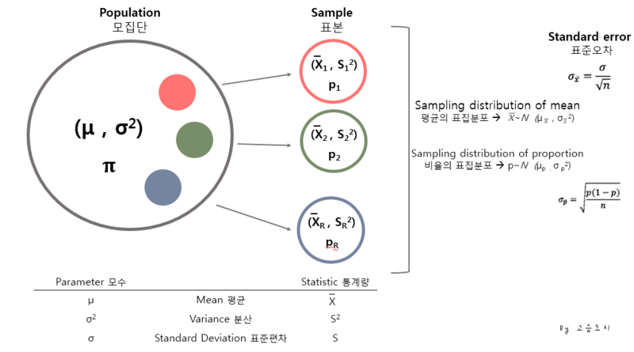
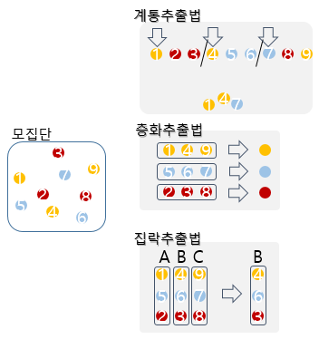
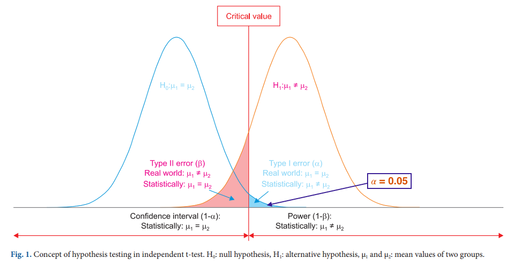

## 4장 통계분석 

### 1절 통계분석의 이해 

#### 1. 통계 

- 특정집단을 대상으로 수행한 조사나 실험을 통해 나온 결과에 대한 요약된 형태의  표현
- 조사 또는 실험을 통해 데이터를 확보, 조사대상에 따라 총조사(census)와 표본조사로 구분한다. 

####  2. 통계자료의 획득 방법

##### 가. 총 조사/전수조사 (census)

- 대상 집단 모두를 조사하는데 많은 비용과 시간이 소요되므로 특별한 경우를 제외하고는 사용되지 않는다. (인구주택 총 조사)

##### 나. 표본조사

- 대부분의 설문조사가 표본조사로 진행되며 모집단에서 샘플을 추출하여 진행하는 조사이다. 

- **모집단(population)**: 조사하고자 하는 대상 집단 전체 

- **원소(element)**: **모집단을 구성하는 개체** 

- **표본(sample)**: 조사하기 위해 추출한 **모집단의 일부 원소** 

- **모수(parameter**): 표본 관측에 의해 구하고자 하는 **모집단에 대한 정보** , 
  모집단의 통계값 _ex.모평균 μ, 모표준편차 σ, 모비율 p

- 모집단의 정의, 표본크기, 조사방법, 조사기간, 표본 추출방법을 정확히 명시해야 한다. 

  

- **Statistic(통계량)** : 표본의 통계값_ ex.표본의 평균 x̄, 표본 표준편차 
- **Standard deviation(표준편차)** :  분산의 제곱근, 통계집단의 변수가 평균을 중심으로 얼마나 퍼져 있는지를 나타내는 대표적인 분포도 지수
- **Sampling distribution of mean(평균의 표집분포)** : 같은 모집단에서  n크기의 표본을 무한 반복하여 뽑아서 추정한 표본 평균값의 분포 
- **Standard error(표준오차)** : 표본평균이 모평균과 얼마나 퍼져 있는지를 나타내는 표준편차 추정치

##### 다. 표본 추출 방법

*** 표본추출법 4가지 방법과  용어를 정확히 알도록 한다. 

- 표본 조사의 중요한 점은 모집단을 대표할 수 있는 표본 추출이므로 표본 추출 방법에 따라 분석결과의 해석은 큰 차이가 발생한다. 
  1. **단순랜덤 추출범(simple random sampling)**
     - 각 샘플에 번호를 부여하여 임의의 n개를 추출하는 방법으로 각 샘플은 선택될 확률이 동일하다. (비복원, 복원(추출한 element를 다시 집어 추출하는 경우) 추출)
  2. **계통 추출법(systematic sampling)**
     - 단순랜덤추출법의 변형된 방식으로 번호를 부여한 생픔을 나열하여 k개씩(K=N/n) n개의 구간으로 나누고 첫 구간(1,2,...,K) 에서 하나를 임의로 선택한 후에 k개씩 띄어서 n개의 표본을 선택한다. 즉, 임의 위치에서 매 k번째 항목을 추출하는 방법이다. 
  3. **집락추출법(cluster random sampling)**
     - 군집을 분류하고 군집별로 단순랜덤 추출법을 수행한 수, 모든 자료를 활용하거나 샘플링 하는 방법이다. (지역표본추출, 다단계표본추출)
  4. **층화추출법(startified sampling)**
     - 이질적인 원소들로 구성된 모집단에서 각 계층을 고루 대표할 수 있도록 표본을 추출하는 방법으로, 유사한 원소끼리 몇 개의 층(stramtum)으로 나누어 각 층에서 랜덤 추출하는 방법이다. 
     - (비례층화추출법, 불비례층화추출법)

#### 라. 측정(measurement)

1. **개요** 

   - 표본조사나 실험을 실시하는 과정에서 추출된 원소들이나 실험 단위로부터 주어진 목적에 적합하도록 관측해 자료를 얻는 것이다. 

     

2. **측정방법**

|              측정 방법              |                             내용                             |                                                              |
| :---------------------------------: | :----------------------------------------------------------: | ------------------------------------------------------------ |
| **명목척도**  (nominal scale)  | **측정 대상이 어느 집단에 속하는지 분류**할 때 사용 (성별, 출생지 구분) | 질적척도  (범주형자료,  숫자들의 크기차이가  계산되지 않는 척도) |
| **순서척도**  (ordinal scale)  | **측정 대상의 서열관계**를 관측하는 척도  (만족도, 선호도, 학년, 신용등급) | 질적척도  (qualitative data)                            |
| **구간척도**  (interval scale) | **측정 대상이 갖고 있는 속성의 양**을 측정하는 것으로  **구간이나 구간 사이**의 간격이 의미가 있는 자료  (온도, 지수) | 양적척도  (수치형자료,  숫자들의 크기 차이를  계산 할 수 있는 척도) |
|  **비율척도**  (ratio scale)   | **간격(차이)에 대한 비율이 의미를 가지는 자료**,  절대적 기준인 0이 존재하고  사칙연산이 가능하며  제일 많은 정보를 가지는 척도  (무게, 나이,연간소득, 제품가격 시간, 거리) | 양적척도  quantitative data                             |

- 서열척도는 명목척도와 달리 매겨진 숫자의 크기를 의미있게 활용할 수 있다. 

  (예: 1등이 2등보다는 성적이 높다.)

- 구간척도는 절대적 크기는 측정할 수 없기 때문에 사칙연산 중 더하기와 빼기는 가능하지만 비율처럼 곱하거나 나누는 것은 불가능하다. 

#### 3. 통계분석 (Statistical Analysis)

##### 가. 정의 

- 특정한 집단이나 **불확실한 현상**을 대상으로 자료를 수집해 대상 집단에 대한 정보를 구하고, 
  **적절한 통계분석 방법을 이용해 의사결정을 하는 과정**이다. 

  

##### 나. 기술통계(descriptive statistics)

- 주어진 자료부터 어떠한 판단이나 예측과 같은 주관이 섞일 수 있는 과정을 배제하여 통계집단들의 여러특성을 수량화하여 객관적인 데이터로 나타내는 통계분석 방법론이다.
- Sample에 대한 특성인 평균, 표준편차, 중위수, 최빈값, 그래프, 왜도, 첨도 등을 구하는 것을 의미한다. 

##### 다. 통계적 추론(추측통계, inference statistics)

- 수집된 자료를 이용해 대상 집단(모집단)에 대한 의사결정을 하는 것으로 sample을 통해 모집단을 추정하는 것을 의미한다. 

1. **모수추정**
   - 표본집단으로부터 **모집단의 특성인 모수 (평균, 분산등) 를 분석**하여 모집단을 추론한다. 
2. **가설검정**
   - 대상집단에 대해 특정한 가설을 설정한 후에 그 가설이 **옳은지 그른지에 대한 채택여부를 결정**하는
     방법론이다. 
3. **예측**
   - 미래의 **불확실성을 해결해 효율적인 의사결정**을 의사결정을 하기 위해 활용한다. 
   - 회귀분석, 시계열분석 등이 방법이 있다. 

#### 4. 확률 및 확률분포 

##### 가. 확률

- ''특정사건이 일어날 가능성의 척도'' 라고 정의할 수 있다. 

- <u>모든 결과들의 집합을 **표본공간** (Sample Space, $\Omega $)</u>이라고 하고 , <u>**사건(event)**란 표본공간의 부분집합</u>을 말한다. 

- 표본공간 $S$ 에 부분집합인 각 사상에 대해 실수값을 가지는 함수의 확률값이 0과 1사이에 있고, 전체 확률의 합이 1인 것을 의미한다. 표본공간 $\Omega $ 의 부분집합인 사건 $E$ 의 확률은 표본공간의 원소의 개수에 대한 사건 $E$ 의 개수의 비율로 확률을 $P(E)$ 라고 할 때, 다음과 같이 정의한다. 

  

$$
P(E) = \frac{n(E)}{n(\Omega)}
$$

- 일반적으로 확률은 표본공간의 부분집합에 실수값을 지정한 것으로 다음과 같은 세 가지 조건을 만족한다. 

  1. 모든 사건 $E$ 의 확률값은 0과 1사이에 있다. 즉,  $ 0 \le  P(E) \le 1$

  2. 전체 집합 $\Omega$ 의 확률은 1이다. 즉,  $P(\Omega)=1$

  3. 서로 배반인 사건들 $E_{1}, E_{2}...$ 의 합집합의 확률은 각 사건들의 확률의 합이다. 
  4. 즉, 배반 사건이란, 교집합이 공집합인 사건들을 말한다.

3. $$
   P( \cup  E_{ n })=\sum _{ n=1 }^{ \infty }{ P(E_{ n } }
   $$

##### 나. 조건부 확률과 독립사건 

- 사건 A가 일어 났다는 가정하의 사건 B의 확률을 **조건부 확률** (conditional provavility)라 한다. 
- 사건 A가 주어졌을 때 **조건부 확률은 $P(B|A)$**와 같이 표시하고, 다음과 같이 정의된다. 

$$
P(B|A)=\frac { P(A\cap B) }{ P(A) }
$$

- 위의 확률은 $P(A)>0$ 일 때만 정의가 된다.
- **독립사건**, 두 사건 $A, B$ 가 

$$
P(A \cap B) = P(A)P(B)
$$

- 를 만족하면, 서로 독립이라고 한다. 
- 두 사건 $A, B$가 독립이면, $P(B|A)=P(B)$ 가 된다. 따라서 사건 $B$의 확률은 $A$가 일어났다는 가정하에서 
  $B$의 조건부 확률과 동일하다.  즉, 사건 $B$의 확률은 사건 $A$가 일어났는지 여부와 상관없이 동일하다. 

##### 다. 확률분포

- 통계분석에서 자료를 수집하고 그 수집된 자료로부터 어떤 정보를 얻고자 하는 경우에는 항상 수집된 자료가 특정한 확률분포를 따른다고 가정한다. 그 분포는 이산형 확률분포와 연속형 확률 변수로 구분할 수 있다. 

- **확률변수(random variable)** 
  - 특정 사건에 대해 실수값을 갖는 변수를 정의한다.
  - 특정사건이 일어날 확률은 그 변수가 특정값을 가질 확률로 표현할 수 있다. 
  - 이와 같이 특정값이 나타날 가능성이 확률적으로 주어지는 변수를 말한다. 
  - **정의역(domain)이 표본공간이고 치역(range)이 실수값(0<y<1)인 함수**이다.

- **이산형 확률변수 (discrete random variable)**
  - 사건의 확률이 그 사건들이 속한 점들의 확률의 합으로 표현할 수 있는 확률변수를 말한다. 
  - 이산형 확률변수는 확률이 0보다 큰 값을 갖는 점들로 확률을 표현할 수 있다.

$$
P(X =x_{i})=p_{i} , i=1 ,2, ...
$$

- - 베르누이 확률분포(Bernoulli distribution), 이항분포(biomial distribution), 기하분포(geometri distribution), 다항분포(multinomial distribution), 포아송분포(Poisson distribution)

- **연속형 확률변수 (continuous random varivble)**

  - <u>사건의 확률이 그 사건 위에서 어떤 $0$보다 큰 값을 갖는 함수의</u> 면적으로 표현 될 수 있는 확률변수를 말한다. 

  - 이 때, 함수 $ f(x)$ 를 확률밀도함수(provavility density function) 라고 한다. 

  - 사건의 확률이 확률밀도함수의 면적으로 표현되므로 한 점에서의 확률은 0이 되고, 
    $0$보다 큰 값을 갖는 사건은 구간에서 확률값이 된다. 

    

  $$
  P(X=x_i, Y=y)=p_{{i}{j}} , i=1, 2, ..., n, j=1, 2, ..., m
  $$

  

  - 균일분포(uniform distribution, 정규분포(normal distribution), 지수분포(exponential) , 정규분포로부터 유도된 t-분포(t-distribution) , $X^{2}$ - 분포($X^{2}$ - distribution), F-분포 (F-distribution) 등이 있다. 

##### 라. 확률변수의 기댓값과 분산

- 확률변수 $X$의 기대값은 다음과 같이 정의 된다. 확률변수 $X$가 확률질량함수  $f(x)$를 갖는 이산형 확률변수인 경우, 
- 그 기댓값은 

$$
E(X) = \sum xf(x)
$$

- 같이 정의되고, $X$ 가 확률밀도함수 $f(x)$를 갖는 연속형 확률변수인 경우에는 

$$
E(X)= \int xf(x)dx
$$

- 와 같이 정의 된다. 
  확률변수의 흩어진 정도를 나타내는 분산과 표준편차는 $X$의 기댓값을 $\mu$ 라 할 때, 다음과 같이 정의 한다. 

$$
\begin{matrix}
{ Var(X)=E(X-\mu )^{ 2 } }\\{ sd(X)= \sqrt {  Var(X)} }
\end{matrix}
$$

##### 마. 백분위수 

- 연속형 확률변수 $X$의 제 $q$ 백분위수 $x_q$ 는 다음의 식을 만족하는 값으로 정의 된다. 

$$
P(X\leq x_q)=q/100
$$

- 여기서 $q$는 0과 100사이의 값이다.

#### 4. 추정과 가설검정 

- 통계적 방법론을 통해 알고자 하는 대상은 모집단의 확률분포이다. 
- 모집단의 확률분포의 특징을 표현하는 값들을 모수(parameter)라고 한다. 
  대표적인 모수의 예는 모집단의 평균, 분산, 표준편차, 백분위수 등이 있다. 
- 모집단에서 추출된 표본을 기반으로 모수들에 대한 통계적 추론을 한다. 
- 통계적 추론은 추정과 가설검정으로 나뉘고, 
- **추정**은 다시 **점추정**과 **구간 추정**으로 나뉜다. 

##### 가. 점추정 (point estimation) 

- 가장 참값이라고 여겨지는 하나의 모수의 값을 택하는 것을 점추정 (point estimation)이라고 한다. 

- '모수가 특정한 값일 것'이라고 추정하는 것이다. 

-  표본의 평균, 중위수 , 최빈값 등을 사용한다. 

  

  - **표본 평균** - 모집단의 평균(모평균) $\mu$ 를 추정하기 위한 추정량(estimator)은 확률표본의 평균값인 표본평균(sample mean)이 대표적이다. 

    

  $$
  \bar { X }=\frac{1}{n}\sum _{i=1}^{ n }{(X_i-\bar{X})^2  }
  $$

  - **표본분산** - 모집단의 분산(모분산)  $σ^2$ 를 추정하기 위한 추정량으로는 표본분산(sample variance)이 대표적이다.

$$
S^2 = \frac{1}{n-1}\sum_{i=1}^{n}{(X_i-\bar{X})^2}
$$

##### 나 . 구간추정 

- 점추정이 정확성을 보완하기 위해 확률로 표현된 믿음을 정도 하에서 **모수가 특정한 구간에 있을것이라고 선언**하는 것이다.

- 일정한 크기의 신뢰수준(confidence level)으로 모수가 특정한 구간에 있을 것이라고 선언하는 것으로, 구해진 구간을 신뢰구간(comgidence interval)이라고 한다. 

- 일반적으로 신뢰수준은 90%, 95%, 99%의 확률을 이용하는 경우가 많다. 

  - 95% 신뢰 수준하에서 모평균의 신뢰 구간 

  - 모분산 $\sigma^2$ 이 알려져 있는 경우 

    

$$
\left ( \bar{X}-1.96 \frac{\sigma}{\sqrt{n}}, \bar{X}+1.96 \frac{\sigma}{\sqrt{n}} \right )
$$

- - 모분산이 $\sigma^2$이 알려져 있지 않은 경우에는 모분산 대신 표본분산을 사용 

    

$$
\left ( \bar{X}-t_{n-1,0.975}\frac{S}{\sqrt{n}}, \bar{X}+t_{n-1,0.975} \frac{S}{\sqrt{n}} \right )
$$

- - 여기서 $t_{n-1,0.975}$ 는 자유도가 $n-1$ 인 t-분포를 따르는 t분포의 97.5 백분위수이다. 

    

- $$
  T= \frac{\bar{X}-\mu}{S/\sqrt{n}}
  $$

##### 다. 가설검정 

- 모집단에 대한 어떤 가설을 설정한 뒤에 표본관찰을 통해 그 가설의 채택 여부를 결정하는 분석방법 
- 표본 관찰 또는 실험을 통해 귀무가설과 대립가설 중에서 하나를 선택하는 과정이다. 
- 검정하고자 하는 모집단의 모수에 대한 가설 설정이다. 
- 귀무가설이 옳다는 전제하에 검정 통계량 값을 구한 후에 이 값이 나타날 가능성이 크기에 의해 귀무가설 채택여부를 결정한다. 

1. **귀무가설 (null hypothesis, $H_0$)**

   - 대립가설과 반대의 증거를 찾기 위해 정한 가설
   - '**'비교하는 값과 차이가 없다. 동일하다''** 를 기본개념으로 하는 가설 

2. **대립가설 (alternative hypothesis, $H_1$)** 

   - 확실하게 증명하고 싶은 가설, **뚜렷한 증거가 있어야 채택**할 수 있는 가설 
   - 혹은 그 결과가 값비싼 가설을 대립가설이라한다.

3. **검정통계량(test statistic, $T(X)$)**

   -  관찰된 표본으로부터 구하는 통계량, 검정 시 가설의 진위를 판단하는 기준

4. **유의수준(significance level, $\alpha $)**

   - 미리 주어진 기준값인 유의수준 보다 작으면 귀무가설이 나올 가능성이 적다고 판단해 귀무가설을 기각한다. 
   - 보통 0.01, 0.005, 0.1중 한 개의 값을 사용한다. 

5. **기각역(ciritical retgion, $C$)**

   - 귀무가설을 기각하는 통계량의 영역

   - 귀무가설이 옳다는 전제하에 구한 검정통계량의 분포에서 확률이 유의수준인 $\alpha$인 부분

**<95% 신뢰구간에서 실험 $(1-\alpha)=0.95$>**   

|    귀무가설 $(H_0): \mu_{1}=\mu_{2}$     | T통계량  | P-value  |
| :--------------------------------------: | :------: | -------- |
| **대립가설** $(H_0): \mu_{1}\neq\mu_{2}$ | (10.248) | (0.0001) |

**<1종오류와 2종오류 >**

|                         | $H_0$가 사실이라고 판정 | $H_0$가 사실이 아니라고 판정 |
| ----------------------- | ----------------------- | ---------------------------- |
| **$H_0$가 사실임**      | 옳은 결정               | 제 1종오류 $(\alpha)$        |
| **$H_0$가 사실이 아님** | 제 2종오류 $(\beta)$    | 옳은 결정                    |

- **1종 오류**(type I error) - 귀무가설$H0$이 옳은데도 귀무가설$H0$ 을기각하게 되는 오류  

- **2종 오류**(type II error) - 귀무가설$H0$ 가 옳지 않은데도 귀무가설$H0$ 을 채택하게 되는 오류 

- 두 가지 오류는 서로 상충관계가 있어서 일반적으로 가설검정에서는 제 1종 오류 $\alpha$ 의 크기를 

  0.1, 00.5, 0.01등으로 고정시킨 뒤 제 2종 오류 $\beta$ 가 최소가 되도록 기각역을 설정한다.

##### 라. 비모수 검정 

- 통계적 검정에서 모집단의 모수에 대한 검정에는 모수적 방법(parametric method)과 비모수적 방법(nonoparameteric method)이 있다. 
- **모수적 검정 방법** 
  - 검정하고자 하는 모집단의 분포에 대한 가정을 하고, 그 가정하에서 검정통계량과 검정 통계량의 분포를 유도해 검정을 실시하는 방법이다. 

- **비모수적 검정 방법** 

  - 자료가 추출된 모집단의 분포에 대해 아무 제약을 가하지 않고 검정을 실시하는 검정방법
  - 관측된 자료가 특정 분포를 따른다고 가정할 수 없는 경우에 이용된다. 

  - 관측된 자료의 수가 많지 않거나 (30개미만) 자로가 개체간의 서열관계를 나타내는 경유에 이용한다.

**<비모수 검정과 모수 검정의 차이점>**

- **가설의 설정**
  - 모수적 검정에서는 가정된 분포의 모수 (모평균$\mu$, 모비율 $p$ 모분산 $\sigma^{2}$ 등)에 대해 가설을 설정한다.
  - 비모수 검정에서는 **가정된 분포가 없으므로** 가설은 단지 '분포의 형태가 동일하다', 또는 '분포의 형태가 동일하지 않다.' 와 같은 **분포의 평태에 대해 설정**한다. 

- **검정 방법** 
  - 모수적 검정에서는 관측된 자료를 이용해 구한 **표본평균$\bar{X}$ , 표본분산$S^{2}$** 등을 이용해 검정을 실시한다.
  - 비모수 검정에서는 관측값의 절대적인 크기에 의존하지 않는 **관측값들의 순위(rank)**나 **두 관측값 차이의 부호** 등을 이용해 검정한다. 
- **비모수 검정의 예** 
  - 부호검정(sign test), 월콕슨의 순위합검정(rank sum test), 윌콕슨의 부호순위합검정(signed rank test), 만-위트니의 U검정, 런검정(run test), 스피어만의 순위상관계수 