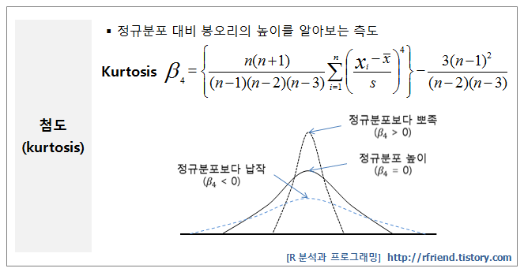
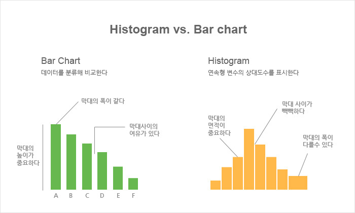
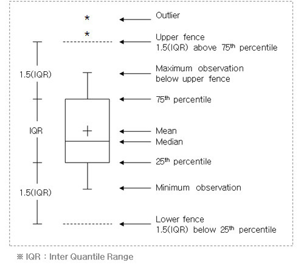
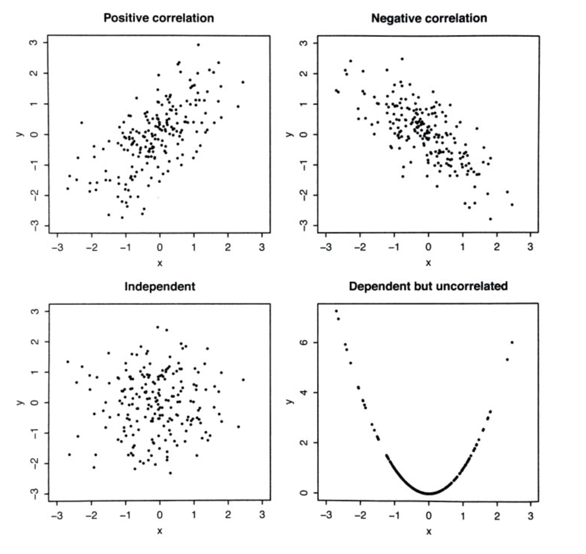
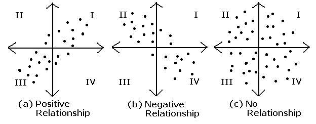

## 4.통계분석 

### 2절. 기초 통계 분석

#### 1. 기술통계 (Descriptive Statistics)

#### 가. 기술통계의 정의

- 자료를 요약하는 기초적 통계를 의미한다. 
- 데이터 분석에 앞서 데이터의 대략적인 토계적 수치를 계산해 봄으로써 데이터에 대한 대략적인 이해와 
  앞으로 분석에 대한 통찰력을 얻기에 유리하다. 
- 본격적인 데이터 분석에 앞서 데이터의 기술통계를 구해 보아야 한다. 

####  

```R
# summary 함수 
# 데이터의 각 컬럼에 대해 볼 수 있다. 
# mean(평균), median(중앙값), sd(표준편차), var(분산), quantile(백분위수), min(최소값), max(최대값), 
# 데이터의 특정 컬럼을 선택할 떄는 "dataname%cloumn명" 

> summary(iris)
  Sepal.Length    Sepal.Width     Petal.Length    Petal.Width          Species  
 Min.   :4.300   Min.   :2.000   Min.   :1.000   Min.   :0.100   setosa    :50  
 1st Qu.:5.100   1st Qu.:2.800   1st Qu.:1.600   1st Qu.:0.300   versicolor:50  
 Median :5.800   Median :3.000   Median :4.350   Median :1.300   virginica :50  
 Mean   :5.843   Mean   :3.057   Mean   :3.758   Mean   :1.199                  
 3rd Qu.:6.400   3rd Qu.:3.300   3rd Qu.:5.100   3rd Qu.:1.800                  
 Max.   :7.900   Max.   :4.400   Max.   :6.900   Max.   :2.500                  
>

> sd(iris$Sepal.Length) # 표준편차 
[1] 0.8280661
> quantile(iris$Sepal.Length, 1/4) # 1사분위수 
25% 
5.1 
> quantile(iris$Sepal.Length, 3/4) # 3사분위수
75% 
6.4 

```


#### 나. 통계량에 의한 자료 정리 

##### 1) 중심위치의 측도

- 자료 (data) :
  $$
  X_1, X_2, ...., X_n
  $$
  

- **표본평균(sample mean) :** 
  $$
  \bar{X}= \frac{1}{n}(x_1+x_2+...+x_3) = \sum_{i=1}^{n}\frac{X_i}{n}
  $$
  

- **중앙값(meadian)** : 자료를 크기순으로 나열할 때 중앙에 위치하는 자료값

  

$$
\frac{(n+1)}{2}
$$

$$
 n이 홀수 인 경우:::   \frac{(n+1)}{2}  
\\
n이 짝수인 경우::: \frac{(n)}{2} 번째값 과 \frac{n}{2}+1 번째 값의 평균
$$

##### 2) 산포의 측도 

- 대표적인 산포도(dispersion)는 분산, 표준편차, 범위 및 사분위수 범위

1. **분산 (variance)** 

   - 편차는 음수와 0, 양수가 섞여 있다. 편차의 평균으로는 산포도를 알 수 없다. 

   -  편차 제곱의 평균, 편차를 전부 다 제곱해서 더한 다음 편차(변량)의 개수로 나눈다.

   $$
   S^2 = \frac{1}{n-1}\sum_{i=1}^{n}(X_i-\bar{X} )^2 = \frac{ 1}{n-1}(\sum_{i=1}^{n}X_{i}^{2}-n\bar{X}^2)
   $$

   

2. **표준편차(standard deviation)**

   - 분산에 제곱근을 씌운 것, 양수인데 0이 될 수도 있다. 

   - 변량의 평균 -> 편차 -> 분산 -> 표준편차 

   $$
   S = \sqrt{S^2} = \sqrt{\frac{1}{n-1}\sum_{i=1}^{n}(X_{i} - \bar{X}^2)}
   $$

   

3. **사분위수범위(interquartle range)**
   - IQR=Q3-Q1


4. **사분위수** 

   - 제 1사분위수(Q1)= 25백분위수, 1/4
   - 제 2사분위수(Q2)=50백분위수, 1/2
   - 제 3사분위수(Q3)=75백분위수, 3/4

5. **백분위수 (percentile)**
   $$
   \frac{(n-1)p}{100+1} 번쨰 값
   $$
   

6. **변동계수(coefficient of variation)**
   $$
   V=\frac{ S}{\bar{X}}
   $$

7. **평균의 표준오차** 

$$
SE(X)=\frac{S}{\sqrt{n}}
$$

##### 3) [분포의 형태에 관한 측도](https://rfriend.tistory.com/123) 

1. **왜도(skewness) : skewness()**  - 분포의 비대칭 정도를 나타내는 측도이다.

$$
m_3 = E\left [ (\frac{X-\mu}{\sigma})^3 \right ] = \frac{\mu_3}{\sigma^3}
$$


[[이미지 참고 R분석과 프로그래밍]](https://rfriend.tistory.com/123)


- **(β3 > 0)**

  오른쪽으로 꼬리가 긴 분포 (right-skewed distribution)

  왜도 점수가 '0'보다 크며 

- **((β3 < 0)**

  왼쪽으로 꼬리가 긴 분포(left-skewed distribution)

  왜도 점수가 '0'보다 작습니다. 

- 기본적으로 관측값에서 평균을 뺀 값을 세제곱한 후에 더했기 때문입니다.


2. **첨도 (kurtosis) : kurtosis()** 

- 분포의 중심에서 표쪽한 정도를 나타내는 측도 이다.

- 첨도(kurtosis)는 정규분포 대비 봉오리의 높이를 알아보는 측도입니다. 
- 첨도가 '0'보다 크면 (β4 > 0) 정규분포보다 뾰족하다는 의미
- 첨도가 '0'보다 작으면 (β4 < 0) 정규분포보다 납작하다는 뜻
- 첨도(kurtosis, β4)는 데이터가 이봉분포(two mountaintop distribution)에 대해서 
  얼마나 단봉분포(one mountaintop distribution)에 가깝게 있는가를 판단하는데도 사용합니다.




#### 다. 그래프를 이용한 자료 정리

##### 1. 히스토그램 

-  표로 되어 있는 도수 분포를 그림으로 나타낸 것으로, 도수 분포표를 그래프로 나타낸 것이다. 

##### 2. [막대그래프와 히스토그램의 비교](https://artwook.tistory.com/313) 

- **막대 그래프** 

  - 범주형으로 구분된 데이터 (예, 직업, 종교, 음식) 을 표현하며 범주의 순서를 의도에 따라 바꿀 수 있다. 

- **히스토그램** 

  - 히스토 그램은 연속(continuous)형으로 표시된 데이터 (예: 몸무게, 성적, 연봉) 등을 표현하며

     임의로 순서를 바꿀 수 없고 막대의 간격이 없다. 



##### 3. 히스토그램의 생성 hist()

- 데이터 수를 활용해서 계급의 수와 계급 간격을 계산하여 도수분포표를 만들고 히스토그램을 생성한다. 

- 계급의 수는 $2^k\ge n $ 을 만족하는 최소의 정수 $log_{2} n= k$ 에서 최소의 정수이다. 

  (k는 계급 수, n은 데이터 수)

- 계급의 간격은 (최대값- 최소값)/계급수 로 파악할 수 있다. 

- 계급의 수와 간격이 변하면 히스토그램의 모양이 변한다. 

- [R로 히스토그램 data 시각화 블로그 참조](https://m.blog.naver.com/PostView.nhn?blogId=hwan0447&logNo=221344774098&proxyReferer=https%3A%2F%2Fwww.google.com%2F) 

```R
hist(x, breaks=4, main="그래프제목")
```


##### 4. 줄기-잎 그림(stem-and leaf plot) :데이터를 줄기와 잎의 모양으로 그린 그림

- 데이터의 수가 많지 않을 때 전체 데이터를 Stem과 Leaf으로 표현하는 플롯이다.

```R
stem(x, scale = 1, width = 80, atom = 1e-08)
```


##### 5. 상자그림 (Box plot) 

- 중앙값, 제1사분위수, 제3사분위수 등의 기술통계량을 상자 모양으로 요약해서 나타낸 그래프이다.
- 상자의 크기는 제3사분위수-제1사분위수(q3-q1)으로 사분위수 범위(IQR)를 나타낸다.

- 사분위수 범위(iQR) :Q3~Q1
- 안울타리(inner fence) : Q ~ 1.5 x IQR 또는 Q3 +1.5 x IQR
- 바깥울타리(out fence) : Q1 ~3 x IQR 또느 Q3 x IQR 
- 보통이상점 (mild outlier) : 안쪽 울타리와 바깥 울타리 사이에 있는 자료 
- 극단이상점 (extreme outlier) : 바깥 울타리 밖의 자료 
- 상자의 위 아래로 1.5*IQR을 넘어가는 부분은 이상치(outlier)로 표시 





#### 2. 인과관계의 이해

##### 가.  용어

**1) 종속변수(반응변수, y)**

- 다른변수의 영향을 받는 변수 

##### 2) 독립변수(설명변수, x)

- 영향을 주는 변수 

##### 3) [산점도 (scatter plot)](https://support.minitab.com/ko-kr/minitab/18/help-and-how-to/graphs/how-to/scatterplot/interpret-the-results/key-results/)

- x축과 y축으로 이루어진 그래프에 두 변수의 값을 점으로 나타낸 그래프이다.
- 산점도를 이용하면 두 변수의 관계를 파악하는데 용이하다.
- 산점도를 이용하면 값들이 얼마나 퍼져있는지(산포도)를 시각적으로 확인
- 이상값이 존재하는가? 
- 몇개의 집단으로 구분(층별) 되는가? 
- 두 변수 사이의 선형관계(직선)가 성립하는가? 




##### 나. 공분산(covariance)

- 두 확률변수 $X$, $Y$ 의 방향의 조합이 선형성이다. 
- $Cov(X,Y) = E[(X-\mu_{x})(Y-\mu_{r})]$
- 공분산의 부호만으로 두 변수간의 방향성을 확인할 수 있다. 
- 공분산의 부호가 $ + $이면 두 변수는 양의 방향성, 공분산의 부호가$ - $ 이면 음의 방향성을 가진다.
- $Cov(X, Y) > 0 $  $X$가 증가 할 때$ Y$도 증가한다.
- $Cov(X, Y) < 0$   $X$가 증가 할 때$ Y$는 감소한다.

- $X$,$Y$ 가 서로 독립이면, $Cov(X,Y)=0$ 이다. 
- 아무런 선형관계가 없으며 두 변수는 서로 독립적인 관계에 있음을 알 수 있다.




#### 3. [상관 분석 (Correalation Analysis)](https://support.minitab.com/ko-kr/minitab/18/help-and-how-to/statistics/basic-statistics/how-to/correlation/interpret-the-results/key-results/)

##### 가. 상관분석의 정의 

- 두 변수 간의 관계의 정도를 알아보기 위한 분석방법이다. 
- 두 변수의 상관관계를 알아보기 위해 상관계수를 이용하며, 그 공식은 아래와 같다. 
- 상관 계수 값의 범위는 -1 부터 +1까지이다. 계수의 절대값이 클 수록 변수 사이에 강한 관계가 있다.
- pearson 상관의 경우 절대값은 1 완전한 선형관계를 나타낸다. 
- 0에 가까운 상관 값은 변수 사이에 선형관계가 없음을 나타낸다. 


$$
r=\frac{cov(x,y)}{S_{x}\times S_{y}} =\frac{\sum_{i=1}^{n} \left [(x-\bar{x})(y-\bar{y}) \right ]}{n(S_{x}\times S_{y})}
$$


##### 나. 변수 사이의 관계의 강도 및 방향


###### - 아무런 관계도 없음: Pearson r = 0

점들이 그림에 랜덤하게 위치합니다. 이는 변수 사이에 선형 관계가 없다는 것을 나타냅니다.


###### - 적절한 양의 관계: Pearson r = 0.476

일부 점은 선에 가깝고 일부 점은 선에서 멀리 떨어져 있습니다. 이는 변수 사이에 적절한 선형 관계만 있다는 것을 나타냅니다.


###### - 강한 양의 관계: Pearson r = 0.93

점들이 선에 가깝게 위치합니다. 이는 변수 사이에 강한 선형 관계가 있다는 것을 나타냅니다. 한 변수가 증가하면 다른 변수도 증가하기 때문에 양의 관계가 있습니다.


###### - 강한 음의 관계: Pearson r = −0.968

점들이 선에 가깝게 위치합니다. 이는 변수 사이에 강한 음의 선형 관계가 있다는 것을 나타냅니다. 한 변수가 증가하면 다른 변수도 감소하기 때문에 음의 관계가 있습니다.


- 상관 계수만을 기초로 하여 한 변수의 변화가 다른 변수의 변화를 유발한다는 결론을 내리는 것은 적절하지 않습니다. 적절히 통제된 실험에서만 인과 관계를 확인할 수 있습니다.

- Pearson 상관 계수는 극단 데이터 값의 영향을 상당히 많이 받습니다. 데이터 집합에 나머지 값들과 매우 다른 값이 하나 있으면 상관 계수의 값이 크게 변경될 수 있습니다. 따라서 극단값의 원인을 식별해야 합니다. 모든 데이터 입력 또는 측정 오류를 수정합니다. 비정상적인 일회성 사건과 연관된 데이터 값을 삭제합니다(특수 원인). 그런 다음 분석을 반복합니다.

- 낮은 Pearson 상관 계수는 변수 사이에 관계가 없다는 것을 의미하지 않습니다. 변수 사이에 비선형 관계가 있을 수도 있습니다. 비선형 관계를 그래픽으로 확인하려면 [산점도](https://support.minitab.com/ko-kr/minitab/18/help-and-how-to/graphs/how-to/scatterplot/before-you-start/overview/)을 생성하거나 [적합선 그림](https://support.minitab.com/ko-kr/minitab/18/help-and-how-to/modeling-statistics/regression/how-to/fitted-line-plot/before-you-start/overview/)을 사용하십시오.

  

##### 다. 상관분석의 유형 

|   구분   |                       피어슨(Pearson)                        |                      스피어만(Spearman)                      |
| :------: | :----------------------------------------------------------: | :----------------------------------------------------------: |
|   개념   | - 등간척도 이상으로 측정된 <br /> 두 변수들의 상관 관계 특정 방식 |       - 서열척도인 두 변수들의 <br />상관관계 측정방식       |
|   특징   | - 연속형 변수, 정규성 가정 <br /> - 대부분 많이 사용 <br />  | - 순서형 변수, 비모수적 방법 <br /> - 순위를 기준으로 상관관계 측정 <br /> |
| 상관계수 |               - 피어슨 $\gamma$ (적률상관계수)               |                 - 순위상관계수($\rho$ ,로우)                 |


##### 라. 상관분석을 위한 R코드 

|   구분   |                            R code                            |
| :------: | :----------------------------------------------------------: |
|   분산   |                  var(x,y=Null, na.rm=FALSE)                  |
|  공분산  | cov(x,y=NULL, use="everything", method=c("pearson", "kendall", "spearman")) |
| 상관관계 | cor(x,y=NULL, use="everything", method=c("pearson", "kendall", "spearman")) |


#####  마. 상관분석의 가설 검정 

- 상관계수 $\gamma$ 이 0이면 입력변수 x와 출력변수 y사이에는 아무런 관계가 없다. 

  (귀무가설 : $\gamma = 0$ , 대립가설 $\gamma \neq 0$)

- t 검정 통계량을 통해 얻은 p-valu값이 유의수준 ($\alpha$ ,0.05의 유의수준) 이하인 경우, 대립가설을 채택하게 되어 우리가 데이터를 통해 구한 상관계수를 활용할 수 있게 된다. 

- **p-값 ≤ α**: 상관 관계가 통계적으로 유의합니다.

  p-값이 유의 수준보다 작거나 같으면 상관 계수가 0과 다르다는 결론을 내릴 수 있습니다.

- **p-값 > α**: 상관 관계가 통계적으로 유의하지 않습니다.

  p-값이 유의 수준보다 크면 상관 관계가 0과 다르다는 결론을 내릴 수 없습니다.


##### 바. 상관분석 예제 

```R
> # "mtcars"라는 데이터셋 
> # 마일(mpg), 총마력(hp) 의 상관관계 분석을 실시한다. 

> data(mtcars)
# 마일 (mpg) 데이터 셋 a로 정의 
> a <-mtcars$mpg
# 총마력(hp) b 로 정의 
> b <-mtcars$hp

> # 공분산 
> cor(a,b)
[1] -0.7761684
> # 상관계수
> cov(a,b)
[1] -320.7321

> # a, b(마일과 총마력) 상관관계 분석 
> cor.test(a, b, method="pearson")

	Pearson's product-moment
	correlation

data:  a and b
t = -6.7424, df = 30, p-value =
1.788e-07
alternative hypothesis: true correlation is not equal to 0
95 percent confidence interval:
 -0.8852686 -0.5860994
sample estimates:
       cor 
-0.7761684  

> 
```


- 공분산은  -0.7761684 , 상관계수는 -320.7321 따라서 mpg와 hp는 공분산으로 음의 방향성을 가지는 것은 알 수 있다. 
- 상관계수를 보면 강한 음의 상관관계가 있음을 알 수 있다. 
- `cor.test`를 이용해 mpg와 hp의 상관관계 분석을 실행한 결과 
- p-value 1.788e-07 로 유의 수준 0.05보다 작게 나타나므로 mpg와 hp가 상관관계가 있다고 할 수 있다. 

