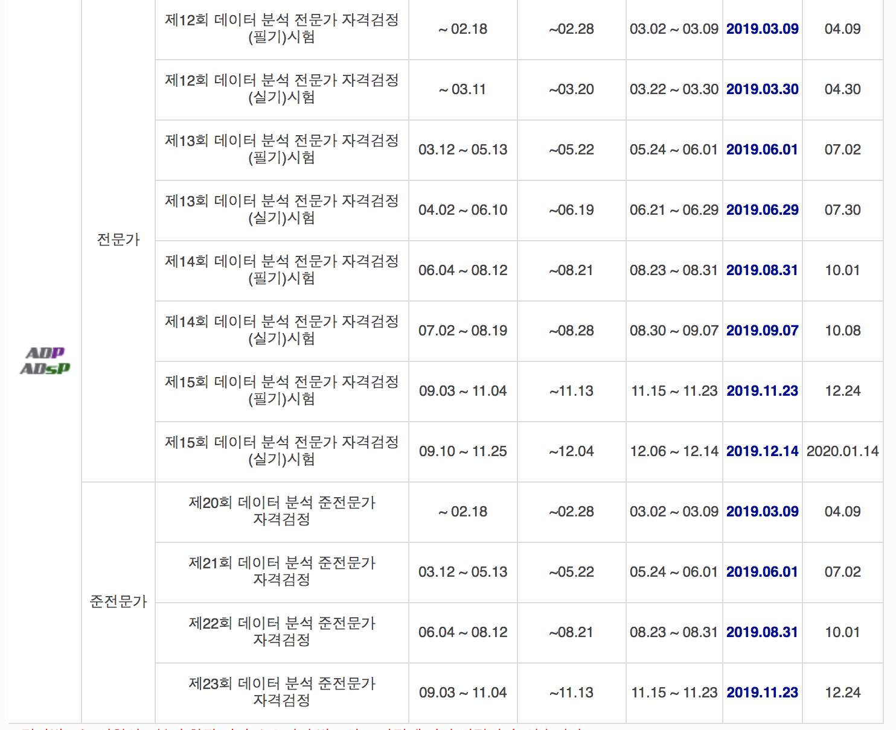
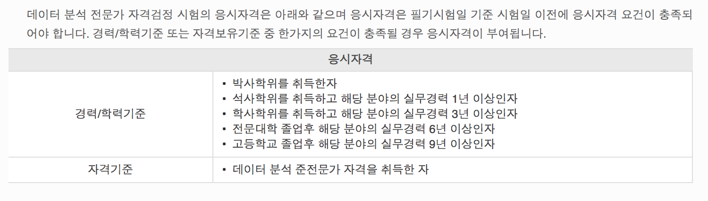
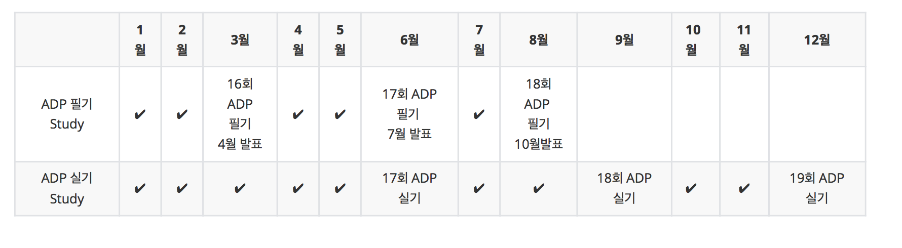
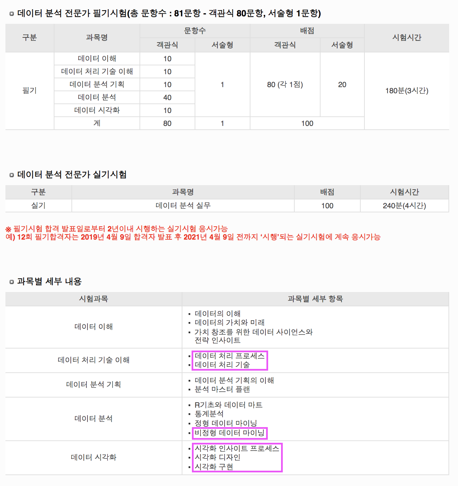
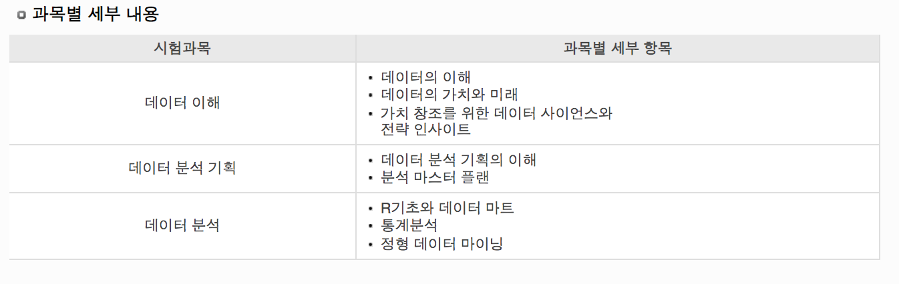

# ADP 필기 / 실기 준비

## ✔️  ADP 2019년 일정

### ADP 응시자격

- 오늘 **2019년 11월 29일 기준**으로

- 2019년에 남은 시험 일정은 12월 14일에 **15회 데이터 분석 전문가 자격검정(실기)** 시험만 남아있다.

    (ADP 필기시험을 pass 하지 못했으므로 응시불가)

- **16회 ADP** 필기 시험은 **2020년 3월 초** 중에 있을 것을 예상하고 공부를 시작한다.

- 필기시험은 보통 **2개월 단위로 스타디를 진행**하는 것 같다.

- 전공 분야인 분들은 1주일 안에도 합격 가능한것 같지만, **비전공자들은 필기+실기 1-2년 정도 소요되는 수준의 자격증 시험**이다. (ADP 최종  합격률 10%)

- 2020년 1월 초에 3월 필기시험 대비 스터디를 시작한다.

- 만약!! 12월 24일 ADsP 시험 결과가 떨어졌을 경우,  ADP와 ADsP 필기시험은 같은 날 치룬다.

    그러니 ADP는 다음 6월로 필기시험이 미뤄진다.

- 6월 필기시험 합격을 한다는 가정 하에, 결과 발표는 2020년 7월에 난다.

    그러니 2020년 시험 가능한 날이 더 늘어나지 않는 이상, ADP 실기시험은 9월에 치를 수 있을 것이다. 

- 비전공자대상,  **ADP 실기 시험은 최소 6개월 - 1년 이상 공부가 소요된다는 것을 감안하고 준비** 해야한다.

- 완전 무상관 비전공자인 나님은 **2020년 12월 ADP 실기 최종 합격을 목표**로 공부를 시작한다.

    

### ADP 응시 시나리오

- **2019년** **12월 24일 23회 ADsP 시험결과 발표**
- **최상의 시나리오 1** ,  23회 **ADsP합격** ➔ 2020년 **3월 초 16회 ADP 필기** ➔ 2020년 6월 말 **17회 ADP 실기 합격**

    :: ADP 준비 6개월 만에 합격 할 가능성 거의 0% 

- 23회 **ADsP불합격** ➔  3월초 **24회 ADsP 필기** ➔  합격 가정, **6월초 ADP필기** ➔ 필기 합격 가정, **9월초 ADP 실기** ➔ 9월 ADP 실기 불합격 ➔ 12월 ADP실기
- **6월 ADP필기 불합격** ➔ **9월 ADP필기** ➔ **12월 ADP실기**
- **최종 12월 실기 합격 목표로 1년간 R 통계학습계획**

### ADP 필기/실기 출제 영역

- ADP 필기 합격 후 실기 3번까지 응시 가능했던 기준에서 **ADP 필기 합격 후 2년 이내 실기시험 응시 가능으로 변경**되었다.

- 위의 표는 **ADsP 필기시험 출제 영역**인데
- **ADP 필기**는 **ADsP**에 **데이터 처리 기술 이해 과목**,  데이터 분석과목의 **비정형 데이터 마이닝**과 **데이터 시각화 과목**이 추가되었다.
- 데이터 분석과목의  **비정형 데이터 마이닝**의 난이도가 높을 것으로 예상된다.
- 특이점은 100점 만점에 **서술형이 20점**인데, 한 데이터셋에 딸린 서술형 문제가 6~7개 정도 되는 모양새이다.
- 필기는 총점 100점 기준 70점 이상이면 Pass, 실기는 총점 100점 기준 75점 이상이면 Pass 다.
- **ADP 실기는** 데이터 분석 실무 영역에 대해 이 사람이 데이터 분석이 실제 가능한지를 검증하는 시험이다.
- 인터넷이 되지 않는 컴퓨터로 시험을 4시간 가량 진행하고, 오픈북 시험이다.
- 보고서는 PDF 형태로 제출해야 하며, 소스코드도 PDF내에 포함되어야 한다.

## ✔️ ADP 시험 대비 STUDY

### 1. ADP 필기 STUDY

- kick off 포함,  약 2개월
- **1월 초 시작 - 3월 초 예상**되는 시험 대비
- ADsP에 시험에 포함되지 않았던 2과목 **데이터 처리 기술 이해 과목,** 4**과목 데이터 분석(비정형 데이터 분석), 5과목 데이터 시각화를 중점**으로 시험 대비
- 만약, 12월 24일 23회 ADsP 필기시험이 불합격 하였어도 ADP 필기를 준비한다면 다음 시험이 대비될 것.

#### ADP 필기 영역 책 List

**1) 데이터 분석 전문가 가이드** 

[데이터 분석 전문가 가이드](https://book.naver.com/bookdb/book_detail.nhn?bid=10835404)

- **거의 1000페이지에 달하는 ADsP/ ADP 정규 교과서격인 책**
- 양장본이라 책이 너무 무겁고 커서 이동하면서 공부하기 불가능
- 서술형이라 읽다 보면 쉽게 이해되는 부분이  많지만, 시험에 필요한 부분이 잘 정리되어 있다고 할 수 없다.
- 그래도 ADP 필기를 수료한 많은 이들이 추천하는 책이다.

**2) ADP 데이터 분석 전문가 필기 (데이터 에듀)**

[데이터 분석 전문가 필기](https://book.naver.com/bookdb/book_detail.nhn?bid=14642121)

- 데이터 에듀에서 발간된 책 [*(링크> 내부 강의도 유료로 진행하고 있다 . but 비쏴 ! 전과정 이수시  200넘음 )*](http://www.dataedu.kr/%eb%82%b4%eb%b6%80%ea%b0%95%ec%9d%98/#1529281518565-599c8cab-0b8b0493-8e51)
- 데이터 에듀 **R 입문부터 데이터전문가** 커리큘럼을 살펴보면 실기 대비를 위해 배워야 하는 영역을 어느 정도 인지할 수 있다.
- 이 책 자체는 표와 이미지 등 시각적으로 잘 정리가 되어 있다. 시험에서 중요한 정도를 표기해 두었다.
- 3회에 걸친 모의 고사와 함께 10회, 11회 검정 시험문제가 실려있다. (매우 유용한 부분)

### 2. ADP 실기 STUDY

- 비전공자 대상으로 매일 2시간 이상 공부, **최소 6개월 ~ 1년 기간** 동안 스타디 예상

- **10% 최종 합격률**을 자랑하는 ADP 자격증을 딴다면, 회사 내 승진 시 가점 적용,  7급 이상 공무원 모집에 가점 항목 등에 활용할 수 있겠다. (경력공뭔 모집은 해당 항목 경력 2-3년 등을 기본으로 하고 있다.)

- 우선 실전에 바로 투입해서 펄펄 날 수 있는 인력은 아닐 지언정, 가공된 데이터를 유의미한 자료로 분석 가능하다는 것을 증명하는 실기시험인 만큼 빅데이터 분석을 목표로 공부하고 있다면 도전해 볼만한 자격증이라고 생각한다.

- **[데이터에듀](http://www.dataedu.kr/%eb%82%b4%eb%b6%80%ea%b0%95%ec%9d%98/#1529281518565-599c8cab-0b8b0493-8e51)** 커리큘럼**에 따르면 **실기 대비 스타디의 범위는 대략 아래와 같이 않을까 예상한다.

  

#### ADP 실기 대비 추천 책 List

1. **R을 이용한 데이터 처리 & 분석 실무** 

   [R을 이용한 데이터 처리&분석 실무](http://www.yes24.com/Product/Goods/14971904)

2. **R과 함께하는 통계학의 이해 <**빅북 무료 PDF 배포 >

   [BIGBOOK 공유와 협력의 교과서 만들기](http://www.bigbook.or.kr/bbs/bbs/board.php?bo_table=bo16&wr_id=5&fbclid=IwAR2okYQqXUY0AnI30lJO7HvvwbmL_szB0-YD3RRWML9eINpyYh4MzXqVtpg)

3. **R을 활용한 머신 러닝 - 브레트 란츠  <무료 PDF 배포>** 

   [R을 활용한 머신 러닝 2/e](http://www.acornpub.co.kr/book/machine-learning-r-2#undefined)

4. **R과 함께하는 다변량 자료분석 - 최용석 <책과 함께 무료 PDF 배포>** 

   [R과 함께하는 다변량 자료분석](http://www.yes24.com/Product/Goods/58727905)

5. **AISL (An Introduction to Statistcal Learning)**

​	[An Introduction to Statistical Learning](https://book.naver.com/bookdb/book_detail.nhn?bid=7293147)

#### ADP 실기 대비 추천 온라인 강의

1. **EDwith** 

[에듀케이션위드 : edwith](https://www.edwith.org/)

- **R언어를 활용한 기초컴퓨터프로그래밍**
- **인공지능 및 기계학습 개론 - 문인철 교수**

2. **K-MOOC** 

- 무료 한국형 코세라, R 관련 수업이 있다.
- 진행형 수업도 있지만 청강으로 들을 수 있다.

  [| K-MOOC](http://www.kmooc.kr/)

- **R프로그램 - 시즌 1, 시즌 2**

**3. Cursera - 영어 강의 무료, 자막이 있지만 허술,** 

​	[기계 학습 | Coursera](https://ko.coursera.org/learn/machine-learning)

- 코세라 앤드류 응 - 기계학습 난이도 상 but, 유명 [<링크>](https://ko.coursera.org/learn/machine-learning)
- Statistics with R 전문 분야 강의 -  [<링크>](https://www.coursera.org/specializations/statistics)

**4. STUDYPIE** 

- **과제 수행형 온라인 스타디, 완주하면 환급이 된다. 환급 받기 위해서는 꾸준함이 필요. 약간의 강제가 있기 때문에 온라인 스타디임에도 완주률이 꽤 높다.**

  [통계학 입문](https://studypie.co/ko/course/statistics_beginner#review)

### **ADP 실기 문제 유형 [(참고 블로그)](https://didalsgur.tistory.com/32)**

**1. 통계학 기반 분석**

**2. Text Mining을 적용한 분석**

**3. Data mining(ML) 학습을 통한 결과 도출**

❌13회, 14회차 실기시험 부터는 **2번 텍스트 마이닝 분석**이 빠져서 출제가 되고 있다. 

- ADP 14회 실기 문제

    - 기계 학습을 이용하여 집 가격 예측 및 검증
    
    - 다중 로지스틱 회귀 분석 및 confusion matrix 해석
    
      

### ADP 실기 블로그 후기

[데이터분석전문가(ADP) 14회 실기 후기](https://didalsgur.tistory.com/32)

[빅데이터 어디서부터 공부해야하나? 자격증!! (데이터 분석 전문가 ADP)](https://bigdata-world.tistory.com/6)

[ADP 실기 합격 후기](https://m.blog.naver.com/harvey88/221674080154)

[국가공인 데이터 분석 전문가(ADP) 취득 및 합격 후기](https://m.blog.naver.com/PostView.nhn?blogId=elmidion&logNo=221679470227&targetKeyword=adp%20%EC%8B%A4%EA%B8%B0&targetRecommendationCode=1&keywordSearchType=TEXT)

[ADP실기 시험 소감 (11회)](http://blog.naver.com/PostView.nhn?blogId=jungj5011&logNo=221386314396&categoryNo=0&parentCategoryNo=0&viewDate=&currentPage=1&postListTopCurrentPage=1&from=postView&userTopListOpen=true&userTopListCount=5&userTopListManageOpen=false&userTopListCurrentPage=1)

**참고>>**  [**빅데이터분석 기사 자격증 생긴다...내년 하반기 취득 가능**](http://news.naver.com/main/read.nhn?mode=LSD&mid=sec&sid1=001&oid=092&aid=0002163539)