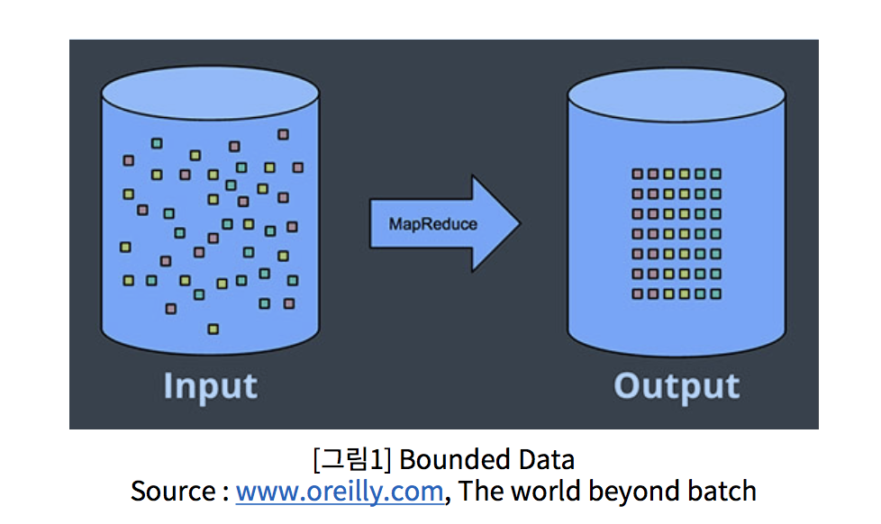
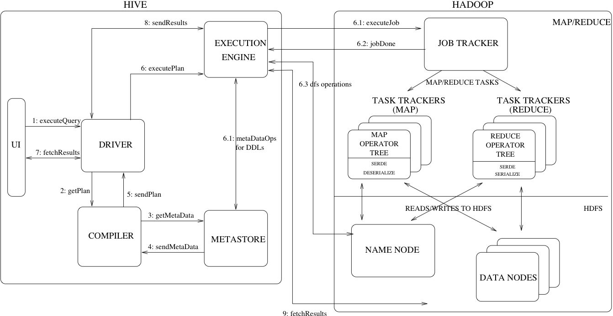

### Crawling - 크롤링

- 다양한 정보를 활용하기 쉽도록 수집하는 행위가 **크롤링 (Crawling)**
- 크롤링을 하는 프로그램을 **크롤러(Crawler)** 라고 한다. 
- 웹의 데이터를 자동화해 가져오는 클롤러가 **웹크롤러 (Web Crawler)**

#### - 크롤러 절차 

- 크롤러가 웹의 데이터를 크롤링 하는데, 웹사이트는 하위링크와 정보를 가지고 있기 때문에 거미줄망 같은  탐색을 하게 된다. 
-  탐색정보를 크롤러가 URL이라는 주소를 기반으로 자동으로 하나씩 들어가 정보를 가져오게 됩니다. 
- 가져온 정보는 HTML이라는 구조로 저장되게 됩니다. 
- HTML를 Parsing이라는 변환과정을 거쳐 우리가 필요로 하는 데이터만 추출하게 됩니다. 
- 이 추출하는 과정을 **Scraping**이라고 통칭한다. 

#### - [참고] html 

- 하이퍼 텍스트 마크업 언어, HTML  (Hyper Text Markup Language)
- Web 페이지의 내용, 구조 등을 정의한 언어 
- 이 HTML 구조를 알고 이 정보를 자유자제로 Parsing 할 수 있어야 한다. 

***

## ETL  , Extract, Transformation , Loading

##### -  추출, 변환 및 로드 

##### - 내외부의 다수의 데이터를 추출하고 이를 필요에 맞게 변환 후 저장하는 일련의 절차를 의미 

 

### ETL Process

- 다양한 데이터에 접근해 데이터를 확보한다. 
- 필요한 데이터만 추출해 변환과정을 거친다. 
- 변환과정이 끝났다면, 데이터는 로딩과정에서 데이터 베이스나 파일 스토리지에 저장된다. 

### ELT Process

- Extract, Loading, Transformation
- ETL 의 Transformation 과 Loading 의 순서를 바꿔 진행하는 절차를 의미한다. 

- 데이터 크기가 너무 크거나 
- 변환 과정에서 데이터 처리 과정이 다수의 시간이 소요되어 이후에 처리해야 하는 이유 
- 변환 과정이 추후 활용되는 때에 이러한 데이터 확보 과정을 거치게 된다. 
- 최근에는 ELT 과정도 많이 있다. 

### ETL 오픈소스 도구  

>  ETL 은 Data warehouse를 데이터 분석을 위한  저장구조를 마련하는데 매우 중요한 절차이다. 

##### - ETL 과련 도구들도 많이 있다. Apach NIFI 등이 빅데이터 분석 회사에서 많이 사용

##### - ETL이 안정적이지 않거나 데이터 정확성이 맞지 않게 설계한다면 추후 문제가 생길 가능성이 많다. 

##### - 다양한 오픈 소스 도구

- Talend 
- Pentaho
- KNIME
- Apache NIFI
- StreamSets
- ..

***

## 정형데이터 

##### - Structured Data

##### - 엑셀 등의 스프레드 시트에서 작업하듯 열과 행을 정리하여 일목요연하게 표로 만들 수 있는 데이터 

##### - 정형데이터 쉽게 다루기 위해 관계형 데이터베이스 (RDB:Relational Database)가 활용되기도 함

##### - 정형 데이터를 File로 변환 할 경우에는 

- CSV(Comma Separated Values)  `, ` 콤마로 구분
- TSV(Tab Separated Values),  Tab으로 구분

### 정형데이터 구조와 예시

- **행** row과 **열** column로 의미로 구분 가능 

- 그림 2는 iris data  - 학습과 테스트에 많이 쓰임 

## 비정형 데이터

##### - Unstructured Data

##### - 문서, 동영상 , 사진, 음성 등의 형태를 정의할 수 없는 데이터 

##### - 정형 데이터를 다루는 RDB에서 활용이 불가능함 

##### - 분석을 위해서는 비정형 데이터를 정형화하는 다양한 과정이 필요

## 반정형 데이터 

##### - semi-structured data

##### - 관계형 데이터 베이스나 다른 형태의 데이터 테이블과 연결된 정형 구조의 데이터 모델을 준수하지 않는 정형 데이터의 한 형태이다. 

##### - 각 의미를 구분할 수는 있지만 행과 열 형태의 표로 쉽게 정리가 어려움 

##### ➔ Parsing이 필요하다. 

##### - JSON, XML, HTMl

***

## Data Warehouse VS Data Lake

 

#### - 사용자의 의사 결정에 도움을 주기 위하여, 여러 시스템의 데이터베이스에 축적된 

####   데이터를 공통의 형식으로 변환해서 관리하는 데이터베이스를 말한다. 

#### - DW를 구축 한다는 것은? 

- 다양한 분석을 할 수 있도록 여러 테이블을 가공해 **Mart**(일종의 주제별 테이블)를 생성 
- **Mart table**은 지속적으로 관리하고, 새로운 주제별로 Mart table 이 생성되기도 한다. 
- 큰 데이터의 경우에는 일 단위 월 단위로 관리된다.
- 이후 사용자는 분석툴( e.g. OLAP, SQL)을 활용해 보다 편리하게 분석할 수 있도록 한다. 

 

- **ETL** - 앞 단의 전형적인 정형데이터를 가지고, 목적에 맞는 변환과 적재과정을 거친다.
- **EDW** - Enterprise Data Warehouse에 적재된다. 
- 적재된 **Data Warehouse**는 각 분석 목적에 맞는 Mart라고 하는 다수의 주제별 테이블을 생성하게 된다. 
- 사용자는 **BI** Sytem을 통해 데이터를 분석하게 된다. 

#### DW의 단점 

- 대용량 데이터를 갱신해야 하기 때문에  ETL에 상당한 부하가 걸리게 된다.
- 대량의 데이터가 적재되기 때문에 DB를 유지하는데 드는 비용 또한 많이 발생된다. 
- Table이 잘 관리되지 않는다면, 중복되는 데이터들로 인해 혼선이 생길 수 있다. 
- Big data 시대가 도래함으로써 비정형 데이터양이 늘어 났다. 비정형 데이터는 DW형태로 데이터 분석이 불가하다. 
- BI 유저들의 개개인의 다양한 데이터 분석 능력이 요구가 된다.

#### Data Lake 

- Data Warehouse의 정보 분석 한계를 개선하기 위해 생긴 데이터 저장개념  
- Data Warehouse는 정형데이터를 가공하여 저장
- Data Lake는 원천 데이터 형식으로 대량 저장하여 분석에서 활용
- 정형, 비정형, 반정형 모두 적재 
- Data Warehouse에 비해 더 큰 빅데이터 저장 공간이 필요하다. 
- 비용에 대한 고려가 필요하다. 

#### Data Lake Architecture

- 기존의 적재 인프라가 정형데이터 구조만이 아닌 
- Haddop , Hive, Spark , HBase 등의 다양한 빅 데이터 기술 요소들을 포함하고 있다. 
- Data Lake만 단독으로 존재하는 것이 아니라, Data Warehouse 도 함께 활용되는 하이브리드 방식architecture도 구상되기도 한다. 

***

##  Data Steam vs Batch

### 데이터 적재 유형 

- Bounded Data 

- Unbounded Data 

### Bounded Data 

- 일단 저장되면 이후  변화가 없는 데이터를 말한다. 

- e.g. 매 월 단위 매출 데이터, 매월신규 고객 유치 수등  

- 처리는 묶어서 한 번에 일괄 처리 

##### - 이를 Bach 처리라고 한다. 

- 왼쪽에있는 구조화되지 않은 데이터의 유한 풀은 데이터 처리 엔진을 통해 실행되어 오른쪽에 해당하는 구조화 된 데이터가 생성됩니다.

### Unbounded Data 

- Bounded Data 와는 달리, 끝을 지정할 수 없는 지속적으로 적재되는 데이터이다. 
- e.g. 시스템 로그데이터, 주식 가격 변동 데이터 등 
- 이러한 데이터는 끝이 정해지지 않기 때문에 주기적으로 처리 또는 실시간 처리해야 한다. 

### Bach Processing

- 일괄처리라고 한다. 
- 대량의 데이터를 특정 시간에 한번에 처리하는 것을 의미한다. 
- Daily Batch, Hourly Batch 등의 형태가 있다. 
- 무한한 데이터 세트는 유한 한 고정 크기의 한정된 데이터 창으로 미리 수집 된 다음 클래식 배치 엔진의 연속 실행을 통해 처리됩니다.

### Stream Processing

- Stream, 영어 뜻으로는 개울, 시내 
- 물의 흐름처럼 지속적으로 유입되는 데이터의 연속성 있는 처리 
- 처리 예시

#### Micro Batch 

- 배치의 주기나 데이터 크기를 상대적으로 짧게 설정하여 준 실시간으로 처리하는 것을 의미한다. 
- 일종의 스트림 처리라고 할 수 있다. 

### 스트림 처리 인프라 Archtecture 

- 데이터 스트림 처리  오픈소스 중 가장 많이 사용 하는 것은 Kafka 와 Spark 이다. 
- Sever와 App에서 일종의 Unbound data 즉, log 데이터가 지속적으로  생성된다. 
- 이 데이터를 가져와 Apach Kafka를 이용해 실시간으로 가져와 Spark Streaming으로 전송한다.
- Kafka는 일종의 `Queue`, 자료구조 라고도 한다.  
- `Queue` 는 뒤의 처리조직이  데이터를 다 받아주지 못할때 밀고 들어오는 데이터 유실을 방지하기 위해서 잠시 담아두는 통으로 생각하면 된다. 거대한 빗물 저장고로 비유할 수 있다. 
- Spark Streaming을 통해 실시간으로 분석을 하게 된다. 
- Spark로 부터 분석된 결과는 HBase(HDFS)라고 하는 일종의 Nosql DB에 빠르게 저장된다. 
- 결국 Streaming 처리는 그때 그때 생성되는 데이터를 실시간으로 처리하는 것이다. 

***

## workflow 

##### - 작업 절차를 통한 정보 또는 업무의 이동을 의미한다. 일종의 작업 흐름 

##### - 데이터 워크플로우는 데이터 처리의 작업 절차를 의미한다. 

##### - ETL 같은 데이터 처리 흐름을 워크 플로우 스케줄링 툴로 처리한다. 

- **[KNIME ](https://www.knime.com/knime-analytics-platform) work flow - Analystics plaform**

- **[Apache Airflow ](http://michal.karzynski.pl/blog/2017/03/19/developing-workflows-with-apache-airflow/)**

### DAG, Directed Acyclic Graph

#### - 방향성 비순환 그래프 

- DAG는 방향을 가지고 있지만, 서로 순환하는 관계가 없어야 한다. 
- 오른쪽 그래프는 DAG속성을 가졌다고 할 수 있다. 
- Workflow를 생성할때 DAG를 유지해야 한다면, 방향을 가지되 순환하면 안된다는 의미이다. 

- 어떤 Workflow는 DAG를 준수하지 않으면 실행되지 않을 수도 있다. 

### Workflow 엔진

#### - [Apache Oozie ](https://oozie.apache.org/)

- Oozie is 
- Hive, MapReduce, Pig등 다양한 Big data 오픈 소스들과 가장 잘 융합되는 workflow scheduler 시스템이다. 

- XML 형태로 작업흐름을 표현해야 한다. 

#### - [Apache Airflow](https://airflow.apache.org/)

- Airbnb 엔지니어링팀에서 개발된 도구 이다. 
- python 기반으로 워크플로우 설계 가능 
- 여러 머신에서 분산하여 수행
- UI 기반의 모니터링 도구 제공 

## Computer Cluster

#### - 여러 대의 컴퓨터들이 연결되어 하나의 시스템처럼 동작하는 컴퓨터들의 집합을 말한다. 

#### - 물리적으로 여러대의 컴퓨터이지만 외부 하용자는 마치 한 대의 컴퓨터 인것으로 보인다. 

#### - Cluster의 구성요소 

- Node(Master +Slave) 서버 
- Network
- OS
- Middleware

### Computer Cluster의 목적 

#### - 서버의 확장을 통한 우수한 성능을 얻을 수 있음 

#### - 분산 컴퓨팅

- 여러의 서버이지만 단일 서버처럼 운영되어야 한다. 
- 여기에는 많은 기술이 요구된다 

### SPOF(Single point of failure) , 단일 장애점 

#### - 시스템 구성 중에 동작하지 않으면 전체 시스템이 중단되는 요소를 말한다.

#### - 일종의 치명적인 약점으로 클러스터에서 SPOF가 없어야 한다. 

- Master node는 전체 시스템을 관장하고 각 슬레이브 node가 서로 유기적으로 작동하는 것을 돕는다. 
- 만약 Master node가 어떤 원인에 의해 기능을 잃는 다면 전체 시스템은 멈추고 Shut down 되게 된다. 
- 그러므로 여기 이 시스템에서는 Master가 SPOF(단일장애지점)이 된다. 

## HA(High Acailbility)

##### - 고가용성 이라고 한다.

##### - 서버와 네트워크, 프로그램 등의 시스템이 지속적으로 운영이 가능한 성질 을 말한다. 

##### - 클러스터에서는 SPOF가 없어야 하며, HA가 유지되어야 한다. 

- 전체를 관장하는 마스터 노드가 2개 이다. 

- 마스터 노드가 2개 있더라도 동시에 운영되지 않는다. 

- Master1은 동작하고 Master2는 대기 상태로 Master1이 셧다운 되었을 때를 대비한다. 

  
***

## Scale Up and Scale Out

### Scale Up 

##### - 서버( 또는 컴퓨터 ) 자체 RAM, CPU, Disk 등의 구성요소 자체를 업그레이드 하여 컴퓨팅 성능을 향상 시키는 방법을 말한다. 

##### - 1의 처리 능력을 가진 서버를 5의 능력을 가진 서버로 기능을 향상시키는 것 

##### - 디스크 공간을 교체한다거나 확장하는 것 

### Scale Out

##### - 네트워크 상의 서버( 또는 컴퓨터) 의 수를 늘려 컴퓨팅 성능을 향상시키는 방법 

##### - 1대의 컴퓨터가 하던 일을 5대의 컴퓨터가 나눠서 처리한다. 

##### - 각 서버를 Cluster로 묶기 때문에 사용자는 1대를 활용하는 것으로 느낀다. 

### Scale Up과 Scale Out의 비교 

- 서버확장 방식
- Hadoop이나 Spark역시 Scale Out 방식의 분산 컴퓨팅 방식이다. 

***

## SQL 

##### - 구조적 질의 언어 (Structured Query Language)

##### - SQL는 관계형 데이터베이스의 데이터를 관리하기 위해 설계된 특수 목적의 프로그래밍 언어 

##### - 데이터베이스에서 정형 데이터 분석을 위한 필수 요소 

##### - 내부적으로는 

- 데이터 정의 언어 (DDL, Data Definition Language)
- 데이터 조작 언어 (DML, Data Manipulation Language)
- 데이터 제어 언어 (DCL, Data Control Language)
- 트랜잭션 제어 언어 (TCL, Transaction Control Language)

### DDL (Data Deginition Language)

##### - 데이터 정의 언어 

##### - 관계형 데이터베이스에 테이블 구조를 정의하고 생성하거나 기존의 테이블의 

##### 	구조 변경 또는 삭제하는 명령어 

##### - 세부 명령어 

- **CREATE** : 새로운 데이터베이스, 테이블의 생성
- **ALTER** : 기존 테이블 구조의 변경
- **DROP** : 기존 데이터베이스, 테이블 삭제 

### DML (Data Manipulation Language)

##### - 데이터 조작언어 

##### - 데이터베이스의 테이블에 들어있는 데이터들을 조회하거나 변경하는 명령어 

##### - 세부 명령어 

- **SELECT** : 데이터의 검색
- **INSERT** : 새로운 데이터의 삽입
- **DELETE** : 기존 데이터의 삭제 
- **UPDATE** : 기존 데이터의 수정

### 데이터 JOIN 이해

### DCL (Data control Language)

##### - 데이터 제어 언어 

##### - 데이터베이스에 있는 테이블에 대한 사용 권한 부여나 회수를 위한 명령어 

##### - 세부 명령어 

- CRANT : 권한 부여 
- REVOKE : 권한회수 

### TCL ( Transaction Control Language)

##### - 트랜잭션 제어 언어 

##### - 트랜잭션

- 수행결과에 완전성을 보장하는 단위 
- 원자성, 일관성, 독립성, 지속성 

##### - 세부명령어 

- COMMIT : 트랜잭션 작업 결과 반영 
- ROLLBACK : 트랜잭션 작업 결과 취소, 조작 명령전으로 복구 

## Hadoop <open tutorial 링크>

**[[하둡 소개 및 기본 구성요소 링크]](https://www.opentutorials.org/course/2908/17055)**

**[[Understanding Hadoop Clusters and the Network , Brad Hedlund]](http://bradhedlund.com/2011/09/10/understanding-hadoop-clusters-and-the-network/)**

##### - Open Source Jave Softwate Framework

##### - Google의 GFS (Google File System) 논문을 기반으로 출발 

##### - 2006년 더그 커팅과 마이크 캐퍼렐라가 개발

##### - 더그커팅의 아들이 가지고 놀던 노란 코끼리 이름에서 유래 

##### - 구성요소 

- **하둡 분산파일 시스템** ( GDFS ,Hadoop Distributed File System) : 데이터 저장 기능
- **맵리듀스** (MapReduce) : 연산기능 

### HDFS

##### - 하둡의 분산형 파일 시스템 

##### - 구성요소 

- name node : 파일의 메타 정보를 관리 
- Data node : 실제 데이터를 저장하고 내보내는 역할

##### - 특징

1. HDFS는 데이터를 저장하면, 다수의 노드에 복제 데이터도 함께 저장해서 데이터 유실을 방지

2. HDFS에 파일을 저장하거나, 저장된 파일을 조회하려면 스트리밍 방식으로 데이터에 접근해야 함.

3. 한번 저장한 데이터는 수정할 수 없고, 읽기만 가능하게 해서 데이터 무결성을 유지.

   (2.0 알파버전부터는 저장된 파일에 append가 가능하게 됨)

4. 데이터 수정은 불가능 하지만 파일이동, 삭제, 복사할 수 있는 인터페이스를 제공함.

### Hadoop Cluster

- 서버 장비는 랙이라는 구조에 차곡 차곡 설치되어 있다. 

- HDSF의 머리 역할을 하는 Name Node가 있고 그 하단에는 수십개의 Data Node ,DN 이라는 서버가 있다.

- 클라이언트가 새로운 데이터를 저장하고자 할 때 , Name Node에 어디에 저장할지 먼저 묻게 되어 있다. 

- Name Node는 몇 번째  DN 저장하면 되는지 거꾸로 알려준다.  

- 이를 확인 받은 클라이언트는 확인받은 DN에게 직접 데이터를 전송하게 된다. 

- 이를 전송받은 DN은 정상적인 요청인지 확인 후 실제 데이터를 저장하게 된다. 

- 이후에는 **replication** 자가 복제 단계가 있다 이는 HDFS가 데이터 유식을 방지하기 위한 기능이다. 

   

## MapReduce

##### - Map , Reduce 라는 두 개의 함수의 조합 

##### - 분산/병렬 시스템에서 데이터를 처리하는 프레임워크

##### - 구성요소 

- **MAP** :  나누어진 단위에서 계산 
- **Reduce** : key 별로 합침

- MapReduce는 Apache Hadoop에서 사용하는 프로그래밍 패턴입니다. 
- Hadoop MapReduce는 확장 가능하고 안정적이며 오류를 흡수하는 저렴한 분산 시스템에서 병렬 다중 노드 클러스터를 사용하여 방대한 데이터를 저장, 처리 및 채굴 할 수있는 시스템을 제공합니다. 
- MapReduce에서 데이터 분석 및 데이터 처리는 다음 그림과 같이 맵 단계 및 축소 단계라고하는 개별 단계로 나뉩니다.

- **INPUT**  - 각 단어가 스페이스바로 구분된 text 파일이 들어 왔다.
- **SPLITTING** - 이 text 데이터는 각각 여러 서버에 전송된다. 
- **MAPPING** - 구분자의 스페이스를 기준으로 분리하고 단어 뒤에 숫자 1을 붙이게 된다. 
- **SHUFFLING** - 다시 네트워크를 통해 각 서버로 이리저리 전달된다. 이때 각 Key(단어)별로 맞는 서버에 전송된다. 
- **REDUCING** - 뭉처진 단어끼리 합을 구하게 되는데 이 뒤에 붙어진 단어를 합하기만 하면 구하고자 했던 단어별 count 값이 계산된다. 

## Spark , 스파크  [[스파크홈페이지]](https://spark.apache.org/)

**[[VCNC가 Hadoop대신 Spark를 선택한 이유]](http://engineering.vcnc.co.kr/2015/05/data-analysis-with-spark/)**

[[**Apache Spark Cluster 구조**]](https://spark.apache.org/docs/1.1.0/cluster-overview.html)

##### - In-memory 기반 Open Source Cluster Computing Framework

##### - Hadoop의 MapReduce와 유사한 역할을 하지만 Memory활용을 극대화 했기 때문에 

#####   연산 속도가 월등히 빠름

##### - 최근에는 Memory 가격이 많이 저렴해졌고 H/W 성능도 많이 올라가 MapReduce 보다 

#####   Spark를 선호한다. 

##### - Scala, Python으로 개발 가능하다. 

### Spark의 핵심 개념 - RDD

##### - Resilient Dstributed Datasets

##### - 스파크에서 활용되는 내부 데이터 모델 

##### - 병령처리가 가능하고 장애가 발생할 경우에도 스스로 복구될 수 있는 내성을 가지고 있음

##### - RDD는 한번 생성되면 바뀌지 않으며 다른 형태로 변환이 필요할 경우 새로운 RDD를 만들어 낸다.

##### - 장애시에는 RDD 진행 절차를 기억했다가 그대로 수행하여 빠르게 복구한다.

##### - Spark 구조 

- Spark 프로그램은 일반적으로 “Driver Program”이라고 하는데, 
- 이 Driver Program 은 여러개의 병렬적인 작업으로 나뉘어져서
- Spark의 Worker Node(서버)에 있는  Executor(프로세스)에서 실행된다.
- Worker Node가 여러 개라는 것은 각각의 서버가 독립적으로 계산하는 분산 컴퓨팅 환경임을 의미한다.

### 기타 Spark의 요소 

##### - Spark SQL 

- SQL을 사용해 데이터를 처리 

##### - Spark Stereaming

- 실시간 스트리밍 데이터를 처리하는 프레임 워크

##### - Spark Milib

- 머신 러닝 알고리즘 라이브러리 

##### - Spark GraphX

- 그래프 연산용 서브모듈

### Hadoop vs Spark 

**[[Apache Spark vs Hadoop MapReduce – Feature Wise Compariso]](https://data-flair.training/blogs/spark-vs-hadoop-mapreduce/)**

- **Hadoop** : 디스크 기반, MapReduce가 중간에 HDFS에 기록을 해야하기 때문에 read하고 write하는 과정에서 속도저하
- **Spark** : 메모리에 올려두고 기억  그래서 속도가 빠르다.  메모리의 한계를 넘어갈 수 없다. 

## Hive , 하이브

##### - 하둡 기반의 데이터 웨어하우스(DW) 소프트웨어 

##### - SQL 기반의 데이터 요약, 질의 및 분석 기능을 제공 

##### - 특징 

- HDFS & Hbase 등 여러 하둡 에코들과 호환
- 기본 분석을 위한 QL(SQL-Like)언어 제공 
- 다수의 내부 함수, 분석 함수 제공 
- UDF(User Defined function) 지원 
- 다양한 파일 형식으로 전환 가능 

 

- **Partition** = directory 

- **Bucket** = file
- Partitions and bucket help reduce data scanned when fiters on partition and bucket keys are present in query 

- 테이블 내의 Hive 데이터는 여러 파티션으로 분할됩니다. 
- 각 파티션은 파티션 열의 특정 값에 해당하며 
- HDFS의 데이블 디렉토리내에 하위 디렉토리로 저장된다.

 

### Hive Physical Layout

- Hive는 기본적으로 HDFS와 연동되게 되어 있다. 
- Database와 Table 그리고 Patition 은 실제 HDFS의 물리적인 Directory로 구조화 됩니다. 
- 특정 Table을 읽는 다는 것은 , 특정 HDFS Directory를 읽는 다는 말과 비슷하겠다. 
- 결국 Hive는 SQL을 가지고 HDFS에 데이터를 처리 또는 조회한다고 이해하면 되겠다. 
- 최하단의 Bucket부터는 Directory로 구조화 되는 것이 아니라 파일단위로 저장됩니다.

### Why Hive? 

   

### [Hive Architecture](https://cwiki.apache.org/confluence/display/Hive/Design#Design-HiveArchitecture)

##### 위의 그림,  Hive의 주요 구성 요소와 Hadoop과의 상호 작용을 보여줍니다. 

- **UI** – 사용자가 시스템에 쿼리 및 기타 작업을 제출할 수있는 사용자 인터페이스입니다. 2011 년 현재 시스템에는 명령 행 인터페이스가 있으며 웹 기반 GUI가 개발되고 있습니다.
- **Driver**, 드라이버 – 쿼리를받는 구성 요소입니다. 이 컴포넌트는 세션 핸들 개념을 구현하고 JDBC / ODBC 인터페이스에서 모델링 된 실행 및 페치 API를 제공합니다.
- **Compiler**, 컴파일러 – 쿼리를 구문 분석하고 다른 쿼리 블록 및 쿼리 식에 대한 의미 분석을 수행하고 결국 메타 스토어에서 조회 된 테이블 및 파티션 메타 데이터를 사용하여 실행 계획을 생성합니다.
- **Metastore**, 메타 스토어 – 열 및 열 유형 정보, 데이터를 읽고 쓰는 데 필요한 시리얼 라이저 및 디시리얼라이저 및 데이터가 저장된 해당 HDFS 파일을 포함하여 다양한 테이블 및 파티션의 모든 구조 정보를웨어 하우스에 저장하는 구성 요소입니다.
- **Execution Engine**, 실행 엔진 – 컴파일러가 만든 실행 계획을 실행하는 구성 요소입니다. 계획은 단계별 DAG입니다. 실행 엔진은 계획의 서로 다른 단계 사이의 종속성을 관리하고 적절한 시스템 구성 요소에서이 단계를 실행합니다.

##### - HDFS에 저장된 데이터에 대한 SQL 처리를 제공하는 시스템 

##### - Hive를 포함하여 Impala , Presto, Drill 등 다양한 오픈 소스가 있다. 

***

## NoSQL

### NoSQL  DB의 배경 

##### - 관계형 데이터 베이스의 한계점 도달

- 전통적인 관계형 데이터베이스는 테이블 간 관계를 통해 다양한 데이터 조회 가능 

- **But,** 빅데이터 시대로 오면서 **대량의 데이터** 적재에 따른 비용이 증가하고 처리 성능에 **한계에 도달함** 

  ➔ 관계형 데이터 베이스의 일부 기능을 포기하더라도 

  ➔ 확장에 유연하면서 저장/조회에 높은 성능이 요구 

  

### NoSQL  DB의 특징 

##### - Not Only SQL 

##### - 고정형 Table Schema 불필요

##### - 적재와 조회에 성능 최적화

##### - 테이블 간 관계형 설정 지양, Join 경우 성능 저하 

##### - Scale out 통한 수평적 규모 확장

### HBase 아키텍처 

- 여러 대의 서버를 네트워크로 연동하는 분산형 DB라는 점이다. 

### NoSQL DB의 종류 

##### -  MongoDB

##### - elasticserch

##### - cassandra

##### - HBase

 

### NoSQL DB의 현황

**NoSQL 커뮤니티**
- https://nosql-database.org/

 

### [[CAP 이론]](http://develop.sunshiny.co.kr/883)

> 2000년 전산학자 에릭 부루어가 이 명제를 가설로 제시, 2002년 세스 길버트와 낸시 린치가 이를 증명하였다. 

##### - 어떠한 분산시스템에서 세 가지 속성을 모두 만족할 수 없다는 이론 

##### - 일관성(Consistency)

- 모든 사용자가 같은 순간에 같은 데이터를 볼 수 있다. 
- 모든 노드들은 같은 시간에 동일한 항목에 대하여 같은 내용의 데이터를 사용자에게 보여준다.

##### - 가용성(Availability)

- 모든 클라이언트는 항상 읽기/ 쓰기가 가능하다.
- 모든 사용자들이 읽기 및 쓰기가 가능해야 하며, 몇몇 노드의 장애 시에도 다른 노드에 영향을 미치면 안된다.

##### - 분할성(Patrition Tolerance)

- 시스템이 물리적 네트워크로 분할된 상태에서 정상 동작한다. 
- 메시지 전달이 실패하거나 시스템 일부가 망가져도 시스템이 계속 동작할 수 있어야 한다.

- **C (일관성) 와 A(가용성)를 만족시키는 것**  ::  관계형 데이터 베이스 (RDBMs)
- CouchDB, Cassandra의 경우에는 A(가용성)과 P(분할성) 사이에 있다. 
- MongoDB, REDIS와 같은 NoSQL DB는 **C(일관성)과 P(분할성)** 사이에 위치함

 

### ACID(Atomicity, Consistency, Isolation, Durability)

##### - 트랜잭션이 안전하게 수행되는 것을 보장하기 위해 관계형 데이터 베이스가 가져야 하는 특성

- **원자성(Atomicity)** : **트랜잭션과 관련된 작업들이 모두 수행되었는지 아니면 모두 실행이 안되었는지를 보장하는 능력**이다. 자금 이체는 성공할 수도 실패할 수도 있지만 원자성은 중간 단계까지 실행되고 실패하는 일은 없도록 하는 것이다.

- **일관성(Consistency)** : **트랜잭션이 실행을 성공적으로 완료하면 언제나 일관성 있는 데이터베이스 상태로 유지하는 것**을 의미한다. 무결성 제약이 모든 계좌는 잔고가 있어야 한다면 이를 위반하는 트랜잭션은 중단된다.

- **고립성(Isolation)** : **트랜잭션을 수행 시 다른 트랜잭션의 연산 작업이 끼어들지 못하도록 보장하는 것을 의미한다.** 이것은 트랜잭션 밖에 있는 어떤 연산도 중간 단계의 데이터를 볼 수 없음을 의미한다. 은행 관리자는 이체 작업을 하는 도중에 쿼리를 실행하더라도 특정 계좌간 이체하는 양 쪽을 볼 수 없다. 공식적으로 고립성은 트랜잭션 실행내역은 연속적이어야 함을 의미한다. 성능관련 이유로 인해 이 특성은 가장 유연성 있는 제약 조건이다. 자세한 내용은 관련 문서를 참조해야 한다.

- **지속성(Durability)** : **성공적으로 수행된 트랜잭션은 영원히 반영되어야 함을 의미한다.** 시스템 문제, DB 일관성 체크 등을 하더라도 유지되어야 함을 의미한다. 전형적으로 모든 트랜잭션은 로그로 남고 시스템 장애 발생 전 상태로 되돌릴 수 있다. 트랜잭션은 로그에 모든 것이 저장된 후에만 commit 상태로 간주될 수 있다.

 

### BASE, NoSQL의 특성 

##### - Basically Available 

- 데이터는 어떠한 경우에든 항상 활용될 수 있는 특성 

  ➔ ACID의 고립성(Isolation)과 대립되는 특성이다. 

##### - Soft-State 

- 분산 노드간 업데이트는 데이터가 노드에 도달한 시점에 갱신

##### - Eventual Consistency 

- 일관성을 제공하되 모든 노드에서 동시에 보장되지는 않음 
- 시간이 지나면 일관성이 보장이 되는 **'지연된 일관성'** 보장 , 시간차가 있을 수 있다. 

 

### NoSQL DB 언제 활용? 

##### - 언제 활용? 

- 실시간 대용량 데이터 적재 필요시 
- 테이블간 Join 등의 처리가 거의 없는 경우 
- 추후 DB확장이 유연해야하는 경우 

##### - 주의 점

- NoSQL 특성에 맞는 Table 설계가 매우 중요 ➔ RDB와 전혀 다름 

- 테이블간 Join을 할 경우 성능 저하 심함 

- 유지보수에 따른 운영 인력 확인 필수 

  ➔ 용도가 명확할 경우 강력한 NoSQL DB

