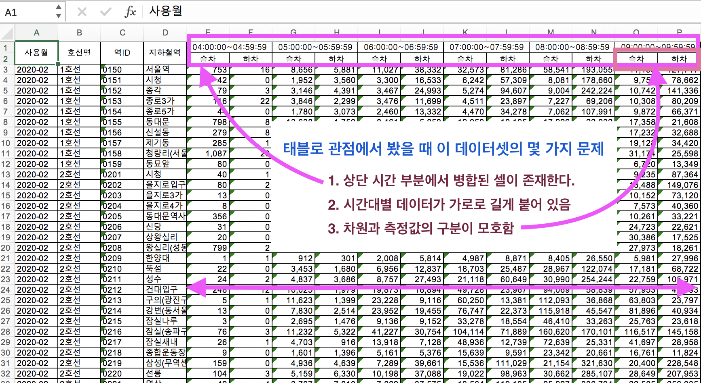
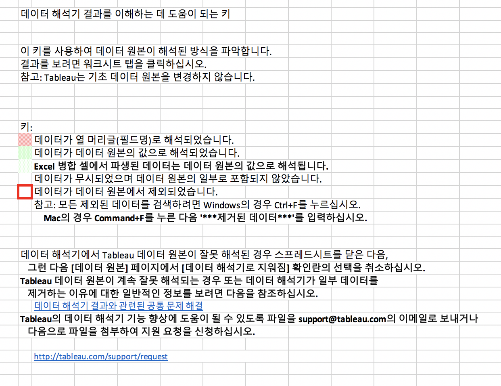
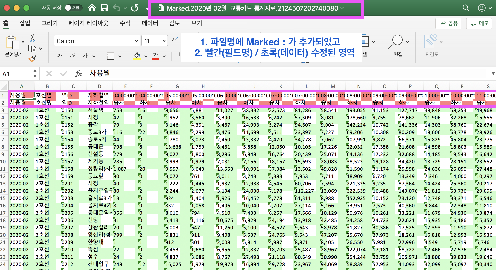
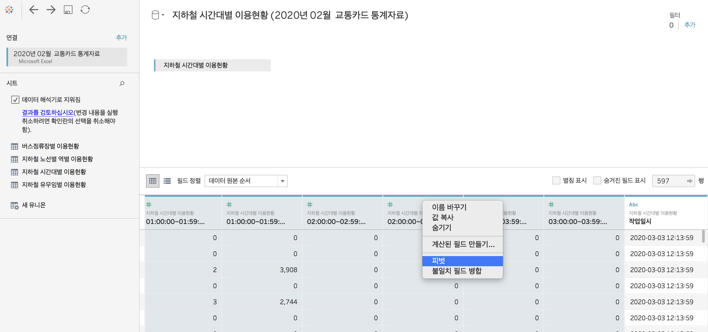
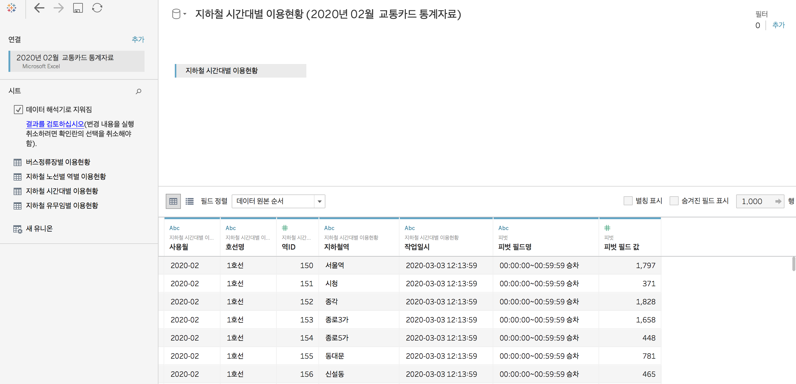
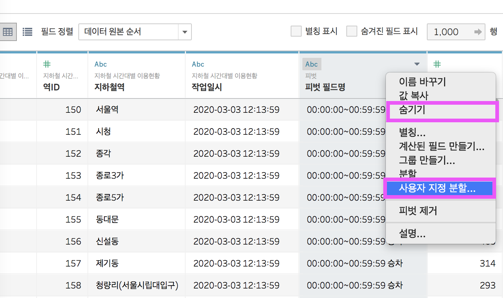
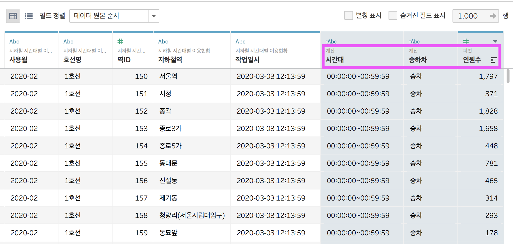
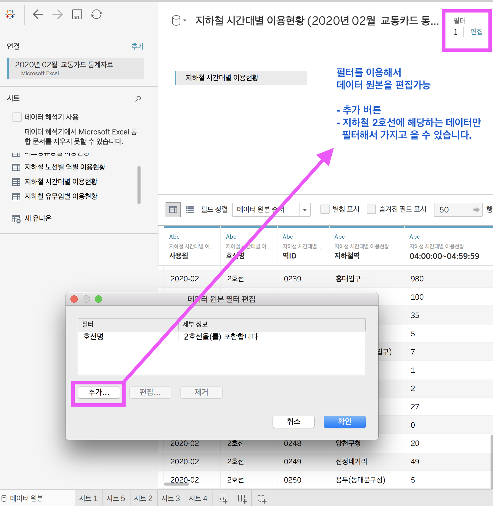

### 태블로 퍼블릭 설치하기 

- **[[태블로 퍼블릭 버전 다운로드 링크]](https://public.tableau.com/en-us/s/download)**
- 태블로 라이센트가 없으면 태블로 퍼블릭을 설치해 시작할 수 있다. 

### 퍼블릭과 데스크탑의 차이 

- 태블로 퍼블릭과 태블로 데스크탑의 가장 큰 차이는 전자는 무료인지 유료인지이다. 
- 데스크탑은  유료이고 개인이 결제하기에는 꽤 고가이다. ㅠㅠ ($840/년)
- 기능 상으로 가장 큰 차이를 보이는 세 가지는,
  1. **퍼블릭은 로컬 머신(PC)에 저장할 수 없으며 태블로 퍼블릭 온라인 공간에 저장해야 된다.** 
  2. **퍼블릭은 엑셀 등 기본적인 연결만 지원하며 데이터베이스 연결을 지원하지 않는다.**
  3. **퍼블릭은 샘플 갤러리를 사용할 수 없다. 유로와 무료의 인터페이스가 다르다.** 

- 태블로 데스크탑 최신 버전을 다운로드 받으면, 2주 동안 무료 체험기간이 주어진다. 
  **[[태블로 데스크탑 버전]](https://www.tableau.com/products/desktop/download)**

***

## 태블로 스터디 시작 !! 

> 모든 학습은 VIzlab 유툽 채널과 
> 스터디 파이 태블로 베이직 코스를 통해 진행 하고 있습니다.

> [[vizlab]](https://vizlab.tistory.com/)  
> [[tableau basic class]](https://studypie.co/ko/course/tableau_basic_class)
 

### 👨‍🏫 태블로 베이직 스터디 코치 / 최정민 강사님

- 스터디 파이 강의를 시작하기 전에 이미 유툽 채널을 구독해 강의를 듣고 있었다. 
- 굳이 스터디 파이를 통해 비용을 지불하고 강의를 진행하는 이유는, **slack으로 강사님과 좀 더 밀접한 소통이 가능하다는 장점**이 있다. 
- 강사님이 직접 질문에 피드백을 해주어 학습 퀄리티를 높여주고, 학습하는데 큰 동기부여가 된다.
- 그리고 이 과정의 강사님은 특히 피드백이 빠르고 자세하다.
- 본인 판단하에 필요한 온라인 강의는 스터디파이에서 진행하는 걸 추천합니다.

***

### 태블로 베이직 - 첫걸음 1. 데이터 연결하기 

> 강의에서 사용하는 데이터 셋 :

##### 1. [https://1drv.ms/x/s!At3ucxamQMPYgexK4GQ5-8j1PFlVGw?e=HgCOmc](https://1drv.ms/x/s!At3ucxamQMPYgexK4GQ5-8j1PFlVGw?e=HgCOmc)
##### 2. [https://vizlab.tistory.com/78](https://vizlab.tistory.com/78)

<iframe width="560" height="315" src="https://www.youtube.com/embed/ZC1l9Xba4vk" frameborder="0" allow="accelerometer; autoplay; encrypted-media; gyroscope; picture-in-picture" allowfullscreen></iframe>

***

### 태블로 베이직 - 첫걸음 2. 데이터 준비하기 

<iframe width="560" height="315" src="https://www.youtube.com/embed/aRVccLYfyL4" frameborder="0" allow="accelerometer; autoplay; encrypted-media; gyroscope; picture-in-picture" allowfullscreen></iframe>

***

### 태블로 베이직 시리즈 - 첫걸음 3. 데이터 작업하기

<iframe width="560" height="315" src="https://www.youtube.com/embed/Dad0Pu3nfI8" frameborder="0" allow="accelerometer; autoplay; encrypted-media; gyroscope; picture-in-picture" allowfullscreen></iframe>

***

# Data Preparation - 데이터 준비 

## 첫 번째, Data Interpreter - 데이터 해석기 

> 데이터 셋을 태블로가 처리하기 좋은 형태로 만들기  
> ***(Data Interpreter)***

##### **강의 링크 :** [vizlab](https://vizlab.tistory.com/42)
##### **사용 데이터 셋** : [교통카드 데이터 - 지하철 시간대별 이용현황](https://pay.tmoney.co.kr/ncs/pct/ugd/ReadTrcrStstDtl.dev;jsessionid=wqaGG9WP4JaJhkHvCf7UoE13mSMkdmkstueI1QloUALEqfX74lCgrC81y5p6h9YO.czzw02ip_servlet_tmyweb?useYm=202002&rgtDtm=20200303121351#)

- 통계청, 공공기관, 웹사이트 등에서 다운로드 받은 데이터 셋은 태블로가 분석하기 편한 포맷이 아니다.
- 데이터 셋을 태블로가 처리하기 좋은 형태로 만들기 
- **절대로 사람 손이 많이 간다는 것은 바람직 하지 않다.** 
- 데이터를 처리하기 위해 [Alteryx](https://www.alteryx.com/)  ,[Tableau Prep](https://www.tableau.com/products/prep) 등의 툴등이 있다.  
- 태블로는 그 수고를 덜어줄 몇 가지 기능을 자체 보유하고 있다. 

#### T-Money :  '교통카드 데이터 -  지하철 시간대별 이용현황' 살펴보기 

#### > 태블로 관점에서 이 데이터는 몇 가지 문제가 있다. 이것의 해결책 !!

1. 시간대를 나타내는 셀이 병합 처리되어 있는 것 ➞ **병합을 풀어줘야 한다.** 

2. 중요한 분석 자원인 시간대가 오른쪽으로 한없이 뻗어 있다. ➞ **세로로 길게 만들어 줘야 한다.** 

3. 승차와 하차에 표시된 숫자는 인원수를 의미 ➞ **승/하차 차원을 생성하고 측정값은 인원수로 잡아줘야 한다.** 

   

#### >  결과 검토하기 !!

#### >  바뀐 부분 확인하기 !!

 

- 붉은색 부분을 **필드명**으로 인식  / 초록은 **데이터 원본**으로 인식 
- 와우 !!  똑똑하다.  데이터 원본을 잘 정리해 줍니다. !! 

***

## 두번째,  Pivot 피벗 

> 하나의 '요소로' 묶어 정렬하기  **(Pivot)**

1. 시간대를 나타내는 셀이 병합 처리되어 있는 것 ➞ **병합을 풀어줘야 한다.** 
2. 중요한 분석 자원인 시간대가 오른쪽으로 한없이 뻗어 있다. ➞ **세로로 길게 만들어 줘야 한다.** 
3. 승차와 하차에 표시된 숫자는 인원수를 의미 ➞ **승/하차 차원을 생성하고 측정값은 인원수로 잡아줘야 한다.** 

   

#### > 가로로 길대 늘어진 시간대를 아래 방향으로 정렬 , '시간대' 라는 이름을 붙여주기 

- 묶고 싶은 영역을 선택해서 우클릭 하면 
- 피벗을 선택할 수 있는 창이 뜬다. 
- 피벗 클릭 !!

  

- **피벗필드명**이 생성되고 승/ 하차 시간으로 구분된  데이터 값이 **피벗 필드 값**으로 채워졌다. 

  

#### > Pivot의 기능 

- **데이터 해석기 - 피벅 - 스플릿 - 데이터 원본필터**  라는 패키지 개념으로, 복합적으로 사용되는 경우가 많다. 
- 이 과정에서 **피벗 기능이 핵심 구성요소**이다, 데이터의 구조 자체를 바꾸는 기능이기 때문이다. 
- **crosstab 형태의 데이터 구조를, 태블로에서 사용하기 편한 columnar 형태로 바꾸는 것**이 피벗이다. 

***

## 세번째, 사용자 지정 분할 (Custom Split)

> 대용량 데이터를 취급할 때 유용하게 쓸 수 있는 **(Data Source Filter)**
>

- 두 번째, 피벗의 결과가 **피벗 필드명 / 피벗 필드 값** 으로 구분되었다. 
- 그런데 **필드명에는 승/하차 정보**가 같이 들어가 있다. 
- 이것을 각각 **분리(Split)** 하는 작업을 해본다. 

- **피벗 필드명에서 마우스 우클릭 하면 '사용자 지정 분할' 기능을 활용할 수 있습니다**
  - `사용자 지정 분할`을 설정해 준다. 
  - 시간대와 승하차를 구분하는 것은  한칸의 스페이스이다. 
  - `00:00:00~00:59:59	승차`
  - 구분기호 사용에 `스페이스 한칸`을 입력해 준다. 
  - 확인을 누른다. 

- **피벗 필드명 - 분할 1** | **피벗 필드명 - 분할 2**  -  `00:00:00~00:59:59` , 	`승차`   분활된 것을 확인 할 수 있다. 
- **필드명 수정** -  수정하고자 하는 필드명을 우클릭하면 `이름 바꾸기` 를 선택해 필드명을 변경한다. 
- **필드명 숨기기** - 분할을 완성한 `피벗 필드명` 을 우클릭해서 `숨기기` 를 선택해 필드를 숨긴다. 

#### > 결과물 !!! 

***

## 네번째, 데이터 원본 필터 

> 대용량 데이터를 취급할 때 유용하게 쓸 수 있는 
> **(Data Source Filter)**

#### > 데이터 원본 필터가 필요한 이유

- 데이터가 백만개 단위로 넘어가게 되면 성능 이슈가 100% 생긴다. 
- 데이터 원본 필터를 사용해 필요한 데이터만 불러오는 것이 좋다! 

 

